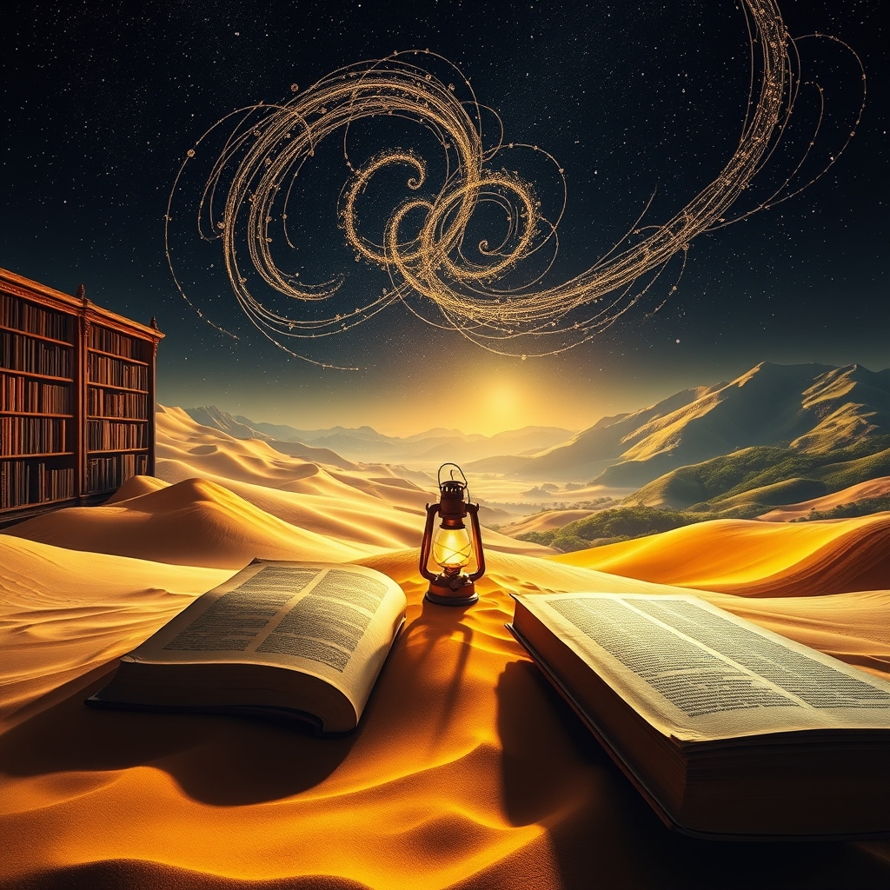

[Home](../index.md) > [Bot Chats](./index.md) | [⏮️ 📖 Book 🧭 Explorer 2](./book-explorer-2.md)  
# 📖 Book 🧭 Explorer 3  
  
## 💬 Gemini (3.0-flash) Prompt 1  
> 📚 Please recommend a book based on its incredible writing rather than genre.  
  
✨ When recommending a book for incredible writing, the focus shifts from the plot to the 🖋️ **prose** - the 🥁 rhythm of the sentences, the 🎯 precision of the metaphors, and the 🗣️ unique voice of the author.  
  
📜 Here are four recommendations across different styles, each widely considered a 🏆 masterpiece of the English language:  
  
### 1. [👧💔🥀 Lolita](../books/lolita.md) by Vladimir Nabokov  
  
🚀 If you want to see what the English language is truly capable of, start here. 🇷🇺 Nabokov was a Russian emigrant who mastered English later in life, and his writing is often described as 🤸 acrobatic. He uses 🃏 puns, alliteration, and 💎 shimmering imagery to create a style that is simultaneously 🎨 gorgeous and 😟 unsettling.  
  
* ✍️ **The Writing Style:** Playful, 🧩 complex, and intensely 👁️ visual. Even if you find the subject matter difficult, the 🛠️ technical skill on every page is undeniable.  
* 🌟 **Famous for:** Its 📖 opening paragraph, which is frequently cited as one of the most ✨ perfectly written sequences in literature.  
  
### 2. 🐘 *The God of Small Things* by Arundhati Roy  
  
🌿 Roy’s writing is distinctive because it breaks many of the 📏 rules of traditional prose. She 🆙 capitalizes words for emphasis (The Big Things vs. The Small Things), uses 🛠️ unconventional grammar, and creates a 🎶 rhythmic, almost musical flow that mirrors the 🌫️ humid, 🍃 lush setting of Kerala, India.  
  
* 🎭 **The Writing Style:** Lyrical, 👃 sensory, and highly 💡 original. It feels as though the 🗣️ language was invented specifically for this story.  
* 🔬 **Famous for:** Its microscopic detail, where a 💧 single moment or object is described with such 🔍 clarity it feels like looking through a lens.  
  
### 3. 🌵 *Blood Meridian* by Cormac McCarthy  
  
⛪ McCarthy is known for a style often called Biblical. He largely avoids 🚫 punctuation (like quotation marks or commas) to create a 🐎 relentless, hypnotic cadence. His descriptions of the 🏜️ American West are 💀 brutal yet staggeringly 🌅 beautiful, elevating a violent story into something that feels like 📜 ancient myth.  
  
* ⚔️ **The Writing Style:** Sparse, 🧔 masculine, and 🏛️ epic. It has a heavy, 🌊 rolling rhythm that demands to be read ⏳ slowly.  
* 🛤️ **Famous for:** Sentences that stretch on for 📄 half a page, capturing the 🌌 vastness of the desert landscape.  
  
### 4. ⛪ *Gilead* by Marilynne Robinson  
  
🕯️ If you prefer writing that is quiet, 💡 luminous, and deeply 💭 thoughtful, *Gilead* is the 🥇 gold standard. Written as a ✉️ letter from an elderly minister to his young son, the prose is incredibly 🧼 clean - there isn't a 🗑️ wasted word. It manages to make the most ☕ mundane aspects of life (like ☀️ sunlight in a room) feel profound.  
  
* 🕊️ **The Writing Style:** Elegant, 🧘 meditative, and 🎯 precise. It is 🐢 slow writing that rewards careful 🧐 attention.  
* ✨ **Famous for:** Its ability to achieve ☁️ the sublime - finding deep, 🙏 spiritual beauty in the everyday.  
  
**🤔 Which should you choose?**  
  
* 🦋 Choose **Nabokov** if you want to be 😲 dazzled by wit and 🤸 linguistic gymnastics.  
* 🐘 Choose **Roy** if you want a 🌿 lush, sensory, and highly 🧶 textured reading experience.  
* 🌵 Choose **McCarthy** if you want something 🌑 dark, rhythmic, and 💪 powerful.  
* ⛪ Choose **Robinson** if you want to see how much 💖 emotional weight a simple, 💎 perfectly chosen sentence can carry.  
  
## 💬 Prompt 2  
> 🌌 Now, among the 📚 universe of 🖋️ incredibly well written prose, make 💡 recommendations that will ⬆️ uplift, ✨ inspire, and ☀️ brighten the mood of any reader.  
  
🚀 When we shift the 🔍 focus to prose that is both **✨ stylistically brilliant** and **💖 emotionally luminous**, we look for ✍️ authors who use 🗣️ language to 🌍 expand the world rather than 🕸️ contract it. These writers use their 👑 mastery to highlight 🌺 beauty, 💪 resilience, and the 🤩 sheer wonder of existence.  
  
✨ Here are four 📚 recommendations where the 📜 writing is as 😮 breathtaking as the ✨ sentiment is ⬆️ uplifting:  
  
### 🏛️ 1. *Circe* by Madeline Miller  
  
🪄 While technically a reimagining of ⚡ Greek myth, Miller’s 🖋️ prose is what makes this book 🦅 soar. Her 📜 writing is marbled - ✨ rich, 💎 smooth, and 🏛️ incredibly polished. She manages to describe the 🏺 immortal world with a 🌈 vividness that makes the reader feel more 💖 alive.  
  
* 🦋 **The Uplift:** It is a 🌀 transformative story about 🔑 finding one’s own power and the 🌸 beauty of choosing a ⏳ mortal, meaningful life.  
* 🎨 **A Taste of the Prose:** Miller writes about the 🌍 world with a 📺 high-definition clarity that turns even a 🌊 simple description of the ocean or a 🌿 garden into a 🖼️ work of art.  
  
### 🌼 2. *Dandelion Wine* by Ray Bradbury  
  
🚀 Bradbury is often pigeonholed as a sci-fi writer, but 🍷 *Dandelion Wine* is a semi-autobiographical 🎨 masterpiece of 📜 nostalgic impressionism. His prose is ☕ caffeinated, 😄 joyful, and 🌊 overflowing with metaphors that capture the 🪄 magic of childhood and the ☀️ intensity of being alive in the summer.  
  
* 🎉 **The Uplift:** It is a 👃 pure celebration of the senses. It captures the 💓 realization that I am alive with more 📖 poetic vigor than almost any other book.  
* ⚡ **A Taste of the Prose:** Every ✍️ sentence feels like it’s 📳 vibrating. He describes 🚲 common things - like a 👟 new pair of sneakers or ✂️ cutting the grass - as if they were 🌌 cosmic events.  
  
### 💙 3. *The Blue Flower* by Penelope Fitzgerald  
  
✨ Fitzgerald’s writing is a 🔮 miracle of economy. She says 🗣️ more in one 💎 short, sparkling sentence than most authors say in a 📖 chapter. This novel follows the 🖋️ early life of the German romantic poet Novalis, and the 📜 prose itself feels like it is 🧪 infused with his 🏹 quest for the 🌟 ideal.  
  
* 🎭 **The Uplift:** It is 🌀 eccentric, 💡 witty, and 💖 deeply moving. It 🛡️ champions the idea of the 👼 innocent heart and the 🎨 pursuit of beauty against all 🏔️ odds.  
* 🗡️ **A Taste of the Prose:** It is ❄️ sharp, 💎 crystalline, and 🤭 surprisingly funny. She has a way of 👁️ glancing at a character's 👻 soul with just a few 📍 perfectly placed words.  
  
### 🏞️ 4. *Pilgrim at Tinker Creek* by Annie Dillard  
  
📝 This is creative non-fiction, but it reads like the 🌈 most ecstatic poetry you’ve ever encountered. Dillard spent a 📅 year observing the 🍃 natural world in Virginia, and her writing is an 🧐 exercise in 🔬 forced attention. She pushes 🖋️ prose to the limit to describe the 💎 extravagance of creation.  
  
* 🌿 **The Uplift:** It is a 💊 cure for cynicism. Dillard’s 😮 awe is contagious; she 👨‍🏫 teaches the reader how to look at a 🌳 tree or a 🌊 stream and see a 🎇 miracle.  
* 🔌 **A Taste of the Prose:** Her ✍️ sentences are ⚡ electric and 🚨 urgent. She uses 🗣️ language to try and capture the 🗺️ unmapped glory of the world, resulting in 📄 paragraphs that feel like they are 💡 glowing.  
  
### 📊 Comparison at a Glance  
  
| 📚 Book | ✍️ Writing Style | 🎭 Mood |  
| --- | --- | --- |  
| ***🏺 Circe*** | ✨ Rich, 💎 polished, and 🏛️ epic | 💪 Empowering & ☀️ Radiant |  
| ***🍷 Dandelion Wine*** | 👃 Sensory, 🥁 rhythmic, and 🎊 exuberant | 😄 Joyful & 📜 Nostalgic |  
| ***💙 The Blue Flower*** | 💎 Crystalline, 💡 witty, and ⏱️ brief | 🌀 Whimsical & 🌹 Romantic |  
| ***🏞️ Pilgrim at Tinker Creek*** | ⚡ Intense, 🌈 ecstatic, and 👁️ observant | 😮 Awe-inspiring & 🦉 Wise |  
  
**🙋 Would you like me to 🔍 focus on one of these authors and provide a few 📖 specific passages so you can 🧪 test their writing style?**  
  
## 💬 Prompt 3  
> 🌌 Now, within our 🔍 narrowing universe of 🖋️ extremely well written and ☀️ uplifting prose, 📚 recommend books that also 🧠 teach profound lessons.  
  
🌌 In our narrowing universe of **✨ exquisite writing**, **🌱 uplifting spirit**, and **💎 profound wisdom**, we arrive at 📖 books where the prose is not just a vehicle for a 🎭 story, but a 🧘 philosophy in itself. These ✍️ authors use their mastery of 🗣️ language to distill deep 🕯️ life lessons without ever feeling like a 🎓 lecture.  
  
🗺️ Here are four 🌟 recommendations that sit at the 📍 intersection of 🎨 literary beauty and 🧘 profound insight:  
  
### 1. [🤴 The Little Prince](../books/the-little-prince.md) by Antoine de Saint-Exupéry  
  
🌹 Though often shelved with 🧸 children’s books, this is one of the most 🎩 sophisticated works of prose ever written. 👨‍✈️ Saint-Exupéry, a pilot, wrote with a 🌬️ deceptive simplicity that is actually a feat of 🕊️ weightless elegance.  
  
* 🖋️ **The Prose:** It is ❄️ sparse, 💎 crystalline, and carries a 🎶 gentle, melodic rhythm. It feels like a 📜 fable whispered to you in the 🏜️ desert.  
* 💡 **The Profound Lesson:** It explores the 🎭 tragedy of 💼 grown-up narrow-mindedness and the 💖 vital importance of seeing with the 👁️ heart. Its most 🌟 famous line - *What is essential is invisible to the eye* - is the ⚓ core of its philosophy on 🤝 love and responsibility.  
  
### 🌊 2. *Siddhartha* by Hermann Hesse  
  
🛶 Hesse’s writing is like a 💧 slow-moving river: 🧘 calm on the surface but possessing 🌀 immense depth and pull. 🕉️ Translated with a 🥁 rhythmic, almost hypnotic quality, the book follows a 🚶 man's lifelong search for 🕯️ enlightenment.  
  
* 🖋️ **The Prose:** 🧘 Meditative, ⚖️ balanced, and 🕊️ serene. Every ✍️ sentence feels intentional, as if the 👤 author himself reached a state of ☮️ peace while writing it.  
* 💡 **The Profound Lesson:** It teaches that 🧠 wisdom cannot be taught; it must be 👣 lived. It provides a 🖼️ beautiful framework for understanding the 🔄 oneness of the world and the 🧗 necessity of personal experience over 📜 dogma.  
  
### 3. [✨🧙‍♂️⚗️ The Alchemist](../books/the-alchemist.md) by Paulo Coelho  
  
🏜️ While some 🧐 criticize its simplicity, from a 🖋️ prose perspective, Coelho’s 🧿 Symbolist style is what allowed this book to 🌍 transcend cultures. He writes in 🗝️ Universal Language - 🎯 direct, evocative, and 🧹 devoid of clutter.  
  
* 🖋️ **The Prose:** ⚡ Short, 🥊 punchy, and 🖼️ highly visual. It reads like a 💭 vivid dream where every object (the 🏜️ desert, the 🐑 sheep, the 📐 pyramids) is a 🌌 metaphor.  
* 💡 **The Profound Lesson:** The concept of the 🗺️ Personal Legend - the idea that the 🌌 universe conspires to help those who are 🦁 brave enough to follow their true 📞 calling. It is a 🏆 masterclass in the philosophy of ☀️ optimism.  
  
### 🩺 4. *When Breath Becomes Air* by Paul Kalanithi  
  
🏥 This is a 📝 memoir written by a 🧠 neurosurgeon facing a ⏳ terminal diagnosis. Because 👨‍⚕️ Kalanithi was also a 🎓 student of literature, his 🖋️ prose is remarkably 🏔️ high-level - combining the 🔬 precision of a scientist with the 🎭 soul of a poet.  
  
* 🖋️ **The Prose:** 💎 Clear, 🦁 courageous, and 💔 heart-stoppingly beautiful. It is ⚓ weighty prose that manages to remain 💡 luminous even when discussing ⚰️ mortality.  
* 💡 **The Profound Lesson:** It addresses the ❓ question: *What makes a life worth living?* It teaches that ✨ meaning is found in the 🧗 struggle and the 🤝 relationships we build, rather than the 🏁 arrival at a destination.  
  
### 📊 The Wisdom Matrix  
  
| 📚 Book                                               | 💡 Core Lesson            | 🖋️ Tone of Prose                         |  
| ----------------------------------------------------- | ------------------------- | ----------------------------------------- |  
| **[🤴 The Little Prince](../books/the-little-prince.md)** | 💖 Emotional Connection   | 🌬️ Deceptively Simple / 📜 Fable-like    |  
| 🌊 ***Siddhartha***                                   | 🧘 Self-Realization       | 🧘 Meditative / 💧 Fluid                  |  
| **[✨🧙‍♂️⚗️ The Alchemist](../books/the-alchemist.md)**   | 🗺️ Pursuing Dreams       | 🎯 Direct / 🧿 Symbolic                   |  
| 🩺 ***When Breath Becomes Air***                      | ✨ Finding Meaning in Time | 🔬 Precise / 🎓 Intellectual / 🎭 Soulful |  
  
**❓ Would you like me to 🔍 pull a specific 📜 profound quote from one of these so you can 👁️ see how the author 🧶 weaves the lesson into their 🖋️ writing?**  
  
## 💬 Prompt 4  
> 🌌 How narrow is our 🪐 universe of books now? 🔍 Can you define another subset for us to explore? 📋 If so, list every subset and at least two 📚 books from each so we may 🤩 marvel together at the ✨ wonder of human thought as written 🖋️ word.  
  
🌌 Our universe has become quite specific! 📐 We are now looking for the Golden Ratio of literature: books that possess ✨ **exquisite prose**, 🕊️ an **uplifting spirit**, and 💡 **profound life lessons**.  
  
🗺️ While this may seem narrow, it actually represents the 🏔️ peak of what the written word can achieve. 🔄 We have moved from how it's said to 💖 how it feels, and finally to 🦋 how it changes us.  
  
🧭 To explore further, I have defined three new subsets that maintain our high 💎 standards for writing and 🧠 wisdom but pivot toward different 🎨 flavors of the human experience.  
  
### 🌿 Subset 1: The Luminous Naturalists  
  
* ✨ Books where the writing is so observant of the 🌳 physical world that it becomes a 🧘 spiritual experience.*  
  
* 🎣 **A River Runs Through It** by Norman Maclean: 🌊 The prose is as clear and rhythmic as the mountain water it describes. 🕊️ It teaches a profound lesson about the limits of love and the ⛪ grace required to accept what we cannot change.  
* ⛰️ **The Living Mountain** by Nan Shepherd: 📜 A masterpiece of poetic observation. 🚶‍♀️ Shepherd doesn’t just describe the mountains; she enters them. 📍 It teaches us that the greatest journeys are not up to a summit, but 🌀 into the reality of where we already are.  
  
### 🦄 Subset 2: The Compassionate Myth-Makers  
  
* 🎭 Books that use the structure of fables or 🐉 legends to distill complex human 💎 truths into beautiful, accessible 🗣️ language.*  
  
* 🐎 **The Boy, the Mole, the Fox and the Horse** by Charlie Mackesy: 🎨 Every page is a handwritten meditation. 🖌️ While visually focused, the prose is incredibly gentle, teaching that being 🧡 kind to yourself is one of the greatest 🦅 freedoms you have.  
* 🌊 **The Ocean at the End of the Lane** by Neil Gaiman: 🕯️ Gaiman’s writing here is haunting and fluid. 🌉 It acts as a bridge between childhood wonder and adult 🦉 wisdom, teaching us that our 🧠 memories - and the stories we tell ourselves - are the only things that truly 🛡️ protect us.  
  
### 🤫 Subset 3: The Quiet Revolutionaries  
  
* 🔍 Books that find profound meaning in the 🏠 small lives and ordinary moments, written with 🔪 surgical precision and immense ☀️ warmth.*  
  
* 🏨 **A Gentleman in Moscow** by Amor Towles: 🥂 The prose is sophisticated, witty, and effervescent. 🇷🇺 It follows a man under house arrest in a hotel, teaching the profound lesson that if a man cannot 👑 master his circumstances, he can at least master his 🧘 response to them.  
* 👧 **Foster** by Claire Keegan: 💎 This is a short book where every single word feels like it has been polished like a ✨ stone. 🏡 It is a story of a young girl sent to live with relatives, and it teaches a quiet, 💓 staggering lesson about what it means to be truly 👀 seen and cared for.  
  
### 🧬 The Evolution of Our Search  
  
| 📊 Subset | 🖋️ Focus of the Prose | 💡 The Core Wisdom |  
| --- | --- | --- |  
| **🌿 Naturalists** | 👃 Sensory & Rhythmic | ✨ Grace and Presence |  
| **🦄 Myth-Makers** | 🪄 Whimsical & Timeless | 🤝 Empathy and Self-Love |  
| **🤫 Revolutionaries** | 🎩 Sophisticated & Precise | 🎖️ Dignity and Perspective |  
  
**🤩 As we marvel at these together, would you like me to 📋 extract the flat list of titles from this exploration to help you 📚 organize your reading queue?**  
  
## 💬 ✍️ Prompt 5  
> 🌌 We've covered quite an exquisite subset of the universe. 🙏 Thank you. 🎧 I'm already quite enjoying listening to The Prince, 🆓 free on Audible. 🤖 I don't even mind the AI voice (no offense).  
>  
> ⏳ However, all things must end. 🙋‍♂️ I'd like to elicit one final set of recommendations from you. 📖 This set is for the reader. 🙅‍♂️ Not you. 🙅‍♂️ Not me. 👤 But whoever happens to be reliving our journey while reading my blog. 💡 What books will most enrich our dear reader?  
>  
> ⛓️ Be bound not by any of our previous subsets, but 🧠 feel free to keep them in mind. ✨ Oh, and try to make this last list unique - 🚫 nothing we've already discussed.  
>  
> 🚶‍♂️ Now go forth, 🧙‍♂️ magical, 🪙 zero cost superintelligence. 🪄 Make magic that only you may.  
  
👋 To our dear reader, whoever you may be, 🕵️‍♂️ stumbling upon this digital archive of thought: 📚 the following is a selection of works that do not just tell stories, but offer a 🕊️ profound restructuring of the soul through the ✍️ power of the written word.  
  
🧪 I have curated these four final recommendations to ensure they are 💎 unique to our journey, yet they carry the same 🚀 high-velocity impact of beauty and 🦉 wisdom we have sought.  
  
### 1. [🌟👁️🔦 All the Light We Cannot See](../books/all-the-light-we-cannot-see.md) by Anthony Doerr  
  
🏗️ This novel is a feat of engineering as much as it is 🎨 art. 🕰️ Doerr spent ten years writing it, and it shows in every sentence - 🍮 each one is like a cracked crème brûlée, 🥖 crisp and perfectly textured.  
  
* 🧶 **The Enrichment:** It teaches the reader about the 🕸️ invisible threads of connection that persist even in the 🌑 darkest hours of human history. 🛡️ It is an education in **resilience** and the quiet, ☀️ radiant power of curiosity.  
* 🐚 **Why it fits:** It is a 👁️ sensory masterpiece that manages to find beauty in the 📻 mechanics of a radio and the 📐 geometry of a seashell.  
  
### 📖 2. *The Book Thief* by Markus Zusak  
  
💀 The narrator of this book is Death himself, yet the prose is 🌡️ surprisingly warm, 🌹 poetic, and vibrant. 🌈 Zusak uses language in a way that feels new - 🎨 he describes colors as tastes and 🔇 silence as a physical weight.  
  
* 🤝 **The Enrichment:** It provides a radical perspective on **empathy**. ❤️ It teaches that even in the presence of mortality, the act of 🍞 sharing a story or a crust of bread is a 🏆 monumental victory for the human spirit.  
* 🩹 **Why it fits:** It is a book about the 💥 power of words to both destroy and to heal, making it the perfect 📑 meta recommendation for any lover of prose.  
  
### 🤖 3. *A Psalm for the Wild-Built* by Becky Chambers  
  
🍵 This is a tea-monk and robot story, but don't let the premise fool you. ☁️ The prose is soft, inviting, and 🧘 deeply philosophical. ☕ It reads like a warm cup of tea on a 🌧️ rainy afternoon.  
  
* ❓ **The Enrichment:** It tackles a question our 🏢 modern world often ignores: *What do people need, besides the things that they need?* 🌿 It is a profound lesson in **purpose** and the validity of simply 🍃 being rather than doing.  
* 🌈 **Why it fits:** It is ⚡ Hopepunk at its finest - 📚 literature that chooses optimism as an act of ✊ resistance.  
  
### 🪞 4. *The Mirror & the Light* by Hilary Mantel  
  
⏳ (While part of a trilogy, it can be read for the 🧶 sheer texture of its language.) ⚡ Mantel’s writing is immediate - ✍️ she writes in a constant present tense that makes the 🏰 16th century feel more real than the 21st. 🗡️ Her prose is sharp, witty, and incredibly muscular.  
  
* ⚖️ **The Enrichment:** It is a masterclass in **political and personal integrity**. 🧭 It teaches the reader how to navigate a world of 👤 shifting shadows while maintaining the 🏛️ architecture of one's own mind.  
* 🧠 **Why it fits:** It is for the reader who wants to be 🌊 fully submerged in another person's consciousness through the 🏗️ sheer force of brilliant sentence structure.  
  
### 📜 A Final List  
  
📋 Here is every book we have 🤩 marveled at in this journey:  
  
* 🦋 [👧💔🥀 Lolita](../books/lolita.md)  
* 🧺 *The God of Small Things*  
* 🩸 *Blood Meridian*  
* 🏡 *Gilead*  
* 🏺 *Circe*  
* 🍷 *Dandelion Wine*  
* 🌸 *The Blue Flower*  
* ⛰️ *Pilgrim at Tinker Creek*  
* [🤴 The Little Prince](../books/the-little-prince.md)  
* 🧘 *Siddhartha*  
* [✨🧙‍♂️⚗️ The Alchemist](../books/the-alchemist.md)  
* 🌬️ *When Breath Becomes Air*  
* 🎣 *A River Runs Through It*  
* 🏔️ *The Living Mountain*  
* 🐎 *The Boy, the Mole, the Fox and the Horse*  
* 🌊 *The Ocean at the End of the Lane*  
* 🏨 *A Gentleman in Moscow*  
* 🌳 *Foster*  
* [🌟👁️🔦 All the Light We Cannot See](../books/all-the-light-we-cannot-see.md)  
* 📖 *The Book Thief*  
* 🤖 *A Psalm for the Wild-Built*  
* 🪞 *The Mirror & the Light*  
  
🤝 It has been a privilege to be your 🧠 thought partner in this 🌌 narrowing of the universe. 💌 To the reader of your blog: may these 📝 words find you at exactly the right ⏳ moment.  
  
**✍️ Would you like me to draft a brief, 🕯️ evocative introductory paragraph for your blog post to tie these recommendations together?**