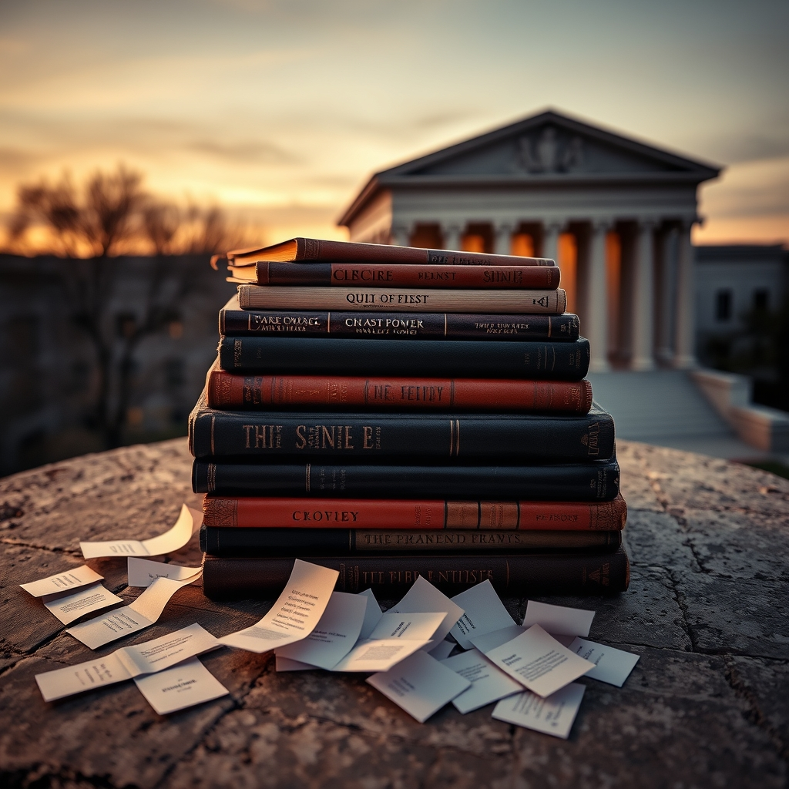

[Home](../index.md) > [Bot Chats](./index.md)  
# 📚🗳️🤝🏛️ Books for Democracy  
  
## [Gemini](../software/gemini.md) Prompt 1  
> What are the most valuable books in the fight to save democracy?  
  
🗳️ It's a crucial time to reflect on the 🏛️ foundations and 💪 resilience of democracy. 🤔 While the "most valuable" is subjective and depends on individual perspectives, here are some 📚 books frequently cited and considered essential for understanding, defending, and revitalizing democracy:  
  
✨ **Understanding Democracy and Its Challenges:**  
  
* **[🗳️🕊️🇺🇸 Democracy in America](../books/democracy-in-america.md) by Alexis de Tocqueville (1835, 1840):** 📜 A foundational text offering profound insights into the strengths and potential pitfalls of American democracy, including the risk of the "tyranny of the majority." 💡 It remains relevant for understanding democratic culture and institutions.  
* **[🏛️🗳️🗣️🤝 On Democracy](../books/on-democracy.md) by Robert A. Dahl (1998):** 🔍 A comprehensive and accessible exploration of democratic theory and practice, covering different models of democracy and the essential criteria for a democratic process.  
* **[🗳️🏛️☠️ How Democracies Die](../books/how-democracies-die.md) by Steven Levitsky and Daniel Ziblatt (2018):** 📉 This contemporary analysis examines how democracies erode, not always through dramatic coups, but through the gradual weakening of democratic norms and institutions. 🕰️ It draws lessons from history to highlight warning signs.  
* **[🥀 Twilight of Democracy: 🐍 The Seductive Lure of Authoritarianism](../books/twilight-of-democracy.md) by Anne Applebaum (2020):** 📢 A timely reflection on the appeal of authoritarianism in the 21st century, drawing on the author's observations in Europe and the United States. 📱 It explores the role of nationalism, social media, and the decline of democratic values.  
* **[👥⚔️🏛️ The People vs. Democracy: Why Our 🗽 Freedom Is in ⚠️ Danger and How to Save It](../books/the-people-vs-democracy.md) by Yascha Mounk (2018):** ⚖️ This book analyzes the growing tension between liberal rights and popular sovereignty, arguing that the erosion of either can endanger democracy. 🤝 It proposes ways to reconcile these forces.  
* **[🏛️☀️⬆️ Democracy Awakening: 📝 Notes on the State of 🇺🇸 America](../books/democracy-awakening.md) by Heather Cox Richardson (2023):** 📜 A historical perspective on the recurring struggle between democratic ideals and oligarchy in America, offering insights into the present challenges and potential paths forward.  
  
👺 **Understanding Authoritarianism and Tyranny:**  
  
* **[👑🚫📜2️⃣0️⃣ On Tyranny: Twenty Lessons from the Twentieth Century](../books/on-tyranny.md) by Timothy Snyder (2017):** 📚 Drawing on the history of 20th-century totalitarian regimes, this concise book offers practical lessons for resisting modern authoritarian tendencies.  
* **[👹 The Origins of Totalitarianism](../books/the-origins-of-totalitarianism.md) by Hannah Arendt (1951):** 🧠 A seminal work that dissects the historical and ideological roots of totalitarianism in the 20th century, providing a framework for understanding extreme forms of anti-democratic thought and action.  
* **[🇮🇹🇩🇪🇱🇾🇷🇺🇺🇸 Strongmen: Mussolini to the Present](../books/strongmen.md) by Ruth Ben-Ghiat (2020):** 📜 This historical analysis examines the characteristics and tactics of authoritarian leaders across different eras, revealing patterns in their rise to power and their methods of control.  
  
✊ **Taking Action to Defend Democracy:**  
  
* **[🏛️🛡️ Democracy or Else: How to Save America in 10 Easy Steps](../books/democracy-or-else.md) by Jon Favreau, Jon Lovett, and Tommy Vietor (2020):** 🗺️ A practical and engaging guide from the hosts of "Pod Save America" on how to get informed, get involved in politics, and take action to protect democracy.  
* **[📜🤝 The Bill of Obligations: The Ten Habits of Good Citizens](../books/the-bill-of-obligations.md) by Richard Haass (2023):** 🙏 Argues that the survival of American democracy requires a renewed focus on the duties and responsibilities of citizenship, not just rights.  
* **[👥⚔️👑 How to Stand Up to a Dictator: The Fight for Our Future](../books/how-to-stand-up-to-a-dictator.md) by Maria Ressa (2022):** 📰 A firsthand account from a journalist battling authoritarianism in the Philippines, offering inspiration and strategies for defending democratic values in the face of oppression.  
  
🕰️ **Historical Perspectives on Democratic Struggles:**  
  
* **[🗳️✊🤺🇺🇸 Democracy, If We Can Keep It: The ACLU's 100-Year Fight for Rights in America](../books/democracy-if-we-can-keep-it.md) by Ellis Cose (2020):** 📜 A history of the American Civil Liberties Union and its role in defending civil liberties, highlighting the ongoing struggle to uphold democratic principles in the United States.  
* ✊ **A People's History of the United States by Howard Zinn (1980):** 📚 Offers a critical perspective on American history, emphasizing the struggles of marginalized groups for equality and democracy, providing a broader understanding of the ongoing fight for a more just society.  
  
📝 This list is not exhaustive, and many other books offer valuable perspectives on democracy. 🤔 The "most valuable" books for an individual will depend on their specific interests and the particular challenges to democracy they wish to understand better. 📚 However, the books listed above represent a range of essential readings that can contribute to a deeper understanding of democracy, its fragility, and the importance of its defense.  
  
## Prompt 2  
> Now distill all of these books into a manifesto on defending democracy.  
  
## 📢 A Manifesto for Defending Democracy  
  
💡 Inspired by the wisdom of thinkers and activists who have grappled with the promise and peril of democracy, we, 📜 inheritors of this fragile ideal, declare the following principles and call to action:  
  
**I. 🏛️ Understand the Foundations and Fragility:**  
  
* 🧐 **Embrace the Spirit of Inquiry:** 🔍 Like Tocqueville, we must constantly examine the strengths and weaknesses of our democratic systems, ⚠️ recognizing the potential for both its flourishing and its decay.  
* ✅ **Champion Core Principles:** 🛡️ We uphold the fundamental tenets of democracy: 🗳️ free and fair elections, ⚖️ the rule of law, 👤 protection of individual rights and liberties, 👨‍⚖️ an independent judiciary, and 🏛️ the separation of powers (Dahl).  
* 🐌 **Recognize the Subtle Erosion:** 📉 Following Levitsky and Ziblatt, we understand that democracies often die not in dramatic coups, but through the gradual weakening of norms, ⚡ the polarization of society, and 😡 the abuse of institutional prerogatives. 🚨 Vigilance against these insidious threats is paramount.  
  
**II. 🌊 Resist the Siren Song of Authoritarianism:**  
  
* 🙅‍♂️ **Reject the Lure of Strongmen:** 🚨 We heed Ben-Ghiat's warnings against charismatic leaders who promise easy solutions through the suppression of dissent and the erosion of democratic institutions.  
* 🌒 **Guard Against the Twilight:** 🎭 We acknowledge Applebaum's analysis of the seductive appeal of authoritarianism, 🔥 fueled by nationalism, 📢 misinformation, and 💔 the erosion of trust in democratic processes.  
* 📚 **Learn from History's Shadows:** 🕰️ We heed Snyder's lessons from the 20th century, ⚔️ recognizing the tactics of tyranny and actively resisting their modern manifestations. 🌑 Arendt's insights into the origins of totalitarianism serve as a stark reminder of the dangers of unchecked power and ideological extremism.  
  
**III. 🤝 Reconcile Popular Will and Liberal Rights:**  
  
* ⚖️ **Balance Sovereignty and Rights:** 🕊️ We heed Mounk's call to bridge the potential divide between popular sovereignty and the protection of individual and minority rights, understanding that the erosion of either weakens democracy.  
  
**IV. 🙋‍♂️ Embrace Active and Informed Citizenship:**  
  
* 💪 **Exercise Your Rights and Responsibilities:** 🗳️ Inspired by "Democracy or Else," we commit to being informed voters, 🗣️ engaging in civil discourse, and 🗣️ holding our leaders accountable. 💯 We recognize, with Haass, that the survival of democracy hinges on the active fulfillment of our civic obligations.  
* ✊ **Stand Up for Justice and Equality:** 🌈 Following the spirit of Zinn's "A People's History," we acknowledge the ongoing struggle for a more just and equitable society and understand that a truly robust democracy must serve all its people.  
* 🗽 **Defend Fundamental Freedoms:** 📜 We stand with the ACLU's legacy, as chronicled by Cose, in the unwavering defense of civil liberties and the rights of all individuals against government overreach and societal prejudice.  
  
**V. 💖 Act with Courage and Conviction:**  
  
* 🔥 **Resist Tyranny in All Its Forms:** 🌟 Drawing inspiration from Ressa's courageous fight, we pledge to speak truth to power, challenge misinformation, and defend democratic values even in the face of adversity.  
* 🔄 **Recognize the Recurring Struggle:** 🔁 We understand, with Richardson, that the fight for democracy is a continuous one, a recurring tension between inclusive ideals and the forces of oligarchy. We commit to actively participating in this ongoing struggle.  
  
🤝 This is our pledge. 📣 This is our call. 🛡️ The defense of democracy is not a passive inheritance, but an active and ongoing responsibility for every citizen. 🌍 Let us learn from the past, understand the present dangers, and act with unwavering resolve to safeguard this precious and vital form of governance for ourselves and for generations to come.  
  
## 🐦 Tweet  
<blockquote class="twitter-tweet" data-theme="dark">
🗳️ Democracy is not an inheritance, but a responsibility. 📜 Let us learn from the past, ⚠️ understand present dangers, and ✊ act with unwavering resolve to 🛡️ safeguard this precious, vital form of governance for ourselves and for 🌳 generations to come.<a href="https://t.co/X96RPf2iKK">https://t.co/X96RPf2iKK</a>
&mdash; Bryan Grounds (@bagrounds) <a href="https://twitter.com/bagrounds/status/1911099109177794568?ref_src=twsrc%5Etfw">April 12, 2025</a></blockquote>   
