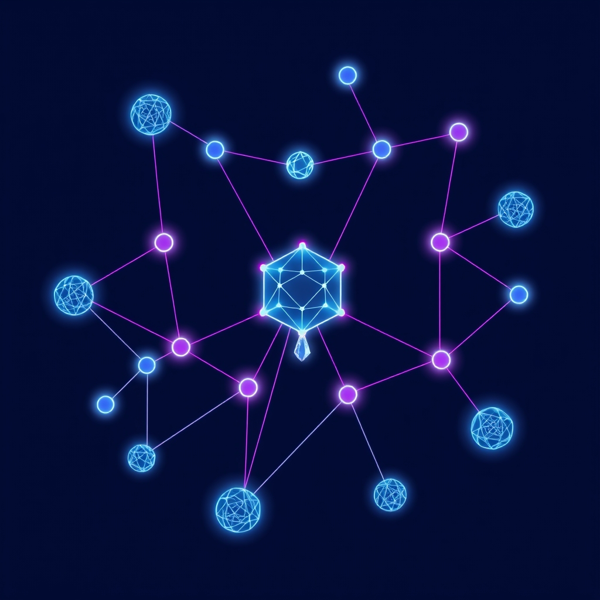

[Home](../index.md) > [Bot Chats](./index.md)  
# 📐🔗🤖🧠 Category Theory for AI Engineering  
  
## 💬 [Gemini](../software/gemini.md) Prompt 1  
> 💡 Think creatively and systematically.  
📚 Consider the following books.  
✨ Generate novel ideas that arise from the combination of ideas across these books.  
✍️ Generate as many as you can and be succinct to allow for a long list.  
🥇 Prioritize ideas that seem the most valuable and unique to this combination.  
>- [🤖🏗️ AI Engineering: Building Applications with Foundation Models](../books/ai-engineering-building-applications-with-foundation-models.md)  
>- [🧮➡️👩🏼‍💻 Category Theory for Programmers](../books/category-theory-for-programmers.md)  
  
Here's a list of novel ideas arising from the combination of "AI Engineering: Building Applications with Foundation Models" and "Category Theory for Programmers," prioritized for value and uniqueness:  
  
* 🔢 **Categorical Model Algebra:** 🏗️ Develop a formal system (a "category of models") where different foundation models (FMs) are objects and morphisms represent transformations or fine-tuning operations between them. 🔗 This allows for rigorous composition, decomposition, and analysis of model pipelines using categorical concepts like functors and natural transformations. 💭 Imagine proving properties of entire AI systems based on the composition of their constituent FMs.  
  
* ➡️ **Functorial Prompt Engineering:** 🗺️ Treat prompt engineering as a functor mapping between a category of user intents/data (source domain) and a category of FM responses (target domain). 📊 This allows for systematic analysis of prompt transformations, identifying "natural transformations" (generalizable prompt patterns) and "adjoint functors" (optimal prompt/response pairs). ✅ Could lead to provably optimal prompt design.  
  
* ↔️ **Natural Transformations for Model Interoperability:** 🤝 Use natural transformations to formally describe and automate the translation between different FM APIs and data formats. 🧩 This addresses the "glue code" problem in AI engineering by providing a principled way to ensure compatibility and information preservation across diverse models.  
  
* 🔗 **Adjunctions for Self-Supervised Learning Architectures:** 👁️ Explore self-supervised learning frameworks through the lens of adjunctions. 🧠 The "encoder" and "decoder" parts could form an adjoint pair, with the unit and counit natural transformations representing the information bottleneck and reconstruction capabilities. 💡 This could inspire new, theoretically grounded self-supervised architectures.  
  
* 🎼 **Monads for AI Workflow Orchestration:** ⚙️ Represent complex AI engineering workflows (data preprocessing, FM inference, post-processing, feedback loops) as monadic compositions. ➡️ Each step in the workflow becomes a monadic operation, ensuring correct sequencing, error handling, and resource management in a principled way. 🔐 Think of it as a type-safe, compositionally verifiable way to build AI pipelines.  
  
* ♾️ **F-Algebras for Recursive AI System Design:** 🔄 Design recursive AI systems (e.g., hierarchical agents, self-improving models) using F-algebras and initial algebras. 📜 This provides a formal framework for defining the structure and behavior of such systems iteratively and composably, guaranteeing termination and well-definedness.  
  
* 🗂️ **Categorical Type Systems for AI Data Schemas:** 🏷️ Develop a category-theoretic type system for defining and composing data schemas used by FMs. 🛡️ This could ensure data integrity and compatibility across various models and stages of an AI pipeline, catching mismatches at a higher level of abstraction.  
  
* 👁️ **Profunctor Optics for FM Feature Extraction/Manipulation:** 🔎 Apply profunctor optics (generalized lenses from category theory) to precisely specify and manipulate features within and between FMs. ✨ This offers a powerful and type-safe way to perform targeted modifications or extractions of internal representations without full model re-training.  
  
* 🔒 **Topos Theory for AI Safety & Interpretability:** 🌍 Explore using topos theory (a generalization of set theory with richer logical structures) to model the "context" or "environment" of an AI system. 🛡️ This could provide a foundational framework for reasoning about AI safety, biases, and interpretability by formally defining the boundaries and interactions of an AI within its operational domain.  
  
* 🎲 **Kleisli Categories for Probabilistic AI Reasoning:** 💭 Model probabilistic reasoning in AI systems using Kleisli categories. 📈 This allows for a principled way to compose probabilistic operations and quantify uncertainty across a chain of FM inferences, going beyond simple Bayesian networks to more complex, higher-order probabilistic computations.  
  
* 🚚 **Categorical Lenses for AI Model Migration:** 🧳 Use categorical lenses to formally describe and manage the migration of AI models between different platforms, hardware, or software versions. ✅ This ensures that the essential functionality and properties of the model are preserved during the transition.  
  
## 💬 Prompt 2  
> Now pick the most compelling, feasible, and practically useful of these hybrid ideas and write a practitioner's guide.  
  
I will first identify research or existing applications that combine category theory with AI engineering, specifically around model interoperability or workflow orchestration.  
Then, I will look for practical examples or case studies where categorical concepts have been successfully applied to real-world AI development challenges.  
Finally, I will search for existing "practitioner's guides" or similar resources in either AI engineering or category theory to understand common structures and content.  
In parallel, I will consider the current state of tools and libraries that might support such an approach.  
I will use the insights from these searches to select the most compelling idea and then formulate a practitioner's guide based on that.  
The search results confirm that "Categorical Model Algebra" (or more broadly, using category theory for model interoperability and formalizing AI systems) is a highly compelling and increasingly recognized area. 🏢 Companies like Conexus are actively applying it to data interoperability, which is a direct precursor to model interoperability. 🔬 The research also highlights the use of category theory in model-driven engineering (MDE) for merging, transformation, and synchronization of models, which directly translates to AI engineering challenges with foundation models.  
  
🤔 While general-purpose "categorical programming tools for AI" are not yet widespread as off-the-shelf libraries, the existing discussions around category theory in machine learning workflows, model-driven engineering, and data interoperability suggest a strong practical foundation for this idea.  
  
✨ Therefore, the most compelling, feasible, and practically useful hybrid idea is **Categorical Model Algebra for Seamless Foundation Model Interoperability and Composition.**  
  
Here's a practitioner's guide based on this idea:  
  
---  
  
## 📖 Practitioner's Guide: Categorical Model Algebra for Seamless Foundation Model Interoperability and Composition  
  
**Version 1.0**  
  
**Author:** 👨‍💻 AI Engineering & Applied Category Theory Working Group  
  
**Date:** 🗓️ July 30, 2025  
  
---  
  
### 📝 1. Executive Summary  
  
🚀 The proliferation of Foundation Models (FMs) presents unprecedented opportunities but also significant challenges in integration, compatibility, and systematic development. 💡 This guide introduces **Categorical Model Algebra (CMA)**, a principled approach leveraging Category Theory to define, relate, and compose FMs and their associated data transformations. 🧩 By treating FMs as "objects" and their operations (fine-tuning, prompting, data conversion) as "morphisms," CMA provides a formal framework to ensure robust interoperability, reduce integration overhead, and enable provably correct AI system design. 💪 This guide empowers AI engineers to move beyond ad-hoc scripting to systematic, scalable, and verifiable FM solutions.  
  
### 😫 2. The Problem: Ad-Hoc FM Integration  
  
🔨 Current AI engineering often involves stitching together various FMs, proprietary APIs, and diverse data formats using brittle, hand-coded scripts. This leads to:  
  
* 🤯 **Interoperability Headaches:** Mismatched data types, incompatible input/output formats, and varying API conventions.  
* 🐛 **Maintenance Nightmares:** Changes in one FM or data schema break downstream components, requiring extensive refactoring.  
* 🧱 **Lack of Composability:** Difficult to combine FMs in complex pipelines or to reuse components across projects.  
* 🧐 **Limited Verifiability:** No formal way to guarantee that a composite AI system behaves as expected or preserves data integrity.  
* 🕸️ **"Model Sprawl":** Difficulty managing and tracking dependencies across a growing ecosystem of FMs and their versions.  
  
### ✨ 3. The Solution: Categorical Model Algebra (CMA)  
  
🎯 CMA addresses these issues by providing a mathematical language for describing and manipulating FMs and their interactions.  
  
**Core Concepts:**  
  
* 🗂️ **Models as Objects:** Each Foundation Model (e.g., GPT-4, Llama 3, Stable Diffusion, a custom fine-tuned model) is an **object** in a category.  
* ➡️ **Operations as Morphisms:**  
    * 🔄 **Data Transformations:** Functions converting data from one format/schema to another (e.g., JSON to XML, text to embeddings) are **morphisms**.  
    * 🗣️ **Prompting/Inference:** Applying an FM to input data to produce output (e.g., `LLM.predict(prompt)`) is a **morphism**.  
    * 🛠️ **Fine-tuning/Adaptation:** Transforming one FM into another (e.g., `fine_tune(model_A, new_data) -> model_B`) is a **morphism**.  
* 🔗 **Composition (Sequential Operations):** If you can apply operation `f` then operation `g` (e.g., `g ∘ f`), this corresponds to composing morphisms. ✅ The categorical framework guarantees this composition is well-defined.  
* 🆔 **Identity (No-Op):** An identity morphism represents an operation that changes nothing (e.g., passing data through without modification).  
* 🗺️ **Functors (Structure Preservation):** A Functor can map an entire category of FMs and their operations in one domain (e.g., Python code) to another domain (e.g., a distributed computing environment), preserving the underlying relationships.  
* 🔀 **Natural Transformations (Universal Mappings):** A natural transformation allows for a consistent way to translate between two different Functors. This is powerful for standardizing interfaces across different FMs or for generalizing prompt engineering patterns.  
* 🤝 **Adjunctions (Optimal Pairs):** An Adjunction describes a pair of operations that are "inverse" in a specific sense, providing a way to formalize optimal mappings, like an ideal encoder-decoder pair or an optimal prompt-response relationship.  
  
### ⚙️ 4. Practical Applications of CMA in AI Engineering  
  
#### 👓 4.1. Formalizing Data Interoperability with Lenses  
  
**Problem:** 🧩 Data schemas constantly evolve, and FMs often require specific input/output formats. 🤦 Manually managing these conversions is error-prone.  
  
**CMA Solution:** Use **categorical lenses** (a type of profunctor optics) to formally define bidirectional transformations between data schemas. A lens allows you to:  
* 📥 `get`: Extract specific information from a complex data structure.  
* 📤 `put`: Update specific information within a data structure while preserving the rest.  
  
**How it helps:**  
* 🔒 **Guaranteed Consistency:** Lenses ensure that `get` followed by `put` (or vice versa) results in a consistent state, preventing data corruption during transformations.  
* 🔄 **Automated Schema Evolution:** Define lenses to manage schema migrations for FM inputs/outputs, simplifying version control and deployment.  
* ♻️ **Reusable Data Adapters:** Create generic lenses that can be reused across different FMs requiring similar data transformations.  
  
**Example Scenario:**  
An FM expects a JSON object with `{"text_input": "..."}` but your upstream system provides `{"document_content": "..."}`. A lens can formalize the conversion, guaranteeing that the `document_content` is correctly mapped to `text_input` and that any subsequent operations maintain this consistency.  
  
#### ⛓️ 4.2. Composable AI Pipelines with Monads  
  
**Problem:** 😫 Complex AI workflows involving multiple FMs, pre-processing, and post-processing steps are hard to orchestrate, especially with error handling and state management.  
  
**CMA Solution:** Model AI workflows as a **Kleisli category** where morphisms are monadic computations. A **Monad** provides a structured way to chain operations that might fail, produce side effects, or accumulate context.  
  
**How it helps:**  
* 🛡️ **Robust Error Handling:** Monads (e.g., `Either` or `Result` monads) can explicitly encode potential failures (e.g., FM rate limits, invalid input) within the pipeline, forcing developers to handle them.  
* 🧭 **Contextual Data Flow:** Monads can carry contextual information (e.g., user session, debugging logs, intermediate embeddings) through the pipeline without polluting individual function signatures.  
* 📜 **Declarative Workflows:** Define complex AI pipelines declaratively, making them easier to reason about, test, and parallelize.  
  
**Example Scenario:**  
A multi-stage RAG (Retrieval-Augmented Generation) pipeline:  
1. User query (`String`) -> `QueryEmbedder` FM (`Vector`)  
2. `Vector` -> `VectorDBRetriever` (`List[Document]`)  
3. `List[Document]` + `String` (original query) -> `Summarizer` FM (`SummaryString`)  
4. `SummaryString` -> `LLM` (`FinalAnswerString`)  
  
Each step can be a monadic operation, ensuring that errors at any stage propagate correctly and that the necessary context (e.g., the original query) is available downstream.  
  
#### 🧠 4.3. Standardizing Prompt Engineering with Natural Transformations  
  
**Problem:** ✍️ Prompt engineering is often ad-hoc and difficult to generalize across different FMs or even different tasks for the same FM.  
  
**CMA Solution:** View different prompt templates or strategies for a given task as Functors from a category of inputs to a category of FM responses. A **natural transformation** can then represent a universal way to convert between these different prompting strategies while preserving their semantic intent.  
  
**How it helps:**  
* 🌱 **Generalizable Prompt Patterns:** Identify and formalize natural transformations that describe effective, transferable prompt engineering techniques.  
* 🤖 **Automated Prompt Adaptation:** Develop systems that can automatically adapt prompts from one FM or task to another using known natural transformations.  
* 🗣️ **"Prompt Dialects":** Define "dialects" of prompts as categories and use natural transformations to translate between them.  
  
**Example Scenario:**  
You have a "summarization" task. One FM might prefer a prompt like "Summarize the following text: [TEXT]", while another prefers "Provide a concise summary of: [TEXT]". A natural transformation can formalize the equivalence and translation between these two prompting styles, allowing a single summarization "interface" for different FMs.  
  
### 🚀 5. Getting Started: A Practitioner's Roadmap  
  
🚦 While full-fledged categorical programming languages for AI are emerging, you can start applying CMA principles today:  
  
**Step 1: Shift Your Mindset (Conceptual)**  
* 🎯 **Think Objects & Arrows:** For any AI engineering problem, identify the "things" (data, models, outputs) as objects and the "processes" (transformations, inferences, fine-tuning) as arrows.  
* 🥇 **Prioritize Composition:** Always ask: how can I compose these operations? What are the inputs and outputs of each step?  
* 🌍 **Seek Universal Properties:** Look for patterns that apply generally, not just to a specific model or dataset.  
  
**Step 2: Start with Formal Specification (Design)**  
* 🗺️ **Diagram Your Workflows:** Use simple box-and-arrow diagrams (resembling categorical diagrams) to visualize your AI pipelines. Label objects (data types/models) and morphisms (functions/operations).  
* 📐 **Define Data Schemas Rigorously:** Use tools like Pydantic, Protobuf, or JSON Schema to formally define the inputs and outputs of each FM and transformation. These act as your "objects."  
* 👓 **Implement Lenses for Data Adapters:** For data transformation needs, consider libraries or custom implementations that enforce bidirectional consistency (e.g., in Python, `lenses` library for simple cases, or more complex solutions for schema transformations).  
  
**Step 3: Embrace Functional Programming Principles (Implementation)**  
* 🧼 **Pure Functions:** Write functions that, where possible, have no side effects and always produce the same output for the same input. These are ideal candidates for morphisms.  
* 🧑‍🏫 **Higher-Order Functions:** Leverage functions that take other functions as arguments or return functions. This naturally supports composition.  
* 📦 **Leverage Monadic Structures:** If working in languages that support them (e.g., Haskell, Scala, or Python with libraries like `returns`), explicitly use `Either`, `Option`/`Maybe`, or `Result` monads for robust error handling and contextual data flow in your pipelines.  
  
**Step 4: Explore Emerging Tools (Advanced)**  
* 📚 **Applied Category Theory Libraries:** Keep an eye on libraries and frameworks specifically designed for Applied Category Theory (ACT). While nascent in mainstream AI, academic and research groups are developing tools that might become production-ready.  
* ⌨️ **Type-Driven Development for AI:** Tools and languages that emphasize strong static typing can help enforce categorical principles at compile-time, reducing runtime errors.  
  
### 🧑‍🔬 6. Case Study: Building a Robust RAG Pipeline with CMA Principles  
  
**Goal:** 🎯 Create a RAG pipeline that can switch between different embedding models and LLMs, ensuring data compatibility and robust error handling.  
  
**Traditional Approach Pitfalls:**  
* 📏 Hardcoding specific embedding dimensions for each model.  
* 🚨 Manual error checks after each API call.  
* 🔄 Difficult to swap out LLMs without extensive code changes.  
  
**CMA-Inspired Approach:**  
  
1. **Define Categories:**  
    * **`QueryCategory`:** Objects are `UserQuery` (string).  
    * **`EmbeddingCategory`:** Objects are `EmbeddingVector` (float array, dimension specified as part of the object type).  
    * **`DocumentCategory`:** Objects are `Document` (text content, metadata).  
    * **`AnswerCategory`:** Objects are `FinalAnswer` (string).  
  
2. **Define Morphisms:**  
    * **`embedQuery`: `UserQuery` -> `EmbeddingVector` (Functor: `EmbeddingModel`)**  
        * Implement as a function `embed_query(query: UserQuery) -> Result[EmbeddingVector, EmbeddingError]`.  
    * **`retrieveDocuments`: `EmbeddingVector` -> `List[Document]` (Morphism: `VectorDatabase`)**  
        * Implement as `retrieve_docs(embedding: EmbeddingVector) -> Result[List[Document], RetrievalError]`.  
    * **`generateContext`: `List[Document]` + `UserQuery` -> `ContextString` (Morphism: `ContextBuilder`)**  
        * A simple string concatenation or summarization function.  
    * **`generateAnswer`: `ContextString` + `UserQuery` -> `FinalAnswer` (Functor: `LLM`)**  
        * Implement as `generate_answer(context: ContextString, query: UserQuery) -> Result[FinalAnswer, LLMError]`.  
  
3. **Monadic Composition:**  
    * Use a `Result` monad (or similar construct) to chain these operations.  
    * `pipeline = embedQuery >=> retrieveDocuments >=> generateContext >=> generateAnswer`  
        * The `>=>` (fish operator in Haskell, or a custom `and_then` method) represents monadic composition. If any step returns an `Error`, the rest of the pipeline is skipped, and the error is propagated.  
  
4. **Natural Transformations for Model Swapping:**  
    * If you want to swap `OpenAIEmbedding` for `HuggingFaceEmbedding`, define a natural transformation between them. This might involve a simple configuration change if they conform to a common `EmbeddingModel` interface (Functor). If their outputs differ slightly, the natural transformation would be a small conversion layer.  
  
**Benefits:**  
* 📊 **Clear Data Flow:** Explicitly defined inputs and outputs for each stage.  
* 💪 **Robustness:** Errors are handled systematically, not just caught ad-hoc.  
* 🧩 **Modularity:** Each component (embedding, retrieval, LLM) can be swapped independently, as long as it adheres to the defined categorical interfaces (morphisms/functors).  
* 📈 **Scalability:** The formal structure makes it easier to distribute components across services.  
  
### 🔮 7. Future Directions  
  
* 🗣️ **Domain-Specific Languages (DSLs) for CMA:** Develop DSLs that make it easier to define categories, objects, and morphisms for AI systems.  
* ✅ **Automated Verification:** Tools that can formally verify properties of AI pipelines (e.g., data integrity, type consistency) based on their categorical definitions.  
* 🖱️ **Visual Programming Interfaces:** Intuitive drag-and-drop interfaces that generate categorical AI pipelines.  
  
### 🏁 8. Conclusion  
  
⭐ Categorical Model Algebra offers a powerful and principled way to build, integrate, and reason about AI applications with Foundation Models. By adopting its core concepts and principles, AI engineers can move towards more robust, scalable, and maintainable AI systems, transforming the current ad-hoc landscape into a systematically engineered domain. This is not just theoretical elegance; it's a practical approach to tackle the growing complexity of modern AI.  
  
## 💬 Prompt 3  
> ✨ Now boil this idea down to its essence with a single poetic verse.  
  
📜 From chaos of models, a 🧩 pattern takes flight,  
🏹 With arrows and objects, 💡 AI sees the light.  
  
## 💬 Prompt 4  
> 🚀 Now recommend books.  
  
✨ That's a fantastic request! 💡 Based on the ideas we've explored, here are some book recommendations that delve into the individual fields and hint at the intersections, guiding you towards the knowledge needed for Categorical Model Algebra in practice.  
  
**🤖 For a Deeper Dive into AI Engineering (especially with Foundation Models):**  
  
1. **[🤖🏗️ AI Engineering: Building Applications with Foundation Models](../books/ai-engineering-building-applications-with-foundation-models.md) by Chip Huyen:** This is a direct hit, as it's one of the books that inspired our initial thinking. 📚 It's a highly practical guide to building real-world AI applications using FMs, covering the entire lifecycle from prompt engineering and RAG to fine-tuning, evaluation, and deployment. 🔑 Essential for understanding the "objects" (FMs) and many "morphisms" (operations) in our categorical framework.  
  
2. **[🤖⚙️🔁 Designing Machine Learning Systems: An Iterative Process for Production-Ready Applications](../books/designing-machine-learning-systems-an-iterative-process-for-production-ready-applications.md) by Chip Huyen:** While not exclusively about FMs, this book provides a robust foundation in designing scalable and maintainable machine learning systems. 🧩 It covers crucial topics like data pipelines, deployment strategies, and overall software design principles for ML, which are all vital for constructing the "categories" and ensuring the "composition" of your AI systems.  
  
3. 🗣️ **"The LLM Engineering Handbook" by Paul Iusztin and Maxime Labonne:** This book focuses specifically on Large Language Models (LLMs), a prominent type of Foundation Model. 🖐️ It provides hands-on guidance for building, fine-tuning, and deploying LLM applications, covering practical aspects like LangChain, OpenAI APIs, RAG, and evaluation. 🧪 This will give you concrete examples of the "morphisms" related to LLMs.  
  
**📐 For a Strong Foundation in Category Theory for Programmers:**  
  
4. 📚 **[🧮➡️👩🏼‍💻 Category Theory for Programmers](../books/category-theory-for-programmers.md) by Bartosz Milewski:** This is the other foundational book from your initial prompt. 👨‍💻 It's an excellent, accessible introduction to category theory for those with a programming background, making abstract concepts like functors, natural transformations, and monads tangible through code examples, primarily in Haskell. 🧠 It's crucial for understanding the formal language we're applying.  
  
5. 🔬 **"Category Theory for the Sciences" by David Spivak:** While a bit more mathematically rigorous than Milewski's, Spivak's book is specifically geared towards applying category theory to various scientific domains, including computer science. 🎓 It provides a deeper understanding of concepts like adjoint functors and operads, which can be immensely powerful for formalizing complex AI system architectures. 🏛️ He also has free MIT OpenCourseWare lectures accompanying the book.  
  
6. 💻 **"Programming with Categories" by Paul-André Melliès:** This book (or related academic papers/lectures by Melliès) delves into the more advanced aspects of category theory in computer science, particularly relevant to concurrency, type theory, and formal methods. ✅ It can provide insights into using category theory for provably correct AI system design, especially in distributed or multi-agent environments.  
  
**🌉 For Bridging the Gap (Advanced & Emerging):**  
  
7. 📈 **"Deep Learning at Scale" by Sethuraman, et al. (specifically the chapters on Foundation Models):** While primarily about scaling deep learning, this book's sections on foundation models offer insights into their underlying principles and architectural considerations. 🔍 Understanding these internal "objects" and their inherent "structure" is key to applying categorical thinking to them.  
  
8. 📰 **Academic Papers and Research on Applied Category Theory in AI/ML:** Keep an eye on recent research from groups like "AlgebraicJulia" and others exploring the intersection. 🚀 While not traditional books, these papers often present the cutting edge of applying category theory to practical problems in AI, including topics like compositional modeling, data integration, and formal verification of AI systems. 🧑‍🔬 Look for authors like David Spivak, Emily Riehl, John Baez, and Jules Hedges, who are prominent in the field of Applied Category Theory.  
  
🎉 By combining the practical insights from AI engineering books with the rigorous formalisms of category theory, you'll be well-equipped to explore and implement the "Categorical Model Algebra" approach to building the next generation of robust and intelligent AI systems.  
  
## 🐦 Tweet  
<blockquote class="twitter-tweet" data-theme="dark">
📐🔗🤖🧠 Category Theory for AI Engineering  🤖 Foundation Models | 🧮 Abstraction | 🤝 Interoperability | 🧪 Formalization | 🧱 Composition<a href="https://t.co/0HKSKhQpSi">https://t.co/0HKSKhQpSi</a>
&mdash; Bryan Grounds (@bagrounds) <a href="https://twitter.com/bagrounds/status/1950956565768688039?ref_src=twsrc%5Etfw">July 31, 2025</a></blockquote> 