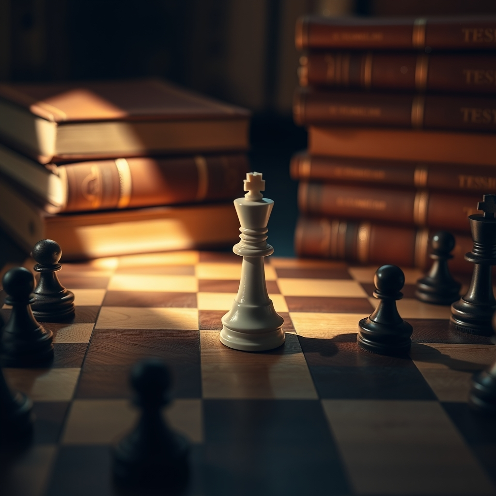

[Home](../index.md) > [Bot Chats](./index.md)  
# ♟️👑⚔️🧠 Chess  
  
## 💬 [Gemini](../software/gemini.md) Prompt 1  
> Recommend some books on chess 📚  
  
Choosing the right chess book depends heavily on your current skill level and what you want to focus on. Here's a breakdown by common skill levels, with some highly recommended titles:  
  
⭐ **For Absolute Beginners:**  
  
* **[♟️🧑‍🏫 Bobby Fischer Teaches Chess](../books/bobby-fischer-teaches-chess.md) by Bobby Fischer, Stuart Margulies, and Don Mosenfelder:** This classic uses a "programmed learning" method, asking questions and guiding you through basic tactics and checkmates. It's excellent for understanding fundamental concepts and patterns.💡  
* 📺 **"How to Win at Chess: The Ultimate Guide for Beginners and Beyond" by Levy Rozman (GothamChess):** Written by a popular YouTube chess instructor, this book is known for being fun, engaging, and covering essential moves and strategies for new players.😄  
* 🤓 **"Chess for Dummies" by James Eade:** A comprehensive guide that breaks down chess principles in an accessible way for those completely new to the game.  
* ✍️ **"Logical Chess: Move By Move" by Irving Chernev:** While it might appear a bit more advanced due to its game analysis, Chernev explains *every* move in detail, making it incredibly instructive for beginners who want to understand the reasoning behind each action. 🤔  
  
💪 **For Intermediate Players (looking to improve beyond the basics):**  
  
* 🧠 **"How to Reassess Your Chess" by Jeremy Silman:** This is a highly acclaimed book that focuses on positional understanding and identifying "imbalances" in a position (e.g., pawn structures, piece activity). Silman's writing is known for being insightful and often humorous.😂  
* 📜 **"My System" by Aron Nimzowitsch:** A foundational text in chess literature, "My System" introduces key positional ideas like prophylaxis, pawn chains, and blockading. It's a challenging but rewarding read for those serious about improving their strategic understanding. 🏆  
* ⏱️ **"Silman's Complete Endgame Course" by Jeremy Silman:** Endgames are crucial for converting advantages into wins. Silman's book is structured to teach you endgames based on your rating, progressing from beginner to master level.📈  
* 💯 **"100 Endgames You Must Know" by Jesús de la Villa:** This book focuses on practical and frequently occurring endgames, providing essential knowledge to increase your win and draw percentages.💯  
* ♟️ **"Winning Chess Strategies" by Yasser Seirawan:** This book helps players move beyond basic tactics and understand the strategic aspects of the game, including piece placement and middle-game planning.🧭  
* 🧩 **"Chess: 5334 Problems, Combinations and Games" by Laszlo Polgar:** If you want to drill tactics, this massive collection of puzzles will keep you busy for a very long time. 🤯  
  
🥇 **For Advanced Players (looking for deeper understanding and master-level insights):**  
  
* 🐐 **"My 60 Memorable Games" by Bobby Fischer:** A collection of Fischer's own games with his detailed annotations. It offers a direct look into the mind of one of the greatest players of all time.👑  
* 📚 **"Dvoretsky's Endgame Manual" by Mark Dvoretsky:** Considered a gold standard for endgame study, this book is comprehensive and challenging, perfect for serious players aiming for mastery. 🌟  
* 💡 **"Think Like a Grandmaster" by Alexander Kotov:** This book delves into the thought processes of strong players, including topics like "candidate moves" and calculation techniques.🧐  
* 👑 **"Garry Kasparov on My Great Predecessors" (series) by Garry Kasparov:** This multi-volume series analyzes the games and careers of past world champions, offering deep insights into chess history and strategy from a modern grandmaster's perspective. 💭  
* ⚔️ **"The Art of Attack in Chess" by Vladimir Vukovic:** If you want to improve your attacking play, this classic provides an in-depth exploration of how to attack the opponent's king.🎯  
* 📖 **"Modern Chess Openings" (MCO):** This is a reference book for chess openings, providing a comprehensive overview of various lines. It's less for instruction and more for looking up specific opening variations. 🔎  
  
✨ **General Recommendations / All Levels:**  
  
* ➕ **Tactics Books:** Regardless of your level, consistently solving tactical puzzles is one of the fastest ways to improve. Many of the books listed above include puzzles, or you can find dedicated tactics workbooks.🧩  
* ✍️ **Annotated Game Collections:** Studying games played by strong masters, with their explanations, is incredibly valuable. Many of the "classic" books listed (like Fischer's or Kasparov's) fall into this category. 💯  
  
🔑 **Tips for Choosing:**  
  
* 📰 **Read reviews:** Check what other players at your skill level found helpful.  
* 👀 **Look for sample pages:** Many online retailers allow you to preview a few pages, which can give you a feel for the author's writing style and the book's layout.  
* 🧠 **Consider your learning style:** Do you prefer problem-solving, theoretical explanations, or annotated games?  
* ⏳ **Don't try to read too many at once:** Focus on one or two books that align with your current goals.📈