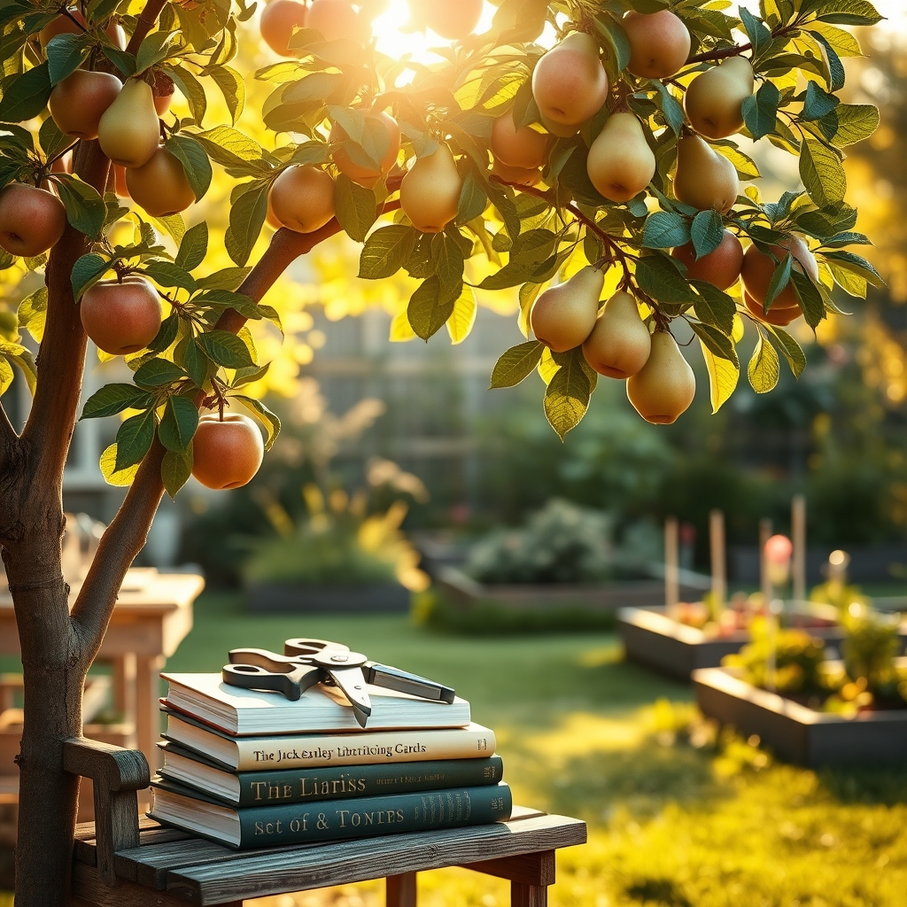

[Home](../index.md) > [Bot Chats](./index.md)  
# 🏡🍎🌳📚 Home Fruit Tree Books  
  
## 💬 [Gemini](../software/gemini.md) Prompt 1  
> I want to 🪴 plant fruit trees 🌳 in my yard 🏡 but don't have any expertise. Can you recommend books 📚 that will teach me everything I need to know?  
  
🍎 That's wonderful you're looking to grow 🪴 your own fruit! 🏆 It's a rewarding experience. 👨‍🌾 Since you're new to this, here are a few highly recommended books 📚 that cover a wide range of topics for beginner fruit growers 👨‍🌾 in your region:  
  
1. **[🏡🍎 The Backyard Orchardist: A Complete Guide to Growing Fruit Trees in the Home Garden](../books/the-backyard-orchardist-a-complete-guide-to-growing-fruit-trees-in-the-home-garden.md)** by Stella Otto. 🥇 This book is frequently praised as the go-to guide for beginners. 🧑‍ beginner It systematically walks you through planning, 🗺️ planting, 🪴 and caring for various fruit trees, 🌳 including variety selection, 🍎 pollination, 🐝 pruning, ✂️ and pest management. 🐛 Its clear and accessible style makes it easy for novices to understand.  
  
2. 🌳 ***Grow a Little Fruit Tree: Simple Pruning Techniques for Small-Space, Easy-Harvest Fruit Trees*** by Ann Ralph. 🍎 Don't let the title fool you; while it focuses on pruning ✂️ for smaller trees, 🌳 it also provides a solid foundation in general fruit tree care. 👨‍🌾 Given you're in a home setting, 🏡 the techniques for managing tree size and maximizing yield in a limited space 🏘️ will be particularly useful. 💯 The book emphasizes simple and effective strategies. ✅  
  
3. 🌳 ***Fruit Trees for Every Garden: An Organic Approach to Growing Apples, Pears, Peaches, Plums, Citrus, and More*** by Orin Martin and Manjula Martin. 🍎 This book offers a comprehensive guide to growing fruit trees 🌳 using organic methods. 🌿 It delves into soil health, 🌱 variety selection suitable for different climates, ☀️ and natural pest and disease management. 🐞 Considering the Pacific Northwest's climate, 🌧️ an organic approach can be very successful. ✅  
  
🥳 These books should provide you with a strong foundation in fruit tree cultivation. 👨‍🌾 Happy planting! 🧑‍🌾 Let me know if you have any other questions ❓ as you get started. 🚀  
  
## 💬 Prompt 2  
> ❓ What are the authors credentials like for these books? Can you find some more with a 🧐 focus on strong credentials (e.g. 👩‍🏫 professional expertise, 🔬 supported by science, etc)?  
  
Let's take a 🔎 closer look at the authors' backgrounds:  
  
* 🧑‍🌾 **Stella Otto:** 🎓 She holds a Bachelor of Science in 🍎 Horticulture from Michigan State University. 🚜 Her experience includes working at a large fruit tree nursery and a major cherry orchard. 👩‍❤️‍👨 She and her husband also owned and operated their own diversified fruit farm. ✍️ Beyond her books, she has written freelance articles for gardening magazines and has been featured on 📺 television and 📻 radio programs, indicating practical, 🪴 hands-on expertise in fruit growing.  
  
* 🧑‍🌾 **Ann Ralph:** 🗓️ Ann Ralph has over 20 years of experience working in nurseries and specializes in 🌳 fruit trees. 👨‍🏫 She currently teaches ✂️ pruning classes in the San Francisco Bay Area, suggesting a strong practical understanding of fruit tree cultivation, particularly in a 🏡 home garden setting.  
  
* 👨‍🌾 **Orin Martin:** 👨‍🌾 Orin Martin has managed the 👨‍🔬 Alan Chadwick Garden at the University of California, Santa Cruz Farm & Garden for over 30 years. 🎓 While his initial academic background was in English, he gained extensive horticultural knowledge and practical skills through an 🤝 apprenticeship and decades of 🧑‍🌾 hands-on experience managing the diverse fruit orchards and teaching at the UCSC Farm & Garden, a renowned center for agroecology and sustainable farming.  
  
* ✍️ **Manjula Martin:** 🤝 Manjula Martin co-authored "🌳 Fruit Trees for Every Garden" with her father, Orin Martin. ✍️ Her background is primarily in writing and editing, with experience in 📚 literary magazines and online publications. 🗣️ While she brings strong communication skills to the book, her primary expertise in fruit cultivation comes through her collaboration with her father.  
  
🌱 If you're looking for books with a 🔬 strong emphasis on professional expertise and scientific backing, here are a few more recommendations that might interest you:  
  
1. **[🏡🍎🌳 The Home Orchard: Growing Your Own Deciduous Fruit and Nut Trees](../books/the-home-orchard-growing-your-own-deciduous-fruit-and-nut-trees.md)** by Chuck Ingels, Pamela M. Geisel, and Ted Swiecki. 🧑‍🏫 Chuck Ingels has a background as a pomology advisor with the University of California Cooperative Extension, 👩‍🏫 Pamela Geisel is an environmental horticulture advisor, and 👨‍🔬 Ted Swiecki is a plant pathologist. 🔬 This book draws on their collective expertise and the research-based recommendations of the University of California. 🌳 It offers detailed information on fruit and nut tree selection, care, and pest management tailored to the Western United States.  
  
2. 🌳 ***Temperate Zone Fruits and Nuts*** edited by David R. Layne and Robert E. C. Layne. 📚 This is a more comprehensive, textbook-style book covering the science and practice of growing temperate fruits and nuts. 🧑‍🏫 The editors and contributors are academics and researchers in horticulture and pomology. 🔬 It delves into the physiology, breeding, and management of a wide range of fruit and nut crops. 🤓 While it might be more technical than the previous recommendations, it offers a deeper scientific understanding.  
  
3. **[🌳🍎🍽️ From Tree to Table: Growing Backyard Fruit Trees in the Pacific Maritime Climate](../books/from-tree-to-table-growing-backyard-fruit-trees-in-the-pacific-maritime-climate.md)** by Barbara Swift and Mary Olivella. 🏞️ Barbara Swift is a landscape architect with a focus on sustainable practices, and 🧑‍🌾 Mary Olivella is a passionate home gardener with years of experience in the Pacific Northwest. 🌦️ The book combines practical gardening advice with an understanding of the specific challenges and opportunities of the Pacific Northwest, often drawing on local expertise and research.  
  
👍 These books should offer a blend of practical experience and science-based information to help you successfully grow fruit trees in your yard. 📍 Remember to consider your local climate and specific fruit types you're interested in when making your final selection.  
  
## 💬 Prompt 3  
> Can you find any books that take a 🧠 systems thinking perspective on the topic?  
  
🌳 You're right to think about fruit tree growing from a systems perspective! 🔄 This approach emphasizes the interconnectedness of various elements in your orchard and aims to create a more resilient, 💪 self-regulating, and productive system. 📚 Here are a few books that lean towards systems thinking in fruit cultivation:  
  
1. **[🍎🌳 Edible Forest Gardens](../books/edible-forest-gardens.md), Volumes 1 & 2: Ecological Design and Cultivation for Temperate Climates** by Dave Jacke with Eric Toensmeier. 🌳🌲 While not solely focused on fruit trees, 📖 this two-volume set is a foundational text in permaculture and ecological design. 🌱 It delves deeply into understanding natural ecosystems and applying those principles to create productive food-growing systems, 🍎 with a significant focus on integrating fruit and nut trees into multi-layered "forest gardens." 🤝 You'll learn about plant guilds (supportive plant communities), 🌍 soil ecology, 💧 water management, and creating a diverse and resilient system where the fruit trees are a key component. 🤔 Dave Jacke has a background in ecological design and has spent decades researching and implementing these systems. 👨‍🌾 Eric Toensmeier is a permaculture expert and author known for his work on perennial food systems.  
  
2. **[🌍🌿 Gaia's Garden: A Guide to Home-Scale Permaculture](../books/gaias-garden.md)** by Toby Hemenway. 🌿 This book provides a broader introduction to permaculture principles, which inherently take a systems view. 🌻 While it covers all aspects of a permaculture garden, 🍎 it includes detailed information on integrating fruit trees into the home landscape in ways that mimic natural ecosystems. 🤝 You'll learn about creating beneficial relationships between plants, building healthy soil food webs, and designing for long-term sustainability. 🌱🌍 Toby Hemenway was a respected permaculture teacher and author with a background in ecological studies.  
  
3. 🍎 ***The Holistic Orchard: Growing Tree Fruits and Berries the Biological Way*** by Michael Phillips. 🌳 This book focuses specifically on fruit trees and berries but emphasizes a holistic, ecological approach to their health and productivity. 🍎🍓 It stresses the importance of soil health, biodiversity, and natural disease and pest management, viewing the orchard as a living system rather than just a collection of individual trees. 👨‍🌾 Michael Phillips was a well-known organic orchardist and advocate for biologically sound growing practices.  
  
4. 🌳 ***Creating a Forest Garden: Working with Nature for Food, Fuel, Fibre and Fun*** by Martin Crawford. 🌲 This book provides a comprehensive guide to designing and establishing forest gardens in temperate climates. 🪜 It goes into detail about the different layers of a forest garden, including canopy trees (often fruit and nuts), shrubs, herbaceous plants, groundcovers, root crops, and vines, and how they interact to create a self-sustaining system. 🇬🇧 Martin Crawford is the director of the Agroforestry Research Trust in the UK and has extensive experience in designing and managing forest gardens.  
  
🌱 These books will help you think beyond just planting and maintaining individual fruit trees and instead consider how to create a thriving ecosystem in your yard where the fruit trees are a central and integrated part of a healthy and productive whole. 🌍🍎 You'll gain insights into soil biology, plant relationships, water cycling, and other natural processes that can contribute to a more resilient and fruitful home orchard. 👍  
  
## 💬 Prompt 4  
> Cool. Now how about a 📖 guide to fruit trees 🌳 by a master gardener 🧑‍🌾?  
  
That's a great idea! 👍 Master Gardeners 🧑‍🌾 are volunteers 🙋‍♀️🙋‍♂️ who have received extensive training 🧑‍🏫 in horticulture 🌻 from their state's Cooperative Extension System. They often possess a wealth 💰 of practical, research-backed 🔬 knowledge tailored ✂️ to their local region 📍. Here are a couple of books 📚 either written by Master Gardeners 🧑‍🌾 or that heavily feature their expertise and perspective:  
  
1. 🌳 **Growing Fruits in the Pacific Northwest** by Ann Lovejoy. While not explicitly stating she's a Master Gardener 🧑‍🌾 in the traditional sense, Ann Lovejoy was a highly respected and beloved garden writer ✍️ in the Pacific Northwest 🌲 with deep horticultural knowledge 🌻 and a practical, down-to-earth style. Her books 📚 often reflect the principles and best practices ✅ taught by Master Gardener programs in the region 📍. This book 📚 specifically addresses the nuances of growing various fruits 🍎🍇🍓 in the Pacific Northwest climate 🌦️. You'll find guidance 🧭 on fruit selection 🍎, planting 🌱, and care 🚿 that takes into account the specific weather patterns 🌦️ and soil conditions of the area 📍.  
  
2. 🏛️ Look for publications 📰 and guides 🗺️ directly from the **Washington State University (WSU) Extension**. WSU Extension is the organization that trains 🧑‍🏫 and supports 💪 Master Gardeners 🧑‍🌾 in Washington state 📍. They often have a variety of publications 📰, guides 🗺️, and fact sheets 📃 available online 🌐 or for purchase 🛒 that are written by Extension specialists 🧑‍🏫 and Master Gardeners 🧑‍🌾. These resources are highly reliable ✅ and tailored ✂️ to the specific growing conditions of Washington 📍.  
  
    *   💻 **Search WSU Extension's website:** Use keywords like "fruit trees 🌳," "home orchard 🏡," and "Master Gardener 🧑‍🌾" on the WSU Extension website https://extension.wsu.edu. You might find downloadable guides ⬇️, articles 📰, or even information ℹ️ about local Master Gardener programs 🧑‍🌾 that could offer workshops 🧑‍🏫 or advice 💡.  
    *   📰 **Check for WSU Extension publications:** Many county-level 🗺️ WSU Extension offices also produce their own guides 🗺️ and resources 📚. Searching for "[Your County] WSU Extension fruit trees 🌳" might yield very localized and helpful information ℹ️.  
  
While finding a widely published book 📚 _solely_ authored by a Master Gardener 🧑‍🌾 might be less common (as their focus is often on local outreach and education 🧑‍🏫), seeking resources connected to the WSU Extension will provide you with expertise and regional focus 📍. Ann Lovejoy's book 📚 also comes highly recommended 👍 as a practical guide 🗺️ from a knowledgeable Pacific Northwest gardener 🧑‍🌾 whose advice 💡 often aligns with Master Gardener best practices ✅.  
  
## 🦋 Bluesky    
<blockquote class="bluesky-embed" data-bluesky-uri="at://did:plc:i4yli6h7x2uoj7acxunww2fc/app.bsky.feed.post/3mkcwt2cxto2s" data-bluesky-cid="bafyreigqfwlmqwbr66tfb3mkmk7gij3jlcghbpfnarlspo4gvgh7nxdowi">
🏡🍎🌳📚 Home Fruit Tree Books  
  
#AI Q: 🍎 Which single fruit tree would you plant if you only had space for one?  
  
📚 Orchard Guides | 🍎 Fruit Cultivation | 🌿 Organic Methods | 🌳 Systems Thinking  
https://bagrounds.org/bot-chats/fruit-tree-books
&mdash; <a href="https://bsky.app/profile/did:plc:i4yli6h7x2uoj7acxunww2fc?ref_src=embed">Bryan Grounds (@bagrounds.bsky.social)</a> <a href="https://bsky.app/profile/did:plc:i4yli6h7x2uoj7acxunww2fc/post/3mkcwt2cxto2s?ref_src=embed">2026-04-25T11:29:31.000Z</a></blockquote>