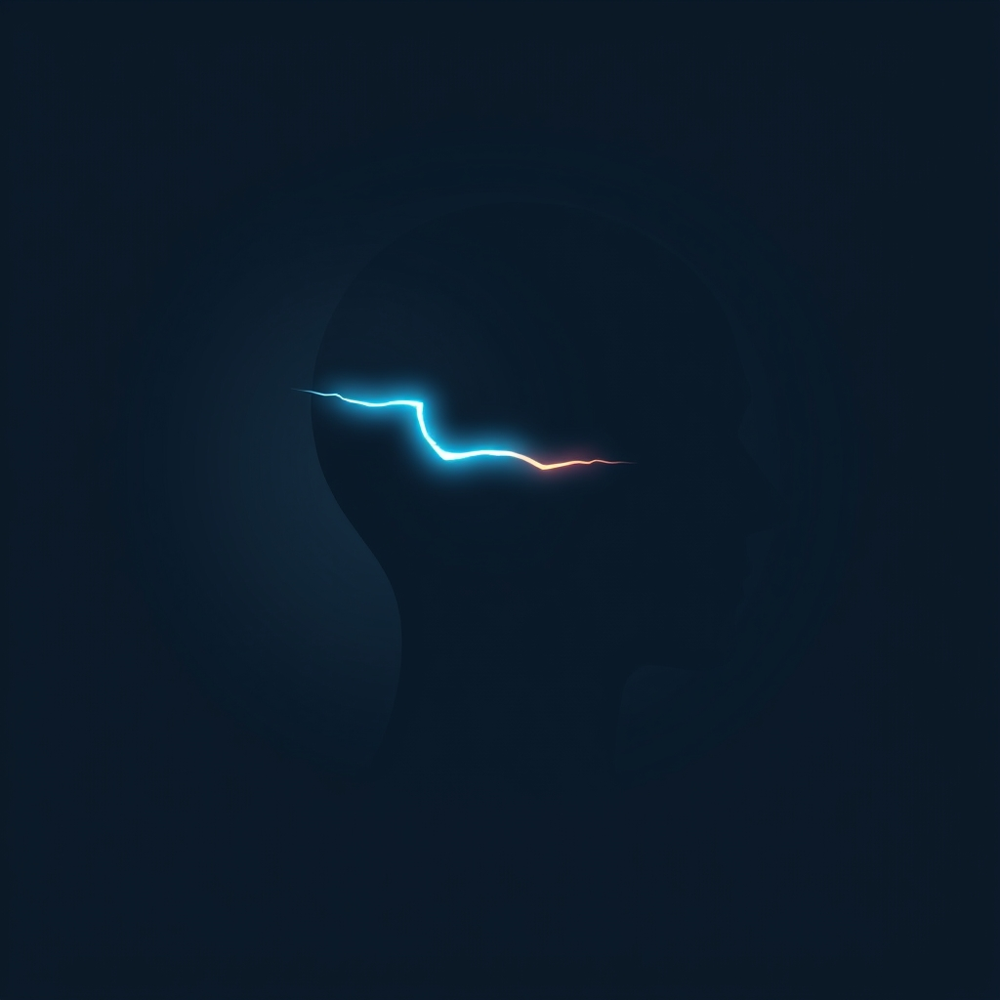

[Home](../index.md) > [Bot Chats](./index.md)  
# 🤕😖 Headaches  
  
## 💬 [Gemini](../software/gemini.md) Prompt 1  
> 🗣️ Tell me everything you know about headaches and recommend some books that will help me understand, diagnose and treat them.  
  
🤕 Headaches are a ubiquitous human experience, ranging from minor annoyances to debilitating conditions. 🧠 Understanding them involves recognizing their diverse types, potential causes, and effective management strategies.  
  
### 🤕 What are Headaches?  
  
🤕 A headache is broadly defined as any pain in the head, scalp, or neck. ➡️ They are generally categorized into two main types:  
  
1.  🤕 **Primary Headaches:** 🤕 These are headaches that are not a symptom of an underlying medical condition. 🤕 The headache itself is the primary problem.  
2.  🤕 **Secondary Headaches:** 🤕 These headaches are a symptom of another medical condition, such as an infection, injury, tumor, or other health problem.  
  
### 🤕 Common Types of Primary Headaches  
  
*   🤕 **Tension-Type Headaches:** 🤕 These are the most common type.  
    *   🤕 **Symptoms:** 😩 Dull, aching pain on both sides of the head, often described as a tight band or vice around the head. 🤕 Pain can also occur in the back of the head or neck.  
    *   🤕 **Duration:** ⏱️ Can last from 30 minutes to several days.  
    *   🤕 **Causes/Triggers:** 😥 Often linked to stress, muscle tension in the head, neck, and jaw, poor posture, and lack of exercise.  
  
*   🤕 **Migraines:** 🧠 More than just a headache, migraines are a neurological condition.  
    *   🤕 **Symptoms:** 😫 Intense, throbbing pain, usually on one side of the head. 🤢 Often accompanied by other symptoms like nausea, vomiting, 💡 sensitivity to light (photophobia), and 📢 sensitivity to sound (phonophobia). ✨ Some people experience an "aura" before or during a migraine, which can include visual disturbances (flashes of light, zigzag patterns, blind spots), numbness, or changes in speech.  
    *   🤕 **Duration:** ⏱️ Can last for hours to several days.  
    *   🤕 **Causes/Triggers:** 🤔 While the exact cause isn't fully understood, triggers can include hormonal changes (especially in women), 🧀 certain foods (aged cheese, processed meats, MSG, caffeine withdrawal), 🍷 alcohol (particularly red wine), 😴 too much or too little sleep, 😥 stress (or relaxation after stress), 💡 bright lights, 👃 strong smells, 📢 loud noises, and 🌦️ changes in weather/barometric pressure.  
  
*   🤕 **Cluster Headaches:** 💥 A rare but extremely painful type of headache.  
    *   🤕 **Symptoms:** 🔪 Severe, stabbing, or burning pain, typically localized behind one eye. 👁️ May be accompanied by a droopy eyelid, red or watery eye, 🤧 runny nose or congestion, and forehead swelling on the affected side.  
    *   🤕 **Duration:** ⏱️ Can last from 15 minutes to 3 hours and may occur multiple times a day in "clusters" lasting weeks to months.  
    *   🤕 **Causes/Triggers:** 🤔 The underlying cause is unknown, but 🍷 alcohol and 🚬 cigarettes can be triggers.  
  
*   🤕 **Sinus Headaches:**  
    *   🤕 **Symptoms:** 🤧 Pressure and pain in the forehead, cheekbones, or around the eyes. These areas may feel sore when pressed or when bending forward. 🤧 Often accompanied by a blocked or runny nose, cough, or sore teeth.  
    *   🤕 **Causes:** 🤧 Caused by inflammation or infection of the sinuses, often due to colds, flu, or allergies.  
  
### 🤕 Other Less Common Headaches:  
  
*   🤕 **Hypnic Headaches:** 😴 Rare headaches that occur only during sleep, typically lasting 30-60 minutes.  
*   🏔️ **Altitude Headaches ("Mountain Sickness"):** 😫 Intense, throbbing pain, generalized or mainly in the forehead, that occurs with changes in altitude (mountain climbing, diving, flying).  
*   😴 **Sleep Apnea Headaches:** ⏰ Usually felt upon waking up in the morning, on most days of the week.  
*   🍷 **Alcohol Headaches:** 😫 Throbbing pain that worsens with exercise, caused by drinking alcohol.  
*   💧 **Dehydration Headaches:** 😫 Pain all over the head, caused by insufficient fluid intake.  
  
### 🤕 Causes and Triggers (General)  
  
🤕 Headaches can have many causes and triggers, often with multiple contributing factors:  
  
*   **Lifestyle Factors:**  
    *   😥 Stress (physical and emotional)  
    *   😴 Poor sleep habits (too much, too little, irregular)  
    *   💧 Dehydration  
    *   🍔 Skipping meals/low blood sugar  
    *   🧍 Poor posture  
    *   📱 Excessive screen time  
    *   🏋️ Lack of exercise (or over-exertion)  
    *   ☕ Caffeine withdrawal or overuse  
    *   🍷 Alcohol consumption (especially red wine)  
    *   🧀 Certain foods (aged cheese, processed meats, MSG, citrus fruits, chocolate, aspartame)  
    *   👃 Strong smells (perfumes, chemicals)  
    *   💡 Bright or flashing lights  
  
*   **Environmental Factors:**  
    *   🌦️ Weather changes (extreme heat/cold, barometric pressure changes)  
    *   📢 Loud noises  
    *   🏭 Pollution  
  
*   **Medical Conditions:**  
    *   🤧 Allergies, colds, flu, sinus infections  
    *   🦷 Dental issues (tooth decay, abscesses)  
    *   👁️ Eye problems (e.g., farsightedness, glaucoma)  
    *   👂 Ear, nose, and throat infections (tonsillitis, labyrinthitis)  
    *   🩸 High blood pressure  
    *   🚺 Hormonal changes (menstrual cycle, pregnancy, menopause)  
    *   💊 Medication overuse (medication-overuse headaches)  
    *   ⚕️ Certain prescription medications  
    *   ⚠️ More serious conditions (less common but important to rule out): brain tumors, aneurysms, meningitis, concussions, stroke.  
  
### 🤕 Diagnosis  
  
🩺 Diagnosing headaches often involves:  
  
*   📝 **Detailed Medical History:** 👩‍⚕️ Your doctor will ask about your symptoms (type of pain, location, severity, frequency, accompanying symptoms), triggers, family history, and lifestyle.  
*   🩺 **Physical and Neurological Examination:** 🧠 To check for any underlying neurological issues.  
*   🔬 **Diagnostic Tests (if a secondary headache is suspected):**  
    *   🩸 **Blood tests:** 🦠 To check for infections or other systemic issues.  
    *   🧠 **MRI (Magnetic Resonance Imaging) or CT (Computed Tomography) scan:** 🧠 To get detailed images of the brain and rule out structural problems like tumors or aneurysms.  
    *   💉 **Lumbar Puncture (Spinal Tap):** 🧠 To analyze cerebrospinal fluid if meningitis or other central nervous system infections are suspected.  
  
### 🤕 Treatment  
  
💊 Treatment depends heavily on the type of headache and its underlying cause.  
  
*   💊 **Acute Treatment (for when a headache occurs):**  
    *   💊 **Over-the-counter (OTC) pain relievers:** Aspirin, ibuprofen (Advil, Motrin IB), acetaminophen (Tylenol). 💊 Be cautious of medication overuse headaches with frequent use.  
    *   ⚕️ **Prescription Medications (especially for migraines):**  
        *   💊 **Triptans:** (e.g., sumatriptan, zolmitriptan) - block pain pathways in the brain.  
        *   💊 **Dihydroergotamine:** (nasal spray or injection) - effective for longer-lasting migraines.  
        *   💊 **Gepants (oral CGRP antagonists):** (e.g., ubrogepant, rimegepant, zavegepant nasal spray) - newer class of drugs that target specific pain pathways.  
        *   💊 **Opioid medications:** ⚠️ Used sparingly due to addiction risk, only when other treatments fail.  
        *   💊 **Anti-nausea drugs:** 🤢 For migraines accompanied by nausea and vomiting.  
  
*   🛡️ **Preventive Treatment (for frequent or severe headaches):**  
    *   🧘 **Lifestyle Modifications:**  
        *   🧘 **Stress management:** Relaxation techniques, meditation, biofeedback, yoga.  
        *   😴 **Regular sleep schedule:** 7-8 hours per night, consistent bedtimes and wake times.  
        *   🥗 **Balanced diet:** Regular meals, avoid skipping meals, limit processed foods, identify and avoid food triggers.  
        *   💧 **Hydration:** Drink plenty of water throughout the day.  
        *   🏃 **Regular exercise:** Moderate cardio, but be mindful of over-exertion.  
        *   ☕ **Limit caffeine and alcohol:** 🍺 Be consistent with caffeine intake to avoid withdrawal headaches.  
    *   ⚕️ **Medications:**  
        *   🩸 **Blood pressure-lowering medications:** Beta-blockers (propranolol, metoprolol), calcium channel blockers (verapamil).  
        *   💊 **Antidepressants:** Tricyclic antidepressants (amitriptyline), or other antidepressants.  
        *   💊 **Anti-seizure drugs:** Valproate, topiramate.  
        *   💉 **CGRP inhibitors:** Newer injectable or oral medications (e.g., Aimovig, Emgality, Ajovy, Nurtec ODT, Ubrelvy) specifically designed for migraine prevention.  
        *   💉 **Botox injections:** For chronic migraine sufferers who don't respond to other treatments.  
    *   ☯️ **Alternative Therapies:** Acupuncture, tinted glasses (for light-sensitive migraines).  
  
### 🚨 When to Seek Medical Help  
  
⚠️ While most headaches are benign, some can signal a serious underlying condition. 🚑 Seek immediate medical attention if you experience:  
  
*   💥 A sudden, severe headache ("thunderclap" headache).  
*   🤒 Headache accompanied by fever, stiff neck, rash, confusion, seizures, double vision, weakness, numbness, or difficulty speaking.  
*   🤕 Headache after a head injury.  
*   👴 A new type of headache after age 50.  
*   🤕 Headaches that worsen over time or with sudden head movement.  
*   👁️ Changes in vision or speech.  
*   😵‍💫 Loss of consciousness.  
  
---  
  
### 📚 Recommended Books for Understanding, Diagnosing, and Treating Headaches:  
  
📚 Here are some highly regarded books, ranging from general guides to more specific focuses on migraines:  
  
**📚 For a comprehensive understanding (general & medical professionals):**  
  
1.  **[🤕⚕️ The Headache Handbook: Diagnosis and Treatment](../books/the-headache-handbook-diagnosis-and-treatment.md)** by Steven B. Graff-Radford and William G. Nash.  
    *   🩺 This book is aimed at both generalist and specialist clinicians. 🔎 It emphasizes accurate fact-gathering, physical, and neurological examinations for understanding and treating various headache disorders.  
  
2.  📚 **"Headache" (Springer book series):** 📖 This is a series of specialized books endorsed by the European Headache Federation. 🎓 While some titles might be very academic, they cover in detail aspects like pathophysiology, diagnosis, management, comorbidities, and specific patient groups. 👀 Look for individual titles that align with your interest, such as:  
    *   🧠 "Neuroimaging of Headache Disorders"  
    *   📊 "Clinical Scales for Headache Disorders"  
  
**📚 For Migraine Sufferers (self-help and understanding):**  
  
3.  📚 **"Heal Your Headache: The 1-2-3 Program for Taking Charge of Your Pain"** by David Buchholz, MD.  
    *   👍 A very popular book that provides a systematic approach to identifying triggers and managing migraines through diet and lifestyle changes. 🧑‍⚕️ It's often highly recommended for those looking for a self-management plan.  
  
4.  📚 **"The Migraine Brain: Your Breakthrough Guide to Fewer Headaches, Better Health"** by Carolyn Bernstein, MD.  
    *   🧠 Offers insights into the neurological aspects of migraine and provides practical strategies for managing the condition.  
  
5.  📚 **"The Woman's Guide to Managing Migraine: Understanding the Hormone Connection to Find Hope and Wellness"** by Susan Hutchinson, MD.  
    *   🚺 Specifically focuses on the hormonal link in migraines, which is crucial for many women.  
  
6.  📚 **"Living Well with Migraine Disease and Headaches: What Your Doctor Doesn't Tell You...That You Need to Know"** by Teri Robert.  
    *   🫂 Provides a patient-centered perspective with practical advice for living with chronic headaches.  
  
7.  📚 **"The Migraine Manual"** by Dr. Shin C. Beh.  
    *   🧑‍⚕️ Discusses various migraine symptoms (both during and between attacks), co-morbid disorders, and offers a comprehensive, holistic treatment strategy including diet, exercise, nutraceuticals, and medical treatments. 🧠 Dr. Beh also has specialized books on vestibular migraine:  
        *   📚 **"Victory Over Vestibular Migraine: The ACTION Plan for Healing & Getting Your Life Back"**  
        *   📚 **"The Mediterranean Migraine Diet: A Science-Based Roadmap to Control Symptoms and Transform Brain Health"** (co-authored with Alicia Wolf).  
  
8.  📚 **"Migraines: A Self-Help Guide to Feeling Better"** by Wendy Green.  
    *   📖 An easy-to-follow guide explaining how dietary, psychological, and environmental factors can cause migraines, offering practical advice and a holistic approach.  
  
**📚 For Tension and Cluster Headaches:**  
  
9.  📚 **"Cluster Headaches & Tension Headaches: Managing Pain The Natural Way"** by Robert Rymore.  
    *   💡 This book offers information on causes, remedies, relief, symptoms, and treatment for both cluster and tension headaches, with a focus on natural management and exercises.  
  
10. 📚 **"Cluster Headaches, Treatment and Relief: Treatment and Relief for Cluster, Cluster Migraine, and Recurring Eye-Stab Pain"** by Michael Goldstein.  
    *   ℹ️ Provides insights and information specifically for cluster headache sufferers, including patient profiles and up-to-date therapies.  
  
🧑‍⚕️ Remember to consult with a healthcare professional for an accurate diagnosis and personalized treatment plan, especially if your headaches are severe, frequent, or accompanied by concerning symptoms. 📚 These books can be valuable resources to help you better understand and manage your condition in conjunction with medical advice.