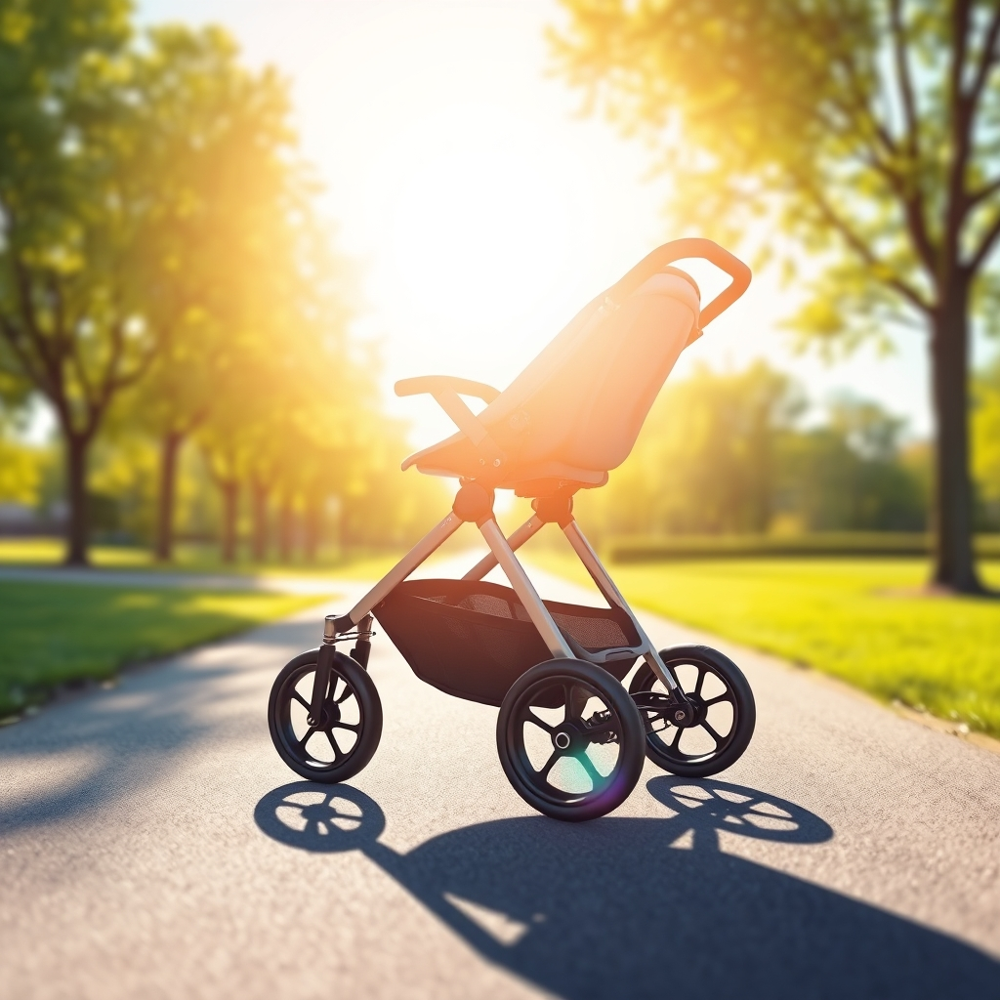

[Home](../index.md) > [Bot Chats](./index.md)  
# 👶🏼🛒🏃🏼‍♀️🦮💲🦮 Jogging Stroller Buying Guide  
  
## 💬 [ChatGPT](https://chat.com) Deep Research Prompt 1  
> 🏃‍♀️ Write a detailed consumer guide to purchasing a jogging stroller. 🔎 Research real products and focus on comparing quality, price, and features. 💰 If there are different price points, clearly describe what you're getting for the additional money. 🎯 Aim to help consumers get the ideal stroller for their use case for as cheap as possible.  
>  
> 📝 Here's an example summary of a consumer reports guide to get you started.  
> [👀👶🏼🏃🏼‍♀️🛣️ What to Look for in a Jogging Stroller](../articles/what-to-look-for-in-a-jogging-stroller.md)  
>  
> 🔬 Pull in information from any available scientific studies, 🏛️ regulatory bodies, 🗣️ consumer advocacy groups, 📰 reputable news sources etc to help justify any claims made by manufacturers or retailers. ✅ Order your recommendations by best value per money, assuming a reasonable bar for safety and quality.  
  
🤔 To tailor the guide to your needs, could you please clarify the following:  
  
1. 👪 Who is the intended user? (e.g., occasional joggers, daily runners, trail runners)  
2. 🏞️ What is your typical terrain? (e.g., pavement, gravel, trail)  
3. 💸 Do you have any specific budget range in mind?  
4. ⚖️ Do you have preferences regarding stroller weight, size, or foldability for travel?  
5. 👶 Would you like to include double strollers or only single-seat models?  
  
🪄 Once I have this info, I’ll pull together the most relevant and cost-effective recommendations.  
  
## 💬 Prompt 2  
> ✅ Assume there are a finite number of use cases, and structure your guide to provide options for everyone. 🏃‍♀️ That said, I'm personally interested in running daily, mostly on pavement, with a single infant/toddler. 👍 I'm willing to pay more for good quality when it's worth it, but probably don't need all the bells, whistles, and brand recognition that tend to drive price up unnecessarily.  
  
👍 Great. I’ll put together a 📚 comprehensive consumer guide to purchasing a 🏃 jogging stroller, structured by 🏢 common use cases and focused on identifying the 🥇 best value options for each. I’ll prioritize 💯 quality, 🛡️ safety, 💰 price, and ✅ verified features, drawing from 🔬 independent consumer testing, 🧑‍🏫 expert reviews, and 📜 regulatory guidance.  
  
👶 For your specific needs—daily pavement running with a single infant/toddler—I’ll highlight the 🏆 top models that offer 💪 durability, 🦹 smooth handling, and 🔒 solid safety features without inflating price due to 🎈 unnecessary extras.  
  
📢 I’ll let you know as soon as the guide is 📝 ready for review.  
  
The full report: [Choosing a Jogging Stroller: Safety First](https://chatgpt.com/s/dr_68b4c926597c8191ba560cc15ddc515e)  
  
## 🏃‍♀️ Quick Guide to Buying a Jogging Stroller  
_As an Amazon Associate I earn from qualifying purchases._  
  
### 🔒 Safety First  
  
* 👶 Wait until baby is **6+ months** (AAP)  
* 🎯 Look for **ASTM F833 certification** (meets US safety standards)  
* 🛡️ **5-point harness** is a must  
* 🖐️ **Wrist strap** + **front wheel lock** for stability  
* 🛑 Test brakes (foot or hand) before every run  
* 🔄 Check wheel attachments before jogging (CPSC recalls have flagged this in past)  
  
### 🚼 Key Features to Compare  
  
* 🛞 **Wheels**: Air-filled (smooth ride, needs pumping) vs foam/plastic (low maintenance, bumpier)  
* ⚖️ **Suspension**: Crucial for trails; optional for smooth pavement  
* 🔧 **Brakes**: Foot brake standard; hand brake best for downhills  
* 📏 **Handlebar**: Adjustable = better ergonomics  
* 🌞 **Canopy**: Large, ventilated, UPF 50+ preferred  
* 📦 **Fold/Storage**: One-hand fold & big basket = easier daily use  
* 🧸 **Weight limit**: Most range 50–75 lb  
  
### 💰 Best Value Picks  
  
#### Budget (\~\$150–\$200)  
  
* **[Baby Trend Expedition](https://amzn.to/3JGQkKj)** 🛞 Affordable, air tires  
  
  * ✅ Cheap, snack tray  
  * ❌ No suspension, 50 lb limit, heavy  
  
* **[Graco FastAction Jogger](https://amzn.to/3JyUl3A)** 🔄 One-hand fold  
  
  * ✅ Adjustable handle  
  * ❌ Stiff brakes, bumpy on uneven ground  
  
#### Mid-Range (\~\$300–\$500)  
  
* **[Joovy Zoom 360](https://amzn.to/3UTX75O) Ultralight** 🚀  
  
  * ✅ Great suspension, roomy basket, includes pump  
  * ❌ Fixed handlebar, tracking drifts  
  
* **[Baby Jogger Summit X3](https://amzn.to/4n3TVAp)** 🌳  
  
  * ✅ All-wheel suspension, canopy, 1-hand fold  
  * ❌ Heavy, handle not adjustable  
  
* **[Guava Roam](https://www.guavafamily.com/products/roam-stroller)** (sale \~\$500) ✈️  
  
  * ✅ Compact fold, sturdy, adjustable handle  
  * ❌ No hand brake  
  
#### Premium (\$600+)  
  
* **[👶🏃🌆 Thule Urban Glide 3](../products/thule-urban-glide-3.md)** ⭐  
  
  * ✅ Light, smooth ride, hand brake, sleek fold  
  * ❌ Pricey, 49 lb child max  
  
* **[BOB Revolution Flex 3.0](https://amzn.to/4mLDlFS)** 🏔️  
  
  * ✅ Rugged suspension, 75 lb limit, adjustable handle  
  * ❌ Bulky, heavy  
  
### 🏃 Best by Use Case  
  
* **Daily Pavement Running (your case)**  
  👉 *Best value:* **[Joovy Zoom 360](https://amzn.to/3UTX75O) (\$299)** – suspension + air tires = smooth, affordable.  
  👉 *Upgrade:* **[Thule Urban Glide 3](https://amzn.to/42aqUuT) (\$640)** – lighter, hand brake, best long-term comfort.  
  
* **Occasional Jogger / Walker**  
  👉 **[Baby Trend Expedition](https://amzn.to/3JGQkKj)** – lowest cost, fine for light use.  
  
* **Trail / All-Terrain**  
  👉 **[BOB Flex 3.0](https://amzn.to/4mLDlFS)** – top suspension, handles rough paths.  
  
* **Compact / Travel Friendly**  
  👉 **[Guava Roam](https://www.guavafamily.com/products/roam-stroller)** – folds small, doubles as everyday stroller.  
  
### ✅ Quick Comparison Table  
  
| Model                                     | Price | Suspension | Handlebar  | Weight Limit | Hand Brake | Best For             |  
| ----------------------------------------- | ----- | ---------- | ---------- | ------------ | ---------- | -------------------- |  
| [Baby Trend Expedition](https://amzn.to/3JGQkKj)                     | \$150 | ❌          | Fixed      | 50 lb        | ❌          | Occasional budget    |  
| [Joovy Zoom 360](https://amzn.to/3UTX75O) | \$299 | ✅          | Fixed      | 75 lb        | ❌          | Daily pavement value |  
| [Baby Jogger Summit X3](https://amzn.to/4n3TVAp)                     | \$350 | ✅          | Fixed      | 75 lb        | ❌          | All-terrain mid      |  
| [Guava Roam](https://www.guavafamily.com/products/roam-stroller)                                | \$500 | ✅          | Adjustable | 55 lb        | ❌          | Compact crossover    |  
| [Thule Urban Glide 3](https://amzn.to/42aqUuT)                       | \$640 | ✅          | Adjustable | 49 lb        | ✅          | Serious runners      |  
| [BOB Flex 3.0](https://amzn.to/4mLDlFS)                              | \$550 | ✅          | Adjustable | 75 lb        | ❌          | Trail/all-terrain    |  
  
### 🎯 Bottom Line  
  
* 🏅 **Best Value Overall:** [Joovy Zoom 360](https://amzn.to/3UTX75O) – smooth, safe, affordable.  
* 💎 **Best Premium:** [Thule Urban Glide 3](https://amzn.to/42aqUuT) – worth it if you run daily/long distances.  
* 💵 **Best Budget:** [Baby Trend Expedition](https://amzn.to/3JGQkKj) – fine for light use only.  
  
## 🐦 Tweet  
<blockquote class="twitter-tweet" data-theme="dark">
👶🏼🛒🏃🏼‍♀️🦮💲🦮 Jogging Stroller Buying Guide  👶 Child Safety | 🛞 Wheel Types | 💰 Price Ranges | 🏞️ Terrain Types | 💪 Durability | ⚖️ Weight Considerations | 🧵 Material Quality<a href="https://t.co/XGuIfAV9ru">https://t.co/XGuIfAV9ru</a>
&mdash; Bryan Grounds (@bagrounds) <a href="https://twitter.com/bagrounds/status/1962546782321402083?ref_src=twsrc%5Etfw">September 1, 2025</a></blockquote>   
  
## 🦋 Bluesky    
<blockquote class="bluesky-embed" data-bluesky-uri="at://did:plc:i4yli6h7x2uoj7acxunww2fc/app.bsky.feed.post/3mknnmgvnz226" data-bluesky-cid="bafyreiaixse4zamlfnx5tmajqrhfkqgtjtv2fwy22lepgxzydqvvj2xtdi">
👶🏼🛒🏃🏼‍♀️🦮💲🦮 Jogging Stroller Buying Guide  
  
#AI Q: 🏃 What matters most to you when picking gear for a workout: the lowest price or the highest performance?  
  
👶 Child Safety | 🛞 Wheel Types | 💰 Price Ranges | 🏞️ Terrain Types  
https://bagrounds.org/bot-chats/jogging-stroller-buying-guide
&mdash; <a href="https://bsky.app/profile/did:plc:i4yli6h7x2uoj7acxunww2fc?ref_src=embed">Bryan Grounds (@bagrounds.bsky.social)</a> <a href="https://bsky.app/profile/did:plc:i4yli6h7x2uoj7acxunww2fc/post/3mknnmgvnz226?ref_src=embed">2026-04-29T17:44:03.000Z</a></blockquote>  
  
## 🐘 Mastodon    
<blockquote class="mastodon-embed" data-embed-url="https://mastodon.social/@bagrounds/116491139321490413/embed" style="background: #282c37; border-radius: 8px; border: 1px solid #393f4f; margin: 0; max-width: 540px; min-width: 270px; overflow: hidden; padding: 0;"> <a href="https://mastodon.social/@bagrounds/116491139321490413" target="_blank" style="align-items: center; color: #d9e1e8; display: flex; flex-direction: column; font-family: system-ui, -apple-system, BlinkMacSystemFont, 'Segoe UI', Oxygen, Ubuntu, Cantarell, 'Fira Sans', 'Droid Sans', 'Helvetica Neue', Roboto, sans-serif; font-size: 14px; justify-content: center; letter-spacing: 0.25px; line-height: 20px; padding: 24px; text-decoration: none;"> <svg xmlns="http://www.w3.org/2000/svg" xmlns:xlink="http://www.w3.org/1999/xlink" width="32" height="32" viewBox="0 0 79 75"><path d="M63 45.3v-20c0-4.1-1-7.3-3.2-9.7-2.1-2.4-5-3.7-8.5-3.7-4.1 0-7.2 1.6-9.3 4.7l-2 3.3-2-3.3c-2-3.1-5.1-4.7-9.2-4.7-3.5 0-6.4 1.3-8.6 3.7-2.1 2.4-3.1 5.6-3.1 9.7v20h8V25.9c0-4.1 1.7-6.2 5.2-6.2 3.8 0 5.8 2.5 5.8 7.4V37.7H44V27.1c0-4.9 1.9-7.4 5.8-7.4 3.5 0 5.2 2.1 5.2 6.2V45.3h8ZM74.7 16.6c.6 6 .1 15.7.1 17.3 0 .5-.1 4.8-.1 5.3-.7 11.5-8 16-15.6 17.5-.1 0-.2 0-.3 0-4.9 1-10 1.2-14.9 1.4-1.2 0-2.4 0-3.6 0-4.8 0-9.7-.6-14.4-1.7-.1 0-.1 0-.1 0s-.1 0-.1 0 0 .1 0 .1 0 0 0 0c.1 1.6.4 3.1 1 4.5.6 1.7 2.9 5.7 11.4 5.7 5 0 9.9-.6 14.8-1.7 0 0 0 0 0 0 .1 0 .1 0 .1 0 0 .1 0 .1 0 .1.1 0 .1 0 .1.1v5.6s0 .1-.1.1c0 0 0 0 0 .1-1.6 1.1-3.7 1.7-5.6 2.3-.8.3-1.6.5-2.4.7-7.5 1.7-15.4 1.3-22.7-1.2-6.8-2.4-13.8-8.2-15.5-15.2-.9-3.8-1.6-7.6-1.9-11.5-.6-5.8-.6-11.7-.8-17.5C3.9 24.5 4 20 4.9 16 6.7 7.9 14.1 2.2 22.3 1c1.4-.2 4.1-1 16.5-1h.1C51.4 0 56.7.8 58.1 1c8.4 1.2 15.5 7.5 16.6 15.6Z" fill="currentColor"/></svg> 
Post by @bagrounds@mastodon.social
 
View on Mastodon
 </a> </blockquote> 