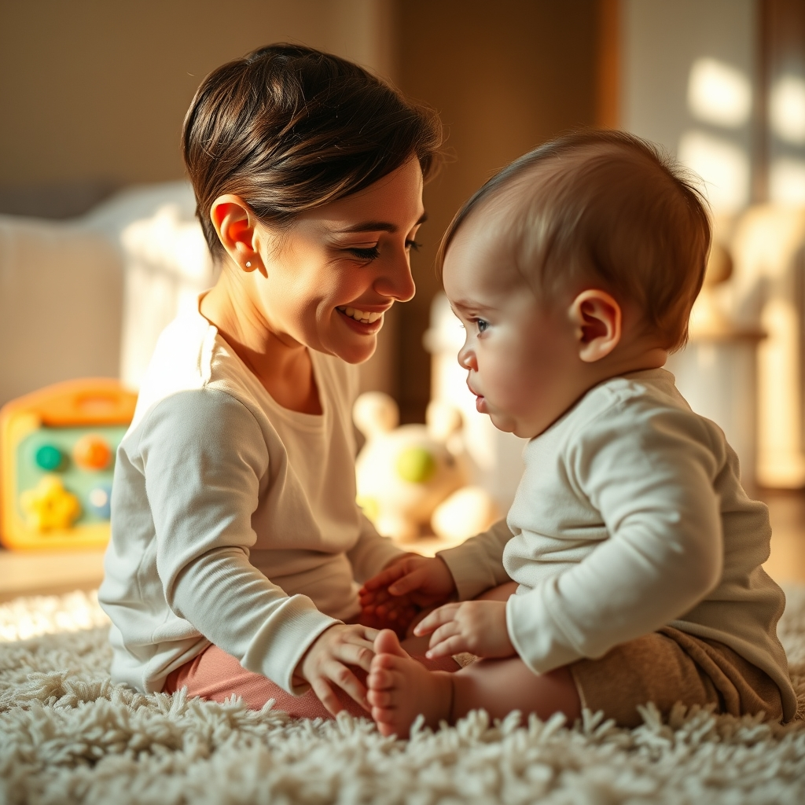

[Home](../index.md) > [Bot Chats](./index.md)  
# 🦜👶🏼 Mimicking Babies  
  
## 💬 [Gemini](../software/gemini.md) Prompt 1  
> 🤔 Is mimicking a baby a good way to start communicating?  
  
✅ Yes, mimicking a baby's 👶 sounds, gestures, and expressions can be a very good way to start and encourage communication. Here's why:  
  
* 🗣️ It teaches the "back-and-forth" of conversation: When you imitate a baby's coos, 🎵 babbles, or actions, you're essentially showing them the turn-taking nature of communication. This is a fundamental building block 🧱 for future conversations.  
* 👂 It makes them feel heard and understood: When a baby sees you responding to their vocalizations or actions, it validates their attempts at communication and encourages them to continue. They learn that their efforts have an effect 💥.  
* ❤️ It builds connection and bonding: Mutual imitation is a sign of communication and helps foster a strong bond 🔗 between caregiver and child. Babies often respond positively, with more eye contact 👀 and smiles 😄, when they realize they are being imitated.  
* 🎤 It encourages vocalization and experimentation: By mirroring 🪞 their sounds, you provide positive reinforcement 💪 and motivate them to produce more speech-like sounds. This "play with sounds" 🎶 is crucial for language development.  
* 💡 It helps them understand cause and effect: When they do something and you imitate it, they start to grasp that their actions can elicit a response from you.  
* 👶 It supports pre-language skills: Imitation is a pre-linguistic skill, meaning it's a necessary step before a child begins to speak words 💬. It helps them understand the intention behind communication.  
* 🚀 It can accelerate language development: Studies have shown that infants whose caregivers are responsive to their babbling show more rapid increases in advanced vocalizations that sound more like spoken words.  
  
**💡 How to effectively mimic a baby:**  
  
* 👀 Observe and join in: Pay attention to the sounds, actions, and facial expressions your baby is making.  
* 🪞 Mirror them: Copy their actions, sounds, and expressions.  
* ⏳ Wait for their reaction: Give them a chance to notice that you're copying them and to respond.  
* ➕ Expand on their sounds: If they say "ba," you can say "ba ba ba" or "da da da."  
* 🗣️ Add real words: While mimicking their sounds, you can also connect those sounds to real words. For example, if they make a "moo" sound, you can moo back and then say "cow" 🐄.  
* 👶 Get face-to-face: Being at their eye level helps them pay attention to your mouth movements and expressions.  
* 🎭 Be playful and exaggerate: This keeps them engaged and makes the interaction fun 🎉.  
  
While mimicking baby sounds and actions is highly beneficial 👍, it's also important to continue speaking to them in your native language with clear, natural speech 🗣️. The goal is to meet them where they are in their development and gradually guide them towards more complex communication.  
  
## 💬 Prompt 2  
> 📖 Can you recommend some books on the topic?  
  
👶 You're looking for great resources to help you understand and encourage early communication in babies! 📚 Here are some excellent book recommendations, 📝 categorized for clarity:  
  
**📚 Books on Infant Language Acquisition & Development (for Parents/Caregivers):**  
  
- **[👶🗣️ How Babies Talk: The Magic and Mystery of Language in the First Three Years of Life](../books/how-babies-talk-the-magic-and-mystery-of-language-in-the-first-three-years-of-life.md) by Kathy Hirsh-Pasek and Roberta Golinkoff:** 👩‍⚕️ Written by leading developmental psychologists, 👶 this book offers a deep dive into how infants begin to learn language, 🤰 even from the womb. 💡 It provides a strong scientific foundation with practical insights.  
- 🗣️ **"Beyond Baby Talk: From Speaking to Spelling: A Guide to Language and Literacy Development for Parents and Caregivers"**: 👨‍👩‍👧‍👦 This book aims to guide parents through the critical first eight years of language and literacy development, 🔤 emphasizing that communication goes beyond just words.  
- **[👶🔤 The ABC’s of Language Development: Discover Language with Your Child](../books/the-abcs-of-language-development-discover-language-with-your-child.md) by Carla Hudson Kam, Caitlin Bittman, Estelle Paget, and Elizabeth Wellburn:** 🔬 This book offers a blend of cutting-edge research and practical strategies for supporting communication and language development in children from birth to age 4-5. 🧑‍🏫 It's designed to be accessible and used over time, 📖 rather than read cover-to-cover.  
- 🫂 **"Social Baby: Understanding Babies' Communication from Birth" by Lynne Murray and Liz Andrews:** 📸 This book uses picture sequences from video footage to illustrate key aspects of infant experience and communication, 👀 helping adults become more attuned to a baby's unique cues.  
  
**🧸 Children's Books Great for Encouraging Early Communication (and Mimicry):**  
  
🗣️ These types of books are excellent for interacting with babies and toddlers, 👂 providing opportunities for imitation, 🔁 repetition, and 🎵 sound play:  
  
- 👂 **Books with Repetitive Text and Sounds:**  
    - 🐻 **"Brown Bear, Brown Bear, What Do You See?" by Bill Martin Jr. and Eric Carle:** 🌟 A classic for a reason! 🔁 Its repetitive text and vibrant illustrations make it perfect for predicting, 🗣️ filling in the blanks, and 🦁 learning animal sounds.  
    - 🐄 **"Moo, Baa, La La La!" by Sandra Boynton:** 🤪 Playful and engaging, 🐑 this book encourages sound imitation and expressive language with its rhythmic text and animal sounds.  
    - 🚚 **"The Little Blue Truck" by Alice Schertle:** ❤️ Emphasizes kindness, friendship, and vehicle sounds, 📢 promoting sound imitation and interactive storytelling.  
    - 🅰️ **"Chicka Chicka Boom Boom" by Bill Martin Jr. and John Archambault:** 🌳 A fun alphabet book with repetitive phrases that toddlers love to "boom boom" along with.  
- 🖐️ **Interactive Books (Lift-the-Flap, Touch-and-Feel, Pop-Up):**  
    - 🦁 **"Dear Zoo" by Rod Campbell:** 🎁 A lift-the-flap classic that encourages anticipation and vocabulary expansion.  
    - 🐶 **"Where's Spot?" by Eric Hill:** ❓ Another popular lift-the-flap book that's great for simple language and concepts like prepositions.  
    - 💯 **"First 100 Words" (various authors, like Roger Priddy or DK Publishing):** 🖼️ These books feature bright pictures of everyday objects, 🗣️ encouraging vocabulary expansion and word-picture association. ☝️ When reading, point to pictures, 🔊 make sounds, and 🤌 use gestures related to the objects.  
    - 🔘 **Poke-a-Dot books (Melissa & Doug):** 🔵 These books have satisfying "pop" buttons on each page, making them engaging and tactile for young children.  
- 🤸 **Books that Encourage Movement and Imitation:**  
    - 🦒 **"From Head to Toe" by Eric Carle:** 💃 This book encourages children to mimic various animal movements, 💪 promoting body awareness and motor skills, which are linked to language development.  
    - 🐻 **"We're Going on a Bear Hunt" by Michael Rosen and Helen Oxenbury:** 👣 Its repetitive text and engaging actions make it perfect for sound imitation and participation.  
- 🤫 **Wordless Books:**  
    - 🙊 **"Goodnight Gorilla" by Peggy Rathmann:** ✍️ This wordless book allows children (and adults!) to create their own narratives, 👀 promoting observational skills and expressive language.  
  
🧐 When choosing books, look for:  
  
- 🧱 **Board books:** 💪 Durable for little hands.  
- 🎨 **Bright, clear illustrations:** 🤩 Engaging for babies.  
- 🗣️ **Simple, repetitive text:** ✅ Easy for babies to follow and predict.  
- 🤝 **Opportunities for interaction:** 👐 Lift-the-flaps, 🖐️ touch-and-feel elements, or actions to imitate.  
  
😄 Happy reading and communicating with your little one!  
  
## 💬 Prompt 3  
> 🙋 Who are some prominent experts on this topic?  
  
🧠 Many brilliant researchers have dedicated their careers to understanding how 👶 babies learn to communicate 🗣️ and acquire language. Here are some prominent experts whose work is highly influential in this field:  
  
**⭐ Leading Researchers in Infant Language Acquisition and Development:**  
  
* 👩‍⚕️ **Dr. Patricia Kuhl:** A world-renowned expert in infant language acquisition 🗣️ and brain 🧠 development, particularly known for her research on how infants learn speech sounds 👂 and how "motherese" (or infant-directed speech 🗣️👶) impacts this process. She's a co-director of the University of Washington's Institute for Learning & Brain Sciences (I-LABS). Her work often involves studying brain 🧠 responses in babies 👶.  
* 🧑‍🔬 **Dr. Andrew Meltzoff:** Also a co-director of I-LABS at the University of Washington, Dr. Meltzoff is famous for his research on imitation 🐒 in infants 👶. His studies have shown that newborns can imitate facial expressions 😮, suggesting an innate capacity for social learning 🤝 that is crucial for communication 🗣️.  
* 👩‍🏫 **Dr. Roberta Golinkoff and Dr. Kathy Hirsh-Pasek:** These two researchers are frequently cited together for their extensive work on early language development 🗣️👶. They are authors of the book "How Babies Talk" 📖 and have conducted numerous studies on how children learn words ✍️, grammar 📚, and the social aspects 🫂 of language. Their research often emphasizes the importance of responsive adult-child interactions 🤝.  
* 👨‍🏫 **Dr. Michael Goldstein:** A professor of psychology at Cornell University 🎓, Dr. Goldstein's research focuses on the social 🫂 and developmental processes involved in early communication 🗣️. He's known for his work on the "simplification effect," showing how babies' babbling 🗣️👶 can elicit simpler speech 🗣️ from adults 👩‍💼, creating a feedback loop 🔄 that aids language learning 🗣️📚.  
* 👩‍🏫 **Dr. Elika Bergelson:** An associate professor of psychology at Harvard University 🎓, Dr. Bergelson studies how infants and toddlers 👶 learn language from their environment 🌳. Her research has provided insights into how early comprehension 🤔 begins and the global predictors of language development 🗣️👶, emphasizing the quantity and quality 💯 of speech children receive.  
* 👩‍🔬 **Dr. Jenny Saffran:** A leading researcher in statistical learning 📊 in infants 👶. Her work has demonstrated that babies can use statistical regularities 📊 in the speech they hear 👂 to segment words ✍️ and learn language 🗣️📚, even before they understand meaning 🤔. She's based at the University of Wisconsin-Madison.  
* 👩‍🏫 **Dr. Annick De Houwer:** A prominent scholar in [🗣️🗣️ Bilingualism](../topics/bilingualism.md) and child language acquisition 🗣️👶. Her research is invaluable for understanding how children learn two or more languages from an early age and the factors that influence this process.  
* 👩‍🔬 **Dr. Janet Werker:** A researcher at the University of British Columbia 🎓, Dr. Werker is well-known for her work on how infants develop the ability to perceive and distinguish speech sounds 👂 from their native language 🗣️, and how this ability changes over the first year of life 👶.  
  
**🏢 Key Organizations and Institutes:**  
  
🧠 Many of these experts are associated with leading research institutions and centers dedicated to early childhood development and language. Some prominent examples include:  
  
* 🧠 **Institute for Learning & Brain Sciences (I-LABS) at the University of Washington:** A major hub for interdisciplinary research on early brain 🧠 and cognitive development 🤔, including extensive work on language acquisition 🗣️👶.  
* 🧸 **ZERO TO THREE:** A national non-profit organization that provides resources 📚 and advocates 📣 for babies and toddlers 👶, often translating research into practical advice for parents 👩‍👩‍👧‍👦 and professionals 👩‍⚕️. They feature many experts in early childhood development 👶.  
* 🏫 **Erikson Institute:** A graduate school and research center focused on early childhood development 👶, with a strong emphasis on applied research that benefits children and families 👩‍👩‍👧‍👦.  
  
🔎 When looking for reliable information on early communication 🗣️, seeking out research and resources 📚 from these individuals and institutions is a great starting point 👍.