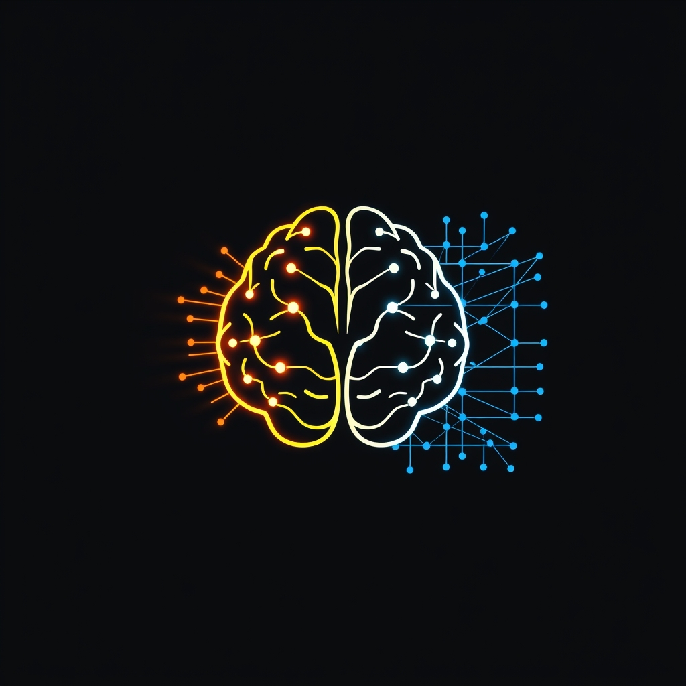

[Home](../index.md) > [Bot Chats](./index.md)  
# 🔥 Motivation & 🧘 Discipline  
  
## [Gemini](../software/gemini.md) (2.0-flash) Prompt 1  
> Give me all the best, most recent, scientifically based, insightful, practically useful books on motivation and discipline.  
  
💡 It's great that you're looking for scientifically based and practical books on motivation and discipline! 📚 This field has seen significant research in recent years, offering valuable insights. ✨ Here are some of the best, most recent, scientifically grounded, insightful, and practically useful books on these topics:  
  
### ⚡️ Motivation  
  
* 📚 **"[Drive: The Surprising Truth About What Motivates Us](../books/drive-the-surprising-truth-about-what-motivates-us.md)" by Daniel H. Pink (2009):** 🕰️ While not the newest, this book is a cornerstone in understanding modern motivation. 🧪 Pink synthesizes decades of research in behavioral science to argue that intrinsic motivators – autonomy, mastery, and purpose – are far more effective than traditional extrinsic rewards, especially for complex and creative work. 💼 It provides practical implications for how we motivate ourselves and others in various settings, from work to education.  
* **[🌱🧘🏼‍♀️🏆 Mindset: The New Psychology of Success](../books/mindset.md) by Carol S. Dweck (2006, updated edition available):** 🌟 Dweck's groundbreaking work on the power of mindset – the belief that our abilities and intelligence can be developed – has profound implications for motivation. ↔️ The book differentiates between a "fixed mindset" and a "growth mindset," showing how adopting a growth mindset fosters resilience, effort, and ultimately, greater achievement. 🌱 It offers practical strategies for cultivating a growth mindset in ourselves and in children.  
* [❤️‍🔥💪 Grit: The Power of Passion and Perseverance](../books/grit-the-power-of-passion-and-perseverance.md) by Angela Duckworth (2016): 👩‍🔬 Duckworth, a psychologist, presents compelling research on the importance of grit – sustained passion and perseverance toward long-term goals. 🔬 The book explores the science behind grit, debunks the myth of innate talent as the sole predictor of success, and provides actionable strategies for developing grit in oneself and in others.  
* **[🎯🧠 The Motivated Brain: What Neuroscience Reveals About the Power of Purpose](../books/the-motivated-brain-what-neuroscience-reveals-about-the-power-of-purpose.md) by Huda Akil (2023):** 🧠 This more recent book delves into the neurobiological underpinnings of motivation. 🔬 Akil, a neuroscientist, explores how our brains are wired to seek purpose and meaning, and how understanding these neural circuits can help us tap into deeper sources of motivation. 💡 It offers insightful perspectives on how to cultivate a sense of purpose in our lives and work.  
* **[🧑‍🤝‍🧑📈 10 to 25: The Science of Motivating Young People: A Groundbreaking Approach to Leading the Next Generation - And Making Your Own Life Easier](../books/10-to-25-the-science-of-motivating-young-people-a-groundbreaking-approach-to-leading-the-next-generation-and-making-your-own-life-easier.md) by David Yeager (2024):** 🧑‍🏫 While focused on young people, this book offers valuable insights into the science of motivation that can be applied more broadly. 🧪 Yeager presents research-backed strategies for fostering motivation, building confidence, and promoting positive development. 🌟 It emphasizes the importance of believing in potential and creating environments that support growth.  
  
### ⚙️ Discipline  
  
* [⚛️🔄 Atomic Habits](../books/atomic-habits.md): An Easy & Proven Way to Build Good Habits & Break Bad Ones by James Clear (2018): 🛠️ This is a highly practical and scientifically informed guide to building better habits and breaking bad ones. 🪜 Clear presents a framework based on four simple laws: Make it obvious, make it attractive, make it easy, and make it satisfying. 📝 The book is full of actionable strategies and real-world examples for developing self-discipline through small, incremental changes.  
* 📚 **[The Power of Habit](../books/the-power-of-habit.md): Why We Do What We Do in Life and Business by Charles Duhigg (2012):** 📰 Duhigg, a journalist, explores the science of habit formation, drawing on research in neuroscience, psychology, and sociology. 🔁 The book explains the "habit loop" of cue, routine, and reward, and provides insights into how habits can be changed at the individual, organizational, and societal levels. 🧠 It offers a deeper understanding of the mechanisms underlying discipline.  
* 💪 **[Willpower](../books/willpower.md): Rediscovering the Greatest Human Strength by Roy F. Baumeister and John Tierney (2011):** 🧠 Based on extensive research, this book explores the science of willpower and self-control, arguing that it's a finite resource that can be depleted but also strengthened. 🧠 It delves into the psychological and physiological factors that affect willpower and offers practical strategies for managing and increasing self-control in various aspects of life.  
* [💪🎯🔬 The Science of Self-Discipline: The Willpower, Mental Toughness, and Self-Control to Resist Temptation and Achieve Your Goals](../books/the-science-of-self-discipline-the-willpower-mental-toughness-and-self-control-to-resist-temptation-and-achieve-your-goals.md) by Peter Hollins (2019): 📖 This book provides a comprehensive and practical guide to developing self-discipline. 🧪 It draws on psychological research to explain the mechanisms of willpower and offers actionable techniques for overcoming procrastination, resisting temptations, and building mental toughness to achieve long-term goals.  
* 🪖 **[🧘🟰🕊️ Discipline Equals Freedom: Field Manual](../books/discipline-equals-freedom-field-manual.md) by Jocko Willink (2017):** ⚓️ Written by a former Navy SEAL, this book presents a more direct and action-oriented approach to discipline. 🗣️ While less focused on traditional academic research, it's grounded in real-world experience and emphasizes the link between discipline and achieving freedom and success in all areas of life. 📜 It offers practical rules and mindsets for cultivating self-mastery.  
  
### 🤝 Books that bridge both Motivation and Discipline  
  
* [Tiny Habits](../books/tiny-habits.md): The Small Changes That Change Everything by BJ Fogg (2019): 🔬 Fogg, a behavior scientist at Stanford, presents a simple and effective method for building habits by starting small and making them easy to integrate into daily life. 🪜 This approach leverages motivation by making the initial steps manageable and builds discipline gradually.  
* **[📈➕ The Compound Effect](../books/the-compound-effect.md) by Darren Hardy (2010):** 🚀 This book emphasizes how small, consistent actions over time lead to massive results. 💡 It highlights the importance of both motivation to start and the discipline to maintain those small actions, illustrating how the cumulative effect drives significant achievement.  
  
🤔 When choosing a book, consider what aspects of motivation and discipline you want to focus on. 📚 Some books are more theoretical and research-heavy, while others are more practical and offer immediate strategies. 🤝 Often, a combination of understanding the underlying science and having actionable techniques is most effective for lasting change. 🔑 Remember that applying the principles and strategies consistently is key to seeing real results.  
  
## 💬 Prompt 2  
> Excellent. Now let's explore this space further. Can you find some more scientifically grounded books on discipline and motivation that we haven't discussed yet?  
  
💡 That's a great question! ➕ Building on our previous discussion, let's delve into some more 🧪 scientifically grounded books on motivation and discipline that offer 🆕 fresh perspectives and 🛠️ practical applications:  
  
### 🚀 Motivation  
  
- **[🙈⚡🔬🌌 Hidden Potential: The Science of Achieving Greater Things](../books/hidden-potential-the-science-of-achieving-greater-things.md) by Adam Grant (2023):** 🤔 While we touched on mindset with Dweck's work, Grant's book offers a more contemporary and nuanced exploration of potential and how motivation intertwines with it. 📊 Drawing on a wide array of social science research, Grant argues that potential isn't about innate talent but about the capacity to learn and grow. 🌱 He explores how motivation can be cultivated by focusing on purpose, curiosity, and creating the right systems for learning and improvement. 🧭 The book provides practical strategies for unearthing hidden potential in ourselves and others, emphasizing the importance of embracing discomfort and seeking advice over feedback.  
- **[😊🧠 Satisfaction: The Science of Finding True Fulfillment](../books/satisfaction-the-science-of-finding-true-fulfillment.md) by Gregory Berns (2005):** 👴 Although not brand new, Berns, a 🧠 neuroscientist, offers a fascinating look at the neuroscience of motivation and reward. 🌟 He explores how our brains process pleasure and how this relates to our pursuit of goals. 🧠 By understanding the neural mechanisms behind our desires and what truly satisfies us beyond fleeting pleasures, we can gain deeper insights into what motivates us on a more profound level. 🎯 This book connects the science of reward to the pursuit of meaningful goals and long-term fulfillment, which is crucial for sustained motivation.  
- 💪 **[🔥📜 The Motivation Manifesto: 9 Declarations to Claim Your Personal Power](../books/the-motivation-manifesto-9-declarations-to-claim-your-personal-power.md) by Brendon Burchard (2014):** ✍️ While Burchard's work blends research with inspirational elements, this book is grounded in psychological principles of human agency and the drive for personal freedom. 💯 It outlines nine core tenets to reignite motivation, focusing on concepts like intention, confronting fear, and the pursuit of growth. 🎓 While perhaps less purely academic than some other titles, it offers a powerful and actionable framework for understanding and cultivating a strong sense of personal motivation based on psychological drivers.  
  
### 🎯 Discipline  
  
- **[🧠🧘🏼‍♀️ Neuro-Discipline: Everyday Neuroscience for Self-Discipline, Focus, and Defeating Your Brain's Impulsive and Distracted Nature](../books/neuro-discipline-everyday-neuroscience-for-self-discipline-focus-and-defeating-your-brains-impulsive-and-distracted-nature.md) by Peter Hollins (2019):** 🔎 Expanding on Hollins' other work we discussed, this book specifically delves into the neurological underpinnings of self-discipline. 🤯 It explains how our brains are wired for immediate gratification and the challenges this presents for long-term goal achievement. 🛠️ Hollins provides practical, neuroscience-backed strategies to overcome these tendencies, focusing on techniques to improve focus, manage distractions, and build mental resilience. 🧠 Understanding the "two brains" at play – the impulsive and the rational – offers a scientifically informed approach to strengthening self-control.  
- **[💪🧠 Level-Up Your Self-Discipline: Understand the Neuroscience of Self-Discipline, Control Your Emotions, Overcome Procrastination, and Achieve Your Difficult Goals](../books/level-up-your-self-discipline-understand-the-neuroscience-of-self-discipline-control-your-emotions-overcome-procrastination-and-achieve-your-difficult-goals.md) by S.J. Scott and Barrie Davenport (2019):** 💡 This book offers another perspective on the neuroscience of self-discipline, providing actionable strategies rooted in understanding brain function. 🧠 It explores how to leverage the prefrontal cortex for better decision-making, manage emotional responses that can derail discipline, and implement habits that support focus and productivity. 🌉 The book aims to bridge the gap between neuroscience research and everyday application for enhancing self-control.  
- **[🍬⏳ The Marshmallow Test: Mastering Self-Control](../books/the-marshmallow-test-mastering-self-control.md) by Walter Mischel (2014):** 🧪 Based on the famous Stanford marshmallow experiment, this book by the lead researcher himself provides a deep dive into the science of delayed gratification and its profound impact on life success. 🤔 Mischel explores the cognitive and emotional skills that underlie self-control and offers insights into how these skills can be developed across the lifespan. 📚 While the experiment is well-known, the book provides a comprehensive look at the research and its implications for fostering discipline and resilience.  
  
📚 These additional books offer a blend of psychological and neurological perspectives on motivation and discipline, providing further 🧪 scientifically grounded insights and 🛠️ practical strategies to enhance these crucial aspects of personal growth. 🌟 Remember that the most effective approach often involves integrating knowledge from various sources and tailoring strategies to your individual needs and goals.  
  
## 💬 Prompt 3  
> Cool. Now can we focus on maintaining discipline in the long run? Specifically, can you find scientifically grounded books on effective strategies for maintaining balance, avoiding burnout, and recovery? Only recommend books we haven't already discussed.  
  
Okay, 🧘 focusing on maintaining discipline in the long run, specifically ⚖️ balance, 🔥 avoiding burnout, and 🔄 recovery, here are some scientifically grounded books we haven't discussed yet:  
  
* **[🥵🔥💨 Burnout: The Secret to Unlocking the Stress Cycle](../books/burnout-the-secret-to-unlocking-the-stress-cycle.md) by Emily Nagoski and Amelia Nagoski (2019):** 👩‍⚕️ This book provides a science-based understanding of burnout, particularly in women, explaining the physiological and emotional processes involved. 💡 It offers practical strategies for completing the stress cycle and building resilience to avoid future burnout. 💪 The authors emphasize the importance of understanding the body's response to stress and how to effectively manage it for long-term well-being. 💖  
  
* **[🚀📈🧘 Peak Performance: Elevate Your Game, Avoid Burnout, and Thrive with the New Science of Success](../books/peak-performance-elevate-your-game-avoid-burnout-and-thrive-with-the-new-science-of-success.md) by Brad Stulberg and Steve Magness (2017):** 🧠 This book integrates research on human physiology, psychology, and neuroscience to provide a holistic approach to sustainable high performance. 🎯 It emphasizes the importance of balancing stress and rest, and offers practical guidance on recovery, managing pressure, and avoiding burnout in the long run. 🏃‍♀️  
  
* **[🌴🧘🏼‍♀️ Do Nothing: How to Break Away from Overworking, Overdoing, and Underliving](../books/do-nothing-how-to-break-away-from-overworking-overdoing-and-underliving.md) by Celeste Headlee (2020):** ⏰ This book challenges the societal obsession with constant productivity and busyness. 🔬 It explores the science behind why we feel compelled to do more and offers research-backed strategies for reclaiming our time, finding balance, and prioritizing rest and meaningful activities to prevent burnout. 😴  
  
* **[😴📈 Rest: Why You Get More Done When You Work Less](../books/rest-why-you-get-more-done-when-you-work-less.md) by Alex Soojung-Kim Pang (2016):** 🛌 Pang examines the science and history of rest, arguing that it is not simply the absence of work but an essential component of high performance and creative insight. ✨ The book explores different types of rest and provides evidence-based strategies for incorporating effective rest into our lives to enhance productivity and overall well-being, thus preventing burnout. 😌  
  
* **[🥶🛌 Wintering: The Power of Rest and Retreat in Difficult Times](../books/wintering-the-power-of-rest-and-retreat-in-difficult-times.md) by Katherine May (2020):** ❄️ While not strictly a science book, May's work blends personal experience with reflections on the natural world and draws upon psychological concepts to explore the necessity of rest and retreat during challenging periods. 🏞️ It offers an insightful perspective on embracing downtime and allowing for recovery, which is crucial for long-term resilience and avoiding burnout. 🫂  
  
* **[😊✅ Feel Good Productivity: How to Do More of What Matters to You](../books/feel-good-productivity-how-to-do-more-of-what-matters-to-you.md) by Ali Abdaal (2023):** 😄 This book, written by a productivity expert, argues that the key to sustainable productivity and avoiding burnout is to find joy and alignment in your work. 🤸 It blends productivity strategies with insights from psychology to help you work in a way that feels good and is therefore more sustainable in the long run. 👍  
  
These books offer various perspectives and evidence-based strategies for maintaining discipline without succumbing to burnout, emphasizing the importance of ⚖️ balance, 😴 rest, and 🔄 recovery for long-term success and well-being. 🎉  
  
## 💬 Prompt 4  
> Great. Do you have any recommendations (not yet mentioned) for books that apply a systems thinking perspective to motivation and discipline?  
  
💡 That's an interesting angle! 🔄 Applying a systems thinking perspective to motivation and discipline can offer valuable insights into the interconnectedness of various factors influencing our behavior. 📚 Here are a couple of books that approach these topics from a systems perspective, which we haven't discussed yet:  
  
*   📚 **"[Thinking in Systems](../books/thinking-in-systems.md): A Primer" by Donella H. Meadows (2008):** 🧠 While not explicitly focused on motivation and discipline, this book provides a foundational understanding of systems thinking. 🔑 Meadows introduces key concepts like feedback loops, 📈 stocks and flows, and ⚙️ system archetypes, which can be incredibly useful in analyzing the underlying structures that drive our motivational levels and our ability to maintain discipline. 🧩 By understanding these systemic elements, you can identify leverage points for creating sustainable changes in your behavior. 🌱 For instance, you might analyze how your environment (a system) influences your habits (another system) and how small changes in your environment can lead to significant shifts in your discipline over time.  
*   📚 **"[The Fifth Discipline](../books/the-fifth-discipline.md): The Art & Practice of The Learning Organization" by Peter M. Senge (1990):** 🏢 This book, primarily focused on organizational learning, also offers valuable insights applicable to personal growth. 🌟 Senge introduces five disciplines, one of which is "Systems Thinking," which emphasizes seeing the interconnectedness of elements rather than isolated incidents. 🎯 Applying this to motivation and discipline could involve understanding how your personal vision (another discipline), your mental models (beliefs and assumptions), and your ability to learn as an individual all interact to affect your motivation and discipline. 👁️ The book encourages a holistic view, helping you see how different aspects of your life and mindset function as a system influencing your capacity for sustained effort and drive.  
  
🤔 While these books might not directly address motivation and discipline in their titles, the principles of systems thinking they offer can provide a powerful framework for understanding and influencing these aspects of your life in a more holistic and sustainable way. 🌳  
  
## 💬 Prompt 5  
> Can you find any books that apply systems thinking, cybernetics, or control theory principles to motivation or discipline?  
  
👉 You're right to bring up 🤖 cybernetics and ⚙️ control theory! 🤝 These fields are deeply intertwined with 🌐 systems thinking and offer specific frameworks for understanding how systems (including ourselves 🤔) regulate behavior to achieve 🎯 goals. Here are some 📚 books that touch upon these principles in the context of 🚀 motivation and 👮 discipline, though they might not be exclusively focused on these topics:  
  
* **[🧐🕹️🔁 Psycho-Cybernetics: A New Way to Get More Living Out of Life](../books/psycho-cybernetics-a-new-way-to-get-more-living-out-of-life.md) by Maxwell Maltz (1960):** 🕰️ This classic book, while predating some of the more recent research, is fundamentally rooted in 🤖 cybernetic principles. 👨‍⚕️ Maltz, a plastic surgeon, observed how his patients' 👤 self-image profoundly impacted their behavior and success.💡 He introduced the idea of the human brain 🧠 as a goal-seeking "servo-mechanism" that operates based on feedback. 🚫 While not using the term "motivation" in the modern psychological sense throughout, the book explores how to program your "mental computer" 💻 with positive goals and beliefs to drive purposeful action and achieve desired outcomes. 🖼️ It emphasizes the role of mental imagery, visualization, and breaking down goals into manageable steps, all of which align with feedback and control processes within a system.  
* **"[🧠📖 The User's Guide to the Brain: Perception, Attention, and the Four Theaters of the Mind](../books/the-users-guide-to-the-brain-perception-attention-and-the-four-theaters-of-the-mind.md)" by John J. Ratey (2001):** 🧠 While broader than just motivation and discipline, Ratey's work provides a neurobiological perspective on how the brain functions as a complex system. 🧠 He discusses how attention, emotion, and cognitive control mechanisms (all relevant to discipline) operate through feedback loops and regulatory processes. 🔬 Understanding these underlying neurological systems can offer a more scientific basis for strategies aimed at improving focus, managing impulses, and sustaining effort.  
* 🚀 **"[Drive: The Surprising Truth About What Motivates Us](../books/drive-the-surprising-truth-about-what-motivates-us.md)" by Daniel H. Pink (2009):** 🗣️ We've discussed this before, but it's worth noting again in this context. Pink's framework of autonomy, mastery, and purpose aligns with the idea of intrinsic motivation as a self-regulating system. 🔑 When these needs are met, individuals are more likely to be self-directed and maintain effort over time, reflecting a system in balance towards a desired state.  
* 🧑‍🏫 **Potentially Relevant Academic Texts (Less "popular science"):** 🕵️‍♀️ While harder to find in the general book market, keep an eye out for academic texts or edited volumes in fields like *Behavioral Cybernetics*, *Social Cybernetics*, or advanced texts on *Self-Regulation* within psychology. 📚 These often delve into the theoretical intersections of control theory, systems thinking, and motivational processes. 🤔 You might find chapters or sections that specifically apply these frameworks to goal pursuit and self-control. 🔎 Searching academic databases with keywords like "cybernetic model of motivation," "control theory of self-regulation," or "systems approach to goal achievement" could lead you to relevant research.  
  
🔑 **Key Connections to 🌐 Systems Thinking, 🤖 Cybernetics, and ⚙️ Control Theory:**  
  
* 🔄 **Feedback Loops:** 📢 These theories emphasize the importance of feedback in guiding behavior towards a goal. 🚀 Motivation can be seen as the initial setpoint, while 👮 discipline involves the feedback mechanisms that keep us on track and adjust our actions when we deviate.  
* 🎯 **Goal-Oriented Systems:** 🚀 Both motivation (setting goals) and 👮 discipline (working towards them) can be viewed as operating within a goal-oriented system. 🤖 Cybernetics and ⚙️ control theory provide frameworks for understanding how these systems maintain stability and achieve their objectives.  
* 👮 **Self-Regulation:** 🧘‍♀️ At its core, 👮 discipline is about self-regulation. ⚙️ Control theory offers specific models of how individuals monitor their behavior, compare it to desired standards, and make adjustments – a central concept in maintaining discipline.  
* 🔗 **Hierarchy and Interconnectedness:** 🌐 Systems thinking highlights how 🚀 motivation and 👮 discipline aren't isolated but are influenced by various interconnected factors within our internal and external environments.  
  
🚫 While there might not be a single, widely popular book that explicitly and solely bridges these fields with 🚀 motivation and 👮 discipline, the principles are definitely present in the literature. 👨‍⚕️ Maltz's work is a foundational example, and understanding the brain 🧠 as a complex system, as explored by Ratey, provides a neurological basis for these ideas. Pink's work on intrinsic motivation also aligns with the concept of a self-regulating motivational system. 🤿 For a deeper dive, exploring academic resources in behavioral cybernetics and self-regulation research would be beneficial.