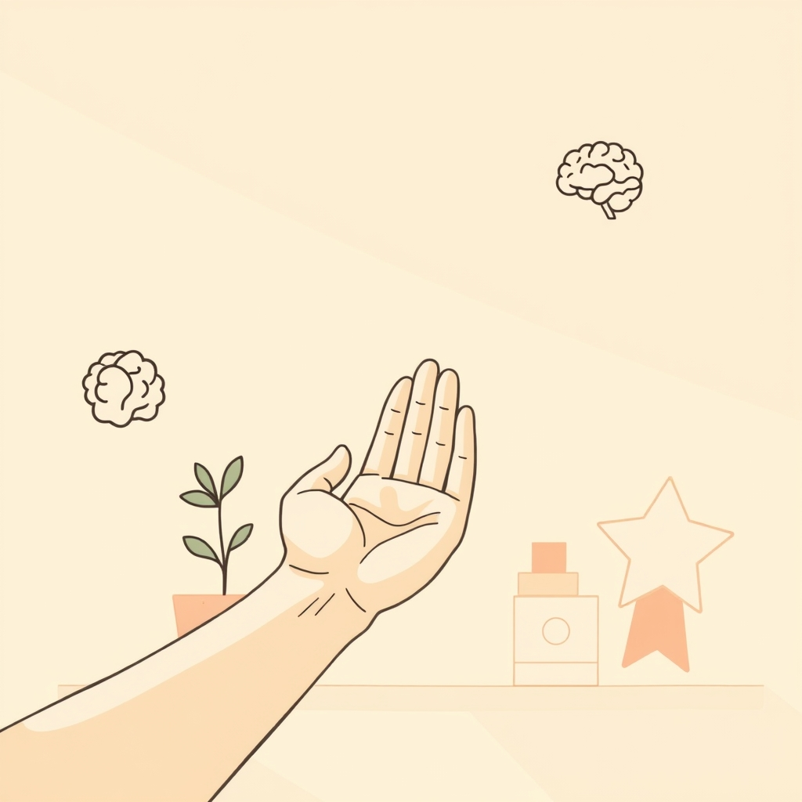

[Home](../index.md) > [Bot Chats](./index.md)  
# 🤰🏼👶🍼👨‍👩‍👦 Parenting and Infant Development Guide  
  
  
## [ChatGPT](https://chat.com) Prompt  
> I want to be an expert on parenting and infant care and development. Assume I don't know much on the topic. Assemble a report that will serve as an introduction and starting point for further research. Identify expert individuals, institutions, and organizations. List high quality books, videos, articles, and other resources, aiming to present the highest quality material with the most practical insights. Start at a high level by breaking the topics down into sub categories, then apply the same research strategy to each sub-field. Format your response as markdown with inline links starting at H3 heading.  
  
## Response  
Below is a comprehensive report to kickstart your journey into becoming an expert on parenting, infant care, and development. This report is organized into key subfields, with each section highlighting foundational concepts, expert voices, and high‐quality resources—books, videos, articles, and institutions—to guide further exploration.  
  
---  
  
### Overview of Parenting, Infant Care, and Development  
Parenting is a multifaceted field that spans not only the daily practices of caring for infants but also encompasses long‐term developmental strategies and parenting philosophies. Understanding this field means exploring:  
- **Parenting Philosophies and Approaches:** How different theories and styles influence a child’s upbringing.  
- **Infant Care Practices:** The practical, day-to-day routines that ensure a baby’s physical and emotional well-being.  
- **Infant Development and Milestones:** The cognitive, motor, and social-emotional changes that occur during infancy.  
- **Evidence-Based Research and Guidelines:** How trusted research informs best practices.  
- **Supplementary Resources:** A curated list of books, videos, online courses, and articles.  
- **Expert Organizations and Institutions:** Key bodies that provide guidelines and up-to-date research.  
- **Leading Expert Individuals:** Renowned professionals whose work shapes the field.  
  
Each of these sections is outlined below with inline links for easy access to high-quality materials.  
  
---  
  
### Parenting Philosophies and Approaches  
This area examines the theories behind how parents can support their children’s emotional, social, and intellectual growth.  
  
- **Concepts & Theories:**    
  Explore various parenting styles—from authoritative to attachment-based approaches—and their impact on child development.  
    
- **Expert Voices:**    
  - [Dr. Benjamin Spock](https://en.wikipedia.org/wiki/Benjamin_Spock) pioneered practical parenting advice with his classic book *Baby and Child Care*.    
  - [Dr. Laura Markham](https://www.ahaparenting.com/about-us) offers insights into peaceful parenting and emotional coaching.    
  - [Alfie Kohn](https://www.alfiekohn.org/) critiques traditional discipline methods and advocates for nurturing approaches.  
    
- **Recommended Reading:**    
  - [🤱🏼🤿🪞🌱 Parenting from the Inside Out: How a Deeper Self-Understanding Can Help You Raise Children Who Thrive](../books/parenting-from-the-inside-out-how-a-deeper-self-understanding-can-help-you-raise-children-who-thrive.md) by Daniel J. Siegel & Mary Hartzell, which connects the dots between parental self-awareness and child well-being.  
    
- **Articles & Videos:**    
  Look for content on the [Harvard Graduate School of Education](https://www.gse.harvard.edu/) and related TED Talks that explore modern parenting challenges and innovations.  
  
---  
  
### Infant Care Practices  
Practical care is central to infant well-being. This section covers daily routines including feeding, sleep, soothing, and safety.  
  
- **Core Topics:**    
  - **Sleep & Soothing:** Establishing healthy sleep habits and calming techniques.    
  - **Feeding:** Best practices for breastfeeding, formula feeding, and transitioning to solids.    
  - **Health & Safety:** Guidelines for immunizations, car seat safety, and developmental screenings.  
    
- **Expert Voices:**    
  - [Dr. Harvey Karp](https://www.happiestbaby.com/), known for *[The Happiest Baby On The Block](../books/the-happiest-baby-on-the-block.md)*, explains soothing techniques and sleep solutions.    
  - [Dr. William Sears](https://www.attachmentparenting.org/) promotes attachment parenting, emphasizing physical closeness and responsiveness.  
    
- **Key Resources:**    
  - **Books:**    
    - [*The Baby Book*](https://www.searsandreid.com/) by Dr. Sears provides a comprehensive look at infant care.    
    - *[The Happiest Baby On The Block](../books/the-happiest-baby-on-the-block.md)* by Dr. Harvey Karp outlines practical methods for calming infants.  
  - **Videos:**    
    - Search for [The Happiest Baby on the Block video series](https://www.happiestbaby.com/) to see demonstrations of soothing techniques.  
  - **Articles:**    
    - Visit the [American Academy of Pediatrics](https://www.aap.org/) for trusted, research-backed guidelines on infant care.  
  
---  
  
### Infant Development and Milestones  
Understanding the rapid changes during infancy is crucial. This section explores cognitive, motor, and social-emotional milestones.  
  
- **Developmental Domains:**    
  - **Cognitive & Motor Skills:** Tracking early problem-solving, language acquisition, and physical coordination.    
  - **Social-Emotional Development:** Fostering attachment, empathy, and early social interactions.  
    
- **Expert Voices:**    
  - [Dr. T. Berry Brazelton](https://en.wikipedia.org/wiki/T._Berry_Brazelton) has been influential in understanding neonatal behavior and early development.    
  - [Dr. Alison Gopnik](http://www.alisongopnik.com/) provides insights into the developing mind and early learning processes.  
    
- **Key Resources:**    
  - **Books:**    
    - [👶🧠😊📈📚 Brain Rules for Baby: How to Raise a Smart and Happy Child from Zero to Five](../books/brain-rules-for-baby.md) by John Medina discusses how early brain development impacts later learning.    
    - *Caring for Your Baby and Young Child* (by the [American Academy of Pediatrics](https://www.aap.org/)) offers evidence-based guidelines.  
  - **Organizations:**    
    - [Zero to Three](https://www.zerotothree.org/) focuses specifically on early development research and practical advice.    
    - [Harvard Center on the Developing Child](https://developingchild.harvard.edu/) provides a wealth of research and policy recommendations.  
  - **Articles & Journals:**    
    - Peer-reviewed journals from the [Society for Research in Child Development](https://www.srcd.org/) are excellent for in-depth studies.  
  
---  
  
### Evidence-Based Research and Guidelines  
For a research-informed approach to parenting, it’s vital to ground practices in the latest science.  
  
- **Institutions & Guidelines:**    
  - The [National Institute of Child Health and Human Development (NICHD)](https://www.nichd.nih.gov/) and the [American Academy of Pediatrics](https://www.aap.org/) publish ongoing research and updated guidelines.  
  - Explore journals like *Child Development* and *Developmental Psychology* for current studies.  
    
- **Practical Application:**    
  - Use resources from [Zero to Three](https://www.zerotothree.org/research) and the [Harvard Center on the Developing Child](https://developingchild.harvard.edu/) to connect theory with practice.  
  
---  
  
### Supplementary Resources: Books, Videos, Courses, and Articles  
To deepen your knowledge, consider these curated resources:  
  
- **Books:**    
  - [🕳️🧠👶🏽 The Whole-Brain Child: 12 Revolutionary Strategies to Nurture Your Child's Developing Mind](../books/the-whole-brain-child.md) by Daniel J. Siegel and Tina Payne Bryson provides strategies to foster healthy brain development.  
  - [*What to Expect the First Year*](https://www.whattoexpect.com/first-year/) by Heidi Murkoff offers a month-by-month guide to infant care.  
  - [Brain Rules for Baby](../books/brain-rules-for-baby.md) by John Medina focuses on neuroscience-informed parenting.  
    
- **Videos & Online Courses:**    
  - [The Happiest Baby On The Block](../books/the-happiest-baby-on-the-block.md) video series by Dr. Harvey Karp is a practical guide to calming your baby.  
  - Explore parenting courses on platforms like [Coursera](https://www.coursera.org/) and [edX](https://www.edx.org/) for structured learning.  
  - TED Talks on parenting can be found by searching topics on the [TED website](https://www.ted.com/topics/parenting).  
    
- **Websites & Articles:**    
  - Visit [American Academy of Pediatrics](https://www.aap.org/) and [Zero to Three](https://www.zerotothree.org/) for extensive libraries of articles and policy statements.  
  
---  
  
### Expert Organizations and Institutions  
The following institutions offer trusted, up-to-date information and research that underpin best practices in parenting and infant care:  
  
- [American Academy of Pediatrics (AAP)](https://www.aap.org/)    
- [Zero to Three](https://www.zerotothree.org/)    
- [Harvard Center on the Developing Child](https://developingchild.harvard.edu/)    
- [National Institute of Child Health and Human Development (NICHD)](https://www.nichd.nih.gov/)    
- [Society for Research in Child Development (SRCD)](https://www.srcd.org/)    
- [National Association for the Education of Young Children (NAEYC)](https://www.naeyc.org/)  
  
---  
  
### Expert Individuals in Parenting and Infant Development  
Learning from the pioneers and current leaders in the field is invaluable:  
  
- **Dr. Benjamin Spock:** His seminal work in *Baby and Child Care* remains influential. ([Learn more](https://en.wikipedia.org/wiki/Benjamin_Spock))  
- **Dr. T. Berry Brazelton:** A key figure in neonatal behavioral research. ([Learn more](https://en.wikipedia.org/wiki/T._Berry_Brazelton))  
- **Dr. Harvey Karp:** Innovator behind modern soothing techniques and sleep strategies. ([Learn more](https://en.wikipedia.org/wiki/Harvey_Karp))  
- **Dr. William Sears:** Advocate of attachment parenting and author of *The Baby Book*. ([Learn more](https://en.wikipedia.org/wiki/William_Sears))  
- **Dr. Laura Markham:** Offers practical guidance on parenting with empathy via [Aha! Parenting](https://www.ahaparenting.com/about-us).  
- **Daniel J. Siegel & Tina Payne Bryson:** Their work in *[🕳️🧠👶🏽 The Whole-Brain Child: 12 Revolutionary Strategies to Nurture Your Child's Developing Mind](../books/the-whole-brain-child.md)* bridges neuroscience and practical parenting. ([Siegel on Wikipedia](https://en.wikipedia.org/wiki/Daniel_J._Siegel), [Bryson on Wikipedia](https://en.wikipedia.org/wiki/Tina_Payne_Bryson))  
  
---  
  
### Moving Forward  
This report offers a high-level map of the vast field of parenting and infant development. As you continue your research:  
- Delve into the recommended books, videos, and courses.  
- Regularly consult the expert organizations’ websites for the latest guidelines.  
- Engage with peer-reviewed research to remain updated on new developments.  
  
Each resource here has been chosen for its quality and practical insights. As you progress, you’ll find that combining theoretical knowledge with practical advice forms the foundation of effective parenting and optimal infant development. Happy learning and best of luck on your journey to expertise!  
  
## 🦋 Bluesky    
<blockquote class="bluesky-embed" data-bluesky-uri="at://did:plc:i4yli6h7x2uoj7acxunww2fc/app.bsky.feed.post/3mkpjrilda32v" data-bluesky-cid="bafyreibh3jybukm5uxgfj26fo6jqn4ihrc4mja6pvuguq3d4pwaooomzbi">
🤰🏼👶🍼👨‍👩‍👦 Parenting and Infant Development Guide  
  
#AI Q: 🍼 What is the one piece of parenting advice you wish you had received sooner?  
  
👶 Infant Milestones | 🧠 Brain Development | 📚 Parenting Books | 😴 Sleep &amp; Soothing  
https://bagrounds.org/bot-chats/parenting-and-infant-development-guide
&mdash; <a href="https://bsky.app/profile/did:plc:i4yli6h7x2uoj7acxunww2fc?ref_src=embed">Bryan Grounds (@bagrounds.bsky.social)</a> <a href="https://bsky.app/profile/did:plc:i4yli6h7x2uoj7acxunww2fc/post/3mkpjrilda32v?ref_src=embed">2026-04-30T11:40:37.000Z</a></blockquote>  
  
## 🐘 Mastodon    
<blockquote class="mastodon-embed" data-embed-url="https://mastodon.social/@bagrounds/116503276941414374/embed" style="background: #282c37; border-radius: 8px; border: 1px solid #393f4f; margin: 0; max-width: 540px; min-width: 270px; overflow: hidden; padding: 0;"> <a href="https://mastodon.social/@bagrounds/116503276941414374" target="_blank" style="align-items: center; color: #d9e1e8; display: flex; flex-direction: column; font-family: system-ui, -apple-system, BlinkMacSystemFont, 'Segoe UI', Oxygen, Ubuntu, Cantarell, 'Fira Sans', 'Droid Sans', 'Helvetica Neue', Roboto, sans-serif; font-size: 14px; justify-content: center; letter-spacing: 0.25px; line-height: 20px; padding: 24px; text-decoration: none;"> <svg xmlns="http://www.w3.org/2000/svg" xmlns:xlink="http://www.w3.org/1999/xlink" width="32" height="32" viewBox="0 0 79 75"><path d="M63 45.3v-20c0-4.1-1-7.3-3.2-9.7-2.1-2.4-5-3.7-8.5-3.7-4.1 0-7.2 1.6-9.3 4.7l-2 3.3-2-3.3c-2-3.1-5.1-4.7-9.2-4.7-3.5 0-6.4 1.3-8.6 3.7-2.1 2.4-3.1 5.6-3.1 9.7v20h8V25.9c0-4.1 1.7-6.2 5.2-6.2 3.8 0 5.8 2.5 5.8 7.4V37.7H44V27.1c0-4.9 1.9-7.4 5.8-7.4 3.5 0 5.2 2.1 5.2 6.2V45.3h8ZM74.7 16.6c.6 6 .1 15.7.1 17.3 0 .5-.1 4.8-.1 5.3-.7 11.5-8 16-15.6 17.5-.1 0-.2 0-.3 0-4.9 1-10 1.2-14.9 1.4-1.2 0-2.4 0-3.6 0-4.8 0-9.7-.6-14.4-1.7-.1 0-.1 0-.1 0s-.1 0-.1 0 0 .1 0 .1 0 0 0 0c.1 1.6.4 3.1 1 4.5.6 1.7 2.9 5.7 11.4 5.7 5 0 9.9-.6 14.8-1.7 0 0 0 0 0 0 .1 0 .1 0 .1 0 0 .1 0 .1 0 .1.1 0 .1 0 .1.1v5.6s0 .1-.1.1c0 0 0 0 0 .1-1.6 1.1-3.7 1.7-5.6 2.3-.8.3-1.6.5-2.4.7-7.5 1.7-15.4 1.3-22.7-1.2-6.8-2.4-13.8-8.2-15.5-15.2-.9-3.8-1.6-7.6-1.9-11.5-.6-5.8-.6-11.7-.8-17.5C3.9 24.5 4 20 4.9 16 6.7 7.9 14.1 2.2 22.3 1c1.4-.2 4.1-1 16.5-1h.1C51.4 0 56.7.8 58.1 1c8.4 1.2 15.5 7.5 16.6 15.6Z" fill="currentColor"/></svg> 
Post by @bagrounds@mastodon.social
 
View on Mastodon
 </a> </blockquote> 