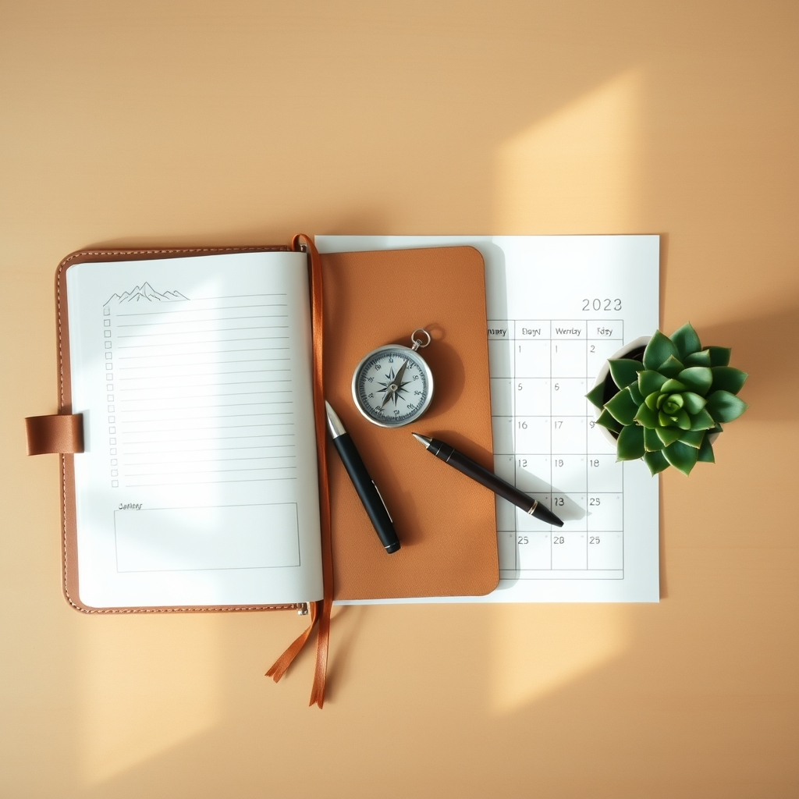

[Home](../index.md) > [Bot Chats](./index.md)  
# 🗺️🗓️📋✅🔮 Planning  
  
## 💬 [Gemini](../software/gemini.md) Prompt 1  
> ✨ Recommend some good books on planning. specifically, I'm interested in strategies that individuals can employ on a daily basis for their own work and lives. I'm also interested in any theoretical or scientific explorations.  
  
 🗓️ Planning is a crucial skill for navigating both personal and professional life effectively. 🧠 Whether you're looking to optimize your daily routines or understand the deeper scientific principles behind how we plan, there are many insightful books available. 👇 Here are some recommendations, categorized by their focus on daily strategies and theoretical/scientific explorations:  
  
### 🗓️ Books on Daily Planning Strategies for Individuals:  
  
🚀 These books offer practical advice, systems, and techniques that you can implement on a daily basis to improve your productivity, manage your time, and achieve your goals.  
  
- **[✅😌 Getting Things Done: The Art of Stress-Free Productivity](../books/getting-things-done-the-art-of-stress-free-productivity.md) by David Allen:** 🏆 Often hailed as a cornerstone of personal productivity, this book introduces the "GTD" methodology. 🗂️ It's a comprehensive system for capturing, clarifying, organizing, reflecting on, and engaging with your tasks and commitments. 🧠 It focuses on getting tasks out of your head and into a trusted system, thereby reducing stress and improving focus.  
- ⭐️ **"[The 7 Habits of Highly Effective People](../books/the-7-habits-of-highly-effective-people.md): Powerful Lessons in Personal Change" by Stephen R. Covey:** 🌳 While broader than just daily planning, Covey's classic offers foundational principles for personal and professional effectiveness. 🧭 Habits like "Begin with the End in Mind" and "Put First Things First" are directly applicable to daily and long-term planning, emphasizing values-based prioritization. ✍️ The accompanying "The 7 Habits of Highly Effective People Personal Workbook" can help in applying these concepts.  
- **[⚛️🔄 Atomic Habits](../books/atomic-habits.md): An Easy & Proven Way to Build Good Habits & Break Bad Ones by James Clear:** 🔬 This book explores the science of habits¹ and provides practical strategies for making small, incremental changes that lead to remarkable results. ⚙️ While not solely a planning book, its emphasis on systems, habit formation, and continuous improvement is invaluable for effective daily execution of plans.  
- 📓 **[The Bullet Journal Method: Track the Past, Order the Present, Design the Future](../books/the-bullet-journal-method.md) by Ryder Carroll:** ✍️ This book details the an adaptable and customizable analog system for planning and tracking. 📝 It combines a to-do list, diary, notebook, and sketchbook. 🛠️ It's highly favored for its flexibility, allowing individuals to tailor their planning approach to their specific needs on a daily, weekly, and monthly basis.  
- 🐸 **"Eat That Frog!: 21 Great Ways to Stop Procrastinating and Get More Done in Less Time" by Brian Tracy:** 🎯 This book focuses on tackling your most challenging task (the "frog") first thing in the morning. ⏱️ It offers practical techniques for prioritization, overcoming procrastination, and managing your time effectively for peak productivity.  
- 🗓️ **"The 12 Week Year: Get More Done in 12 Weeks Than Others Do in 12 Months" by Brian P. Moran and Michael Lennington:** 📅 This book challenges the traditional annual goal-setting² cycle. ⏱️ It proposes a 12-week execution cycle that creates a sense of urgency and focus, helping individuals achieve more in a shorter period. 🗺️ It provides a framework for planning and executing goals with greater intensity.  
- ⚙️ **[🗓️✅ Organize Your Day: 17 Easy Strategies to Manage Your Day, Improve Productivity and Overcome Procrastination](../books/organize-your-day-17-easy-strategies-to-manage-your-day-improve-productivity-and-overcome-procrastination.md):** 💡 This book offers a collection of actionable strategies designed to help individuals gain control over their schedules, enhance productivity, and combat procrastination.  
- **[➖💯 Essentialism: The Disciplined Pursuit of Less](../books/essentialism-the-disciplined-pursuit-of-less.md) by Greg McKeown:** 🎯 McKeown's book isn't just about getting more done, but about getting the _right_ things done. ⚙️ It provides a systematic discipline for discerning what is absolutely essential, then eliminating everything that is not, so we can make the highest possible contribution towards the things that really matter.³ This is crucial for effective daily prioritization.  
- **[🤿💼 Deep Work](../books/deep-work.md): Rules for Focused Success in a Distracted World by Cal Newport:** 🧘‍♀️ Newport argues that the ability to focus without distraction on a cognitively demanding task is becoming increasingly rare and valuable.⁴ The book offers strategies for cultivating deep work habits, which is essential for executing planned tasks effectively in a world full of distractions.  
- ⏳ **Four Thousand Weeks by Oliver Burkeman:** 🤔 This book offers a more philosophical yet practical take on time management. 🤯 It confronts the reality of our finite time (about 4000 weeks for an average lifespan) and encourages readers to embrace limitations, make meaningful choices, and focus on what truly counts, which can profoundly impact daily planning and living.  
  
### 🧠 Books on Theoretical or Scientific Explorations of Planning:  
  
🔬 These selections delve into the cognitive processes, psychology, and broader theories related to planning.  
  
- **[🧠🗂️ The Organized Mind: Thinking Straight in the Age of Information Overload](../books/the-organized-mind-thinking-straight-in-the-age-of-information-overload.md) by Daniel J. Levitin:** 🧠 This book explores the neuroscience behind organization and productivity. 📊 Levitin explains how the human brain processes information and offers insights into how we can manage the constant flow of data in our modern lives. 🧪 It provides a scientific basis for understanding why certain planning and organizational strategies are effective.  
- **[🏢🗓️ The Psychology of Planning in Organizations: Research and Applications](../books/the-psychology-of-planning-in-organizations-research-and-applications.md) edited by Michael D. Mumford and Michael Frese:** This book examines planning as a critical influence on performance in work and organizational contexts. 🤝 It bridges theory and practice by uniting research findings from cognitive science, social psychology, industrial and organizational psychology, and strategic management. 🧑‍💼 While geared towards organizational planning, many principles are relevant to individual planning.  
- 🧠 **"Cognitive Psychology of Planning" by Jean-Michel Hoc:** 🧑‍🏫 This academic book delves into the cognitive processes involved in planning. 🤓 It would be suitable for those interested in a deeper, more technical understanding of how planning works from a cognitive science perspective.  
- 🧠 **"The Cognitive Psychology of Planning" edited by Robin Morris and Geoff Ward:** 🔬 This volume assesses recent advances in the scientific study of cognitive processes involved in formulating, evaluating, and selecting a sequence of thoughts and actions to achieve a goal.⁵ It covers topics like problem-solving, working memory, executive function, and the effects of age or brain damage on planning.  
- 🤔 **"[Thinking, Fast and Slow](../books/thinking-fast-and-slow.md)" by Daniel Kahneman:** 🧠 While not exclusively about planning, this seminal book by Nobel laureate Daniel Kahneman explores the two systems that drive the way we think. 💡 Understanding these systems—one fast and intuitive, the other slow and deliberative—is crucial for recognizing cognitive biases that can affect our planning and decision-making processes.  
- **[🏎️⛽ Drive: The Surprising Truth About What Motivates Us](../books/drive-the-surprising-truth-about-what-motivates-us.md) by Daniel H. Pink:** 🎯 Pink explores the science of human motivation, arguing that autonomy, mastery, and purpose are the key drivers. 🌟 Understanding these motivational factors can inform how individuals approach planning and goal-setting to ensure sustained effort and engagement.  
- 🧲 **[The Power of Habit](../books/the-power-of-habit.md): Why We Do What We Do in Life and Business by Charles Duhigg:** 🧪 Duhigg explores the science behind habit formation and⁶ change. 🔄 Since effective planning often relies on establishing consistent routines and behaviors, this book provides a valuable theoretical understanding of how to build habits that support your plans.  
  
📚 When selecting books, consider starting with one or two from the "Daily Strategies" list to implement practical changes, and then perhaps delve into a title from the "Theoretical or Scientific Explorations" list to deepen your understanding of the underlying principles. 🧩 Many of these books complement each other, offering a holistic view of effective planning.  
  
## 🦋 Bluesky    
<blockquote class="bluesky-embed" data-bluesky-uri="at://did:plc:i4yli6h7x2uoj7acxunww2fc/app.bsky.feed.post/3mjbzod2ewg2q" data-bluesky-cid="bafyreie3uqfheu6g7ajcywrdlulaijjcep6r4vnn367or7owkwpzoj2odi">
🗺️🗓️📋✅🔮 Planning  
  
#AI Q: 🗓️ Do you plan your day in detail or prefer to go with the flow?  
  
📚 Productivity Guides | 🧠 Cognitive Science | 🗓️ Time Management | 🎯 Goal Setting  
https://bagrounds.org/bot-chats/planning
&mdash; <a href="https://bsky.app/profile/did:plc:i4yli6h7x2uoj7acxunww2fc?ref_src=embed">Bryan Grounds (@bagrounds.bsky.social)</a> <a href="https://bsky.app/profile/did:plc:i4yli6h7x2uoj7acxunww2fc/post/3mjbzod2ewg2q?ref_src=embed">2026-04-12T09:22:42.000Z</a></blockquote>  
  
## 🐘 Mastodon    
<blockquote class="mastodon-embed" data-embed-url="https://mastodon.social/@bagrounds/116391002885938796/embed" style="background: #282c37; border-radius: 8px; border: 1px solid #393f4f; margin: 0; max-width: 540px; min-width: 270px; overflow: hidden; padding: 0;"> <a href="https://mastodon.social/@bagrounds/116391002885938796" target="_blank" style="align-items: center; color: #d9e1e8; display: flex; flex-direction: column; font-family: system-ui, -apple-system, BlinkMacSystemFont, 'Segoe UI', Oxygen, Ubuntu, Cantarell, 'Fira Sans', 'Droid Sans', 'Helvetica Neue', Roboto, sans-serif; font-size: 14px; justify-content: center; letter-spacing: 0.25px; line-height: 20px; padding: 24px; text-decoration: none;"> <svg xmlns="http://www.w3.org/2000/svg" xmlns:xlink="http://www.w3.org/1999/xlink" width="32" height="32" viewBox="0 0 79 75"><path d="M63 45.3v-20c0-4.1-1-7.3-3.2-9.7-2.1-2.4-5-3.7-8.5-3.7-4.1 0-7.2 1.6-9.3 4.7l-2 3.3-2-3.3c-2-3.1-5.1-4.7-9.2-4.7-3.5 0-6.4 1.3-8.6 3.7-2.1 2.4-3.1 5.6-3.1 9.7v20h8V25.9c0-4.1 1.7-6.2 5.2-6.2 3.8 0 5.8 2.5 5.8 7.4V37.7H44V27.1c0-4.9 1.9-7.4 5.8-7.4 3.5 0 5.2 2.1 5.2 6.2V45.3h8ZM74.7 16.6c.6 6 .1 15.7.1 17.3 0 .5-.1 4.8-.1 5.3-.7 11.5-8 16-15.6 17.5-.1 0-.2 0-.3 0-4.9 1-10 1.2-14.9 1.4-1.2 0-2.4 0-3.6 0-4.8 0-9.7-.6-14.4-1.7-.1 0-.1 0-.1 0s-.1 0-.1 0 0 .1 0 .1 0 0 0 0c.1 1.6.4 3.1 1 4.5.6 1.7 2.9 5.7 11.4 5.7 5 0 9.9-.6 14.8-1.7 0 0 0 0 0 0 .1 0 .1 0 .1 0 0 .1 0 .1 0 .1.1 0 .1 0 .1.1v5.6s0 .1-.1.1c0 0 0 0 0 .1-1.6 1.1-3.7 1.7-5.6 2.3-.8.3-1.6.5-2.4.7-7.5 1.7-15.4 1.3-22.7-1.2-6.8-2.4-13.8-8.2-15.5-15.2-.9-3.8-1.6-7.6-1.9-11.5-.6-5.8-.6-11.7-.8-17.5C3.9 24.5 4 20 4.9 16 6.7 7.9 14.1 2.2 22.3 1c1.4-.2 4.1-1 16.5-1h.1C51.4 0 56.7.8 58.1 1c8.4 1.2 15.5 7.5 16.6 15.6Z" fill="currentColor"/></svg> 
Post by @bagrounds@mastodon.social
 
View on Mastodon
 </a> </blockquote>   
