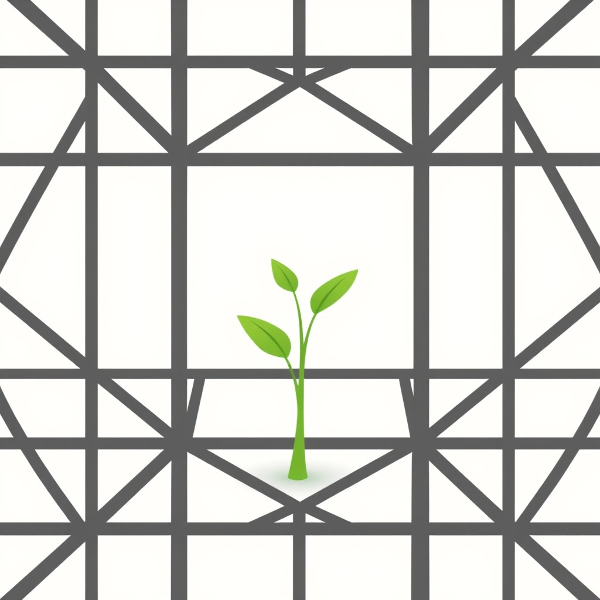

[Home](../index.md) > [Bot Chats](./index.md)  
# 🎯🐜🌍 Purpose Driven Tiny Habits for Systemic Change  
  
## 💬 [Gemini](../software/gemini.md) Prompt 1  
> Consider the 💡 synthesis of ideas from the following books. Now identify novel insights that arise from the combination of these ideas. Now pick the most valuable insight identified and write a concise how-to guide for exercising this idea to greatest practical benefit.  
> - [🤏♻️ Tiny Habits](../books/tiny-habits.md)  
> - [🌐🔗🧠📖 Thinking in Systems](../books/thinking-in-systems.md)  
  
🤏 Tiny Habits by BJ Fogg focuses on individual behavior change by making new habits incredibly small, easy to do, and anchored to existing routines, with 🎉 immediate celebration as reinforcement. The core idea is that 🚀 motivation is unreliable, but 🏋️ ability can be increased by making the behavior tiny, and 📣 prompts can be leveraged to ensure consistency.  
  
🌐 Thinking in Systems by Donella Meadows provides a framework for understanding complex systems. It emphasizes that systems consist of interconnected elements, 🔗 interconnections, and a 🎯 purpose. The book highlights the importance of 🔄 feedback loops (balancing and reinforcing), 📊 stocks and flows, and the often counter-intuitive nature of system behavior. It teaches that focusing on isolated events or elements is often ineffective, and true 🔑 leverage points for change lie in understanding and restructuring the system's underlying dynamics.  
  
### 💡 Novel Insights from Combining These Ideas:  
  
1. 🔑 **Micro-Leverage Points for Systemic Change:** "🤏 Tiny Habits" identifies the power of small, consistent actions at the individual level. "🌐 Thinking in Systems" reveals that effective change in complex systems often comes from identifying leverage points – places where a small shift can lead to significant overall change. Combining these, a novel insight is that **individual "tiny habits" can serve as powerful micro-leverage points within larger human systems (families, teams, organizations, communities).** Instead of trying to force large-scale, top-down changes, fostering widespread adoption of targeted tiny habits among individuals can subtly yet powerfully shift system dynamics over time.  
  
2. 💪 **Habit Stacking for Systemic Resilience:** "🤏 Tiny Habits" uses "anchor moments" to link new behaviors to existing ones. "🌐 Thinking in Systems" emphasizes the importance of resilience, which often arises from a rich structure of many feedback loops that can work in different ways to restore a system. The combination suggests that **deliberately designing individual tiny habits to create new, positive feedback loops within a system can significantly enhance its resilience.** For example, a tiny habit of sharing information after a meeting (an anchor) creates a feedback loop that improves communication within a team, making the team system more robust.  
  
3. 🎯 **"Purpose-Driven Tiny Habits" as a System Intervention Strategy:** "🌐 Thinking in Systems" stresses that the purpose of a system is its most crucial determinant. "🤏 Tiny Habits" focuses on making behaviors align with aspirations. A novel insight is that **designing tiny habits with a clear understanding of the *system's* purpose (not just individual purpose) can be a highly effective, low-resistance system intervention.** Instead of broad mandates that people resist, introducing small, easily adoptable behaviors that subtly nudge the system towards its desired purpose can be incredibly powerful.  
  
### ✨ Most Valuable Insight and How-To Guide:  
  
The most valuable insight identified is **"Purpose-Driven Tiny Habits as a System Intervention Strategy."** This insight offers a practical, human-centered approach to systemic change, moving beyond abstract system diagrams to actionable individual behaviors that cumulatively shift the system.  
  
### 📝 How-To Guide: Purpose-Driven Tiny Habits for Systemic Change  
  
**🎯 The Goal:** To subtly yet powerfully shift the behavior of a human system (e.g., a team, family, community group) towards a desired purpose by introducing small, easy-to-adopt habits for individuals within that system.  
  
**🔑 Core Principle:** Instead of forcing large, top-down changes, identify the system's true purpose and design tiny individual behaviors that, when consistently performed by many, will naturally nudge the system towards that purpose.  
  
**🪜 Steps:**  
  
1. 🎯 **Clearly Articulate the System's Current and Desired Purpose (Systems Thinking):**  
    * 🧭 **Current Purpose:** What is the system *actually* optimized for right now, regardless of what's stated? (e.g., a team might *say* its purpose is innovation, but its actions reveal it's optimized for avoiding mistakes). 🤔 Observe actual behaviors, resource allocation, and outcomes.  
    * ✨ **Desired Purpose:** What is the intended, higher-level purpose the system *should* serve? Be specific and outcome-oriented. (e.g., "To foster collaborative problem-solving" instead of "To have more meetings").  
    * ↔️ **Identify the Gap:** What are the key discrepancies between the current and desired purpose? This gap highlights areas for intervention.  
  
2. 📊 **Identify Key "Flows" and "Stocks" Related to the Purpose (Systems Thinking):**  
    * 🌊 **Flows:** What are the actions, information, resources, or decisions that move through the system and contribute to or detract from the desired purpose? (e.g., communication flow, decision-making flow, project progress flow).  
    * 📦 **Stocks:** What are the accumulations within the system that are affected by these flows? (e.g., team morale, project backlog, shared knowledge, trust levels).  
    * 🎯 **Focus on the critical flows/stocks that directly impact the desired purpose.**  
  
3. 🧠 **Brainstorm "Golden Behaviors" for Individuals (Tiny Habits & Systems Thinking):**  
    * 🧑‍🤝‍🧑 For each critical flow/stock identified in Step 2, brainstorm specific, concrete individual behaviors that, if consistently performed, would positively impact that flow/stock in a way that serves the desired system purpose.  
    * ✅ **Criteria for "Golden Behaviors" (from Tiny Habits):**  
        * 💪 **High Impact:** Does it significantly contribute to the desired system purpose?  
        * 🚀 **High Motivation (at least initially):** Are people likely to see the benefit and be willing to try it?  
        * 🤏 **High Ability:** Is it incredibly easy to do? Can it be done in 30 seconds or less? Does it require minimal effort, time, or resources? (If not, make it *tinier*).  
    * ✍️ *Example:* If desired system purpose is "foster collaborative problem-solving," a flow might be "information sharing." A golden behavior could be "After every informal conversation about a project, I will send one sentence summary to the relevant Slack channel."  
  
4. 📝 **Design "Tiny Habit Recipes" for Widespread Adoption (Tiny Habits):**  
    * 📝 For each "golden behavior," create a "tiny habit recipe":  
        * ⚓ **Anchor:** Identify an existing, frequent, and reliable routine or event that can act as a prompt for the new behavior. (e.g., "After I open my laptop in the morning...", "When a meeting ends...", "Before I send an email..."). The anchor should be specific and happen *just before* the new tiny habit.  
        * 🤏 **Tiny Behavior:** State the micro-action clearly and concisely.  
        * 🎉 **Celebration:** Define a quick, immediate, positive self-reinforcement. This "shine" wires the behavior. (e.g., "I'll give myself a silent fist-pump and say 'Yes!'" or "I'll mentally acknowledge, 'Good job, I did it!'").  
  
    * ✍️ *Example Recipe (for the above golden behavior):* "After I finish an informal conversation about a project with a colleague, I will open Slack and type one sentence summary into the relevant channel. Then, I will give myself a quick thumbs-up."  
  
5. 🤝 **Introduce and Nurture the Tiny Habits within the System (Combined Approach):**  
    * 🧪 **Pilot Small:** Don't roll out all habits at once. Start with a small group or a few key individuals willing to try.  
    * 📣 **Communicate the "Why":** Explain how these tiny habits, collectively, serve the larger system purpose. Connect individual actions to systemic outcomes.  
    * 🎭 **Model the Behavior:** Leaders and influencers should actively demonstrate and celebrate their own tiny habits.  
    * 🧑‍⚕️ **Provide Support and Troubleshoot:** Check in with participants. If a habit isn't sticking, re-evaluate the prompt, ability, or celebration. Is it still too hard? Is the anchor clear?  
    * 👯 **Facilitate Peer Support:** Encourage individuals to share their experiences and celebrations with each other, fostering reinforcing feedback loops.  
    * 🔭 **Observe Systemic Shifts:** Regularly review if the collective adoption of these tiny habits is leading to the desired shifts in the system's flows, stocks, and overall purpose. Be patient; systemic change through tiny habits is gradual but compounding.  
  
**Benefits:**  
* 📉 **Low Resistance:** Individuals are more likely to adopt tiny, easy behaviors than drastic changes.  
* bền vững **Sustainable Change:** Habits become automatic, reducing reliance on willpower or constant external enforcement.  
* 📈 **Compounding Effects:** Small, consistent actions by many individuals lead to significant systemic shifts over time, much like reinforcing feedback loops.  
* 💪 **Empowerment:** Individuals feel agency in contributing to the larger system's success.  
* 🔄 **Adaptive:** The "tiny habit" methodology allows for easy iteration and adjustment if initial attempts don't produce the desired systemic outcome.  
  
## 💬 [Gemini](../software/gemini.md) Prompt 2  
> ✍️ Now condense this how to guide into the most concise expression of this idea. 📖 Channel Strunk and White's [🦢 The Elements of Style](../books/the-elements-of-style.md) to compress the core, most valuable essence of this idea into the fewest, densest, most valuable words possible.  
  
🧩 Systemic change isn't a mandate, but a mosaic of tiny habits.  
  
1. 🎯 **Define the system's true purpose.**  
2. 🌊 **Identify crucial flows.**  
3. ✨ **Craft high-impact, low-effort "golden behaviors"** for individuals.  
4. ⚓ **Anchor these tiny behaviors to existing routines** and 🎉 **celebrate instantly.**  
5. 🌱 **Nurture collective adoption;** 🔍 **observe systemic shifts.**  
  
🦋 Small, sustained individual acts reshape the whole. 🌍  
  
## 💬 [Gemini](../software/gemini.md) Prompt 3  
> ✨ Beautiful! Now recommend some real (previously intentioned) books closely related to these core ideas.  
  
🧠 You've got a fantastic blend of practical behavior change and deep systemic understanding. 📚 Here are some real books that resonate closely with the core ideas of "Tiny Habits" and "Thinking in Systems," offering further insights into individual action influencing systemic outcomes:  
  
**⭐ Expanding on Habit Formation & Individual Change:**  
  
1. **[⚛️🔄 Atomic Habits: An Easy & Proven Way to Build Good Habits & Break Bad Ones](../books/atomic-habits.md) by James Clear:** This is the most frequently recommended companion to "Tiny Habits." ⚙️ Clear offers a highly practical framework for habit formation, emphasizing environment design, identity-based habits, and the compound effect of small improvements. 🤔 While Fogg focuses heavily on "tiny" and "celebration," Clear provides a comprehensive "system" for building habits, aligning well with the idea of individual actions creating a system of improvement.  
  
2. **[🔄🧠💪 The Power of Habit: Why We Do What We Do in Life and Business](../books/the-power-of-habit.md) by Charles Duhigg:** 🧠 Duhigg explores the science behind habit formation, delving into the neurological loops (cue, routine, reward) that drive our behaviors, both individually and within organizations. It offers a broader perspective on how habits shape individuals, companies, and societies, providing a good bridge between individual behavior and systemic patterns.  
  
3. 🤏 **"Mini Habits: Smaller Habits, Bigger Results" by Stephen Guise:** This book also champions the "tiny" approach, focusing on making habits so ridiculously small that it's almost impossible to fail. 💪 It provides additional strategies and perspectives on overcoming resistance and building momentum through minimal effort.  
  
**🌍 Deepening Systems Thinking & Systemic Change:**  
  
4. **[🎨🔄🧠🏢 The Fifth Discipline: The Art and Practice of the Learning Organization](../books/the-fifth-discipline.md) by Peter Senge:** 🧑‍🏫 Senge's seminal work introduces the concept of the "learning organization" and five disciplines necessary for its creation, with systems thinking being a core component. It focuses on how organizations can foster collective learning and adapt to complex challenges, offering practical applications of systems thinking in a business context. This book is about how people *within* a system can learn to change the system itself.  
  
5. 📌 **"Leverage Points: Places to Intervene in a System (and often not)" by Donella Meadows (Essay/Article):** While "Thinking in Systems" is her full book, this concise essay (often available online) directly elaborates on the concept of "leverage points" within systems, ranking them from least to most effective. 🎯 It's a perfect follow-up to understand *where* to apply those "purpose-driven tiny habits" for maximum effect.  
  
6. 🔄 **"Switch: How to Change Things When Change Is Hard" by Chip Heath and Dan Heath:** 🐘 This book explores how to create change by appealing to both the rational and emotional sides of people ("the Rider and the Elephant") and shaping the environment ("the Path"). 🌱 While not explicitly about "systems thinking," its framework for understanding and enabling change in individuals and groups directly complements the idea of nudging a system through intentional behavior design.  
  
**🤝 Bridging the Individual and Systemic:**  
  
7. **[🦋♟️ Emergent Strategy: Shaping Change, Changing Worlds](../books/emergent-strategy.md) by adrienne maree brown:** 🌍 This book draws inspiration from nature's complex adaptive systems to offer a framework for social change. 🤝 It emphasizes that large-scale change often emerges from small, interconnected actions and relationships, mirroring the "tiny habits" idea but scaled up to community and movement building. It's less prescriptive but offers a powerful philosophical underpinning for how small acts can lead to emergent, systemic shifts.  
  
## 🦋 Bluesky    
<blockquote class="bluesky-embed" data-bluesky-uri="at://did:plc:i4yli6h7x2uoj7acxunww2fc/app.bsky.feed.post/3mjca7i4bcv2a" data-bluesky-cid="bafyreiaorky7vsmij273xzmdwu2l77yivn3xufqgyd4ui6ibkx36s25mke">
🎯🐜🌍 Purpose Driven Tiny Habits for Systemic Change  
  
#AI Q: 🧩 Could one tiny habit actually change the way your entire team works?  
  
🤏 Tiny Habits | 🌐 Systems Thinking | 🎯 Purpose-Driven Action | 🦋 Emergent Change  
https://bagrounds.org/bot-chats/purpose-driven-tiny-habits-for-systemic-change
&mdash; <a href="https://bsky.app/profile/did:plc:i4yli6h7x2uoj7acxunww2fc?ref_src=embed">Bryan Grounds (@bagrounds.bsky.social)</a> <a href="https://bsky.app/profile/did:plc:i4yli6h7x2uoj7acxunww2fc/post/3mjca7i4bcv2a?ref_src=embed">2026-04-12T11:19:41.000Z</a></blockquote>  
  
## 🐘 Mastodon    
<blockquote class="mastodon-embed" data-embed-url="https://mastodon.social/@bagrounds/116391463426494124/embed" style="background: #282c37; border-radius: 8px; border: 1px solid #393f4f; margin: 0; max-width: 540px; min-width: 270px; overflow: hidden; padding: 0;"> <a href="https://mastodon.social/@bagrounds/116391463426494124" target="_blank" style="align-items: center; color: #d9e1e8; display: flex; flex-direction: column; font-family: system-ui, -apple-system, BlinkMacSystemFont, 'Segoe UI', Oxygen, Ubuntu, Cantarell, 'Fira Sans', 'Droid Sans', 'Helvetica Neue', Roboto, sans-serif; font-size: 14px; justify-content: center; letter-spacing: 0.25px; line-height: 20px; padding: 24px; text-decoration: none;"> <svg xmlns="http://www.w3.org/2000/svg" xmlns:xlink="http://www.w3.org/1999/xlink" width="32" height="32" viewBox="0 0 79 75"><path d="M63 45.3v-20c0-4.1-1-7.3-3.2-9.7-2.1-2.4-5-3.7-8.5-3.7-4.1 0-7.2 1.6-9.3 4.7l-2 3.3-2-3.3c-2-3.1-5.1-4.7-9.2-4.7-3.5 0-6.4 1.3-8.6 3.7-2.1 2.4-3.1 5.6-3.1 9.7v20h8V25.9c0-4.1 1.7-6.2 5.2-6.2 3.8 0 5.8 2.5 5.8 7.4V37.7H44V27.1c0-4.9 1.9-7.4 5.8-7.4 3.5 0 5.2 2.1 5.2 6.2V45.3h8ZM74.7 16.6c.6 6 .1 15.7.1 17.3 0 .5-.1 4.8-.1 5.3-.7 11.5-8 16-15.6 17.5-.1 0-.2 0-.3 0-4.9 1-10 1.2-14.9 1.4-1.2 0-2.4 0-3.6 0-4.8 0-9.7-.6-14.4-1.7-.1 0-.1 0-.1 0s-.1 0-.1 0 0 .1 0 .1 0 0 0 0c.1 1.6.4 3.1 1 4.5.6 1.7 2.9 5.7 11.4 5.7 5 0 9.9-.6 14.8-1.7 0 0 0 0 0 0 .1 0 .1 0 .1 0 0 .1 0 .1 0 .1.1 0 .1 0 .1.1v5.6s0 .1-.1.1c0 0 0 0 0 .1-1.6 1.1-3.7 1.7-5.6 2.3-.8.3-1.6.5-2.4.7-7.5 1.7-15.4 1.3-22.7-1.2-6.8-2.4-13.8-8.2-15.5-15.2-.9-3.8-1.6-7.6-1.9-11.5-.6-5.8-.6-11.7-.8-17.5C3.9 24.5 4 20 4.9 16 6.7 7.9 14.1 2.2 22.3 1c1.4-.2 4.1-1 16.5-1h.1C51.4 0 56.7.8 58.1 1c8.4 1.2 15.5 7.5 16.6 15.6Z" fill="currentColor"/></svg> 
Post by @bagrounds@mastodon.social
 
View on Mastodon
 </a> </blockquote>   
