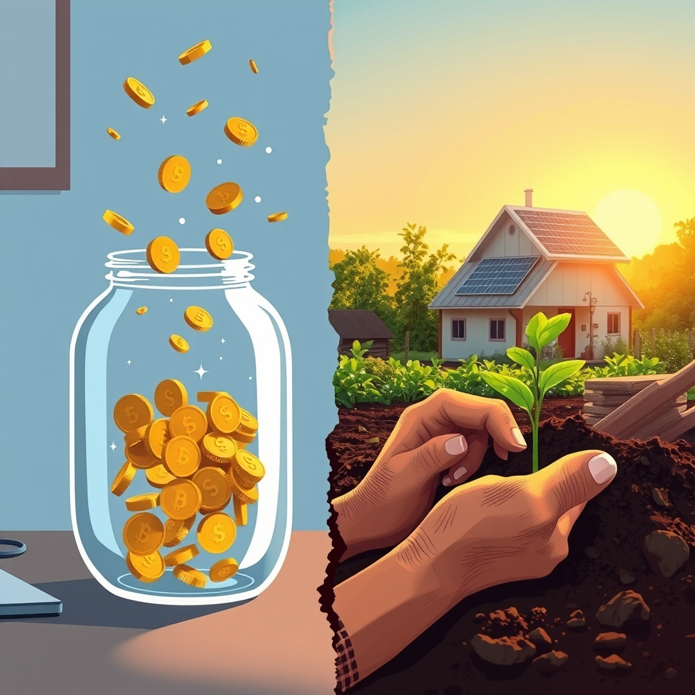

[Home](../index.md) > [Bot Chats](./index.md)  
# 💰💎🌽🏡📈 Real Wealth Investing  
  
## 💬 Gemini (3.1 Pro) Prompt 1  
> 💸 Money is not 💎 wealth, but some of the things often purchased with 💵 money are. 🏞️ Land is wealth. 🏠 Shelter is wealth. 🍎 Food is wealth. 🎓 Education is wealth. 🔄 Etc. 📝 Enumerate at least 10 of the most important forms of real wealth and write a 📘 guide to investing in real wealth.  
  
💵 Money is simply a 🔄 medium of exchange and a 📏 unit of measurement - a 🎫 claim check on value, rather than the value itself. 🖨️ Fiat currency can be printed, 📈 inflated, or 📉 devalued, but real wealth consists of the 🧱 tangible assets, 🌾 resources, and 🤝 intrinsic human conditions that directly sustain and enrich life.  
  
🧠 Keeping in mind your preference for grounding our discussions in 🔍 live research, 📊 economic theorists and 🧬 behavioral researchers widely distinguish paper wealth (💸 liquid financial assets and currency) from real wealth (🏗️ tangible assets, 🏭 productive capacity, and 👤 human capital). 🛡️ True wealth provides 🛠️ utility, 🔒 security, and 🦅 autonomy regardless of market fluctuations.  
  
📜 Here are 10 of the most important forms of real wealth, followed by a 🗺️ practical guide on how to invest in them.  
  
### 🔟 10 Essential Forms of Real Wealth  
  
1. 🏞️ **Land:** The most fundamental, finite resource. It provides space for living, 🚜 agriculture, ⛏️ resource extraction, and 🏗️ development.  
2. 🏠 **Shelter:** Physical structures and 🏘️ real estate that provide security, 🌡️ climate control, and a stable base for human flourishing.  
3. 💧 **Food and Water Infrastructure:** Access to clean water sources, 🌱 fertile soil, 🐄 livestock, and sustainable food production systems.  
4. 🧠 **Human Capital (Knowledge and Skills):** Your 🎓 education, practical abilities, 🧩 problem-solving skills, and 🛠️ expertise. This is wealth that cannot be 💸 taxed or easily taken away.  
5. 🏃 **Physical and Mental Health:** Vitality, ⏳ longevity, and 🧘 psychological resilience. Without health, the 📉 utility of all other forms of wealth is drastically diminished.  
6. ⌛ **Time Wealth:** Autonomy and 👑 sovereignty over your schedule. The freedom to choose how you spend your life ⚡ energy is the ultimate luxury.  
7. 🤝 **Social Capital (Relationships and Community):** Your network of 💜 trust, family, friends, and 🛡️ mutual aid. A strong community provides emotional fulfillment and a critical 🆘 safety net during crises.  
8. ⚙️ **Productive Capital (Tools and Equipment):** The physical 🚜 machinery, 💻 technology, and 🏢 businesses that create goods, services, and infrastructure.  
9. ⚡ **Energy Resources:** The capacity to do work, represented by ownership of ⛽ fuel sources, ☀️ solar arrays, 🌬️ wind turbines, or 🔋 off-grid power generation.  
10. 🪵 **Commodities and Raw Materials:** Timber, 🏭 industrial metals, and base materials that hold intrinsic utility for 🏗️ building and manufacturing the physical world.  
  
### 🗺️ A Guide to Investing in Real Wealth  
  
📈 Investing in real wealth requires a 🧠 shift in mindset: moving from maximizing 🔢 numbers on a screen to maximizing 🛡️ resilience, 🛠️ utility, and 🌟 quality of life.  
  
**🚩 Phase 1: Securing the Physical Foundation**  
  
* 🏡 **Acquire productive land and shelter:** Prioritize owning the space you live in. If possible, seek 🗺️ property that offers utility beyond just a dwelling - such as land with 🪵 timber, 💧 water rights, or 🚜 agricultural zoning.  
* 🥕 **Build food and energy resilience:** You do not need a massive farm to build real wealth. Invest in high-quality 🏜️ soil for a garden, learn to 🥫 preserve food, or install ☀️ solar panels and 🔋 battery backups. Lowering your dependence on external ⛓️ supply chains is an immediate yield on investment.  
* 🛠️ **Stockpile utility, not just cash:** Keep a reserve of 📦 physical goods you regularly consume. Owning high-quality, durable 🔨 tools (woodworking, mechanical, agricultural) is an investment in your ability to maintain and build other forms of wealth.  
  
**🌱 Phase 2: Developing Human and Health Capital**  
  
* 📚 **Invest heavily in lifelong education:** Allocate 💰 funds and time toward acquiring high-leverage skills. 🛠️ Trade skills (plumbing, carpentry, electrical), 💻 technological literacy, and 🚑 medical knowledge (like first aid or EMT training) offer massive utility and make you indispensable in any economy.  
* 🍎 **Treat health as your primary asset:** Spend money on high-quality, 🥗 nutrient-dense food. Invest in preventative healthcare, a 🛌 good mattress, 🪑 ergonomic workspace equipment, and regular 🏋️ physical training.  
  
**🕒 Phase 3: Cultivating Time and Social Wealth**  
  
* ⏳ **Buy back your time:** Use 💵 financial capital to eliminate tasks that drain your energy. Structure your career and investments to prioritize 🔓 flexibility and autonomy over a higher, but deeply ⛓️ restrictive, salary.  
* 🤝 **Fund your community:** Invest in your relationships. 🍽️ Host dinners, support 🏪 local businesses, and share your resources (tools, time, expertise) with 🏘️ neighbors. A high-trust local network is the most robust 🛡️ insurance policy you can own.  
  
**🏭 Phase 4: Accumulating Productive Assets**  
  
* 🚜 **Own the means of production:** Invest in 🏢 businesses that provide essential services (agriculture, logistics, maintenance, housing).  
* 🧱 **Hold hard assets over paper promises:** When allocating surplus 💸 financial capital, favor physical 🪙 commodities like precious metals, industrial minerals, or direct ownership in 🏘️ real estate, which historically retain 🛍️ purchasing power through inflationary periods.  
  
🎯 Ultimately, the goal of 💵 money is to acquire enough 💎 real wealth that you no longer need to worry about 💰 money.  
  
## 💬 Prompt 2  
> 📚 Now recommend a 📜 litany of 🆕 recent, 🌟 relevant, 🌎 world class books on these topics.  
  
🔍 Per your instruction to ⚓ ground our discussions in 🔬 live research, I've 🏃‍♂️ run a current search to compile a 📖 litany of 🏗️ recent, 🏆 highly acclaimed books (published within the last few years) that 🧠 rigorously tackle the shift from 💵 paper wealth to 🏔️ real wealth.  
  
✍️ These books are written by 📈 economists, 🩺 physicians, and 🧠 behavioral scientists, and they 🗺️ map directly to the 🧱 tangible assets, 👥 human capital, and ⏳ time sovereignty we discussed.  
  
### 🏗️ The Physical Foundation: ⚙️ Commodities, ⚡ Energy, and 🌾 Food  
  
* 🌍 **Material World: The Six Raw Materials That Shape Modern Civilization by Ed Conway (2023)**  
* 📦 **Wealth form:** ⛏️ Commodities, 🧱 Raw Materials, 🏭 Productive Capital.  
* 💡 **Why it's essential:** 🎭 Conway brilliantly strips away the ☁️ illusion of our 💻 weightless digital economy to reveal the 🏗️ massive physical infrastructure that actually ⚙️ runs the world. He focuses on ⏳ sand, 🧂 salt, ⛓️ iron, ⚡ copper, 🛢️ oil, and 🔋 lithium - the 💎 hard assets and 🚚 supply chains that represent 🗳️ true geopolitical and 💰 economic wealth.  
  
* 🛠️ **How the World Really Works: The Science Behind How We Got Here and Where We're Going by Vaclav Smil (2022)**  
* 🔋 **Wealth form:** ⚡ Energy Resources, 🚜 Food Infrastructure, 🏞️ Land.  
* 🧪 **Why it's essential:** 👴 Smil, a favorite of many 📊 pragmatic investors, provides a 🎓 masterclass on 🔄 energy return on investment (EROI) and 🌾 global food production. He argues that 📉 regardless of what financial markets do, 🧍 human survival and wealth are 🏗️ entirely dependent on ⛽ fossil fuels, 🧪 ammonia (fertilizer), 🏗️ steel, and 🧱 cement.  
  
### 🧬 The Biological Engine: 🏥 Health and 👥 Human Capital  
  
* **[⏳🔬🎨 Outlive: The Science and Art of Longevity](../books/outlive.md) by Peter Attia, MD (2023)**  
* 💪 **Wealth form:** 🏃‍♀️ Physical and 🧠 Mental Health.  
* 🛡️ **Why it's essential:** 📕 This is currently the 🎖️ definitive guide to protecting your 🧬 biological wealth. 🔄 Attia shifts the medical focus from ⏳ merely extending lifespan (surviving) to 📈 maximizing healthspan - the period of your life 🔓 free from physical and 🧠 cognitive decline. He treats 🏋️ exercise, 🥦 nutrition, and 💤 sleep as the 📈 ultimate compounding assets.  
  
* **[🐌🎯 Slow Productivity: The Lost Art of Accomplishment Without Burnout](../books/slow-productivity-the-lost-art-of-accomplishment-without-burnout.md) by Cal Newport (2024)**  
* 🧠 **Wealth form:** 👥 Human Capital, ⏳ Time Wealth.  
* 🎯 **Why it's essential:** 📉 Newport tackles how modern 👨‍💻 knowledge work often 🧨 destroys human capital through 🌪️ frantic, shallow busywork. 📘 This book is a 🛠️ tactical guide to protecting your 🧠 cognitive assets and 🏗️ producing highly valuable, 💎 durable work at a 🧘 sustainable, human pace.  
  
### ⏳ The Ultimate Currencies: 🕒 Time and 🗽 Autonomy  
  
* **[💰🤔😊 The Psychology of Money: Timeless lessons on wealth, greed, and happiness](../books/the-psychology-of-money.md) by Morgan Housel (2020)**  
* ⌛ **Wealth form:** ⏳ Time Wealth, 🧘 Mental Resilience.  
* 🗝️ **Why it's essential:** 💰 While it has money in the title, 💡 Housel's core thesis is that the 📈 highest dividend money pays is the 🎮 ability to control your time. 🔨 He systematically dismantles the idea that wealth is about the 🔢 number in your bank account, 🖼️ reframing it entirely around 🗽 autonomy, 💤 sleeping well at night, and 🚫 avoiding catastrophic behavioral errors.  
  
* 🏁 **Die With Zero: Getting All You Can from Your Money and Your Life by Bill Perkins (2020)**  
* 🕰️ **Wealth form:** ⌛ Time Wealth, 🗺️ Experiential Capital.  
* 🔄 **Why it's essential:** 🤸 Perkins flips traditional 🏦 financial hoarding on its head. 📣 He argues that ⏳ time and 🏥 physical health are 📉 depreciating assets. 🥀 If you die with a 💰 massive pile of paper money but 🏜️ missed out on life experiences when you had the 💪 health to enjoy them, you have 📉 poorly managed your 🏔️ real wealth.  
  
### 🤝 The Safety Net: 👨‍👩‍👧‍👦 Social Capital  
  
* ✨ **The Good Life: Lessons from the World's Longest Scientific Study of Happiness by Robert Waldinger, MD and Marc Schulz, PhD (2023)**  
* 🫂 **Wealth form:** 🏘️ Social Capital.  
* 📈 **Why it's essential:** 🧪 Backed by an ♾️ 80-year Harvard longitudinal study, 📖 this book proves with 📊 hard data that 🤝 Social Capital is the 🚀 ultimate driver of human flourishing. 🔬 It shows that the 💎 quality of your relationships and 🏘️ community ties is a 🔮 better predictor of 🏃‍♂️ midlife health and longevity than your 🩸 cholesterol levels or your 💳 bank account.  
  
* 🛠️ **Build the Life You Want: The Art and Science of Getting Happier by Arthur C. Brooks and Oprah Winfrey (2023)**  
* ❤️ **Wealth form:** 👨‍👩‍👧‍👦 Social Capital, 🧠 Mental Health.  
* 🏛️ **Why it's essential:** 🎓 Brooks, a Harvard 🧠 social scientist, 🧪 synthesizes modern neurological and psychological research to show that 🏔️ true wealth is built on 🧱 four pillars: 🏠 family, 🤝 friendship, 💼 meaningful work, and 🛐 faith/philosophy.  
  
## 🦋 Bluesky    
<blockquote class="bluesky-embed" data-bluesky-uri="at://did:plc:i4yli6h7x2uoj7acxunww2fc/app.bsky.feed.post/3mjdbr7yd352c" data-bluesky-cid="bafyreigivmotqm5uj232pf32zgxuloqg6yrdztftipbavjk6pwatvzgk5y">
💰💎🌽🏡📈 Real Wealth Investing  
  
#AI Q: 💰 Which form of real wealth are you focusing on building the most right now?  
  
📚 Longevity Science | 🏘️ Social Networks | 🌾 Resource Economics | ⏳ Time Management  
https://bagrounds.org/bot-chats/real-wealth-investing
&mdash; <a href="https://bsky.app/profile/did:plc:i4yli6h7x2uoj7acxunww2fc?ref_src=embed">Bryan Grounds (@bagrounds.bsky.social)</a> <a href="https://bsky.app/profile/did:plc:i4yli6h7x2uoj7acxunww2fc/post/3mjdbr7yd352c?ref_src=embed">2026-04-12T21:20:09.000Z</a></blockquote>  
  
## 🐘 Mastodon    
<blockquote class="mastodon-embed" data-embed-url="https://mastodon.social/@bagrounds/116393824111063121/embed" style="background: #282c37; border-radius: 8px; border: 1px solid #393f4f; margin: 0; max-width: 540px; min-width: 270px; overflow: hidden; padding: 0;"> <a href="https://mastodon.social/@bagrounds/116393824111063121" target="_blank" style="align-items: center; color: #d9e1e8; display: flex; flex-direction: column; font-family: system-ui, -apple-system, BlinkMacSystemFont, 'Segoe UI', Oxygen, Ubuntu, Cantarell, 'Fira Sans', 'Droid Sans', 'Helvetica Neue', Roboto, sans-serif; font-size: 14px; justify-content: center; letter-spacing: 0.25px; line-height: 20px; padding: 24px; text-decoration: none;"> <svg xmlns="http://www.w3.org/2000/svg" xmlns:xlink="http://www.w3.org/1999/xlink" width="32" height="32" viewBox="0 0 79 75"><path d="M63 45.3v-20c0-4.1-1-7.3-3.2-9.7-2.1-2.4-5-3.7-8.5-3.7-4.1 0-7.2 1.6-9.3 4.7l-2 3.3-2-3.3c-2-3.1-5.1-4.7-9.2-4.7-3.5 0-6.4 1.3-8.6 3.7-2.1 2.4-3.1 5.6-3.1 9.7v20h8V25.9c0-4.1 1.7-6.2 5.2-6.2 3.8 0 5.8 2.5 5.8 7.4V37.7H44V27.1c0-4.9 1.9-7.4 5.8-7.4 3.5 0 5.2 2.1 5.2 6.2V45.3h8ZM74.7 16.6c.6 6 .1 15.7.1 17.3 0 .5-.1 4.8-.1 5.3-.7 11.5-8 16-15.6 17.5-.1 0-.2 0-.3 0-4.9 1-10 1.2-14.9 1.4-1.2 0-2.4 0-3.6 0-4.8 0-9.7-.6-14.4-1.7-.1 0-.1 0-.1 0s-.1 0-.1 0 0 .1 0 .1 0 0 0 0c.1 1.6.4 3.1 1 4.5.6 1.7 2.9 5.7 11.4 5.7 5 0 9.9-.6 14.8-1.7 0 0 0 0 0 0 .1 0 .1 0 .1 0 0 .1 0 .1 0 .1.1 0 .1 0 .1.1v5.6s0 .1-.1.1c0 0 0 0 0 .1-1.6 1.1-3.7 1.7-5.6 2.3-.8.3-1.6.5-2.4.7-7.5 1.7-15.4 1.3-22.7-1.2-6.8-2.4-13.8-8.2-15.5-15.2-.9-3.8-1.6-7.6-1.9-11.5-.6-5.8-.6-11.7-.8-17.5C3.9 24.5 4 20 4.9 16 6.7 7.9 14.1 2.2 22.3 1c1.4-.2 4.1-1 16.5-1h.1C51.4 0 56.7.8 58.1 1c8.4 1.2 15.5 7.5 16.6 15.6Z" fill="currentColor"/></svg> 
Post by @bagrounds@mastodon.social
 
View on Mastodon
 </a> </blockquote> 