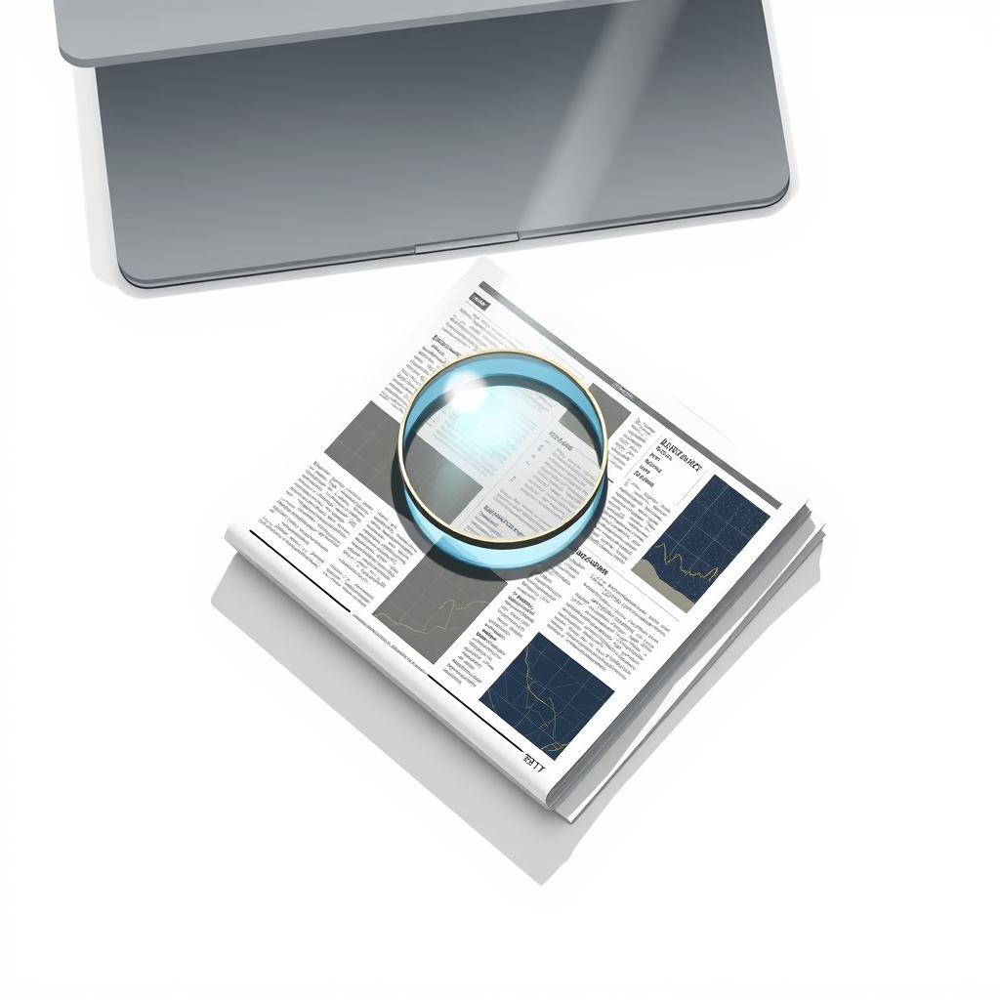

[Home](../index.md) > [Bot Chats](./index.md)  
# ✅🔎📰 Reliable News  
  
## [ChatGPT](https://chat.com) Prompt  
> I want to find or assemble a collection of the most accurate, most objective, least bias news sources. I want news sources that are considered reliable and trustworthy by people of all political and social backgrounds. How should I go about this and what candidate news sources would you suggest? Support your choices with arguments as to why these sources are so trustworthy.  
  
## Response  
To assemble a collection of highly reliable, accurate, and minimally biased news sources, it’s useful to start by establishing clear criteria. Look for outlets that:  
  
• **Adhere to rigorous editorial standards:** They have a long history of fact‐checking, correct errors transparently, and maintain strict ethical guidelines.    
• **Demonstrate editorial independence:** They are not overly influenced by political or commercial pressures, so their reporting isn’t tailored to a partisan agenda.    
• **Earn trust through consistency:** They’re widely used as wire services or cited by other reputable outlets, and have earned awards (like the Pulitzers) for their reporting.    
• **Are evaluated positively by independent tools:** Resources such as AllSides, Media Bias/Fact Check, and Ad Fontes Media can help you assess an outlet’s bias and factual reliability.  
  
Based on these criteria, here are several candidate sources:  
  
**1. Associated Press (AP):**    
• *Why it’s trustworthy:* AP is one of the world’s longest-running news agencies. Its reporters follow strict guidelines for accuracy and impartiality, and its wire service model focuses on reporting verified facts rather than opinion.    
• *Evidence:* AP’s neutrality and commitment to factual reporting make it a frequent source for other media outlets.  
  
**2. Reuters:**    
• *Why it’s trustworthy:* Reuters is globally respected for its fast, accurate, and balanced coverage. With stringent editorial controls and a policy against sensationalism, Reuters consistently delivers news that’s fact-checked and clear of overt bias.    
• *Evidence:* Its widespread use by newspapers and broadcasters around the world underscores its reputation as a reliable source.  
  
**3. BBC:**    
• *Why it’s trustworthy:* The BBC has a long tradition of comprehensive international coverage. Funded largely by the public through license fees, it is accountable to the public rather than commercial or political interests, though critics sometimes note perceived bias in specific contexts.    
• *Evidence:* Its commitment to impartiality and its robust fact-checking practices are key reasons many people worldwide trust it.  
  
**4. NPR (National Public Radio):**    
• *Why it’s trustworthy:* NPR is known for in-depth, thoughtful reporting and a commitment to thorough fact-checking. Even though some critics argue it leans left, its news segments generally focus on a fact-based, narrative style that emphasizes transparency and context.    
• *Evidence:* Its long-standing reputation and widespread citation in academic and media circles attest to its reliability.  
  
**5. PBS NewsHour:**    
• *Why it’s trustworthy:* With a focus on detailed, measured analysis and in-depth interviews, PBS NewsHour avoids sensationalism. It covers a broad range of topics in a calm, balanced manner that prioritizes accuracy over speed.    
• *Evidence:* Its programming is frequently recommended in media literacy guides as an example of careful, fact-based reporting.  
  
**6. The Economist:**    
• *Why it’s trustworthy:* Although it presents opinions and analysis, The Economist is renowned for its data-driven and well-researched approach to global affairs. Its articles are underpinned by strong fact-checking and a reputation for incisive, in-depth analysis.    
• *Evidence:* Its consistent track record in business and political reporting makes it a reliable source for understanding complex issues.  
  
**7. The Conversation:**    
• *Why it’s trustworthy:* Written by academics and subject-matter experts, articles on The Conversation are rigorously peer-reviewed and edited for clarity and factual accuracy. This model reduces the chance for sensationalism while providing context and detailed explanation.    
• *Evidence:* Its innovative approach has been praised for bringing expert insight to current events, making it a valuable complement to traditional news outlets.  
  
**How to Proceed:**    
– **Define Your Criteria:** Decide which elements (accuracy, impartiality, transparency, and accountability) are most important for your collection.    
– **Use External Evaluations:** Check resources like AllSides, Media Bias/Fact Check, and Ad Fontes Media to gauge each outlet’s performance on these criteria.    
– **Diversify Perspectives:** While the above sources are widely respected for their factual accuracy, consider including outlets from different regions or with slightly different focuses (e.g., The Economist for global analysis or The Conversation for academic insight) to ensure a balanced view.    
– **Monitor and Reassess:** Trust can evolve over time. Regularly review the performance of your chosen sources and be open to adding new outlets that meet your standards.  
  
This approach—using objective criteria, independent evaluations, and a commitment to multiple perspectives—will help you assemble a collection that can be trusted by people across the political and social spectrum.  
  
## 🦋 Bluesky    
<blockquote class="bluesky-embed" data-bluesky-uri="at://did:plc:i4yli6h7x2uoj7acxunww2fc/app.bsky.feed.post/3mjdqib6kdx2g" data-bluesky-cid="bafyreigy7h5ai77icsm7lwe6bfihohr6lhv2pmnw6aiezklcese2osszna">
✅🔎📰 Reliable News  
  
#AI Q: 📰 Which news source do you actually trust most?  
  
📰 News Literacy | 🔎 Fact Checking | 📊 Media Bias | 🌐 Objective Reporting  
https://bagrounds.org/bot-chats/reliable-news
&mdash; <a href="https://bsky.app/profile/did:plc:i4yli6h7x2uoj7acxunww2fc?ref_src=embed">Bryan Grounds (@bagrounds.bsky.social)</a> <a href="https://bsky.app/profile/did:plc:i4yli6h7x2uoj7acxunww2fc/post/3mjdqib6kdx2g?ref_src=embed">2026-04-13T01:43:35.000Z</a></blockquote>  
  
## 🐘 Mastodon    
<blockquote class="mastodon-embed" data-embed-url="https://mastodon.social/@bagrounds/116394859292962882/embed" style="background: #282c37; border-radius: 8px; border: 1px solid #393f4f; margin: 0; max-width: 540px; min-width: 270px; overflow: hidden; padding: 0;"> <a href="https://mastodon.social/@bagrounds/116394859292962882" target="_blank" style="align-items: center; color: #d9e1e8; display: flex; flex-direction: column; font-family: system-ui, -apple-system, BlinkMacSystemFont, 'Segoe UI', Oxygen, Ubuntu, Cantarell, 'Fira Sans', 'Droid Sans', 'Helvetica Neue', Roboto, sans-serif; font-size: 14px; justify-content: center; letter-spacing: 0.25px; line-height: 20px; padding: 24px; text-decoration: none;"> <svg xmlns="http://www.w3.org/2000/svg" xmlns:xlink="http://www.w3.org/1999/xlink" width="32" height="32" viewBox="0 0 79 75"><path d="M63 45.3v-20c0-4.1-1-7.3-3.2-9.7-2.1-2.4-5-3.7-8.5-3.7-4.1 0-7.2 1.6-9.3 4.7l-2 3.3-2-3.3c-2-3.1-5.1-4.7-9.2-4.7-3.5 0-6.4 1.3-8.6 3.7-2.1 2.4-3.1 5.6-3.1 9.7v20h8V25.9c0-4.1 1.7-6.2 5.2-6.2 3.8 0 5.8 2.5 5.8 7.4V37.7H44V27.1c0-4.9 1.9-7.4 5.8-7.4 3.5 0 5.2 2.1 5.2 6.2V45.3h8ZM74.7 16.6c.6 6 .1 15.7.1 17.3 0 .5-.1 4.8-.1 5.3-.7 11.5-8 16-15.6 17.5-.1 0-.2 0-.3 0-4.9 1-10 1.2-14.9 1.4-1.2 0-2.4 0-3.6 0-4.8 0-9.7-.6-14.4-1.7-.1 0-.1 0-.1 0s-.1 0-.1 0 0 .1 0 .1 0 0 0 0c.1 1.6.4 3.1 1 4.5.6 1.7 2.9 5.7 11.4 5.7 5 0 9.9-.6 14.8-1.7 0 0 0 0 0 0 .1 0 .1 0 .1 0 0 .1 0 .1 0 .1.1 0 .1 0 .1.1v5.6s0 .1-.1.1c0 0 0 0 0 .1-1.6 1.1-3.7 1.7-5.6 2.3-.8.3-1.6.5-2.4.7-7.5 1.7-15.4 1.3-22.7-1.2-6.8-2.4-13.8-8.2-15.5-15.2-.9-3.8-1.6-7.6-1.9-11.5-.6-5.8-.6-11.7-.8-17.5C3.9 24.5 4 20 4.9 16 6.7 7.9 14.1 2.2 22.3 1c1.4-.2 4.1-1 16.5-1h.1C51.4 0 56.7.8 58.1 1c8.4 1.2 15.5 7.5 16.6 15.6Z" fill="currentColor"/></svg> 
Post by @bagrounds@mastodon.social
 
View on Mastodon
 </a> </blockquote> 