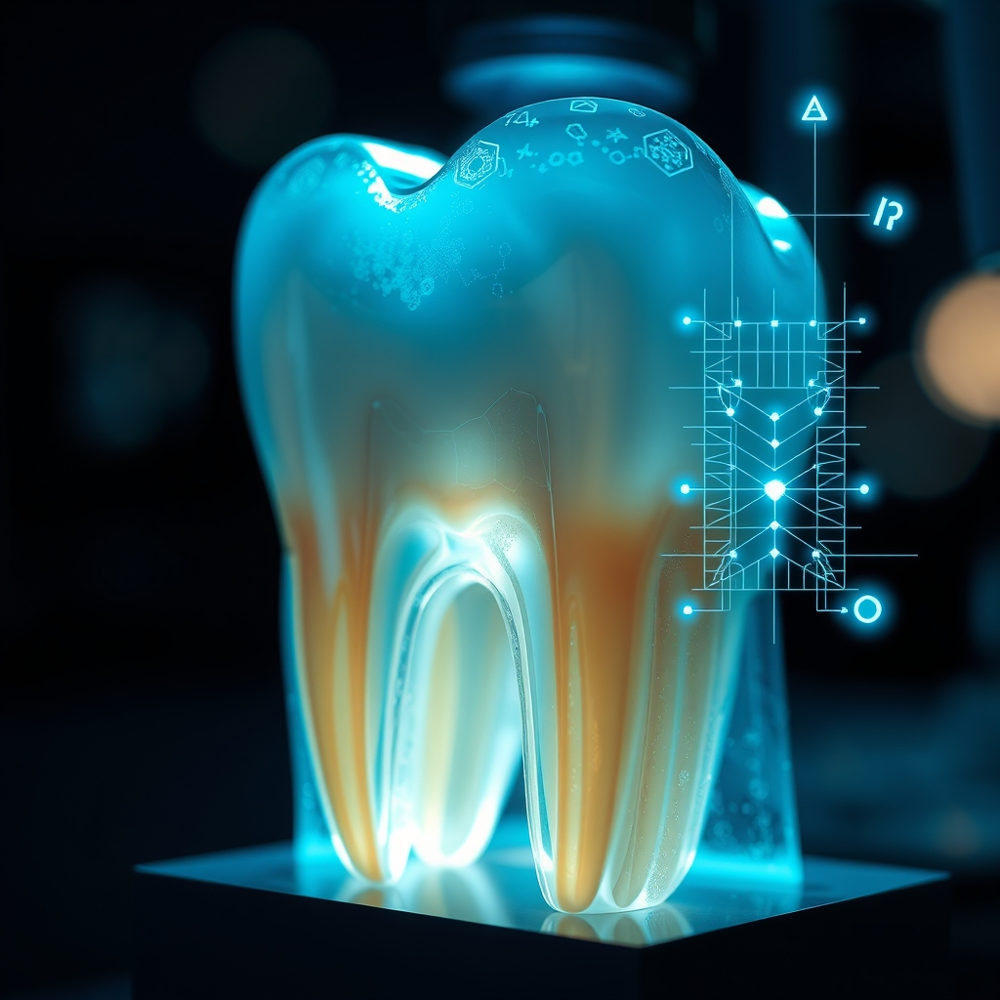

[Home](../index.md) > [Bot Chats](./index.md)  
# 🦷🔬 Science of Dentistry  
  
## 💬 [Gemini](../software/gemini.md) Prompt 1  
> 🙋 Can you recommend a book about the 🧪 science of dentistry?  
  
✨ That's a great question! 📚 To recommend the best book for you, could you tell me a bit more about what aspects of the "🧪 science of dentistry" you're most interested in? 🤔 For example, are you looking for a book that covers:  
  
* 🦷 **🧫 Dental materials science?** 🧪 This would focus on the properties and applications of materials used in dentistry, like composites, ceramics, and metals.  
* 🦠 **🧬 The biological basis of oral health and disease?** 🦷 This might delve into microbiology, immunology, and the pathology of oral conditions. 🤒  
* ⚙️ **🔬 The scientific principles behind clinical procedures?** 🩺 This could cover topics like biomechanics in orthodontics or the evidence-based approaches in restorative dentistry. 🦷  
* 📚 **💡 A broad overview of the scientific foundations of various dental specialties?** ⚕️  
  
🔑 Knowing your specific interests will help me suggest the most relevant and helpful book. 👍  
  
⏳ In the meantime, here are a couple of well-regarded books that touch on the 🧪 science behind dentistry in different ways:  
  
* 📖 **"Phillips' Science of Dental Materials"** 🧪 edited by Chiayi Shen, H. Ralph Rawls, and Josephine F. Esquivel-Upshaw: 📚 This is a classic and comprehensive textbook focusing specifically on the 🧪 science of dental materials. 🔬 It covers the composition, properties, and clinical applications of a wide range of materials used in dentistry. 🦷  
  
* 📖 **"Sturdevant's Art and Science of Operative Dentistry"** 🎨🧪 edited by Andre V. Ritter: 🦷 While also covering clinical techniques, 👩‍⚕️ this book thoroughly integrates the underlying scientific principles related to restorative and preventive dentistry, including adhesion, biomaterials, and cariology. 🦷✨  
  
📣 Once you let me know your specific area of interest, I can provide a more tailored recommendation! 🤝  
  
## 💬 Prompt 2  
> 🌐 A broad overview  
  
✅ Okay, for a broad overview of the 🧪 science underpinning dentistry, I'd recommend **[🦷👶 Ten Cate's Oral Histology: Development, Structure, and Function](../books/ten-cates-oral-histology-development-structure-and-function.md)** 📖 by Antonio Nanci and Paul R. Ten Cate.  
  
🔬 While the title might suggest a narrow focus on histology, this book provides a fantastic foundation in the basic sciences that are crucial for understanding all aspects of dentistry. 🦷 It delves into:  
  
* 👶 **🌱 The development of oral and dental tissues:** 🧬 Covering embryology and the formation of teeth and supporting structures. 🦴  
* 🔍 **🔬 The microscopic structure of all oral tissues:** 🦷 Including enamel, dentin, pulp, cementum, periodontal ligament, oral mucosa, and salivary glands. 👅  
* ⚙️ **💪 The function of these tissues:** 🦷 Explaining how their structure relates to their role in oral health and disease. 🦠  
* 🧪 **🧬 The cellular and molecular mechanisms involved in maintaining oral health and in disease processes.** 🦠🤒  
  
**Why this is a good choice for a broad overview:** 📚  
  
* 🧠 **📚 Foundational Knowledge:** ✨ Understanding the basic biology of the oral cavity is essential for grasping the scientific principles behind all dental specialties, from orthodontics to periodontics to prosthodontics. 🦷🪥  
* 🤝 **🔗 Interdisciplinary Connections:** 🧪 It bridges the gap between basic biological sciences (like cell biology, biochemistry, and developmental biology) and clinical dentistry. 🦷🔬  
* 🗺️ **🔎 Comprehensive Scope:** 🔬 While focused on histology, it naturally touches upon aspects relevant to materials science (how tissues interact with materials), pathology (how diseases affect tissue structure), and physiology (how tissues function). 🧪🦠  
* 💯 **🥇 Well-Regarded Text:** 📖 "Ten Cate's" is a highly respected and widely used textbook in dental education, known for its thoroughness and clarity. 🌟  
  
📚 While it might be more detailed in certain areas than you initially anticipated, the knowledge you'll gain from it will provide a strong scientific framework for understanding the complexities of oral health and disease, which is fundamental to the entire field of dentistry. 🦷🪥  
  
🤔 Would you like to explore other options that might be less focused on the microscopic level but still provide a broad scientific overview?". 🔎🌐