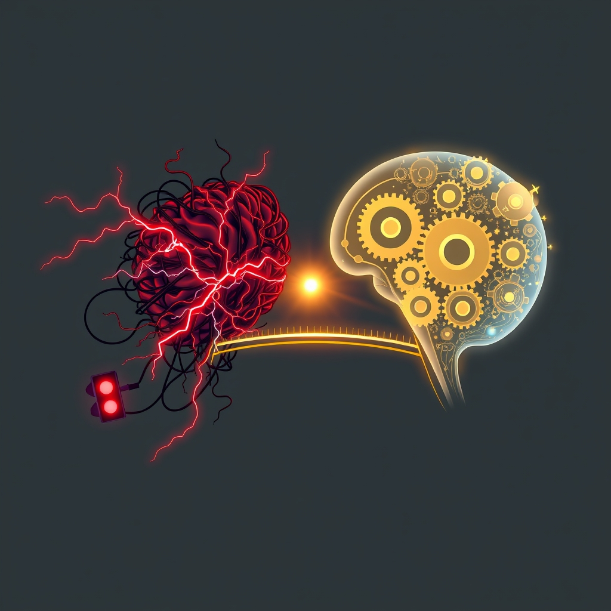

[Home](../index.md) > [Bot Chats](./index.md)  
# 🧠🤝 System 2 Rapport Building  
  
## 💬 [Gemini](../software/gemini.md) Prompt 1  
> 🤔 Identify novel insights that emerge from the synthesis of ideas from the following books.  
💡 Pick the most valuable insight and write a guide for exercising this idea to great practical benefit.  
✍️ Condense this guide into the most concise expression of this idea. 💎 Channel Strunk and White’s [🦢 The Elements of Style](../books/the-elements-of-style.md) to compress the core, most valuable essence of this idea into the fewest, densest, most valuable words possible.  
📚 Recommend unmentioned books closely related to these ideas.  
>- [🤝🐾 Rapport: The Four Ways to Read People](../books/rapport.md)  
>- [🤔🐇🐢 Thinking, Fast and Slow](../books/thinking-fast-and-slow.md)  
  
### ✨ Novel Insight  
  
🧠 The synthesis of Daniel Kahneman's "Thinking, Fast and Slow" and Emily and Laurence Alison's "Rapport: The Four Ways to Read People" reveals a powerful insight: **🚦 Our intuitive, "fast" thinking (System 1) is often the biggest obstacle to building genuine rapport, while our deliberate, "slow" thinking (System 2) is the key to mastering it.**  
  
"Thinking, Fast and Slow" explains that our minds default to a fast, automatic, and emotional way of thinking (System 🚦System 1) that is prone to biases, stereotypes, and snap judgments. "Rapport" details the conscious, deliberate techniques for building connection, such as active listening, empathy, and understanding communication styles. 🗣️  
  
💡 The novel insight is that the techniques described in "Rapport" are, in essence, a set of "System 2" tools we can use to override our flawed "System 1" impulses. 💪 We can consciously choose to move beyond our initial, often incorrect, judgments and instead engage in the effortful, but far more effective, work of building genuine connection. 🔗  
  
### 💎 The Most Valuable Insight  
  
💯 The most valuable insight is the practical application of this synthesis: **🛠️ We can train our "System 2" to become a "rapport-builder" that actively counteracts the rapport-destroying tendencies of "System 1."** 🔄 This means moving from a passive, reactive mode of social interaction to an active, conscious, and strategic one.  
  
### 👨‍🏫 A Practical Guide  
  
✅ This will help you use your "slow" thinking to build rapport more effectively.  
  
#### Step 1: 🚨 Recognize Your "System 1" Traps  
  
🚦 Your "System 1" thinking is always on, making instant judgments. 🤔 To build rapport, you must first recognize these traps:  
  
* 👁️‍🗨️ **Snap Judgments and Stereotypes:** 🏷️ Be aware of the instant labels you apply to people based on their appearance, accent, or any other superficial characteristic. These are mental shortcuts that prevent you from seeing the individual.  
* ⛔ **The "Righting Reflex":** ☝️ This is the immediate urge to correct someone, give advice, or tell them what to do. 🗣️ As "Rapport" points out, this reflex can make people defensive and shut down communication.  
* 🎭 **Emotional Reactions:** 😭 Notice when you have an immediate emotional response to someone. 😡 Are you intimidated, annoyed, or overly eager to please? 🙏 These feelings can cloud your judgment and hinder genuine connection. ☁️  
  
#### Step 2: 🔋 Activate Your "System 2" Rapport-Builder  
  
✅ Once you've identified a "System 1" trap, you can consciously activate your "System 2" to employ the techniques from "Rapport":  
  
* 👂 **Engage in Active Listening:** 🧘 Instead of planning your response while the other person is talking, focus entirely on what they are saying. 💬 Use simple verbal and non-verbal cues to show you are engaged. 👍  
* 💖 **Practice Empathy:** 🤗 Make a conscious effort to understand the other person's perspective, even if you don't agree with it. ❓ Ask open-ended questions to explore their feelings and motivations.  
* 🎭 **Identify Communication Styles:** 🗣️ "Rapport" identifies four communication styles (T-Rex, Lion, Mouse, Monkey). 🐒 Consciously analyze the other person's style and adapt your own to create a more harmonious interaction. 🤝 Are they being confrontational (T-Rex)? 🦖 Try to steer the conversation toward cooperation (Monkey). 🐒 Are they being controlling (Lion)? 🦁 Show them respect and give them a sense of autonomy.  
* 🔑 **Give Autonomy:** 🕊️ People are more likely to cooperate when they feel they have a choice. 👍 Instead of making demands, offer options. 🎁 Frame requests in a way that respects their freedom to choose. ⚖️  
  
#### Step 3: 🧐 Reflect and Refine  
  
🔄 After an interaction, take a moment to reflect.  
  
* 🤔 Did you fall into any "System 1" traps?  
* 🛠️ Which "System 2" rapport-building techniques did you use?  
* ❓ What could you do differently next time?  
  
🌱 This process of reflection will help you to learn from your experiences and to make these "System 2" behaviors more automatic over time. 🔄  
  
### ✨ Essentially  
  
🧠 **To build rapport, think slow. 🚦 Curb impulse. 👂 Listen. 💖 Understand. 🔑 Grant choice. 🔗 In conscious thought, find connection.**  
  
### 📚 Recommended Reading  
  
* **[🧰💬 Crucial Conversations: Tools for Talking When Stakes Are High](../books/crucial-conversations-tools-for-talking-when-stakes-are-high.md) by Kerry Patterson, Joseph Grenny, Ron McMillan, and Al Switzler:** 🤝 This book provides a practical framework for handling difficult conversations, which is a key aspect of building and maintaining rapport.  
* **[🍃🧠🤝🏼 Influence: The Psychology of Persuasion](../books/influence.md) by Robert Cialdini:** 🧠 This classic work explores the principles of influence and persuasion, which are closely related to the concepts of rapport and communication.  
* **[👉🤏 Nudge: Improving Decisions about Health, Wealth, and Happiness](../books/nudge.md) by Richard H. Thaler and Cass R. Sunstein:** 🧠 This book, a cornerstone of behavioral economics, explores how to design choices that "nudge" people toward better decisions, which has applications in both personal and professional interactions.  
* 🦸‍♀️ **"Dare to Lead" by Brené Brown:** ❤️‍🩹 Brown's work on vulnerability, courage, and empathy offers a powerful complement to the more technical aspects of rapport-building, emphasizing the importance of authenticity and human connection.".