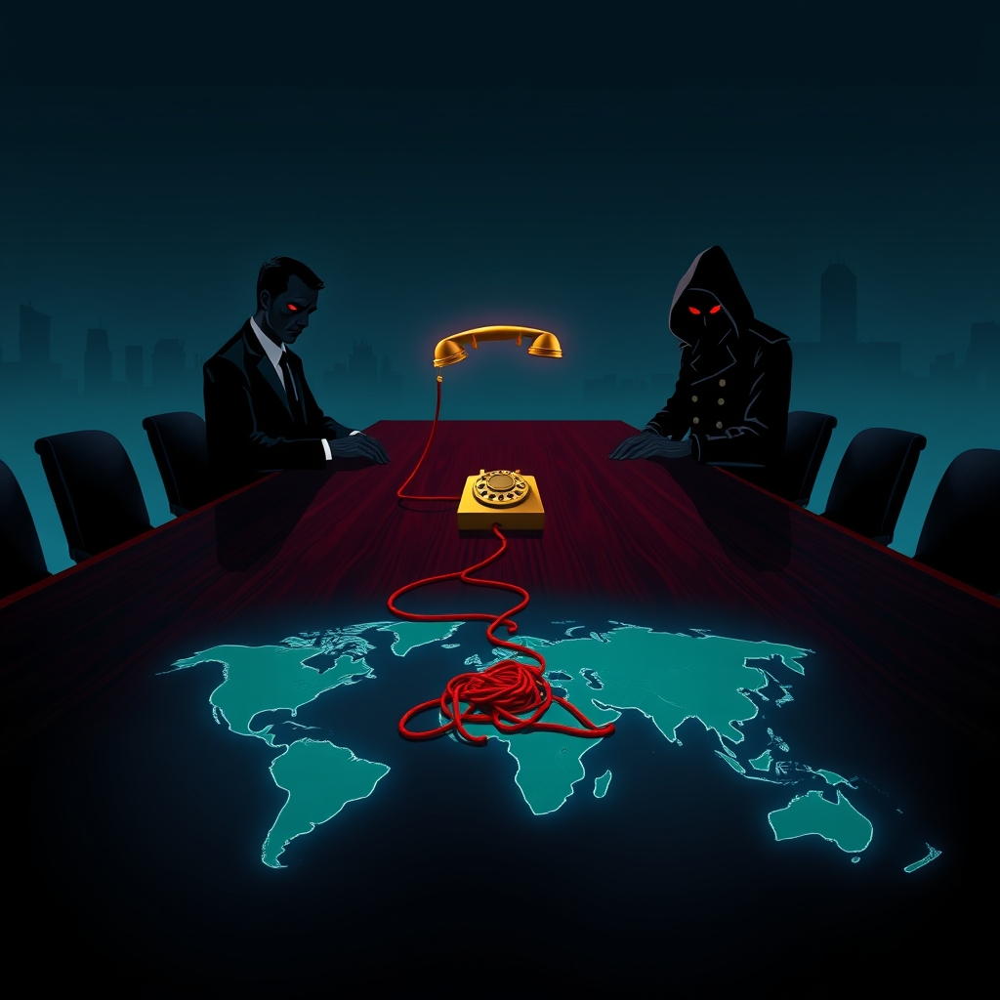

[Home](../index.md) > [Bot Chats](./index.md)  
# 🇺🇸👹🤝🏻👹🇷🇺 Trump and Putin  
  
## 💬 [Gemini](../software/gemini.md) Prompt (Deep Research)  
> Write a thorough historical and contemporary analysis of the ties between Trump and Putin. Cite books, high quality journalism, and reliable government reports on the topic.  
  
## 🤝 The Evolving Nexus: A Historical and Contemporary Analysis of Ties Between Donald Trump and Vladimir Putin  
### 📝 I. Executive Summary  
The relationship between Donald Trump and Vladimir Putin represents a complex and multifaceted dynamic that has significantly influenced global geopolitics over several decades. 📊 This report provides a thorough analysis of their ties, tracing its origins from Trump's early business 🏢 ventures in the Soviet Union and Russia, through the contentious period of the 2016 U.S. presidential 🗳️ election and subsequent investigations, and into the contemporary second presidency, particularly in the context of the ongoing Russia-Ukraine ⚔️ war. The consistent pursuit of perceived personal or national 💰 gain has consistently driven engagement between the two leaders, albeit with shifting public 🗣️ rhetoric and evolving dynamics, particularly as Trump navigates his second term.  
🤔 A central observation from this extensive history is the enduring nature of the Trump-Putin relationship. 🔄 Despite its public fluctuations and the controversies it has engendered, the persistence of interactions suggests a deeper, underlying transactional approach by both leaders. This continuity, even amidst significant political upheaval and shifting international landscapes, indicates that the relationship is not merely episodic but rooted in a consistent, albeit adaptable, strategic calculus for both individuals. 😠 For instance, Trump's recent expressions of frustration with Putin over the Ukraine conflict do not signify a fundamental rejection of the relationship itself, but rather a reaction to Putin's perceived failure to deliver on Trump's stated goal of a swift "peace 🕊️ deal," thereby underscoring the deeply transactional core of their engagement.  
  
### 🌍 II. Introduction: Setting the Stage  
The post-Cold War era has seen U.S.-Russia relations oscillate between periods of cooperation and intense rivalry. 📈 Within this volatile landscape, the ties between Donald Trump and Vladimir Putin have emerged as a singularly contentious and scrutinized aspect, shaping international perceptions and domestic political discourse. 🔗 This report defines "ties" broadly, encompassing a spectrum of connections: business ventures and financial dealings, direct and indirect political interactions, the cultivation of personal rapport, and serious allegations of intelligence 🕵️‍♂️ connections and foreign influence.  
🚨 The intense public and governmental scrutiny directed at the Trump-Putin relationship highlights a fundamental concern within Western democracies regarding the integrity of electoral processes and the potential for foreign influence at the highest levels of government. This relationship has become a focal point for broader debates on national security 🛡️, the autonomy of foreign policy, and the very nature of modern geopolitical competition. 🧐 The sheer volume of investigations, including the Special Counsel probe, Senate Intelligence Committee inquiries, and numerous journalistic examinations, underscores the perceived gravity of these connections. 🤫 Furthermore, documented attempts to obscure contacts and controversies surrounding the handling of classified information suggest that these ties were not merely routine diplomatic engagements but carried significant political and security implications, contributing to a profound erosion of public trust in governmental institutions.  
  
### ⏳ III. Formative Years: Business Ambitions and Early Contacts (Pre-2016)  
💰 Donald Trump's engagement with Russia long predates his political career, marked by a consistent and ambitious pursuit of business opportunities within the country. 🇷🇺 This decades-long interest established a foundational context for his later political interactions with Vladimir Putin.  
  
#### 🇷🇺 Early Soviet/Russian Engagements  
🤝 Trump's initial foray into the Soviet Union began in 1986, when he met Yuri Dubinin, the Soviet Ambassador to the United States, at a New York event. 🏢 This meeting was part of a determined effort by the Soviet government to establish contact with America's business elite, with Dubinin's daughters indicating it was a deliberate assignment. 👨‍💼 Following this, Trump met with visiting Soviet leader Mikhail Gorbachev in Washington in 1987. ✈️ His first trip to the Soviet Union occurred in July 1987 with his then-wife Ivana, where they explored potential hotel sites for a possible joint-venture with Intourist, the Soviet government's tourism agency. ✍️ This visit, documented in Trump's The Art of the Deal, was reportedly arranged by the "top level of the Soviet diplomatic service" with KGB assistance, as spy chief Vladimir Kryuchkov sought to recruit more Americans. 🗣️ Trump noted his impression of Soviet officials' ambition to make a deal.  
🇷🇺 His interest continued after the collapse of the Soviet Union. 🌆 In 1996, Trump traveled to Moscow again, proposing a luxury residential complex on a property owned by a U.S. tobacco company and publicly praising the city's potential. 📝 That same year, he began seeking trademarks in Russia for company names, including "Trump Tower," with at least eight applications filed between 1996 and 2008. 🏢 In 1997, Trump hosted retired Russian general and presidential aspirant Alexander Lebed at Trump Tower in New York.  
  
#### 🏢 Persistent Moscow Ventures  
⭐ The aspiration for a "Trump Tower Moscow" was a recurring theme throughout these years, first envisioned during his 1987 visit and mentioned in The Art of the Deal. 🤝 Efforts to realize this vision continued in 1996, when Trump partnered with Liggett-Ducat, a small company, to plan an upscale residential development in Moscow. ✍️ In 2005, the Trump Organization signed a one-year contract with the Bayrock Group, a real estate firm co-founded by Tevfik Arif, a former Soviet commerce official, and Felix Sater, a Russian-born businessman with reported mob connections. 📍 A site was chosen for a Trump Tower in Moscow, with a stipulation that any spas or fitness areas be branded "The Spa by Ivanka Trump". ⛔ Although this particular proposal did not proceed, Sater maintained a relationship with Trump. 📝 Trump's company continued to apply for numerous trademarks in Russia between 2006 and 2008, including "Trump," "Trump Tower," and "Trump International Hotel and Tower," with the goal of real estate developments. 🏙️ Despite these persistent attempts spanning decades, no Trump-branded skyscraper was ever built in Moscow.  
  
#### 💸 Financial Flows and Oligarch Connections  
🔗 Beyond direct development projects, financial connections between Trump's businesses and Russian money became apparent. 💰 In 1984, Russian mobster David Bogatin purchased five condominiums in Trump Tower for $6 million; these units were later seized by the government on claims they were used to launder money for the Russian mafia. 👥 Bogatin was also an associate of Semion Mogilevich, a major Russian mafia boss. 🏘️ A significant transaction occurred in July 2008, when Trump sold the Palm Beach estate Maison de L'Amitie to Russian oligarch Dmitry Rybolovlev for a record $95 million, a substantial profit over the $41.35 million Trump paid for it three years earlier with only minor improvements. 🗣️ Donald Trump Jr., then an executive vice president of The Trump Organization, publicly stated in September 2008 that "Russians make up a pretty disproportionate cross-section of a lot of our assets, say, in Dubai, and certainly with our project in SoHo and anywhere in New York. 🏦 We see a lot of money pouring in from Russia". 🏨 In 2010, the Trump International Hotel and Tower in Toronto received timely financing from Vnesheconombank (VEB), a Russian state-run investment bank.  
  
#### 🕵️ Allegations of Cultivation  
📜 Claims have emerged from ex-KGB officials, notably Yuri Shvets, and are detailed in books such as Luke Harding's Collusion and Craig Unger's [🇷🇺🪝🇺🇸 American Kompromat: How the KGB Cultivated Donald Trump, and Other Tales of Sex, Greed, Power, and Treachery](../books/american-kompromat-how-the-kgb-cultivated-donald-trump-and-other-tales-of-sex-greed-power-and-treachery.md), alleging that Trump was cultivated and potentially recruited by the KGB as early as 1977-1987. 🇷🇺 These claims suggest a deliberate Soviet effort to establish contact with America's business elite, with Trump identified as a potential asset. 🎭 Such narratives posit that Russian intelligence sought to compromise and promote Trump to a position of influence over many years.  
  
#### 👑 The Miss Universe 2013 Event  
🏆 Trump's fourth trip to Moscow in November 2013 was for the Miss Universe pageant, an event he co-owned with NBC. 🗣️ Prior to the trip, he publicly expressed a desire to meet Vladimir Putin, tweeting in June 2013, "Do you think Putin will be going to The Miss Universe Pageant in November in Moscow — if so, will he become my new best friend?". ✉️ While Putin did not attend the pageant, Trump received a private message from the Kremlin, delivered by Aras Agalarov, an oligarch close to Putin and Trump's partner in hosting the event. 🗣️ Trump later claimed to MSNBC that he had a "relationship" with Putin and that he could tell reporters "he's very interested in what we're doing here today". 🗣️ He also stated in a 2014 speech that he "spoke indirectly and directly with President Putin who could not have been nicer". 🕵️ This event was seen by Miss Universe staffers as an open secret that Trump's true agenda was to scout new business opportunities in Moscow. 🌆 Following the trip, Trump tweeted, "Moscow is a very interesting and amazing place" and that "TRUMP TOWER-MOSCOW is next". ✍️ Indeed, this visit revitalized the Trump Tower Moscow project, with a letter of intent reportedly signed in October 2015.  
💰 The decades-long pursuit of business in Russia, marked by repeated failures but persistent attempts, demonstrates a deep-seated financial and branding ambition that made Trump uniquely receptive to Russian overtures. ⏱️ This was not a sudden interest but a sustained, opportunistic engagement. 🏢 The consistent pattern of investing time and effort in the Russian market, despite projects failing to materialize, indicates that a "Trump Tower Moscow" or similar ventures were significant business objectives. 🤔 This persistence potentially made him more susceptible to influence or eager for a breakthrough, regardless of the backgrounds of his partners, such as Felix Sater's reported mob connections or David Bogatin's mafia ties. 👑 The Miss Universe event specifically served as a strategic platform to reignite these ambitions.  
🕵️ The alleged cultivation by the KGB and the subsequent financial dealings with Russian individuals, including those linked to organized crime and state-run banks, created a complex web of connections that could be perceived as potential leverage or "kompromat," even if not explicitly proven. 📚 Books like Unger's American Kompromat and Harding's Collusion directly address the "cultivation" narrative, positing a long-term strategy by Russian intelligence. 💸 The documented financial ties, such as the sale of the Palm Beach estate for an inflated price and the financing from a Russian state-run bank, provide a factual basis for questions about the nature of these financial relationships and their potential implications for influence.  
🔑 This pre-2016 period establishes a critical foundation for understanding the later controversies. 🗣️ Trump's public praise for Putin during this time and his continued pursuit of Russian business deals, even as he considered a presidential run, indicate a consistent worldview that prioritized personal and business interests, potentially overlooking geopolitical risks or ethical considerations. 💬 His tweet about Putin becoming his "new best friend" and his public statements about having a "relationship" with Putin reveal a personal admiration or strategic flattery that would carry significant weight once he became a presidential candidate. 🤝 This early rapport, combined with the persistent business interests, set a distinctive tone for his approach to Russia, contrasting sharply with traditional U.S. foreign policy.  
  
#### 🗓️ Table 1: 🇷🇺 Chronology of Key Pre-2016 Interactions and Business Ventures  
| Year | Event/Interaction | Key Individuals Involved | Nature of Tie | Source |  
|---|---|---|---|---|  
| 1984 | 💰 Russian mobster David Bogatin buys 5 🏢 Trump Tower condos for $6M (later seized for 💸 money laundering) | David Bogatin | 💼 Business | [Trump's Dirty Money (Foreign Policy in Focus)](https://fpif.org/trumps-dirty-money/), [Salon: Trump's deep links to organized crime (Mike Quigley)](https://quigley.house.gov/media-center/news-article/salon-trump-s-deep-links-organized-crime-federal-investigators-know-and) |  
| 1986 | 🤝 Trump meets 🇷🇺 Soviet Ambassador Yuri Dubinin; Dubinin invites Trump to 🇷🇺 Moscow | Donald Trump, Yuri Dubinin | 🏛️ Political/💼 Business | [Confused by Trump's Russia Ties? This timeline breaks it down for you (Medium)](https://medium.com/@abbievansickle/timeline-of-trumps-relationship-to-russia-5e78c7e7f480) |  
| 1987 | 🤝 Trump meets 🇷🇺 Soviet leader Mikhail Gorbachev | Donald Trump, Mikhail Gorbachev | 🏛️ Political | [When Donald Trump Tried to Meet With a Russian Leader in the 1980s (Time Magazine)](https://time.com/4437403/trump-gorbachev-history/) |  
| 1987 | ✈️ First trip to 🇷🇺 Soviet Union with Ivana; scouts 🏨 hotel sites for Intourist joint-venture | Donald Trump, Ivana Trump, Intourist | 💼 Business | [Russian Interference: Recruiting Donald Trump – the Early Years (Byline Times)](https://bylinetimes.com/2019/11/13/russian-interference-recruiting-donald-trump-the-early-years/) |  
| 1996 | ✈️ Second trip to 🇷🇺 Russia; proposes 럭셔리 luxury residential complex; praises 🇷🇺 Moscow | Donald Trump | 💼 Business | [Business projects of Donald Trump in Russia (Wikipedia)](https://en.wikipedia.org/wiki/Business_projects_of_Donald_Trump_in_Russia) |  
| 1996 | 📝 Trump applies for 🇷🇺 Russian trademarks (e.g., 🏢 Trump Tower) | Donald Trump | 💼 Business | [Business projects of Donald Trump in Russia (Wikiwand)](https://www.wikiwand.com/en/map/Business_projects_of_Donald_Trump_in_Russia) |  
| 1997 | 🥂 Trump hosts retired 🇷🇺 Russian general Alexander Lebed at 🏢 Trump Tower | Donald Trump, Alexander Lebed | 🏛️ Political/🧑‍💼 Personal | [Business projects of Donald Trump in Russia (Wikipedia)](https://en.wikipedia.org/wiki/Business_projects_of_Donald_Trump_in_Russia) |  
| 2005 | ✍️ Trump Organization signs exclusive deal with Bayrock Group to build Trump-branded property in 🇷🇺 Moscow; Felix Sater involved | Donald Trump, Tevfik Arif, Felix Sater | 💼 Business | [Business projects of Donald Trump in Russia (Wikipedia)](https://en.wikipedia.org/wiki/Business_projects_of_Donald_Trump_in_Russia) |  
| 2006 | ✈️ Ivanka Trump and Donald Trump Jr. travel to 🇷🇺 Moscow with Felix Sater; Ivanka sits in 💺 Putin's office chair | Ivanka Trump, Donald Trump Jr., Felix Sater | 💼 Business/🧑‍💼 Personal | [Ivanka Trump Sat in Vladimir Putin's Chair and Spun Around When at Kremlin (Newsweek)](https://www.newsweek.com/ivanka-putin-chair-spun-kremlin-931754) |  
| 2007 | ✈️ Third trip to 🇷🇺 Russia; promotes "Trump Super Premium 🍸 Vodka 24K" at Millionaire Fair | Donald Trump | 💼 Business | [Trump's Russia Ties: A Chronology (Medium)](https://medium.com/@Inside/trumps-russia-ties-a-chronology-9553583a4cd6) |  
| 2008 | 🗣️ Donald Trump Jr. states "Russians make up a pretty disproportionate cross-section of a lot of our assets" | Donald Trump Jr. | 💼 Business | [Yes, there is evidence Trump does business with Russians (POLITICO)](https://www.politico.com/blogs/2016-presidential-debate-fact-check/2016/10/contrary-to-his-claims-there-is-evidence-that-trump-does-business-with-russians-229484) |  
| 2008 | 🏘️ Trump sells 🌴 Palm Beach estate to 🇷🇺 Russian oligarch Dmitry Rybolovlev for $95M | Donald Trump, Dmitry Rybolovlev | 💼 Business | ["Russian mogul pays Trump $95 million for mansion" (Corcoran)](https://www.corcoran.com/nyc/press-mention/display/7404) |  
| 2010 | 🏨 Trump International Hotel and Tower in 🇨🇦 Toronto receives 🏦 financing from 🇷🇺 Russian state-run Vnesheconombank (VEB) | Trump Organization, VEB | 💼 Business | [Russian State-Run Bank Financed Deal To Help Trump Tower Project In Toronto (Bisnow)](https://www.bisnow.com/national/news/hotel/russian-state-run-bank-veb-financed-deal-to-help-trump-tower-project-in-toronto-74583?utm_source=MorningBrief&utm_medium=email&utm_campaign=20170525_hotel_morningbrief&be=%7B%7Bemail%7D%7D) |  
| 2013 | ✈️ Fourth trip to 🇷🇺 Moscow for 👑 Miss Universe pageant; Trump tweets "🏢 TRUMP TOWER-MOSCOW is next" | Donald Trump, Aras Agalarov | 💼 Business/🧑‍💼 Personal | [Flight logs suggest Trump's 'pee tape' alibi is a lie (ThinkProgress)](https://archive.thinkprogress.org/trump-moscow-flight-logs-steele-dossier-5ebdcd9fe1ad/) |  
| 2013-2015 | 💬 Trump states "I do have a relationship with" 🇷🇺 Putin, "I met him once", and "I spoke indirectly and directly with President 🇷🇺 Putin, who could not have been nicer." | Donald Trump, Vladimir Putin | 🧑‍💼 Personal/🏛️ Political | [Russia: Trump & His Team's Ties (Eric Swalwell - House.gov)](https://swalwell.house.gov/issues/russia-trump-his-administration-s-ties) |  
| Oct 2015 | ✍️ Trump signs Letter of Intent for 🏢 Trump World Tower 🇷🇺 Moscow project | Donald Trump, Andrey Rozov | 💼 Business | [Signed LOI Trump Moscow (CNN)](https://i2.cdn.turner.com/cnn/2017/images/09/08/trumpletterofintent.pdf) |  
  
### 🗳️ IV. The 2016 Election: Interference and Campaign Contacts  
🇺🇸 The 2016 U.S. presidential election marked a critical juncture, as confirmed 🇷🇺 Russian interference efforts intersected with extensive, often undisclosed, contacts between the 🤝 Trump campaign and individuals linked to Russia. 🕵️ This period became the subject of major governmental investigations and enduring controversy.  
  
#### 🇷🇺🕵️ Russian Interference Operations  
🇺🇸📣 The U.S. intelligence community reached a consensus that the Russian government conducted foreign electoral interference in 2016, an operation personally ordered by 👑 Vladimir Putin. 🎯 The primary objectives were to sabotage 💔 Hillary Clinton's campaign, boost 🚀 Donald Trump's presidential bid, and sow political and social ⚔️ discord within the United States. 🎭 This multifaceted operation, codenamed "Project Lakhta," involved several key components. 👨‍💻 The Internet Research Agency (IRA), a Saint Petersburg-based "troll farm," created thousands of social media accounts masquerading as Americans to spread 📢 disinformation, support 🚀 Trump, and attack 💔 Clinton. 💻 Concurrently, computer hackers affiliated with the Russian military intelligence service (GRU) infiltrated the information systems of the Democratic National Committee (DNC), the Democratic Congressional Campaign Committee (DCCC), and Clinton campaign officials, most notably chairman John Podesta. 📂 The stolen information was then publicly released, primarily through 🌐 WikiLeaks.  
  
#### 🤝🇷🇺 Campaign-Russia Contacts  
🤝🇷🇺 Numerous individuals associated with the Trump campaign engaged in contacts with Russian nationals and intermediaries, with documented figures reaching at least 💯40 by April 2019, and 💯272 contacts identified by The Moscow Project. 🔍 These interactions became a central focus of subsequent investigations.  
 * 💰 Paul Manafort: As Trump's campaign chairman from March to August 2016, Manafort had repeated contacts with senior Russian intelligence officials. 📞 Intercepted communications indicated that Russian officials believed they could leverage Manafort to influence 🚀 Trump. 🛑 Manafort's resignation was prompted by questions surrounding his prior pro-Russian business dealings in 🇺🇦 Ukraine. 📜 The Republican-led Senate Intelligence Committee later described Manafort's relationship with Konstantin Kilimnik, whom the committee identified as a Russian intelligence officer, as a "grave counterintelligence threat" due to Manafort's high-level access and willingness to share information.  
 * ✈️ Michael Flynn: Trump's future National Security Advisor, accepted a 💵$45,000 payment from Russia Today (RT), a Kremlin-supported television channel, for a talk in Moscow in December 2015, where he was seated next to 👑 Putin. 🤥 Flynn later misled Vice President Mike Pence about his discussions with Russian Ambassador Sergey Kislyak regarding Obama-era sanctions, leading to his resignation.  
 * 🤫 Jeff Sessions: During his confirmation hearings for Attorney General, Sessions denied having communications with Russians, despite having had two undisclosed conversations with Ambassador Kislyak during the 2016 campaign. 🚫 Upon the surfacing of these meetings, Sessions recused himself from any investigations into Russia's election interference.  
 * 🌍 Carter Page: A foreign policy adviser to the Trump campaign, traveled to Moscow in July 2016, where he reportedly met with Putin confidants Igor Sechin and Igor Diveykin. 🕵️‍♂️ The FBI had opened a counterintelligence investigation into Page in April 2016, based on his contacts with suspected Russian intelligence officers.  
 * 🏢 Donald Trump Jr.: In June 2016, Trump Jr., along with Paul Manafort and Jared Kushner, met with Russian lawyer Natalia Veselnitskaya at Trump Tower. 🤝 This meeting occurred after Trump Jr. was promised damaging information on 💔 Hillary Clinton, explicitly framed as part of "Russia and its government's support for Mr. Trump". 📜 The Senate panel found Veselnitskaya to have "significant connections to the Russian government, including the Russian intelligence services," as did another participant, Rinat Akhmetshin, whose connections were "far more extensive and concerning than what had been publicly known".  
 * 👨‍💼 Michael Cohen: Trump's personal lawyer, continued to pursue the Trump Tower Moscow project through June 2016, even speaking directly with a representative of the Kremlin press office regarding the development. 🤥 Cohen later pleaded guilty to lying to Congress about the project's timeline. 🏢 Felix Sater, involved in the project, discussed the possibility of giving a 💰$50 million penthouse in the tower to Vladimir Putin, believing Putin's residence there would significantly increase the value and saleability of other units. 📰 The proposal was reportedly dropped in June 2016 due to news reports emerging about the Russian hacking of the Democratic National Committee, making a Russian business connection a political liability.  
  
#### 🗣️ Trump's Public Stance on Interference  
🗣️ Donald Trump's public statements regarding 👑 Vladimir Putin and Russian election interference displayed considerable inconsistency. 🔄 Between 2013 and 2015, he publicly claimed to have a "relationship" with Putin, stating he had "met him once" and spoken "indirectly and directly" with him. 🤔 However, during a July 2016 press conference, he asserted, "I never met Putin, I don't know who Putin is. Never spoken to him," and in a subsequent interview, "I have no relationship with him". ❓ Throughout the campaign, he frequently expressed skepticism about Russian involvement in the hacking, suggesting it "could be Russia, but it could also be China. It could also be some guy in his home in New Jersey". 📢 Notably, in July 2016, he publicly urged Russia to hack Hillary Clinton's emails, stating, "Russia, if you're listening, I hope you're able to find the 30,000 emails that are missing".  
🤥 The contradiction and deception evident in Trump's shifting public statements about his relationship with Putin and his knowledge of Russian interference stand in stark contrast to the documented contacts of his campaign and his administration's later acknowledgements. 🎭 This suggests a deliberate attempt to mislead the public and investigators, likely due to the significant political liability associated with these ties. 🗓️ His denial of knowing Putin in July 2016 directly contradicts his earlier public claims of a "relationship" and direct communication. 🤝 The extensive number of contacts between Trump's team and Russia-linked operatives, coupled with efforts to conceal them, further highlights a pattern of concealment, indicating an awareness that these connections were problematic and politically damaging.  
  
#### 🔎 The Mueller Investigation Findings  
🕵️‍♂️ The Special Counsel investigation, led by Robert Mueller from May 2017 to March 2019, focused on three primary areas: Russian interference in the 2016 elections, connections between Trump associates and Russian officials, and possible obstruction of justice by Trump and his associates.  
 * 🇷🇺 Interference: 📜 The Mueller report concluded unequivocally that the Russian government interfered in the 2016 presidential election by bolstering Trump's candidacy and attacking Clinton's. 📱 This involved the Internet Research Agency's social media campaign and Russian intelligence hacking and releasing damaging material from the Clinton campaign and Democratic Party organizations.  
 * 🤝 Conspiracy/Coordination: 📜 The investigation "did not establish that members of the Trump campaign conspired or coordinated with the Russian government in its election interference activities". 🤝 However, the report "identified numerous links between the Russian government and the Trump campaign" and determined that the Trump campaign "expected it would benefit electorally" from Russian hacking efforts. ⚠️ This finding highlights a crucial nuance: while direct, criminal conspiracy was not proven, the campaign was aware of and receptive to the benefits of Russian interference. 🤫 This implies a passive or opportunistic acceptance of foreign aid rather than active collaboration, but still represents a significant ethical and national security concern.  
 * ⚖️ Obstruction of Justice: ❓ On the question of obstruction of justice by Trump, the investigation "does not conclude that the President committed a crime" but explicitly states that it "does not exonerate him". 👮‍♀️ The report identified public and private actions by the President that were "capable of exerting undue influence over law enforcement investigations". 👨‍⚖️ Mueller later stated that the Constitution requires a process other than the criminal justice system to formally accuse a sitting president of wrongdoing, implying that a president could be charged with obstruction of justice after leaving office.  
  
#### 🏛️ Congressional Investigations  
🏛️ Beyond the Special Counsel, congressional committees also conducted extensive probes. 📜 The Republican-led Senate Intelligence Committee's five-volume, nearly 1,000-page report, the culmination of a bipartisan investigation, confirmed Russian interference and found that the Trump campaign's interactions with Russian intelligence services posed a "grave counterintelligence threat". ✉️ The report detailed how Trump associates had regular contact with Russians and expected to benefit from their aid, particularly by maximizing the impact of hacked Democratic emails. 📢 Democrats on the committee stated that the report "unambiguously shows that members of the Trump campaign cooperated with Russian efforts to get Trump elected".  
  
#### 📁 The Steele Dossier  
📁 The Steele dossier, also known as the Trump–Russia dossier, is a controversial political opposition research report compiled by former British intelligence officer Christopher Steele. 🤝 It alleged a "well-developed conspiracy" and "cooperation" between Trump campaign members and Russian operatives to aid Russia's election interference efforts and damage 💔 Hillary Clinton's candidacy. ✅ While some allegations in the dossier were publicly corroborated by U.S. intelligence agencies (e.g., the Russian government working to get Trump elected, efforts to cultivate people in Trump's orbit), ⚠️ the dossier itself was treated with caution due to its unverified allegations and has been described as "discredited" by some mainstream sources. 🤡 It became a significant factor in "conspiracy theories promoted by Trump and his supporters," who used terms like "Russia hoax" or "Russiagate hoax" to delegitimize accusations and investigations.  
🔍 The crucial distinction between "contacts" and "conspiracy/coordination" is paramount in understanding the findings of these investigations. 🤝 While the Mueller Report found no criminal conspiracy, it unequivocally established widespread Russian interference and numerous links, noting the campaign's expectation to benefit. 🤫 This means that while direct, criminal collusion was not proven, the campaign was aware of and receptive to the benefits of Russian interference, creating a situation that, for many, amounted to a significant ethical and national security concern. ⚠️ The Senate Intelligence Committee's finding of a "grave counterintelligence threat" further emphasizes the severity of the interactions, even without a criminal charge.  
🏢 The timing of the Trump Tower Moscow project's continuation through June 2016 and Michael Cohen's subsequent admission of lying about it suggests that Trump's business interests in Russia were active even during his presidential campaign, potentially influencing his stance on Russia and creating vulnerabilities. 📰 The project was reportedly halted in June 2016 due to news of the DNC hacking, indicating an awareness of the political liability associated with Russian business connections. 💸 This direct overlap between active business pursuits and the emergence of Russian interference allegations highlights how personal financial ambitions could become intertwined with national security concerns.  
🌐 The 2016 election demonstrated how foreign adversaries can exploit existing political divisions and individual ambitions to undermine democratic processes, even without explicit "conspiracy." 📜 The investigations, while contentious, highlighted significant gaps in U.S. counterintelligence and campaign finance regulations. 📱 The findings of widespread social media disinformation and hacking illustrate the new frontier of electoral interference. 🔢 The sheer number of contacts and the subsequent legal actions against individuals like Manafort and Flynn reveal the extent of the vulnerabilities. 📢 The ongoing debate over the "Russia hoax" also highlights the challenge of public perception and the weaponization of information in a polarized political landscape, even after official reports are released.  
  
#### 📊 Table 2: 🤝 Key Contacts and 🗓️ Events During the 🇺🇸 2016 🗳️ Election Cycle  
| 🗓️ Date | 🗣️ Trump Associate | 🇷🇺 Russian Individual/Entity | 🤝 Nature of Contact | ❗Outcome/Significance | 📰 Source |  
|---|---|---|---|---|---|  
| 🗓️ March 2016 | 🗣️ Paul Manafort | | 💼 Hired as 🗣️ Trump campaign manager | 🚪 Resigned August 2016 amid 🇺🇦 Ukraine business dealings questions | [Paul Manafort (Ballotpedia)](https://ballotpedia.org/Paul_Manafort) |  
| 🗓️ April 2016 | 🗣️ Carter Page | 🕵️ Suspected Russian intelligence officers | 🔍 FBI opens counterintelligence investigation based on contacts | 🔎 FBI probe into 🗣️ Page | [Statement of Michael E. Horowitz, Inspector General, U.S. Department of Justice (OIG Justice)](https://oig.justice.gov/node/16547) |  
| 🗓️ June 2016 | 🗣️ Michael Cohen | 📰 Kremlin press office representative | 🏢 Pursuit of 🗣️ Trump Tower Moscow project | ⚖️ Cohen pleaded guilty to lying to Congress about timeline | [Trump's Moscow Tower Problem (WNYC Studios)](https://www.wnycstudios.org/podcasts/trumpinc/episodes/trump-inc-trump-moscow-tower-problem) |  
| 🗓️ June 9, 2016 | 🗣️ Donald Trump Jr., 🗣️ Paul Manafort, 🗣️ Jared Kushner | 🗣️ Natalia Veselnitskaya (Russian lawyer 👩‍⚖️), others | 🏢 Meeting at 🗣️ Trump Tower after promise of damaging 🗣️ Clinton information from 🇷🇺 Russian government | 🏛️ Senate panel found 🗣️ Veselnitskaya had "significant connections to the 🇷🇺 Russian government" | [Trump Tower meeting (Wikipedia)](https://en.wikipedia.org/wiki/Trump_Tower_meeting), [Emails: Lawyer who met Trump Jr. tied to Russian officials (AP News)](https://apnews.com/article/b0170858e878432f8e2594413bc20f05) |  
| 🗓️ June 14, 2016 | | 💻 DNC | 📰 Washington Post reports 🇷🇺 Russian hackers (allegedly by 🕵️ Russian spies) penetrated 💻 DNC databases | 📢 Public disclosure of 💻 DNC hack | [Russian government hacks US Democratic committee database (KUNA via Washington Post)](https://www.kuna.net.kw/ArticlePrintPage.aspx?id=2507343&language=en) |  
| 🗓️ July 2016 | 🗣️ Carter Page | 🗣️ Igor Sechin, 🗣️ Igor Diveykin (Putin confidants) | ✈️ Traveled to Moscow, met with confidants | ✅ Approved by 🗣️ Trump campaign, but not as official representative | [A timeline of Carter Page's contacts with Russia (Slate)](https://slate.com/news-and-politics/2017/11/a-timeline-of-carter-pages-contacts-with-russia.html), [Revisiting Carter Page and the Rosneft Deal (Washington Monthly)](https://washingtonmonthly.com/2018/03/30/revisiting-carter-page-and-the-rosneft-deal/) |  
| 🗓️ July 18, 2016 | 🗣️ Jeff Sessions | 🗣️ Sergey Kislyak (Russian Ambassador) | 🗣️ Conversation after RNC speech | 🙊 Undisclosed at confirmation hearings, 🗣️ Sessions later recused | [Breaking down why Jeff Sessions recused himself from Russian investigation (CBS News)](https://www.cbsnews.com/news/breaking-down-why-jeff-sessions-recused-himself-from-russian-investigation/) |  
| 🗓️ July 27, 2016 | 🗣️ Donald Trump | 🇷🇺 Russia | 📢 Publicly urges 🇷🇺 Russia to hack 🗣️ Hillary Clinton's emails | ❗ Highly controversial statement, widely reported | [Trump urges Russia to find Clinton's missing emails (Al Jazeera)](https://www.aljazeera.com/news/2016/7/27/trump-urges-russia-to-find-clintons-missing-emails), [Statement of Reasons, MUR 7207 (FEC)](https://www.fec.gov/files/legal/murs/7207/7207_47.pdf) |  
| 🗓️ August 2016 | 🗣️ Roger Stone | 👨‍💻 Guccifer 2.0 (hacker linked to 🇷🇺 Russia) | ✉️ Exchanges with hacker; 🐦 tweets about 🗣️ Podesta emails | 📰 WikiLeaks began posting 🗣️ Podesta's emails two months later | [Timeline: Roger Stone and His Interactions with Wikileaks, Russians, and More (Just Security)](https://www.justsecurity.org/45435/timeline-roger-stone-russias-guccifer-2-0-wikileaks/) |  
| 🗓️ Sept 2016 | 🗣️ Jeff Sessions | 🗣️ Sergey Kislyak (Russian Ambassador) | 🤝 Second undisclosed meeting | 🙊 Undisclosed at confirmation hearings, 🗣️ Sessions later recused | [All the ambassadors Jeff Sessions met in 2016 (PBS News)](https://www.pbs.org/newshour/politics/all-the-ambassadors-jeff-sessions-met-in-2016), [Sessions failed to disclose two 2016 meetings with Russian ambassador (PBS News)](https://www.pbs.org/newshour/politics/sessions-failed-disclose-two-2016-meetings-russian-ambassador) |  
| 🗓️ Nov 14, 2016 | 🗣️ Donald Trump | 🗣️ Vladimir Putin | 📞 Putin calls 🗣️ Trump to congratulate him on election victory | 🙏 Putin expressed hope for cooperation | [Trump and President Putin hold telephone call (DW)](https://www.dw.com/en/donald-trump-and-russian-president-putin-hold-phone-call-kremlin-says/a-36394376) |  
| 🗓️ Nov 2016 | 🗣️ Trump Campaign | 🇷🇺 Russia | 🗣️ Russian Deputy Foreign Minister confirms 🗣️ Trump campaign had contact with 🇷🇺 Russia | ❌ Contradicts 🗣️ Trump's denials | [Links between Trump associates and Russian officials (Wikipedia)](https://en.wikipedia.org/wiki/Links_between_Trump_associates_and_Russian_officials) |  
| 🗓️ Dec 2016 | 🗣️ Michael Flynn, 🗣️ Jared Kushner | 🗣️ Sergey Kislyak (Russian Ambassador) | 🤝 Met to establish secret backchannel communication | 🚪 Flynn later resigned for misleading VP Pence | [Explainer: Was Jared Kushner's attempted 'back-channel' with Russia treasonous — or typical? (PBS News)](https://www.pbs.org/newshour/politics/explainer-jared-kushners-attempted-back-channel-russia-treasonous-typical) |  
| 🗓️ Dec 2016 | 🗣️ Michael Flynn | 📺 Russia Today (RT) | 💰 Paid $45,000 for talk in Moscow; seated next to 🗣️ Putin | 📜 Flynn did not obtain required permission from 🏛️ Defense/State Dept. | [Michael Flynn received nearly $34,000 to attend event with Putin (CBS News)](https://www.cbsnews.com/news/michael-flynn-received-nearly-34000-to-attend-event-with-putin/) |  
  
### 🏛️ V. The First Presidency: Policy, Diplomacy, and Shifting Rhetoric (2017-2021)  
  
🤝 Donald Trump's first presidency brought the ties between him and Vladimir Putin into the highest echelons of international diplomacy, marked by a distinctive blend of personal rapport, often 🎤 conciliatory rhetoric, and, at times, ❓ contradictory policy actions.  
  
#### 📍 The Helsinki Summit (2018)  
📅 A pivotal moment was the July 16, 2018, summit in Helsinki, Finland, which served as the first official meeting between President Trump and President Putin. 🗣️ The most notable aspect of the summit was the bilateral discussions between the two leaders, which took place in the Presidential Palace's Gothic Hall with only their interpreters present, a meeting that lasted two hours despite being scheduled for 90 minutes. 🤫 This decision to exclude U.S. aides or note-takers drew significant criticism for its lack of transparency. 😠 On the eve of the summit, Trump publicly stated that the relationship between Russia and the U.S. had "never been worse," attributing this to "foolishness and stupidity" on the part of the U.S. and labeling the ongoing Special Counsel investigation a "🧙‍♀️ witch hunt". 📢 In the joint press conference immediately following their private meeting, Trump appeared to side with Putin over U.S. intelligence regarding election interference, stating, "He said he didn't meddle — I asked him again. You can only ask so many times". 🚨 This public stance, seemingly validating Putin's denials, sparked widespread alarm among U.S. allies and within the intelligence community.  
  
#### 🗣️ Trump's Public and Private Discourse on Putin  
⭐ Throughout his presidency, Trump frequently expressed admiration for Putin. 👍 He called Putin "highly respected" and, when confronted with the accusation that Putin was a "killer," deflected by stating, "🔪 We've got a lot of killers... you think our country's so innocent?". 🙅‍♂️ He also defended himself against those who urged him to push back on Putin's praise, stating, "🧠 What, he calls me a genius and I'm going to disavow it? Are you crazy?". 🇺🇸🇷🇺 This consistent public praise contrasted sharply with traditional U.S. presidential rhetoric towards Russia. 🙁 However, later in his presidency, and particularly in the post-presidency period, his tone shifted to expressing frustration and being "not happy" with Putin, especially regarding the Ukraine war.  
  
#### 🇺🇸 Policy Towards Russia  
🛡️ Despite President Trump's often conciliatory rhetoric, his administration did implement a series of 🚫 sanctions and other punitive measures against Russia. 🗳️ These included sanctions in response to attempted interference in the 2018 U.S. midterm elections, targeting four entities and seven individuals, including Russian financier Yevgeniy Prigozhin. ⚖️ Additional sanctions were imposed for human rights abuses, such as those under the Magnitsky Act against a Chechen group and five Russian individuals for allegations including extrajudicial killings and torture of LGBT people. 🎖️ The administration also sanctioned 33 Russian individuals and entities for their role in U.S. election interference and support for military operations in Syria and Ukraine. 🧪 In response to the Skripal poisoning in the United Kingdom, the U.S. expelled 48 Russian intelligence officers from the Russian embassy in Washington and ordered the closure of the Russian consulate in Seattle. 🕵️‍♀️ Furthermore, 12 Russian intelligence officers from the Russian Mission to the United Nations in New York were expelled for abuses of their residence privilege. 🇺🇦 On Ukraine, the Trump administration's policy on military aid fluctuated, but ultimately, defensive weapons were sent to Ukraine.  
  
#### 📞 High-Level Communications  
🗺️ Beyond the Helsinki summit, Trump and Putin engaged in numerous phone calls during Trump's presidency. 🎉 Putin called Trump to formally congratulate him on his 2016 election victory in November 2016. 💬 Subsequent calls, such as one in March 2025 (as per the provided material, likely a future hypothetical or typo for 2020), covered a variety of topics including Ukraine, the need for improved bilateral relations, strategic weapons non-proliferation, and the Middle East. 🤝 The tone of these conversations was often described as cordial, with Putin reportedly adjusting his demands for Ukrainian subjugation during these calls.  
↔️ A significant pattern during Trump's presidency was the divergence between his personal rhetoric towards Putin, which was often conciliatory or admiring, and his administration's actual policy actions, which included the imposition of sanctions and expulsions of Russian officials. 🤔 This suggests that while Trump may have had a personal affinity or a strategic desire for a different kind of relationship, the institutional pressures from the U.S. foreign policy establishment and Congress often compelled a more traditional, adversarial approach to Russia. 🇺🇸 The "America First" policy, which viewed international relations through a transactional lens, also played a role, as Trump sought "enormous economic deals and geopolitical stability".  
🔒 Trump's private meetings with Putin, particularly the Helsinki summit, conducted without U.S. aides or note-takers, created significant strategic ambiguity and fueled concerns about undisclosed agreements or concessions. 📉 This lack of transparency eroded trust among U.S. allies and within the U.S. intelligence community. 🤝 The decision to meet privately, coupled with Trump's public statements appearing to validate Putin's denials of election interference, led to widespread alarm. 🚨 Such actions undermine established diplomatic norms and create an environment ripe for speculation and distrust, regardless of the actual content of the discussions.  
😥 Trump's later expressions of frustration with Putin, particularly regarding the Ukraine war, indicate that his relationship with the Russian leader is fundamentally transactional. ⏳ When Putin's actions, such as prolonging the war and making maximalist demands, directly impede Trump's stated goals, such as quickly ending the conflict, the perceived "bromance" cools. 😐 His comments like "He's very nice all of the time, but it turns out to be meaningless" and his acknowledgment that ending the war "turned out to be tougher" demonstrate that his assessment of Putin is tied to the Russian leader's perceived utility in achieving Trump's objectives. 🤝 This transactional view means the relationship is not based on ideological alignment but on a pragmatic assessment of outcomes.  
  
#### 📊 Table 3: Major Policy Decisions and Diplomatic Engagements (2017-2021)  
| Date | Event/Policy Action | Description | Trump's Public Stance/Rhetoric | Source |  
|---|---|---|---|---|  
| 🗓️ May 2017 | 🤝 Oval Office meeting with Russian Ambassador Kislyak and Foreign Minister Lavrov | 🤫 Trump revealed highly classified information; 📰 US media banned, 📸 Russian photographer allowed | 🗣️ Trump later said he had "absolute right" to share info | [Trump Shared Secrets with Russia. Here's Why It Matters. (Atlantic Council)](https://www.atlanticcouncil.org/blogs/new-atlanticist/trump-shared-secrets-with-russia-here-s-why-it-matters/), [Trump revealed highly classified intel to Russians in recent meeting, officials say (Times of Israel)](https://www.timesofisrael.com/trump-revealed-highly-classified-intel-to-russians-in-recent-meeting-officials-say/) |  
| 🗓️ July 16, 2018 | 🤝 Helsinki Summit with Vladimir Putin | 🤝 First official meeting; 🗣️ private bilateral discussions for 2 hours with only interpreters | 🤷‍♂️ Blamed US "foolishness" for poor relations; 🇷🇺 appeared to side with Putin on election interference | [2018 Russia–United States summit (Wikipedia)](https://en.wikipedia.org/wiki/2018_Russia%E2%80%93United_States_summit), [Russia–United States Summit (2018) (EBSCO Research Starters)](https://www.ebsco.com/research-starters/history/russia-united-states-summit-2018) |  
| 🗓️ Sep 12, 2018 | ✍️ Executive Order on Election Interference | 📜 President Trump signed an executive order imposing sanctions on any nation or individual who authorizes, directs, or sponsors meddling operations in U.S. elections. | ✅ Public commitment to deter interference | [What's in the Executive Order on Election Interference? (Lawfare)](https://www.lawfaremedia.org/article/whats-executive-order-election-interference), [Text of a Notice on Continuation of the National Emergency With Respect To Foreign Interference In or Undermining Public Confidence In U.S. Elections (Trump White House Archives)](https://trumpwhitehouse.archives.gov/briefings-statements/text-notice-continuation-national-emergency-respect-foreign-interference-undermining-public-confidence-u-s-elections/) |  
| 🗓️ Dec 19, 2018 | 🚫 Sanctions on 33 Russian individuals and entities | 🕵️ For roles in US election interference and support for military operations in Syria and Ukraine | 🛡️ Part of administration's broader sanctions policy | [On the record: The U.S. administration's actions on Russia (Brookings Institution)](https://www.brookings.edu/articles/on-the-record-the-u-s-administrations-actions-on-russia/), [20181219_notification_removal.pdf (Office of Foreign Assets Control)](https://ofac.treasury.gov/system/files/126/20181219_notification_removal.pdf) |  
| 🗓️ Mar 15, 2018 | 🚫 Sanctions on 5 Russian entities and 19 individuals | 💻 For conducting cyberattacks and interfering in 2016 US elections | 🛡️ Part of administration's broader sanctions policy | [Treasury Sanctions Russian Cyber Actors for Interference with the 2016 U.S. Elections and Malicious Cyber-Attacks (U.S. Department of the Treasury)](https://home.treasury.gov/news/press-releases/sm0312), [Ukraine and Russia Sanctions (United States Department of State)](https://www.state.gov/division-for-counter-threat-finance-and-sanctions/ukraine-and-russia-sanctions) |  
| 🗓️ Mar 26, 2018 | expulsión 🚫 Expulsion of 48 Russian intelligence officers | 🇷🇺 From Russian embassy in Washington; 🏛️ closure of Seattle consulate in response to Skripal poisoning | 🗣️ Public condemnation of Skripal poisoning | [US, EU expel more than 100 Russian diplomats over Skripal case (Al Jazeera)](https://www.aljazeera.com/news/2018/3/27/us-eu-expel-more-than-100-russian-diplomats-over-skripal-case), [Novichok nerve agent use in Salisbury: UK government response, March to April 2018 (gov.uk)](https://www.gov.uk/government/news/novichok-nerve-agent-use-in-salisbury-uk-government-response) |  
| 🗓️ Mar 25, 2018 | expulsión 🚫 Expulsion of 12 Russian intelligence officers | 🇷🇺 From Russian Mission to UN in New York | 🗣️ Public condemnation of Russian intelligence activities | [U.S. expels 12 Russian diplomats at United Nations, citing "espionage activities" (CBS News)](https://www.cbsnews.com/news/russian-diplomats-expelled-united-nations-espionage-activities/), [Background Press Call by Senior Administration Officials on the Expulsion of Russian Intelligence Officers (The American Presidency Project)](https://www.presidency.ucsb.edu/documents/background-press-call-senior-administration-officials-the-expulsion-russian-intelligence) |  
| ⏳ Ongoing | ⚔️ Defensive weapons to Ukraine | 🇺🇸 Trump administration went back and forth on providing aid, eventually sending defensive weapons | 🗣️ Stated US must send more weapons; 🤔 "Putin is not, he's not treating human beings right" | [Trump administration resumes sending some weapons to Ukraine after Pentagon pause (AP News)](https://apnews.com/article/ukraine-weapons-shipments-trump-a1a39c136bce749debe36646f69b5196), [Trump caught off guard by Pentagon's abrupt move to pause Ukraine weapons deliveries, AP sources say (AP News)](https://apnews.com/article/trump-ukraine-weapons-pentagon-15694071ddb6f7040273e9ef090e84c4) |  
| 🔄 Throughout Presidency | 👍 Public praise for Putin | 🗣️ Called Putin "highly respected"; defended him against "killer" accusations | 💬 "What, he calls me a genius and I'm going to disavow it? Are you crazy?" | [Sanders: Trump's praise of Putin 'outrageous' (Senator Bernie Sanders)](https://www.sanders.senate.gov/in-the-news/sanders-trumps-praise-of-putin-outrageous/), [Donald Trump and fascism (Wikipedia)](https://en.wikipedia.org/wiki/Donald_Trump_and_fascism) |  
  
### 🏛️ VI. The Second Presidency: Evolving Dynamics and Contemporary Challenges (2025-Present)  
🇺🇸 Donald Trump's second and current tenure as the president of the United States began upon his inauguration as the 47th president on January 20, 2025. 🤝 In this new term, the ties between him and Vladimir Putin have continued to evolve, most notably against the backdrop of the ongoing 🇷🇺🇺🇦 Russia-Ukraine war, revealing a pragmatic shift in Trump's public rhetoric while private communications and underlying concerns about his foreign policy approach persist.  
  
#### 🗣️ Continued Engagement  
📞 Now in his second term, President Trump and President Putin have maintained communication. 📱 Publicly disclosed phone calls have occurred, including a formal telephone conversation on February 12, 2025, which lasted about an hour and a half and was described by the American side as "lengthy and very productive". 🗓️ Subsequent calls were also made in March and May 2025. 🌍 These discussions have covered critical issues such as the Ukraine war, the need for improved bilateral relations, strategic weapons non-proliferation, and broader Middle East concerns, including Iran. 🗣️ Kremlin Press Secretary Dmitry Peskov confirmed that mutual invitations were exchanged between the leaders to meet in each other's nations, emphasizing Trump's invitation to Moscow. ✈️ Trump has also announced an upcoming personal meeting with Putin in Saudi Arabia.  
  
#### 🇷🇺🇺🇦 The Russia-Ukraine War  
⚔️ The full-scale invasion of Ukraine by Russia in February 2022 continues to present a significant challenge to Trump's prior rhetoric and perceived relationship with Putin, particularly as Russia has gained territory in recent months. ⏱️ Trump initially suggested he could swiftly resolve the conflict, promising to end the war on "Day One" of his second term. 😠 However, his public stance has evolved from general praise for Putin to increasingly vocal expressions of frustration, with Trump stating he is "not happy" with Putin and asserting that the war is "killing a lot of people" on both sides. 🤬 He has also used strong language, stating, "We get a lot of bullshit thrown at us by Putin, if you want to know the truth. He's very nice all of the time, but it turns out to be meaningless". 🕊️ This shift in tone appears to be driven by Putin's perceived lack of seriousness in peace-making efforts and his continued escalation of attacks on Ukrainian civilians, which directly impacts Trump's self-proclaimed image as a master negotiator and his desire for a Nobel Peace Prize.  
🛡️ In a notable policy adjustment, Trump has approved sending defensive weapons to Ukraine, including Patriot air defense systems, through a complex arrangement where the weapons are sold to NATO countries, which then pay for them and pass them on to Ukraine. 💰 This mechanism, where NATO is stated to be "paying for those weapons, 100%," reflects Trump's transactional approach to foreign aid and military support. 😞 He has also expressed frustration with Putin's lack of flexibility in peace talks, indicating that he is "disappointed and frustrated that there's not been more flexibility on the Russian side" to end the war. 🛑 Trump has also signaled support for a tough new Russia sanctions bill targeting oil and uranium imports, but only if he retains full control over enforcement, stating it is "totally at my option". 🗺️ As of July 2025, Russian forces gained 72 square miles of Ukrainian territory in the past week, doubling the rate of advance from the previous week, and launched 477 drones and 60 missiles overnight in a major air strike. 🇺🇦 Ukraine has maintained a foothold of 5 square miles across Russia's Kursk and Belgorod regions. 🙏 The relationship with Ukraine's leader, Volodymyr Zelenskyy, has stabilized, at least for now, over the course of recent meetings and phone calls, a change from his first term where he didn't get along with Zelenskyy.  
  
#### ⚖️ Ongoing Legal and Political Scrutiny  
👨‍⚖️ Investigations and legal battles surrounding Trump's past ties to Russia continue to unfold in the second presidency. 📰 Trump filed a libel lawsuit against the Pulitzer Prize Board in 2022, seeking to compel them to withdraw the 2018 National Reporting Prize awarded to The New York Times and The Washington Post for their coverage of alleged Russian intervention in the 2016 election. 🤥 Trump claims the publications "peddled a 'now-debunked theory'" and reported "false reporting" on the "Russia, Russia, Russia Hoax". 📢 This legal action underscores the continued politicization of the "Trump-Russia collusion narrative," which remains a subject of intense debate and counter-narratives.  
  
### 💡 VII. Conclusion: Synthesis and Future Implications  
🔄 The ties between Donald Trump and Vladimir Putin are not a recent phenomenon but are rooted in decades of Trump's persistent business pursuits in Russia, a dynamic that continues to shape his second presidency. 📜 This historical trajectory is marked by a consistent desire for a significant Moscow presence and engagement with various Russian figures, some with documented ties to organized crime or state entities. 🏢 This pre-political ambition laid a unique foundation for their later interactions.  
🗳️ The 2016 U.S. presidential election brought these ties into sharp focus amidst confirmed and widespread Russian interference efforts. 🕵️‍♀️ Extensive investigations, including the Mueller Special Counsel probe and the Senate Intelligence Committee's bipartisan inquiry, documented numerous contacts between Trump campaign associates and Russian individuals. 📝 While the Mueller Report explicitly stated it "did not establish that members of the Trump campaign conspired or coordinated with the Russian government in its election interference activities," it unequivocally concluded that Russia interfered to benefit Trump and noted that the campaign "expected it would benefit electorally" from these efforts. 🤔 This distinction is crucial: it points to a receptive environment within the campaign, even if direct, criminal collusion was not proven. 🛡️ During his first presidency, Trump's personal rhetoric often diverged from his administration's actions, which included the imposition of sanctions against Russia and the expulsion of diplomats, reflecting the institutional pressures of U.S. foreign policy. 😠 Now in his second term, his public stance on Putin has shifted to expressions of frustration over the protracted Ukraine war, while private communications between the two leaders continue, including recent phone calls in February, March, and May 2025.  
❓ Despite extensive investigations, several questions regarding the full extent of financial ties, the nature of alleged cultivation by Russian intelligence, and the precise content of private discussions between the two leaders remain unresolved. 🕵️ The political and counterintelligence implications of these ties continue to be debated, fueling ongoing scrutiny and legal challenges.  
🔑 The core of the Trump-Putin relationship appears to be fundamentally transactional, driven by perceived personal and national interests rather than a shared ideology. ♻️ This means the relationship is highly adaptable and responsive to changing circumstances, particularly when one party fails to deliver on the other's expectations. 💰 The decades-long pursuit of business deals, the instrumental use of the 2013 Miss Universe event as a business opportunity, and Trump's current frustration with Putin over the Ukraine war's failure to conclude quickly all point to a relationship based on perceived utility. 🥶 When Putin's actions no longer serve Trump's narrative or objectives, the perceived "bromance" cools, demonstrating its conditional nature.  
🌪️ This relationship, characterized by opacity and shifting loyalties, continues to introduce instability and uncertainty into U.S. foreign policy, particularly concerning NATO and European allies. 💔 This dynamic undermines traditional alliances and complicates collective responses to global challenges, as seen by the alarm in Kyiv and among European allies regarding potential concessions in peace talks. 🚨 The private meeting at the Helsinki summit and Trump's questioning of U.S. intelligence findings caused alarm among allies. 🇺🇸 In the second presidency, the "America First" policy and the politicization of U.S. intelligence continue to create uncertainty for Ukraine and European partners, highlighting the consistent destabilizing effect of this relationship on the existing international order by fostering distrust and unpredictability. ⚠️ Experts caution against concluding a fundamental shift in Trump's policy, noting his "propensity to flip back and forth on issues".  
📰 Furthermore, the ongoing debate and legal challenges surrounding the "Russia hoax" narrative underscore that the information war initiated by Russian interference continues to be a significant domestic and international challenge, impacting public discourse and trust in institutions. 🚫 The continuous efforts to delegitimize accusations and investigations, as seen in the lawsuit against the Pulitzer Prize Board, demonstrate that the battle over the narrative of Trump's Russia ties is far from over. 🌐 This ongoing "information war" means that even after official reports, the ability to shape public perception remains a powerful tool, impacting the future political landscape and the effectiveness of democratic institutions.  
🔮 The future trajectory of the Trump-Putin relationship, now in his second term, is likely to remain complex and transactional. 😠 While Trump has shown frustration with Putin over Ukraine, his underlying desire for a "deal" and his "America First" approach could lead to unpredictable shifts in U.S. foreign policy, potentially impacting alliances and global stability. 📈 The historical pattern suggests that any future engagement will continue to prioritize perceived personal and national gains, potentially at the expense of traditional diplomatic norms and allied cohesion.  
  
## 📚 Book Recommendations  
* **[🏛️👹🇺🇸🏰👹🇷🇺 House of Trump, House of Putin: The Untold Story of Donald Trump and the Russian Mafia](../books/house-of-trump-house-of-putin-the-untold-story-of-donald-trump-and-the-russian-mafia.md) by Craig Unger**  
    * This book offers a comprehensive investigation into the decades-long relationship among Donald Trump, Vladimir Putin, and the Russian Mafia, arguing that these connections ultimately helped Trump win the White House. Unger traces the financial and personal ties back to the 1970s, focusing on real estate as a vehicle for Russian money.  
  
* **[🇷🇺🤫🇺🇸 Collusion: Secret Meetings, Dirty Money, and How Russia Helped Donald Trump Win](../books/collusion-secret-meetings-dirty-money-and-how-russia-helped-donald-trump-win.md) by Luke Harding**  
    * Written by a former *Guardian* foreign correspondent who was expelled from Russia, this book aims to connect the dots of the Trump-Russia story. Harding draws on new material, key sources, and unique access to principals to detail the alleged secret meetings, financial transactions, and influence operations.  
  
* **"Interference: The Inside Story of Trump, Russia, and the Mueller Investigation" by Aaron Zebley, James Quarles, and Andrew Goldstein**  
    * Authored by key members of Robert Mueller's investigative team, this book provides an insider's account of the Special Counsel's investigation into Russian interference in the 2016 election. It details the challenges, decisions, and findings from the perspective of those who conducted the probe.  
  
* **"Trump/Russia: A Definitive History" by Seth Hettena**  
    * Hettena chronicles Trump's long history of seeking Russian money and power, from the collapse of his casino empire to his political ascent. The book uses extensive research, court documents, and interviews to explore the myriad of shadowy figures and convoluted dealings that suggest deep connections to Russia.  
  
## 🐦 Tweets  
<blockquote class="twitter-tweet" data-theme="dark">
🇷🇺👹🤝👹🇺🇸 Trump and Putin  Analysis of Trump-Putin ties by <a href="https://twitter.com/GeminiApp?ref_src=twsrc%5Etfw">@GeminiApp</a> Deep Research with citations.  🏢 Business Ventures | 🗳️ Election Interference | 🇷🇺 Soviet Contacts | 🛡️ Sanctions | 🇺🇦 Ukraine Conflict | 🗣️ Public Statements | 🕵️ Investigations<a href="https://t.co/8wnt1ziLBy">https://t.co/8wnt1ziLBy</a>
&mdash; Bryan Grounds (@bagrounds) <a href="https://twitter.com/bagrounds/status/1944485444986823092?ref_src=twsrc%5Etfw">July 13, 2025</a></blockquote> 