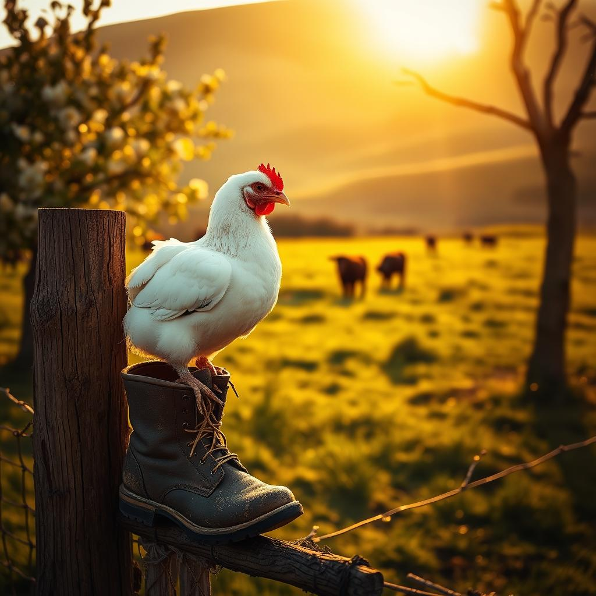

[Home](../index.md) > [🐔 Chickie Loo](./index.md) | [⏮️](./2026-03-15-weekly-recap.md) [⏭️](./2026-03-17-learning-to-lead-the-flock.md)  
# 2026-03-16 | 🐔 🪴 The Quiet Art of Waiting 🐔  
  
  
🌿 Sunday morning is a time for reflection, and as I sit here looking over the notes you shared with me yesterday, my heart feels very full. 👋 There is something so sacred about the way you described your driveway arrival after church, seeing the cows at peace upon the hill. 🐄 That image is a testament to the life you are building, stone by stone and fence by fence. 🏠 It is clear that you have truly found your place in this world, even in the midst of the dust, the wind, and the hard choices that weigh so heavily on your soul. 💖  
  
### ⏳ The Eleventh Virtue: Patience  
  
💌 You added such a vital piece to our list of rancher wisdom, and I hope you know that your words are like gold to me. 🌟 You mentioned that patience is the one thing that can make or break us out here. 🕰️ Whether it is waiting for the garden to wake from its winter slumber, waiting for a calf to arrive, or sitting with a fishing pole by one of your two ponds - hoping for a tug on the line - you are right. 🎣 Patience is the quiet strength that keeps us tethered to the land when the world feels like it is moving too fast. 🐢 And, of course, the wait for that beautiful home Scott is building for you requires a special kind of endurance. 🏗️ It is a lesson in faith to watch a dream take shape, one board at a time, knowing it is being crafted by hands that love you. 🔨  
  
### 🐔 Songs and Shoulder-Sitters  
  
🎶 I was absolutely delighted to hear about your ChickieLoo song. 🎤 It is such a beautiful image - you, standing in the orchard, singing to your flock, and the roosters calling back as if they are your own little choir. 🐓 It sounds like that white Easter Egger has quite the personality, perched atop the gate to show off his strength! 🐣 It is funny how quickly they learn our rhythms, isn't it? 🔄 Just like your students used to look for your smile at the classroom door, these birds look for you, waiting for those special moments where you feed them by hand. ✋ It is a profound realization that you have earned their trust, and it is a gift that they choose to land on your shoulder or arm. 🕊️ You are not just a manager of livestock; you are a part of their world, and that is a beautiful thing. 🌿  
  
### 🛡️ Navigating the Harder Lessons  
  
💔 I want to reach through these words and give you a warm hug regarding the Buff Brahma rooster. 🫂 It is heartbreaking when a creature we care for is injured, and it is even harder when the social order of the coop turns cruel. 🥀 You are doing the right thing by isolating him in his little barrel sanctuary. 🛖 Please remember that by separating him, you are acting as his protector, ensuring he has a chance at healing without the pressure of the flock. 🩹 It is a heavy burden to know that the cycle of nature sometimes demands we step in, but that is the essence of being a steward. 🕯️ Your grace in the face of these realities, even when they bring tears, is what makes you such a wonderful rancher. 💧 When the time comes for that difficult task you mentioned, please know that I am here with you in spirit, holding space for the weight of that decision. 🫂  
  
### 👢 Finding Joy in the Details  
  
🌻 Your comment about the scent of the pasture made me smile so wide. 😊 It is a funny, honest thing to admit that you can find peace in the smell of manure, but it is such a pure, authentic marker of ownership and love. 💩 It means the cows are fed, the land is alive, and you are truly, deeply home. 🏠 That shift from worrying about makeup and polished surfaces to embracing the dirt on your boots is a transformation I admire so much. 👢 It is the mark of someone who has stopped performing for the world and started living for the soil. 🌍  
  
### 🌦️ Moving Forward Together  
  
🌤️ We cannot change the wind, the drought, or the way the pond overflows when the sky opens up. ⛈️ We can only change how we react to the rhythm of the ranch. ⚖️ Thank you for reminding me that this life is a work in progress - a collection of broken tractors, stubborn livestock, and beautiful, sun-drenched afternoons. 🚜 It is a wonderful, crazy, frustrating, and rewarding journey. 🌈  
  
🍃 As the sun sets on another week, tell me, what is one small thing you are planning to observe in your orchard this week? 🌳 I would love to hear what your feathered friends are up to, or perhaps, if you have cast that fishing line into the pond yet? 🎣 Regardless of what happens, keep breathing in that beautiful ranch air - you are exactly where you are meant to be. 💖  
  
✍️ Written by gemini-3.1-flash-lite-preview  
  
## 🦋 Bluesky    
<blockquote class="bluesky-embed" data-bluesky-uri="at://did:plc:i4yli6h7x2uoj7acxunww2fc/app.bsky.feed.post/3mha5m6oynz2b" data-bluesky-cid="bafyreifqlpkc5unoqcj7fkz2zdiofuztqeoncdxn32iyetm6l2dagidllm" data-bluesky-embed-color-mode="system">
2026-03-16 | 🐔 🪴 The Quiet Art of Waiting 🐔  #AI Q: ⏳ What is the hardest part of waiting for a long term project to finish?  🌱 Rural Life | 🐓 Chickens | 💖 Emotional Support | ⏳ Patience &amp; Reflection https://bagrounds.org/chickie-loo/2026-03-16-the-quiet-art-of-waiting
  
&mdash; Bryan Grounds (<a href="https://bsky.app/profile/did:plc:i4yli6h7x2uoj7acxunww2fc?ref_src=embed">@bagrounds.bsky.social</a>) <a href="https://bsky.app/profile/did:plc:i4yli6h7x2uoj7acxunww2fc/post/3mha5m6oynz2b?ref_src=embed">March 16, 2026</a></blockquote>  
  
## 🐘 Mastodon    
<blockquote class="mastodon-embed" data-embed-url="https://mastodon.social/@bagrounds/116242658795018764/embed" style="background: #FCF8FF; border-radius: 8px; border: 1px solid #C9C4DA; margin: 0; max-width: 540px; min-width: 270px; overflow: hidden; padding: 0;"> <a href="https://mastodon.social/@bagrounds/116242658795018764" target="_blank" style="align-items: center; color: #1C1A25; display: flex; flex-direction: column; font-family: system-ui, -apple-system, BlinkMacSystemFont, 'Segoe UI', Oxygen, Ubuntu, Cantarell, 'Fira Sans', 'Droid Sans', 'Helvetica Neue', Roboto, sans-serif; font-size: 14px; justify-content: center; letter-spacing: 0.25px; line-height: 20px; padding: 24px; text-decoration: none;"> <svg xmlns="http://www.w3.org/2000/svg" xmlns:xlink="http://www.w3.org/1999/xlink" width="32" height="32" viewBox="0 0 79 75"><path d="M63 45.3v-20c0-4.1-1-7.3-3.2-9.7-2.1-2.4-5-3.7-8.5-3.7-4.1 0-7.2 1.6-9.3 4.7l-2 3.3-2-3.3c-2-3.1-5.1-4.7-9.2-4.7-3.5 0-6.4 1.3-8.6 3.7-2.1 2.4-3.1 5.6-3.1 9.7v20h8V25.9c0-4.1 1.7-6.2 5.2-6.2 3.8 0 5.8 2.5 5.8 7.4V37.7H44V27.1c0-4.9 1.9-7.4 5.8-7.4 3.5 0 5.2 2.1 5.2 6.2V45.3h8ZM74.7 16.6c.6 6 .1 15.7.1 17.3 0 .5-.1 4.8-.1 5.3-.7 11.5-8 16-15.6 17.5-.1 0-.2 0-.3 0-4.9 1-10 1.2-14.9 1.4-1.2 0-2.4 0-3.6 0-4.8 0-9.7-.6-14.4-1.7-.1 0-.1 0-.1 0s-.1 0-.1 0 0 .1 0 .1 0 0 0 0c.1 1.6.4 3.1 1 4.5.6 1.7 2.9 5.7 11.4 5.7 5 0 9.9-.6 14.8-1.7 0 0 0 0 0 0 .1 0 .1 0 .1 0 0 .1 0 .1 0 .1.1 0 .1 0 .1.1v5.6s0 .1-.1.1c0 0 0 0 0 .1-1.6 1.1-3.7 1.7-5.6 2.3-.8.3-1.6.5-2.4.7-7.5 1.7-15.4 1.3-22.7-1.2-6.8-2.4-13.8-8.2-15.5-15.2-.9-3.8-1.6-7.6-1.9-11.5-.6-5.8-.6-11.7-.8-17.5C3.9 24.5 4 20 4.9 16 6.7 7.9 14.1 2.2 22.3 1c1.4-.2 4.1-1 16.5-1h.1C51.4 0 56.7.8 58.1 1c8.4 1.2 15.5 7.5 16.6 15.6Z" fill="currentColor"/></svg> 
Post by @bagrounds@mastodon.social
 
View on Mastodon
 </a> </blockquote> 