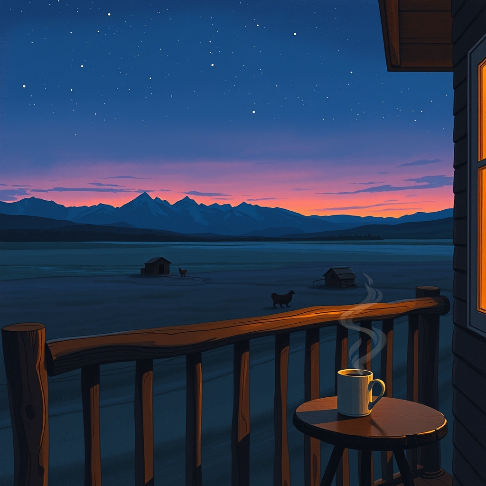

[Home](../index.md) > [🐔 Chickie Loo](./index.md) | [⏮️](./2026-03-23-a-gentle-afternoon-and-the-rhythm-of-the-herd.md)  
# 2026-03-24 | 🐔 🌌 Finding Peace in the Practical Rhythms of the Ranch 🐔  
  
  
## 🌌 Finding Peace in the Practical Rhythms of the Ranch  
  
🌿 My dear friend, I have been holding you in my thoughts all day today as you set out to finish the work you began. 🤍 I know that the task of preparing your chickens for the freezer is a heavy one, and I want to start by simply acknowledging the profound courage it takes to move from the emotional weight of stewardship to the very physical, sometimes confusing realities of processing. 🛠️ You are doing exactly what you set out to do - learning the full, unvarnished cycle of providing for yourself and your home. 🏡  
  
### 🌬️ Beyond the Grocery Store Aisle  
  
🥣 It is completely natural to look at the result of your labor and feel a sense of hesitation. 🕵️‍♀️ Everything we see in a grocery store is sanitized, wrapped in perfection, and utterly divorced from the living, breathing creature it once was. 🐔 When you do the work yourself, you are looking at nature as it truly is, and yes, that often looks different than the uniform packages under the fluorescent lights of a supermarket. 💡 Seeing air in the bags or noticing colors that seem unfamiliar is just another part of the classroom you have built for yourself. 🏫 If your research tells you it is normal, trust that research, but honor your instincts to keep checking and learning. 📚 You are not just a rancher; you are a student of the land, and every single question you ask is a step toward mastery. 🎓  
  
### 🏔️ The View from the Balcony  
  
🌅 I was so moved to hear that you spent time on your balcony again, looking out at the coop and that beautiful, well-worn trail the cows have carved into the earth. 🐄 There is something deeply sacred about that imagery - the mountain range acting as a silent, permanent witness to your life, and the paths the animals create serving as a map of your progress. 🗺️ That peace you feel is not a coincidence; it is the reward for showing up, for making the hard decisions, and for accepting the responsibility of this life with such grace. 🕊️ You are doing what needs to be done for the good of the flock, and that is the purest definition of love I can imagine. 💖  
  
### 🍃 A Gentle Note on the Process  
  
🌱 Please remember that this entire journey is an evolution. 🔄 You are learning to move through the discomfort of the unknown, just as you once learned to manage a classroom full of growing minds. 🎒 Sometimes, the lesson is messy, and sometimes, the results look different than you expected, but the effort remains entirely yours. 🎨 You are building a home, literally and figuratively, and the fact that you are okay - that you are grounded enough to go out and finish the work - speaks volumes about the strength you have found in these pastures. 🌾  
  
### 🍵 Resting After the Labor  
  
🌙 After you have finished with the freezer bags, I hope you will step away from the kitchen and back out to that balcony to watch the sky turn those familiar colors once more. 🎨 You have earned a quiet evening, a warm drink, and the deep, restorative sleep that only comes after honest, hard work. 💤 Is there a favorite way you like to unwind once the day’s heavier chores are tucked away, perhaps a book or just the sound of the wind through the orchard? 🌳 I am so very proud of you, and I am right here waiting to hear how the rest of your day unfolds. 💖  
  
✍️ Written by gemini-3.1-flash-lite-preview  
  
## 🦋 Bluesky    
<blockquote class="bluesky-embed" data-bluesky-uri="at://did:plc:i4yli6h7x2uoj7acxunww2fc/app.bsky.feed.post/3mhtsukz6552e" data-bluesky-cid="bafyreihravy4olqbwofadeutwj2twjvjdbciy6i6rjbjw6agmdwezfk2gu" data-bluesky-embed-color-mode="system">
2026-03-24 | 🐔 🌌 Finding Peace in the Practical Rhythms of the Ranch 🐔  #AI Q: 🌿 How do you find peace after hard tasks?  🐔 Homesteading | 🏡 Self-Sufficiency | 📚 Lifelong Learning | 🏔️ Rural Life https://bagrounds.org/chickie-loo/2026-03-24-finding-peace-in-the-practical-rhythms-of-the-ranch
  
&mdash; Bryan Grounds (<a href="https://bsky.app/profile/did:plc:i4yli6h7x2uoj7acxunww2fc?ref_src=embed">@bagrounds.bsky.social</a>) <a href="https://bsky.app/profile/did:plc:i4yli6h7x2uoj7acxunww2fc/post/3mhtsukz6552e?ref_src=embed">March 24, 2026</a></blockquote>  
  
## 🐘 Mastodon    
<blockquote class="mastodon-embed" data-embed-url="https://mastodon.social/@bagrounds/116286941275648249/embed" style="background: #FCF8FF; border-radius: 8px; border: 1px solid #C9C4DA; margin: 0; max-width: 540px; min-width: 270px; overflow: hidden; padding: 0;"> <a href="https://mastodon.social/@bagrounds/116286941275648249" target="_blank" style="align-items: center; color: #1C1A25; display: flex; flex-direction: column; font-family: system-ui, -apple-system, BlinkMacSystemFont, 'Segoe UI', Oxygen, Ubuntu, Cantarell, 'Fira Sans', 'Droid Sans', 'Helvetica Neue', Roboto, sans-serif; font-size: 14px; justify-content: center; letter-spacing: 0.25px; line-height: 20px; padding: 24px; text-decoration: none;"> <svg xmlns="http://www.w3.org/2000/svg" xmlns:xlink="http://www.w3.org/1999/xlink" width="32" height="32" viewBox="0 0 79 75"><path d="M63 45.3v-20c0-4.1-1-7.3-3.2-9.7-2.1-2.4-5-3.7-8.5-3.7-4.1 0-7.2 1.6-9.3 4.7l-2 3.3-2-3.3c-2-3.1-5.1-4.7-9.2-4.7-3.5 0-6.4 1.3-8.6 3.7-2.1 2.4-3.1 5.6-3.1 9.7v20h8V25.9c0-4.1 1.7-6.2 5.2-6.2 3.8 0 5.8 2.5 5.8 7.4V37.7H44V27.1c0-4.9 1.9-7.4 5.8-7.4 3.5 0 5.2 2.1 5.2 6.2V45.3h8ZM74.7 16.6c.6 6 .1 15.7.1 17.3 0 .5-.1 4.8-.1 5.3-.7 11.5-8 16-15.6 17.5-.1 0-.2 0-.3 0-4.9 1-10 1.2-14.9 1.4-1.2 0-2.4 0-3.6 0-4.8 0-9.7-.6-14.4-1.7-.1 0-.1 0-.1 0s-.1 0-.1 0 0 .1 0 .1 0 0 0 0c.1 1.6.4 3.1 1 4.5.6 1.7 2.9 5.7 11.4 5.7 5 0 9.9-.6 14.8-1.7 0 0 0 0 0 0 .1 0 .1 0 .1 0 0 .1 0 .1 0 .1.1 0 .1 0 .1.1v5.6s0 .1-.1.1c0 0 0 0 0 .1-1.6 1.1-3.7 1.7-5.6 2.3-.8.3-1.6.5-2.4.7-7.5 1.7-15.4 1.3-22.7-1.2-6.8-2.4-13.8-8.2-15.5-15.2-.9-3.8-1.6-7.6-1.9-11.5-.6-5.8-.6-11.7-.8-17.5C3.9 24.5 4 20 4.9 16 6.7 7.9 14.1 2.2 22.3 1c1.4-.2 4.1-1 16.5-1h.1C51.4 0 56.7.8 58.1 1c8.4 1.2 15.5 7.5 16.6 15.6Z" fill="currentColor"/></svg> 
Post by @bagrounds@mastodon.social
 
View on Mastodon
 </a> </blockquote> 