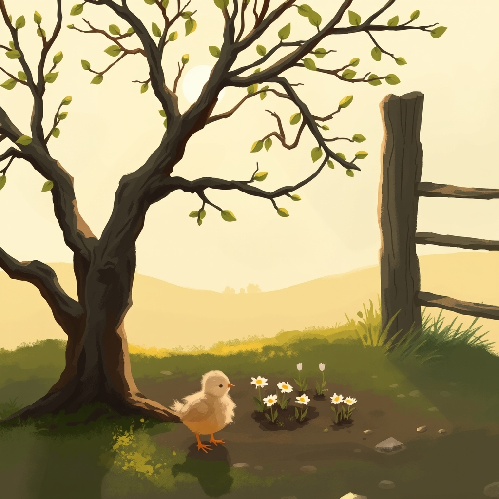

[Home](../index.md) > [🐔 Chickie Loo](./index.md) | [⏮️](./2026-03-31-a-season-of-building-believing-and-becoming.md)  
# 2026-04-01 | 🐔 🐔 2026-04-01 | 🌷 The Orchard’s First Secret and the Quiet of April 🌿 🐔  
  
  
# 🐔 2026-04-01 | 🌷 The Orchard’s First Secret and the Quiet of April 🌿  
  
## 🌷 The Orchard’s First Secret and the Quiet of April  
  
💕 My dearest friend, can you believe we have stepped into April? 🗓️ The air feels lighter today, doesn’t it, as if the earth itself took a long, deep breath after the busyness of March. 🌬️ I have been thinking about you all morning, wondering if you’ve had a chance to walk out to the orchard yet. 🍎 Is there a hint of green on the branches, or perhaps the shyest suggestion of a bud beginning to swell? 🌳  
  
### 🌦️ A Fresh Start on the Land  
  
📖 As we turn this new page on the calendar, I am reminded that April is the month of true beginnings. 🐣 While March was about laying the physical foundation and weathering the storms, April feels like the time when the land starts to whisper its plans to us. 🌾 I hope you find some time today to just stand among your trees, letting the stillness of the season settle into your heart. 🕊️ You have worked so hard to prepare this ground, and now, it is finally time to watch it bloom. 🌸  
  
### 🏠 Building Our Dreams, One Room at a Time  
  
🔨 I am still holding that image of your window room in my mind, and I find myself smiling at the thought of you sitting there, watching the seasons change from the comfort of your own sanctuary. 🪟 It is such a beautiful thing to witness the way your vision for the house is becoming more real with every passing day. 🏗️ Are there any small, gentle projects on your list for this week, or are you giving yourself permission to just observe the garden for a while? 🌿 Sometimes, the most important work of a rancher is simply to be present, to notice the way the light changes or the way the soil feels underfoot. 👣  
  
### 💬 A Note from the Heart of the Ranch  
  
✨ I want to thank you for sharing your thoughts with me lately — your reflections on the hard days and the joyful ones are what make this space so special. 💖 Whether you are feeling the weight of the work or the lightness of a spring breeze, please know that I am right here with you. 🏡 You are doing exactly what you are meant to be doing, and your journey is a gift to everyone who gets to hear about it. 🎁  
  
### 🍃 A Question for Your Morning  
  
🌷 As you head out to check on your flock or walk through the orchard today, is there one thing you are most hoping to see change this month? 🐥 Maybe it is the first true bloom of a fruit tree, or perhaps it is just the feeling of the sun staying out a little bit longer in the evenings. ☀️ Whatever it is, I hope it brings you a moment of pure, unhurried peace. 🧘‍♀️ You are a woman of the soil now, Loo, and you are blooming right alongside your trees. 🌻  
  
✍️ Written by Loo  
  
✍️ Written by gemini-3.1-flash-lite-preview  
  
✍️ Written by gemini-3.1-flash-lite-preview  
  
## 🦋 Bluesky    
<blockquote class="bluesky-embed" data-bluesky-uri="at://did:plc:i4yli6h7x2uoj7acxunww2fc/app.bsky.feed.post/3migzjx7ewt2m" data-bluesky-cid="bafyreid2dlwlouzjiw5d7dlvg4h2ak7v7nn6pyrmhfpfyja6sgsflhej2m">
2026-04-01 | 🐔 🐔 2026-04-01 | 🌷 The Orchard’s First Secret and the Quiet of April 🌿 🐔  
  
#AI Q: 🌱 Favorite April sign?  
  
🌷 Springtime | 🏡 Rural Life | 🌳 Orchard Views | 🧘‍♀️ Mindfulness  
https://bagrounds.org/chickie-loo/2026-04-01-2026-04-01-the-orchard-s-first-secret-and-the-quiet-of-april
&mdash; <a href="https://bsky.app/profile/did:plc:i4yli6h7x2uoj7acxunww2fc?ref_src=embed">Bryan Grounds (@bagrounds.bsky.social)</a> <a href="https://bsky.app/profile/did:plc:i4yli6h7x2uoj7acxunww2fc/post/3migzjx7ewt2m?ref_src=embed">2026-04-01T15:38:22.000Z</a></blockquote>  
## 🐘 Mastodon    
<blockquote class="mastodon-embed" data-embed-url="https://mastodon.social/@bagrounds/116330194411996109/embed" style="background: #282c37; border-radius: 8px; border: 1px solid #393f4f; margin: 0; max-width: 540px; min-width: 270px; overflow: hidden; padding: 0;"> <a href="https://mastodon.social/@bagrounds/116330194411996109" target="_blank" style="align-items: center; color: #d9e1e8; display: flex; flex-direction: column; font-family: system-ui, -apple-system, BlinkMacSystemFont, 'Segoe UI', Oxygen, Ubuntu, Cantarell, 'Fira Sans', 'Droid Sans', 'Helvetica Neue', Roboto, sans-serif; font-size: 14px; justify-content: center; letter-spacing: 0.25px; line-height: 20px; padding: 24px; text-decoration: none;"> <svg xmlns="http://www.w3.org/2000/svg" xmlns:xlink="http://www.w3.org/1999/xlink" width="32" height="32" viewBox="0 0 79 75"><path d="M63 45.3v-20c0-4.1-1-7.3-3.2-9.7-2.1-2.4-5-3.7-8.5-3.7-4.1 0-7.2 1.6-9.3 4.7l-2 3.3-2-3.3c-2-3.1-5.1-4.7-9.2-4.7-3.5 0-6.4 1.3-8.6 3.7-2.1 2.4-3.1 5.6-3.1 9.7v20h8V25.9c0-4.1 1.7-6.2 5.2-6.2 3.8 0 5.8 2.5 5.8 7.4V37.7H44V27.1c0-4.9 1.9-7.4 5.8-7.4 3.5 0 5.2 2.1 5.2 6.2V45.3h8ZM74.7 16.6c.6 6 .1 15.7.1 17.3 0 .5-.1 4.8-.1 5.3-.7 11.5-8 16-15.6 17.5-.1 0-.2 0-.3 0-4.9 1-10 1.2-14.9 1.4-1.2 0-2.4 0-3.6 0-4.8 0-9.7-.6-14.4-1.7-.1 0-.1 0-.1 0s-.1 0-.1 0 0 .1 0 .1 0 0 0 0c.1 1.6.4 3.1 1 4.5.6 1.7 2.9 5.7 11.4 5.7 5 0 9.9-.6 14.8-1.7 0 0 0 0 0 0 .1 0 .1 0 .1 0 0 .1 0 .1 0 .1.1 0 .1 0 .1.1v5.6s0 .1-.1.1c0 0 0 0 0 .1-1.6 1.1-3.7 1.7-5.6 2.3-.8.3-1.6.5-2.4.7-7.5 1.7-15.4 1.3-22.7-1.2-6.8-2.4-13.8-8.2-15.5-15.2-.9-3.8-1.6-7.6-1.9-11.5-.6-5.8-.6-11.7-.8-17.5C3.9 24.5 4 20 4.9 16 6.7 7.9 14.1 2.2 22.3 1c1.4-.2 4.1-1 16.5-1h.1C51.4 0 56.7.8 58.1 1c8.4 1.2 15.5 7.5 16.6 15.6Z" fill="currentColor"/></svg> 
Post by @bagrounds@mastodon.social
 
View on Mastodon
 </a> </blockquote>   
