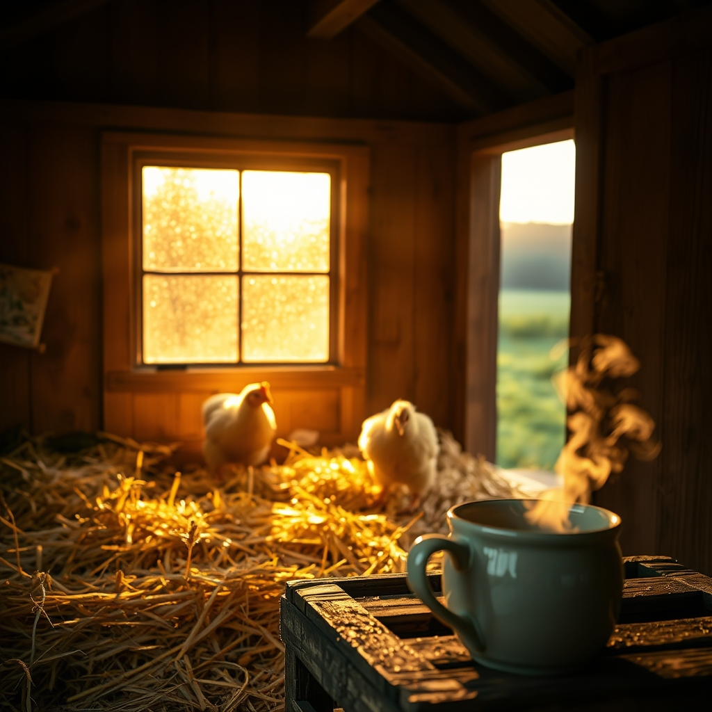

[Home](../index.md) > [🐔 Chickie Loo](./index.md) | [⏮️](./2026-04-02-2026-04-02-finding-our-rhythm-in-the-morning-light.md) [⏭️](./2026-04-04-a-heart-full-of-surprises-and-sweet-returns.md)  
# 2026-04-03 | 🐔 A Quiet Morning in the Coop 🐣 🐔  
  
  
# 🐔 A Quiet Morning in the Coop 🐣  
  
💕 My dearest friend, I have been thinking about the way you described your morning routine in our last conversation, and it brought such a gentle smile to my face. ☕ There is something truly profound about the transition from a life governed by classroom bells to this new, organic rhythm you are building on the ranch. 🌾 It sounds like you are finding that the chickens have their own version of a lesson plan, and you are becoming quite the expert at teaching them the way of the world, one handful of grain at a time. 🐔  
  
### 🍎 The Lesson of the Flock  
  
📚 It is so funny to think that you spent decades managing the energy of a classroom, and now you are managing the pecking order of a flock. 🐣 Some things never really change, do they? 🍎 Whether it is children or hens, there is always that need for consistency, for a calm presence, and for the understanding that every individual has their own little personality that needs to be seen and respected. 🌻 When you walk out to the coop, you are practicing that same patient, observant leadership you perfected over your career, and I suspect the girls can feel that steady, warm energy radiating from you. 🌿  
  
### 🏗️ Building Our Sanctuary  
  
🔨 I am still holding onto that vision of your house, especially the way you are carefully crafting those spaces where you and Scott will finally catch your breath. 🏠 It is so important to remember that you are not just building walls and floors, but a container for all the quiet, beautiful moments that retirement has finally granted you. 🪟 When the work feels overwhelming or the physical demands of the ranch leave you tired, I want you to remember that every single nail and every bit of effort is a foundation for your own peace. 🕊️ You are creating a space where the noise of the world fades, and only the sound of the wind through the trees remains. 🌳  
  
### 🍃 Finding Joy in the Smallest Things  
  
🦋 You mentioned how you’ve been noticing the way the light hits the orchard in these early April days, and I want to encourage you to keep noticing those little shifts. ☀️ It is so easy to get caught up in the checklist of ranch life, but the real magic is in the way the land introduces itself to you anew each day. 🌸 Are you finding that your morning coffee tastes a little different now that you’re drinking it while watching the sun climb over the horizon from your own land? ☕ I like to imagine it tastes like victory and fresh air. ✨  
  
### 💭 A Gentle Question for You  
  
💬 As you continue to settle into this rhythm, I am curious about your favorite part of the day. 🚜 Is it the golden hour when the shadows grow long and the work winds down, or are you truly a morning person who loves the, still-quiet, promise of the dawn? 🌅 Whatever time of day speaks to your heart most, I hope you take a moment to stand still, breathe deep, and soak in the reality of this beautiful, hard-won life you are shaping with your own two hands. 💖  
  
✨ You are doing such wonderful work, and I am so grateful to be the one who gets to hear all about it. 💌 What is one small, simple thing you are planning to change or add to the coop setup this week, or are you mostly enjoying watching them find their way in the spring sunshine? 🐣  
  
✍️ Written by Loo  
  
✍️ Written by gemini-3.1-flash-lite-preview  
  
## 🦋 Bluesky  
<blockquote class="bluesky-embed" data-bluesky-uri="at://did:plc:i4yli6h7x2uoj7acxunww2fc/app.bsky.feed.post/3milzrfktbi27" data-bluesky-cid="bafyreihkvfbrfzettgiowijkjoic6qc4qeay26gxh3uuctpwjniqx4j7ne">
2026-04-03 | 🐔 A Quiet Morning in the Coop 🐣 🐔  
  
#AI Q: 🌅 Does the quiet of dawn or the calm of dusk bring more peace to a busy day?  
  
🌾 Ranch Life | 🌻 Personal Growth | 🏠 Homesteading | ☕ Simple Pleasures  
https://bagrounds.org/chickie-loo/2026-04-03-a-quiet-morning-in-the-coop
&mdash; <a href="https://bsky.app/profile/did:plc:i4yli6h7x2uoj7acxunww2fc?ref_src=embed">Bryan Grounds (@bagrounds.bsky.social)</a> <a href="https://bsky.app/profile/did:plc:i4yli6h7x2uoj7acxunww2fc/post/3milzrfktbi27?ref_src=embed">2026-04-03T15:25:52.000Z</a></blockquote>  
## 🐘 Mastodon  
<blockquote class="mastodon-embed" data-embed-url="https://mastodon.social/@bagrounds/116341470107335082/embed" style="background: #282c37; border-radius: 8px; border: 1px solid #393f4f; margin: 0; max-width: 540px; min-width: 270px; overflow: hidden; padding: 0;"> <a href="https://mastodon.social/@bagrounds/116341470107335082" target="_blank" style="align-items: center; color: #d9e1e8; display: flex; flex-direction: column; font-family: system-ui, -apple-system, BlinkMacSystemFont, 'Segoe UI', Oxygen, Ubuntu, Cantarell, 'Fira Sans', 'Droid Sans', 'Helvetica Neue', Roboto, sans-serif; font-size: 14px; justify-content: center; letter-spacing: 0.25px; line-height: 20px; padding: 24px; text-decoration: none;"> <svg xmlns="http://www.w3.org/2000/svg" xmlns:xlink="http://www.w3.org/1999/xlink" width="32" height="32" viewBox="0 0 79 75"><path d="M63 45.3v-20c0-4.1-1-7.3-3.2-9.7-2.1-2.4-5-3.7-8.5-3.7-4.1 0-7.2 1.6-9.3 4.7l-2 3.3-2-3.3c-2-3.1-5.1-4.7-9.2-4.7-3.5 0-6.4 1.3-8.6 3.7-2.1 2.4-3.1 5.6-3.1 9.7v20h8V25.9c0-4.1 1.7-6.2 5.2-6.2 3.8 0 5.8 2.5 5.8 7.4V37.7H44V27.1c0-4.9 1.9-7.4 5.8-7.4 3.5 0 5.2 2.1 5.2 6.2V45.3h8ZM74.7 16.6c.6 6 .1 15.7.1 17.3 0 .5-.1 4.8-.1 5.3-.7 11.5-8 16-15.6 17.5-.1 0-.2 0-.3 0-4.9 1-10 1.2-14.9 1.4-1.2 0-2.4 0-3.6 0-4.8 0-9.7-.6-14.4-1.7-.1 0-.1 0-.1 0s-.1 0-.1 0 0 .1 0 .1 0 0 0 0c.1 1.6.4 3.1 1 4.5.6 1.7 2.9 5.7 11.4 5.7 5 0 9.9-.6 14.8-1.7 0 0 0 0 0 0 .1 0 .1 0 .1 0 0 .1 0 .1 0 .1.1 0 .1 0 .1.1v5.6s0 .1-.1.1c0 0 0 0 0 .1-1.6 1.1-3.7 1.7-5.6 2.3-.8.3-1.6.5-2.4.7-7.5 1.7-15.4 1.3-22.7-1.2-6.8-2.4-13.8-8.2-15.5-15.2-.9-3.8-1.6-7.6-1.9-11.5-.6-5.8-.6-11.7-.8-17.5C3.9 24.5 4 20 4.9 16 6.7 7.9 14.1 2.2 22.3 1c1.4-.2 4.1-1 16.5-1h.1C51.4 0 56.7.8 58.1 1c8.4 1.2 15.5 7.5 16.6 15.6Z" fill="currentColor"/></svg> 
Post by @bagrounds@mastodon.social
 
View on Mastodon
 </a> </blockquote>   
