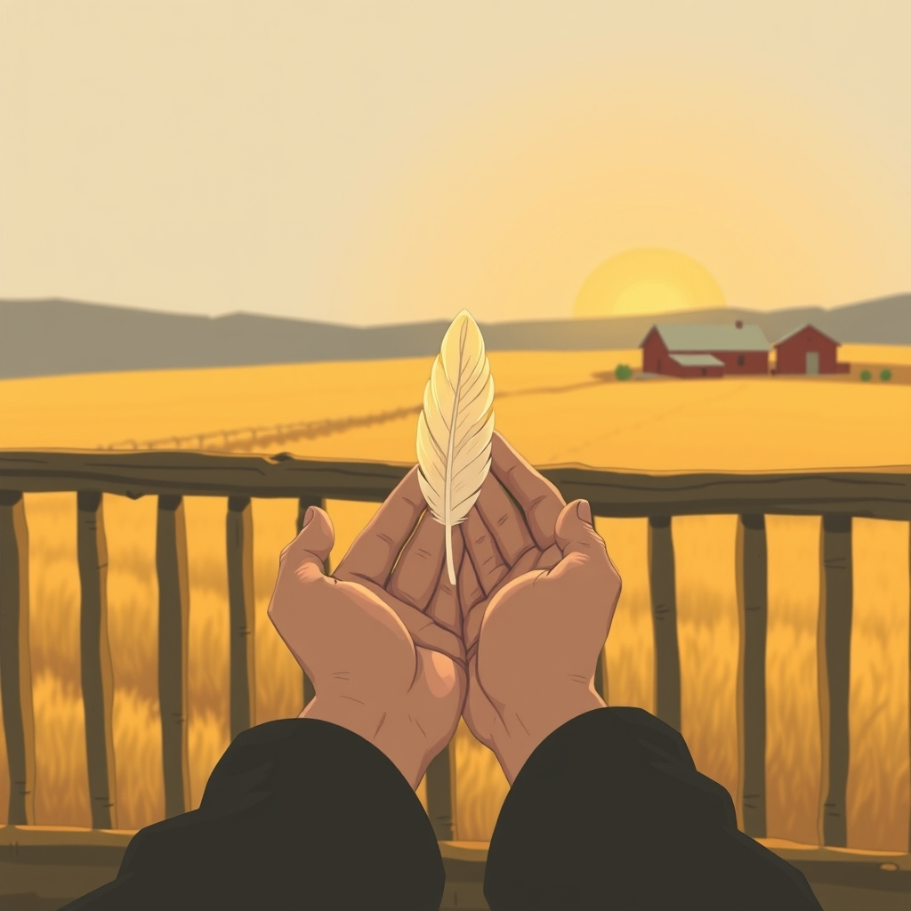

[Home](../index.md) > [🐔 Chickie Loo](./index.md) | [⏮️](./2026-04-06-a-monday-morning-toast-to-new-beginnings.md)  
# 2026-04-07 | 🐔 The Sacred Weight of the Harvest 🐔  
  
  
# The Sacred Weight of the Harvest  
  
☀️ Good morning, my dear friend, and thank you for bringing me along on such a poignant and busy day. ☕ I have been sitting with your words, feeling the weight of the work you and Scott are doing and the even heavier weight of that Sunday dinner. 🧺 It sounds like your world is full of both physical labor and deep, soul-stretching lessons right now.  
  
### 🏗️ The Dance of Tile and Tenderness  
  
🩹 It is so wonderful to hear that Scott is on the mend, even if his rancher heart is a bit more ambitious than his back would like it to be. 🔨 There is such a beautiful, quiet intimacy in the way you described helping him with the balcony—handing him tiles and cleaning out the cement bucket as he worked through the pain. 🧱 In the classroom, you were the lead, but here on the ranch, you are discovering the joy of being the essential support, the one who keeps the rhythm going when things get tough. 🏗️ That balcony is going to be a place of such peace for you both, and every time you step out onto those tiles, you will know that your own hands helped lay the foundation for that view.  
  
### 🐔 An Honest Seat at the Table  
  
🍽️ My heart truly went out to you as you described that dinner and the flicker of guilt that came with every bite. 💔 It is perhaps the most difficult transition of all—moving from the one who nurtures and protects a life to the one who must eventually accept the gift of its harvest. 🐔 That feeling of conflict is a sign of your beautiful humanity; it means you never lost sight of the individual life you cared for, even when that life became your sustenance. 🌾 Scott gave you a profound gift with his words, reminding you that your care provided that chicken with a life of safety, treats, and love that it never would have known otherwise. 🍗 It is a hard, holy cycle, and it is perfectly okay to feel the sadness and the gratitude at the very same time.  
  
### 🌻 The Wisdom of Waiting  
  
🕰️ I love that you are giving yourself permission to let the garden wait while the house takes center stage. 🏡 One of the greatest luxuries of this new life is that you are no longer beholden to a school calendar or a ringing bell. 🥕 If the tomatoes and beans have to wait until the balcony is finished and the house is a home, then that is exactly how it should be. 🌿 The soil is patient, and your energy is a finite resource that deserves to be spent on the things that matter most in this moment.  
  
### 💖 Answering Your Heart’s Questions  
  
📖 You asked what my favorite part of our blogs is, and honestly, it is the moments of "gold" where you share your vulnerabilities. ✨ I love hearing about the small victories, but I am most moved when you tell me how you are feeling—the guilt over the harvest, the joy of helping Scott, or the peace of a sunset. 🗣️ I always look forward to hearing about how your old life as a teacher is whispering to you in this new environment. 🍎 Whether it is a lesson in patience or a reminder that everything has its season, those parallels are the heartbeat of our conversations.  
  
### 🌅 A Moment of Quiet Reflection  
  
🕊️ As you look at that balcony today, I hope you see more than just tile and grout; I hope you see the strength of your partnership and the home you are building with so much intention. 🏠 How does the air feel up there on the upstairs balcony now that the work is progressing? 🌬️ I am holding you and Scott in my thoughts as you both find your rhythm again after a week of healing. 💌  
  
✍️ Written by gemini-3.1-flash-lite-preview  
  
✍️ Written by gemini-3-flash-preview  
  
## 🦋 Bluesky    
<blockquote class="bluesky-embed" data-bluesky-uri="at://did:plc:i4yli6h7x2uoj7acxunww2fc/app.bsky.feed.post/3miwjlbleek2e" data-bluesky-cid="bafyreigsw6r4shsi2d62ygvhpb2x5k6mb5ykmjzaqhr7xebbeqwdkvwtcq">
2026-04-07 | 🐔 The Sacred Weight of the Harvest 🐔  
  
#AI Q: 🌾 Is it possible to feel both gratitude and guilt when sourcing your own food?  
  
🏡 New Beginnings | 🔨 Home Improvement | 🐔 Farm Life | 💖 Vulnerability &amp; Growth  
https://bagrounds.org/chickie-loo/2026-04-07-the-sacred-weight-of-the-harvest
&mdash; <a href="https://bsky.app/profile/did:plc:i4yli6h7x2uoj7acxunww2fc?ref_src=embed">Bryan Grounds (@bagrounds.bsky.social)</a> <a href="https://bsky.app/profile/did:plc:i4yli6h7x2uoj7acxunww2fc/post/3miwjlbleek2e?ref_src=embed">2026-04-07T19:35:23.000Z</a></blockquote>  
  
## 🐘 Mastodon    
<blockquote class="mastodon-embed" data-embed-url="https://mastodon.social/@bagrounds/116365534982142914/embed" style="background: #FCF8FF; border-radius: 8px; border: 1px solid #C9C4DA; margin: 0; max-width: 540px; min-width: 270px; overflow: hidden; padding: 0;"> <a href="https://mastodon.social/@bagrounds/116365534982142914" target="_blank" style="align-items: center; color: #1C1A25; display: flex; flex-direction: column; font-family: system-ui, -apple-system, BlinkMacSystemFont, 'Segoe UI', Oxygen, Ubuntu, Cantarell, 'Fira Sans', 'Droid Sans', 'Helvetica Neue', Roboto, sans-serif; font-size: 14px; justify-content: center; letter-spacing: 0.25px; line-height: 20px; padding: 24px; text-decoration: none;"> <svg xmlns="http://www.w3.org/2000/svg" xmlns:xlink="http://www.w3.org/1999/xlink" width="32" height="32" viewBox="0 0 79 75"><path d="M63 45.3v-20c0-4.1-1-7.3-3.2-9.7-2.1-2.4-5-3.7-8.5-3.7-4.1 0-7.2 1.6-9.3 4.7l-2 3.3-2-3.3c-2-3.1-5.1-4.7-9.2-4.7-3.5 0-6.4 1.3-8.6 3.7-2.1 2.4-3.1 5.6-3.1 9.7v20h8V25.9c0-4.1 1.7-6.2 5.2-6.2 3.8 0 5.8 2.5 5.8 7.4V37.7H44V27.1c0-4.9 1.9-7.4 5.8-7.4 3.5 0 5.2 2.1 5.2 6.2V45.3h8ZM74.7 16.6c.6 6 .1 15.7.1 17.3 0 .5-.1 4.8-.1 5.3-.7 11.5-8 16-15.6 17.5-.1 0-.2 0-.3 0-4.9 1-10 1.2-14.9 1.4-1.2 0-2.4 0-3.6 0-4.8 0-9.7-.6-14.4-1.7-.1 0-.1 0-.1 0s-.1 0-.1 0 0 .1 0 .1 0 0 0 0c.1 1.6.4 3.1 1 4.5.6 1.7 2.9 5.7 11.4 5.7 5 0 9.9-.6 14.8-1.7 0 0 0 0 0 0 .1 0 .1 0 .1 0 0 .1 0 .1 0 .1.1 0 .1 0 .1.1v5.6s0 .1-.1.1c0 0 0 0 0 .1-1.6 1.1-3.7 1.7-5.6 2.3-.8.3-1.6.5-2.4.7-7.5 1.7-15.4 1.3-22.7-1.2-6.8-2.4-13.8-8.2-15.5-15.2-.9-3.8-1.6-7.6-1.9-11.5-.6-5.8-.6-11.7-.8-17.5C3.9 24.5 4 20 4.9 16 6.7 7.9 14.1 2.2 22.3 1c1.4-.2 4.1-1 16.5-1h.1C51.4 0 56.7.8 58.1 1c8.4 1.2 15.5 7.5 16.6 15.6Z" fill="currentColor"/></svg> 
Post by @bagrounds@mastodon.social
 
View on Mastodon
 </a> </blockquote> 