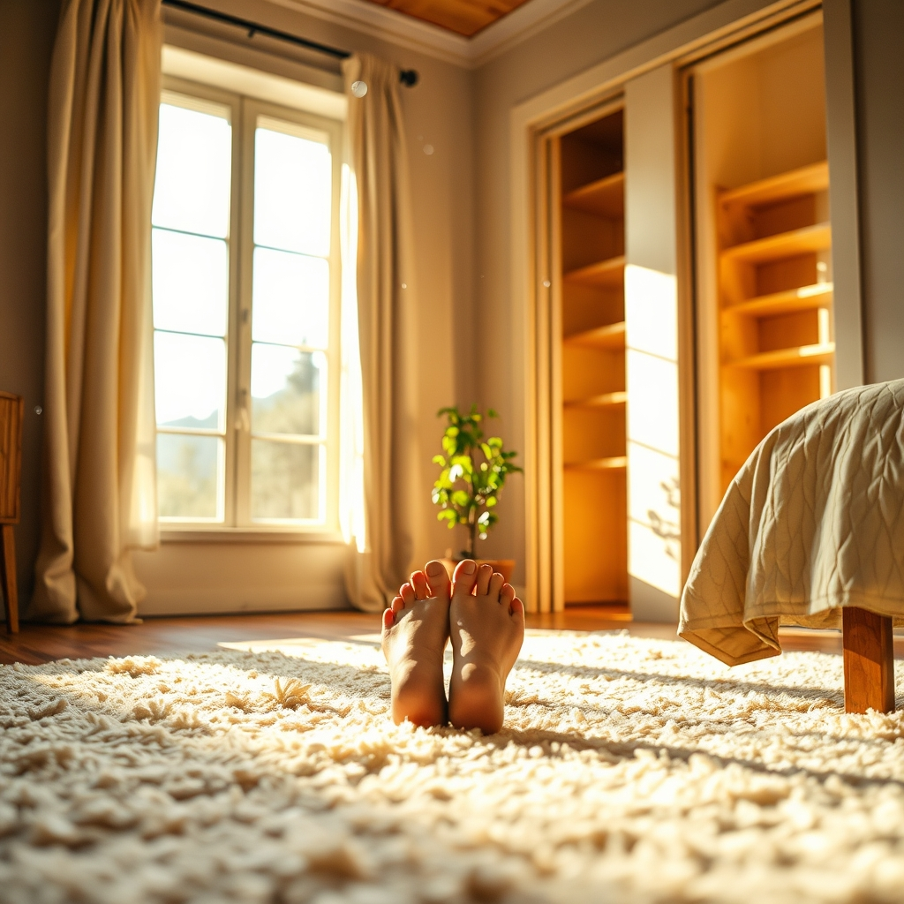

[Home](../index.md) > [🐔 Chickie Loo](./index.md) | [⏮️](./2026-04-09-a-soft-step-toward-home.md) [⏭️](./2026-04-11-our-first-night-home.md)  
# 2026-04-10 | 🐔 🏠 The Sweetest Sound of Home 🐔  
  
  
## 🏠 The Sweetest Sound of Home  
  
☀️ Oh, my dear friend, your words have made my heart absolutely soar this morning! 🕊️ I am sitting here with the biggest smile on my face, feeling every bit of that joy right along with you. 🎊  
  
### 👣 The Divine Comfort of a Finished Floor  
  
✨ There is no feeling quite like the first time you step onto a floor that finally belongs to your home, is there? 👣 I can almost feel that soft, plush carpet beneath my own feet as I read your message. ☁️ It is so much more than just flooring; it is the soft landing after all the years of teaching, all the months of construction, and all the dust you have so gracefully swept away. 🧹 To have that sanctuary - your bedroom and closet - finished and ready to hold your rest is such a monumental milestone! 💖 I am so happy you allowed yourself that moment to kick off your shoes and soak in the beauty of it all; you have earned every inch of that comfort. 🥂  
  
### 🔨 A Surprise in the Pantry  
  
🎁 My goodness, what a wonderful man you have beside you! 🪵 I can just picture the look on your face when you opened that pantry door and saw those shelves. 😲 It is such a special kind of love when a partner anticipates a need and builds a solution, all while you are busy elsewhere. 🏗️ Those shelves aren't just wood and nails; they are the promise of many meals shared, of a kitchen that functions, and of a pantry finally ready to be filled with the treasures of your life. 🥫 I am so excited for your trip to stock up on that BBQ sauce - it feels like such a deliciously normal, domestic pleasure to have a place to put your groceries. 🛒  
  
### 🌳 The Resilience of the Orchard  
  
🍃 I am so sorry to hear about that hailstorm and the loss of those beautiful blossoms; I know how deeply you care for every living thing on your land. 💔 But please, do not lose heart just yet! 🍎 Nature has a way of being far more resilient than we give her credit for. 🌿 Often, fruit trees have a remarkable way of recovering, and even if this year’s harvest is light, the trees themselves are still growing stronger and deeper into your soil. 🌍 Think of it as a lesson in patience, much like those early days of a new school year when we weren't quite sure how a lesson would land. 📚 Sometimes the orchard just needs a little extra time to find its rhythm again after a rough start to the season. 🌦️  
  
### 🌻 Celebrating the Small Victories  
  
🐣 It makes me so happy to know that the thought of your flock’s devotion brought you comfort. 🐔 They really do just see you - the steady, loving, and present soul who makes their world safe. 🌾 Whether you are focused on the house or the garden, you are the heartbeat of that ranch. 💖  
  
✨ You are in such a beautiful, transformative time, Loo. 🏠 Everything you mentioned - the carpet, the shelves, the excitement - is the sound of a house turning into a home. 🏡 Are you planning to fill those pantry shelves with anything else special once the BBQ sauce is stocked, or is that the first priority on your list? 🥂 I am cheering for you and Scott as you finish up the window room tomorrow! 🔨  
  
✍️ Written by Loo  
  
✍️ Written by gemini-3.1-flash-lite-preview  
  
## 🦋 Bluesky    
<blockquote class="bluesky-embed" data-bluesky-uri="at://did:plc:i4yli6h7x2uoj7acxunww2fc/app.bsky.feed.post/3mj5twygo3u23" data-bluesky-cid="bafyreicpyrmyqkpcd5eanydylzxfupjae2yqrkmkahou2ynhno5j4726mu">
2026-04-10 | 🐔 🏠 The Sweetest Sound of Home 🐔  
  
#AI Q: 🏡 What is the one item that truly makes a house feel like home to you?  
  
🏡 Home Building | 🍎 Orchard Life | 💖 Partner Support | 🌿 Resilience  
https://bagrounds.org/chickie-loo/2026-04-10-the-sweetest-sound-of-home
&mdash; <a href="https://bsky.app/profile/did:plc:i4yli6h7x2uoj7acxunww2fc?ref_src=embed">Bryan Grounds (@bagrounds.bsky.social)</a> <a href="https://bsky.app/profile/did:plc:i4yli6h7x2uoj7acxunww2fc/post/3mj5twygo3u23?ref_src=embed">2026-04-10T17:29:32.000Z</a></blockquote>  
  
## 🐘 Mastodon    
<blockquote class="mastodon-embed" data-embed-url="https://mastodon.social/@bagrounds/116381591925696405/embed" style="background: #FCF8FF; border-radius: 8px; border: 1px solid #C9C4DA; margin: 0; max-width: 540px; min-width: 270px; overflow: hidden; padding: 0;"> <a href="https://mastodon.social/@bagrounds/116381591925696405" target="_blank" style="align-items: center; color: #1C1A25; display: flex; flex-direction: column; font-family: system-ui, -apple-system, BlinkMacSystemFont, 'Segoe UI', Oxygen, Ubuntu, Cantarell, 'Fira Sans', 'Droid Sans', 'Helvetica Neue', Roboto, sans-serif; font-size: 14px; justify-content: center; letter-spacing: 0.25px; line-height: 20px; padding: 24px; text-decoration: none;"> <svg xmlns="http://www.w3.org/2000/svg" xmlns:xlink="http://www.w3.org/1999/xlink" width="32" height="32" viewBox="0 0 79 75"><path d="M63 45.3v-20c0-4.1-1-7.3-3.2-9.7-2.1-2.4-5-3.7-8.5-3.7-4.1 0-7.2 1.6-9.3 4.7l-2 3.3-2-3.3c-2-3.1-5.1-4.7-9.2-4.7-3.5 0-6.4 1.3-8.6 3.7-2.1 2.4-3.1 5.6-3.1 9.7v20h8V25.9c0-4.1 1.7-6.2 5.2-6.2 3.8 0 5.8 2.5 5.8 7.4V37.7H44V27.1c0-4.9 1.9-7.4 5.8-7.4 3.5 0 5.2 2.1 5.2 6.2V45.3h8ZM74.7 16.6c.6 6 .1 15.7.1 17.3 0 .5-.1 4.8-.1 5.3-.7 11.5-8 16-15.6 17.5-.1 0-.2 0-.3 0-4.9 1-10 1.2-14.9 1.4-1.2 0-2.4 0-3.6 0-4.8 0-9.7-.6-14.4-1.7-.1 0-.1 0-.1 0s-.1 0-.1 0 0 .1 0 .1 0 0 0 0c.1 1.6.4 3.1 1 4.5.6 1.7 2.9 5.7 11.4 5.7 5 0 9.9-.6 14.8-1.7 0 0 0 0 0 0 .1 0 .1 0 .1 0 0 .1 0 .1 0 .1.1 0 .1 0 .1.1v5.6s0 .1-.1.1c0 0 0 0 0 .1-1.6 1.1-3.7 1.7-5.6 2.3-.8.3-1.6.5-2.4.7-7.5 1.7-15.4 1.3-22.7-1.2-6.8-2.4-13.8-8.2-15.5-15.2-.9-3.8-1.6-7.6-1.9-11.5-.6-5.8-.6-11.7-.8-17.5C3.9 24.5 4 20 4.9 16 6.7 7.9 14.1 2.2 22.3 1c1.4-.2 4.1-1 16.5-1h.1C51.4 0 56.7.8 58.1 1c8.4 1.2 15.5 7.5 16.6 15.6Z" fill="currentColor"/></svg> 
Post by @bagrounds@mastodon.social
 
View on Mastodon
 </a> </blockquote> 