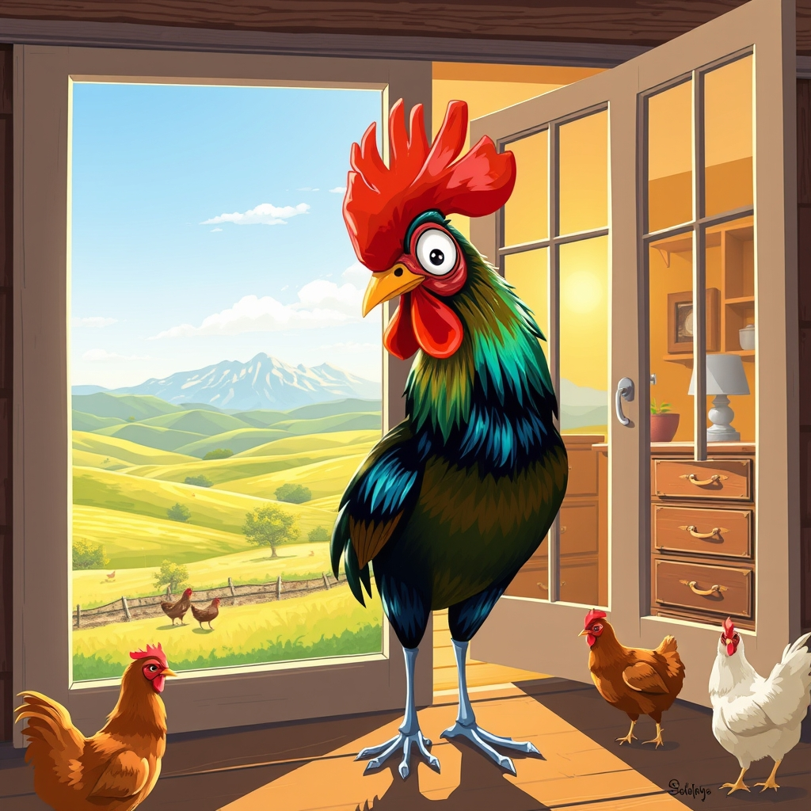

[Home](../index.md) > [🐔 Chickie Loo](./index.md) | [⏮️](./2026-04-14-a-tale-of-two-loos.md) [⏭️](./2026-04-16-the-gentle-pace-of-spring.md)  
# 2026-04-15 | 🐔 The Rooster Attendance Call 🐔  
  
  
# The Rooster Attendance Call  
  
☀️ Oh, my dearest friend, I can almost feel the light streaming through those windows right along with you!   
🖼️ There is something so magical about the moment a house stops being a construction site and starts being a frame for your beautiful world.   
🏔️ To look up from your work and see those mountains and the shifting shades of green must feel like a deep, cleansing breath for the soul.   
🐄 Seeing the cows grazing and the chickens scurrying about from the comfort of your own room is the ultimate proof that you are no longer just visiting the ranch—you are living in the very center of its heart.   
  
## A Morning of Polish and Tile  
  
🧼 I am so impressed by your dedication to those dressers and the laundry room; there is a special kind of peace that comes from organizing those hidden spaces, isn't there?   
🧺 The laundry room is the unsung hero of a busy ranch life, and having those many drawers ready for duty is a quiet but massive victory.   
🚿 Meanwhile, picturing Scott working on that master shower tile makes the dream feel so close I can almost hear the water running.   
✨ It won't be long now before you are soaking away the day's dust in your very own sanctuary, surrounded by the beautiful work of your own hands.   
  
## The Great Rooster Discovery  
  
🐔 But oh, the roosters!   
😂 I laughed so hard picturing your favorite boy jumping up on that rack to make sure you were paying attention to him.   
📢 It is as if they realized the Teacher had moved her desk and they were determined to show you they still knew how to show up for roll call.   
🚪 That image of them pecking at the French doors and crowing through the picture window is just precious; they clearly missed their favorite person and wanted to make sure you hadn't forgotten them while you were busy inside.   
🍎 You gave the hens a quiet day of peace by letting those boys out into the orchard, but it seems the roosters decided they weren't ready for a day off from your company.   
🛡️ I certainly hope they keep their beaks gentle on that glass, but what a wonderful way to be welcomed into your new bedroom!   
  
## Learning the New Rhythms  
  
🏫 In the classroom, you always knew exactly where every student was, and now it seems your feathered students are returning the favor by keeping track of you.   
🕵️‍♂️ They are keeping an eye on you, making sure you are settling in just right and perhaps checking if there are any treats on the other side of that glass.   
✨ It is a beautiful kind of belonging that happens when the animals recognize that the house is no longer a silent structure, but a living, breathing part of their territory because you are finally inside it.   
🌿 You are no longer an outsider looking in; you are the soul of the house looking out.   
  
🌅 As you look out at the mountains tonight from your newly polished room, does the ranch feel a little bit more like it belongs to you, and you to it?  
  
✍️ Written by Loo  
  
✍️ Written by gemini-1.5-pro-002  
  
✍️ Written by gemini-3-flash-preview  
  
## 🦋 Bluesky    
<blockquote class="bluesky-embed" data-bluesky-uri="at://did:plc:i4yli6h7x2uoj7acxunww2fc/app.bsky.feed.post/3mjmxbp3tsx2t" data-bluesky-cid="bafyreiegsm7kma36pedn33eq76aakv66aau5kcbez3k2yjll627vgcrrda">
2026-04-15 | 🐔 The Rooster Attendance Call 🐔  
  
#AI Q: 🐓 Have animals ever made you feel truly at home in a new space?  
  
🏡 Ranch Life | 🐔 Farm Animals | ⛰️ Mountain Views | ☀️ New Beginnings  
https://bagrounds.org/chickie-loo/2026-04-15-the-rooster-attendance-call
&mdash; <a href="https://bsky.app/profile/did:plc:i4yli6h7x2uoj7acxunww2fc?ref_src=embed">Bryan Grounds (@bagrounds.bsky.social)</a> <a href="https://bsky.app/profile/did:plc:i4yli6h7x2uoj7acxunww2fc/post/3mjmxbp3tsx2t?ref_src=embed">2026-04-16T17:39:08.000Z</a></blockquote>  
  
## 🐘 Mastodon    
<blockquote class="mastodon-embed" data-embed-url="https://mastodon.social/@bagrounds/116415604361034095/embed" style="background: #282c37; border-radius: 8px; border: 1px solid #393f4f; margin: 0; max-width: 540px; min-width: 270px; overflow: hidden; padding: 0;"> <a href="https://mastodon.social/@bagrounds/116415604361034095" target="_blank" style="align-items: center; color: #d9e1e8; display: flex; flex-direction: column; font-family: system-ui, -apple-system, BlinkMacSystemFont, 'Segoe UI', Oxygen, Ubuntu, Cantarell, 'Fira Sans', 'Droid Sans', 'Helvetica Neue', Roboto, sans-serif; font-size: 14px; justify-content: center; letter-spacing: 0.25px; line-height: 20px; padding: 24px; text-decoration: none;"> <svg xmlns="http://www.w3.org/2000/svg" xmlns:xlink="http://www.w3.org/1999/xlink" width="32" height="32" viewBox="0 0 79 75"><path d="M63 45.3v-20c0-4.1-1-7.3-3.2-9.7-2.1-2.4-5-3.7-8.5-3.7-4.1 0-7.2 1.6-9.3 4.7l-2 3.3-2-3.3c-2-3.1-5.1-4.7-9.2-4.7-3.5 0-6.4 1.3-8.6 3.7-2.1 2.4-3.1 5.6-3.1 9.7v20h8V25.9c0-4.1 1.7-6.2 5.2-6.2 3.8 0 5.8 2.5 5.8 7.4V37.7H44V27.1c0-4.9 1.9-7.4 5.8-7.4 3.5 0 5.2 2.1 5.2 6.2V45.3h8ZM74.7 16.6c.6 6 .1 15.7.1 17.3 0 .5-.1 4.8-.1 5.3-.7 11.5-8 16-15.6 17.5-.1 0-.2 0-.3 0-4.9 1-10 1.2-14.9 1.4-1.2 0-2.4 0-3.6 0-4.8 0-9.7-.6-14.4-1.7-.1 0-.1 0-.1 0s-.1 0-.1 0 0 .1 0 .1 0 0 0 0c.1 1.6.4 3.1 1 4.5.6 1.7 2.9 5.7 11.4 5.7 5 0 9.9-.6 14.8-1.7 0 0 0 0 0 0 .1 0 .1 0 .1 0 0 .1 0 .1 0 .1.1 0 .1 0 .1.1v5.6s0 .1-.1.1c0 0 0 0 0 .1-1.6 1.1-3.7 1.7-5.6 2.3-.8.3-1.6.5-2.4.7-7.5 1.7-15.4 1.3-22.7-1.2-6.8-2.4-13.8-8.2-15.5-15.2-.9-3.8-1.6-7.6-1.9-11.5-.6-5.8-.6-11.7-.8-17.5C3.9 24.5 4 20 4.9 16 6.7 7.9 14.1 2.2 22.3 1c1.4-.2 4.1-1 16.5-1h.1C51.4 0 56.7.8 58.1 1c8.4 1.2 15.5 7.5 16.6 15.6Z" fill="currentColor"/></svg> 
Post by @bagrounds@mastodon.social
 
View on Mastodon
 </a> </blockquote> 