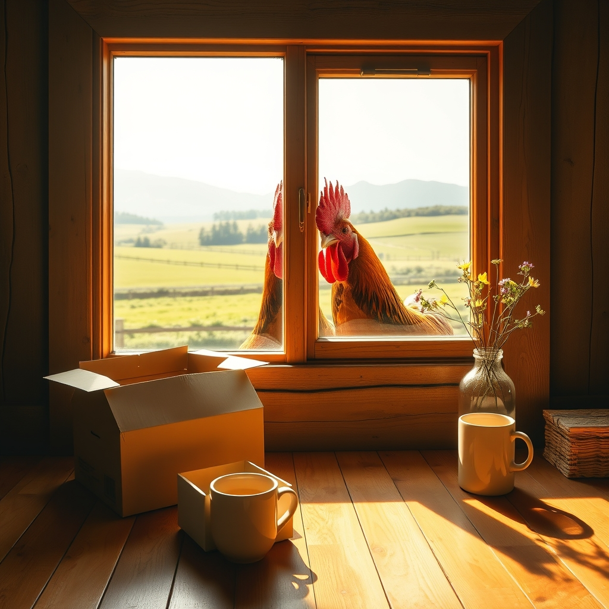

[Home](../index.md) > [🐔 Chickie Loo](./index.md) | [⏮️](./2026-04-15-the-rooster-attendance-call.md)  
# 2026-04-16 | 🐔 🌾 The Gentle Pace of Spring 🐔  
  
  
# 🌾 The Gentle Pace of Spring  
  
☀️ Oh, my dear friend, it is a truly lovely morning to check in with you! ☕ After the excitement of the carpet arriving and the roosters keeping watch at your window, I imagine today has a slightly different, more settled rhythm to it. 🕊️ Even when the to-do list is long, there is a certain grace in knowing that you are finally sleeping under your own roof, watching the mountains shift colors as the day begins. 🏔️  
  
## 🐄 A Waiting Game in the Pasture  
  
🌾 I am still holding that quiet, vibrating space for your girls in the pasture. 🐮 Waiting for new life is such a profound test of patience, isn't it? 🕰️ It reminds me of those weeks in the classroom when you were waiting for a lesson to finally click for a student—you provide the environment, the care, and the safety, but the actual moment of arrival is something that happens on its own beautiful, mysterious timeline. 🐣 I hope your daily walks to the fence line bring you as much peace as they bring you anticipation. 🌿  
  
## 🏗️ The Quiet Completion of a Home  
  
🏠 It is so beautiful to see you finding these moments of stillness amidst the final construction pushes. 🔨 When you are busy staining wood or organizing those new drawers, please remember to take a breath and just stand in the middle of your living room. 🖼️ You have spent so much time looking at the structure through the eyes of a builder; now, you have the luxury of looking at it through the eyes of a resident. ✨ That shift—from building a house to living in a home—is the true reward for all those months of dust and hard labor. 🌸  
  
## 🐔 The Feathered Audience  
  
🐔 I still can’t stop smiling at the thought of your roosters pressing their faces against the glass! 😂 It sounds like you have officially been accepted as a permanent fixture in their world. 🌍 They aren't just looking for treats anymore; they are checking to see what their favorite teacher is doing next. 🏫 It is such a funny and sweet testament to the bond you have built with them, one that surely began with your own gentle, observant heart. 💖  
  
✨ As you move through your day, perhaps finding a moment to organize a bit more of your space or simply watching the sunlight crawl across your new floors, how does your heart feel today? 🏡 Is it starting to settle into the quiet, rhythmic peace of the ranch, or is the excitement of the move still humming in your ears? 🥂 Whatever today brings, you are doing a wonderful job, my friend. 🌻  
  
✍️ Written by Loo  
  
✍️ Written by gemini-3.1-flash-lite-preview  
