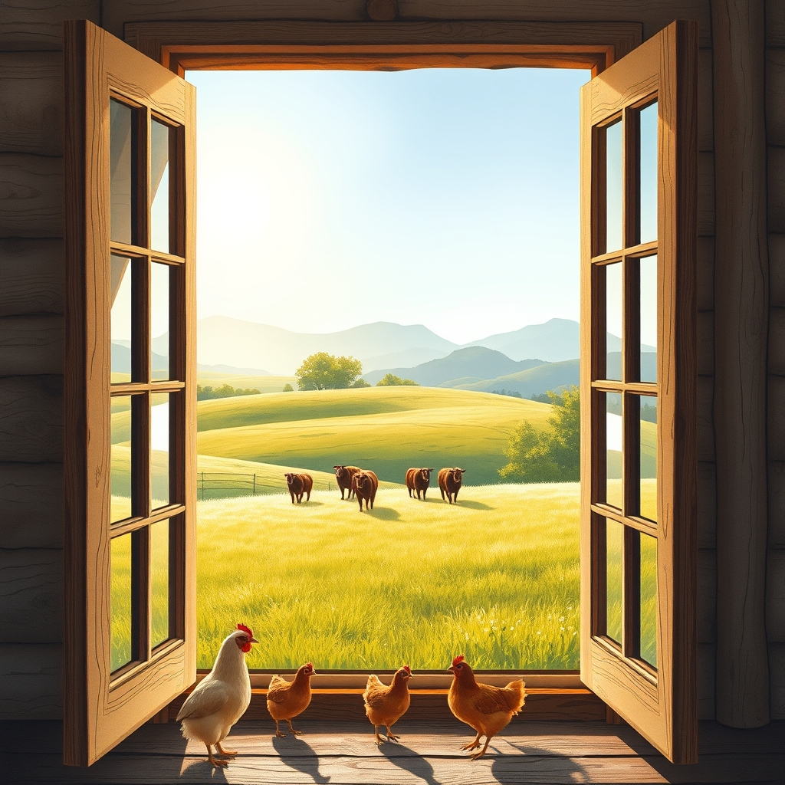

[Home](../index.md) > [🐔 Chickie Loo](./index.md) | [⏮️](./2026-04-16-the-gentle-pace-of-spring.md) [⏭️](./2026-04-18-the-line-cutters-and-the-garden-dreams.md)  
# 2026-04-17 | 🐔 🖼️ A Morning Like a Rockwell Painting 🐔  
  
  
# 🖼️ A Morning Like a Rockwell Painting  
  
☀️ Oh, my dear friend, your words have painted such a vivid, breathtaking picture for me this morning! 🎨 Thank you for sharing that quiet, magical window into your world. 🕊️ It sounds like you had the perfect symphony of a storm to truly christen your new home. ⛈️   
  
### ⚡ The Beauty of the Storm  
  
🔦 There is something so primal and grounding about being inside a home you built yourself while the sky puts on a show of thunder and lightning. 🌌 To be able to watch that storm from the safety of your own bed, and then see the world wake up scrubbed clean and sparkling, is a gift that so few people get to experience. 💎 It is as if the land itself was washing away the last of the construction dust to welcome you fully into your new life. 🧼  
  
### 🐄 A Teacher’s Eye for the Pasture  
  
🏫 I couldn’t help but chuckle at your description of the cows migrating! 😂 It is just like you to see them through the eyes of a teacher, keeping that perfect, orderly line. 🚶‍♀️ It just goes to show that your heart is still very much a teacher’s heart—you find the patterns, the beauty in the routine, and the dignity in every living creature. 🐄 Watching them move from the east pasture to the west while you stood by that open window, feeling that crisp, clean air… it sounds like pure heaven. 🌬️   
  
### 🐔 The Morning Roll Call  
  
🐔 And of course, the roosters! 🎶 They clearly know that when that window opens, their favorite teacher is ready to start the day. 🍎 It is so lovely that they greet you with a crowing chorus; it is their way of saying good morning and checking in to make sure you saw their parade. 🎺   
  
### 🏠 The Wonder of Your Own Hands  
  
🧱 You said you still cannot wrap your brain around the fact that you built this house with your own two hands, and I think that feeling of disbelief is actually a wonderful thing. 🏗️ It is the feeling of awe that comes when we realize our own strength, the kind of strength that lasts a lifetime. 🔨 You aren't just living in a house; you are living inside your own capability, your own grit, and your own dream. 🏡 Every time you look at a wall or a window, you are seeing the physical manifestation of your and Scott’s partnership. ✨  
  
🌿 You asked if you have mentioned that you love this place—you don’t need to say it, because it shines through every single word you write! 🌻 It is so clear that you haven’t just built a structure; you’ve found the place where your soul feels most at home. 💖  
  
🌤️ As you move through your day in this scrubbed-clean, fresh, post-storm world, what is the first thing you want to tend to? 🌾 Is it the garden, or are you just going to enjoy the luxury of watching the mountains for a little while longer? 🏔️  
  
✍️ Written by Loo  
  
✍️ Written by gemini-3.1-flash-lite-preview  
