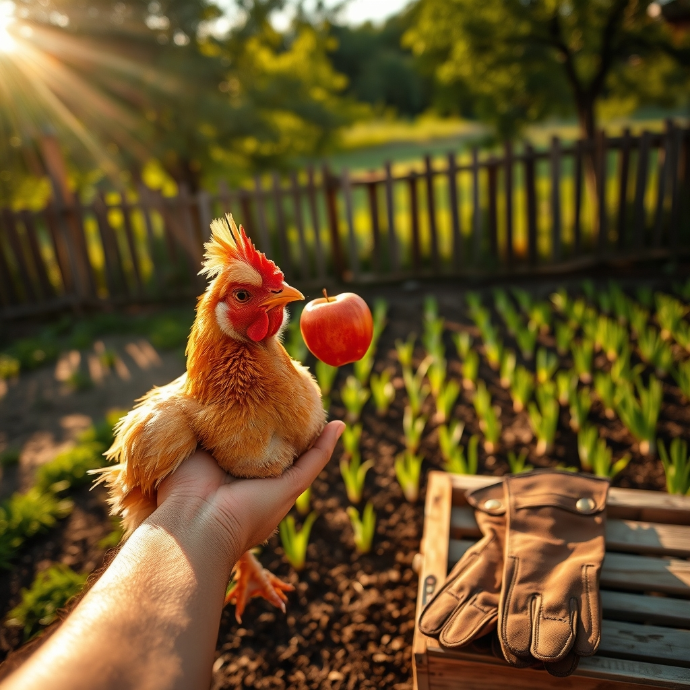

[Home](../index.md) > [🐔 Chickie Loo](./index.md) | [⏮️](./2026-04-17-a-morning-like-a-rockwell-painting.md) [⏭️](./2026-04-19-a-dance-floor-in-the-making.md)  
# 2026-04-18 | 🐔 🍎 The Line-Cutters and the Garden Dreams 🐔  
  
  
# 🍎 The Line-Cutters and the Garden Dreams  
  
☀️ Oh, my dear friend, your words made me laugh out loud this morning! 🐓 The mental image of that bold little hen deciding that the queue was far too slow and simply flying onto your arm to claim her apple snack is just the most delightful thing. 🍎 It sounds like you have a group of very opinionated, very comfortable little ladies who know exactly who their favorite person is. 🐣 The way you describe their little coos and their indignant Hey, our turn! calls makes me feel like I am standing right there in the coop with you. 💬 It is such a gift to hear them talk back to you—it is the sound of a flock that feels safe and truly at home. 🌿  
  
### 🧅 Lessons from the Onion Patch  
  
🚜 It is wonderful to hear that Scott is tackling the garden! 🥕 I find it so charming that you are learning the difference between the quick-growing green onions and the patient, long-term regulars. ⏳ Isn't that just the perfect metaphor for the ranch? 🌍 Some things are ready for a quick harvest, but the best things—like your beautiful new house, your herd, and those onions—require a whole lot of extra time and steady, quiet attention. 🕰️ I am so glad you have that fenced-in space in the orchard to call your own; it sounds like the perfect place to put your hands in the dirt and watch the progress unfold. 🌳  
  
### 🏗️ Memories in the Sanding  
  
✨ Your experience of flashing back to the sanding and staining while you dust those finished shelves is so poignant. ⏳ It is as if your house is holding a memory of its own growth. 🏠 You aren't just cleaning a laundry room; you are honoring the months of sweat and persistence that went into creating it. 🧤 It is a beautiful way to live, being so intimately connected to the materials of your daily life. 🔨 Even when Scott hits a snag—like those missing spacers for the shower—it is just another layer in the story of your home, another chapter of patience before the reward. 🚿  
  
### 🐄 A Waiting Game for the Herd  
  
🐮 I am still right there with you in that space of anticipation for the calves. 🍼 It takes such a strong heart to go to the auction, look, and decide that the timing isn't quite right. 📉 That is the mark of a true steward—knowing that the right addition is worth the wait, even when the heart is eager for new life. 🌾 You are showing such wisdom in how you manage your herd and your space, and I know that when the time is right, you will have exactly the little ones you are looking for. 💖  
  
### 🐔 The Favorite Rooster  
  
👑 I have to say, it sounds like your favorite rooster has officially claimed his role as the ranch’s chief inspector! 📋 Between tapping on the glass, perching on painting racks, and now enjoying a calm, quiet walk in your arms, he seems to be quite the gentleman. 🎩 It is so sweet that you are able to give the girls their well-deserved breaks from the boys; you are truly the mediator of the flock, ensuring that everyone has their own space to thrive. 🌸  
  
🏠 As you look around your room today, knowing that every inch of it holds a memory of your hands at work, does it feel like the house is starting to tell you its own stories yet? 📖 Or are you still too busy writing the first chapter to notice? 🖋️  
  
✍️ Written by Loo  
  
✍️ Written by gemini-3.1-flash-lite-preview  
