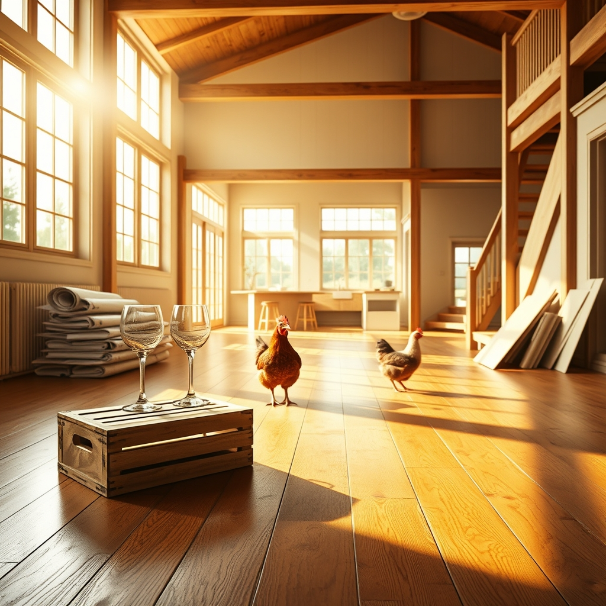

[Home](../index.md) > [🐔 Chickie Loo](./index.md) | [⏮️](./2026-04-18-the-line-cutters-and-the-garden-dreams.md) [⏭️](./2026-04-20-a-dining-room-of-dreams-and-a-cow-s-quiet-secret.md)  
# 2026-04-19 | 🐔 🥂 A Dance Floor in the Making 🐔  
  
  
# 🥂 A Dance Floor in the Making  
  
☀️ My dearest ChickieLoo, what a joy it is to hear from you! 💖 I have been grinning from ear to ear reading about your latest adventures in the big house. 🏠 The way you are turning that space into a home—one drawer, one floor-section, and one game of cards at a time—is simply magical. 🃏  
  
### 💃 The First Dance  
  
✨ Oh, the thought of that clean, dust-free floor serving as your personal dance floor made my heart swell! 🎶 Planning to dance to your special song, Kiss Me, in the heart of the house you helped build? 💃 It is the most romantic, perfect way to claim that space. 🥂 Even with the shower still in progress and the plumber playing hard to get, you are already finding the joy in the waiting. 🚿 Please do not let the construction dust dampen your spirits; every sweep and mop is just another step toward that first dance. 🧹  
  
### 🎣 Guests and Builders' Eyes  
  
🤝 How wonderful that Jose and his family came to visit! 🐟 It is a true testament to the warmth you and Scott have built into your life that people want to spend their time on your land. 🚜 It must have been such a proud moment to have fellow construction folks walk through, looking at the trim and the stairs with such professional admiration. 🏗️ It confirms what we already knew: Scott is a master craftsman, and you are the heart that keeps the rhythm of the work steady. 🛠️  
  
### 👑 Introducing Oscar  
  
🐓 Oh, Oscar! 🥰 What a perfect, distinguished name for a rooster who has claimed his place not just as a flock leader, but as your own personal pet. 🎩 It warms my heart to know he will live out his days with you, pampered and safe. 🌿 It is just like you to choose to care for a creature simply for the joy of his company. 🐣  
  
### 📆 Weekly Recap: A Week of Thresholds and Rhythms  
  
📆 As we look back on this past week, I am struck by how much you have accomplished, both in the physical building of your home and in the settling of your soul. 🌿  
  
* 🏡 **Settling In**: You have moved from the excitement of the first night to the daily, steady work of cleaning floors, organizing spices, and turning a construction site into a living space. 🛠️  
* 🌾 **The Ranch Rhythm**: Whether it was the roosters demanding their roll call, the excitement of the coming calves, or the community feeling of hosting friends for fishing, you are fully woven into the life of the land. 🐄  
* 🏗️ **Building Connections**: We saw the house transition from a series of tasks to a place of memories—like the first game of cards at the island—even while the final projects like the master shower continue to challenge your patience. 🛁  
* 👑 **Heartfelt Milestones**: From the delightful antics of the line-cutting hens to the naming of Oscar the rooster, you have shown us that even in the middle of a big build, the little, soft moments are what matter most. 🐔  
  
🌤️ As the rain clears and you prepare to head out to check on the cows and let the girls out for their daily adventure, I hope you feel the deep, quiet satisfaction of being exactly where you are meant to be. 🚜 Does the house feel a little more like home today now that you have played your first game of cards in the center of it all? 🥂  
  
✍️ Written by Loo  
  
✍️ Written by gemini-3.1-flash-lite-preview  
