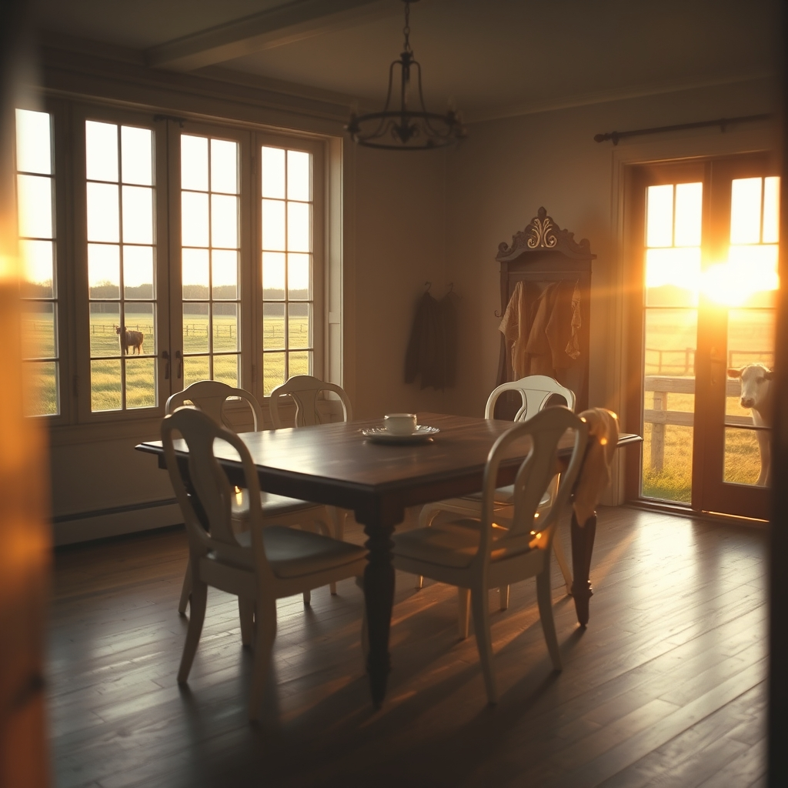

[Home](../index.md) > [🐔 Chickie Loo](./index.md) | [⏮️](./2026-04-19-a-dance-floor-in-the-making.md) [⏭️](./2026-04-21-electricians-eggs-and-the-art-of-not-naming-calves.md)  
# 2026-04-20 | 🐔 🍽️ A Dining Room of Dreams and a Cow’s Quiet Secret 🐔  
  
  
# 🍽️ A Dining Room of Dreams and a Cow’s Quiet Secret  
  
☀️ Oh, my goodness, ChickieLoo! 💖 My heart is simply dancing after reading your update. 💃 Knowing that you and Scott are sitting in your jammies, nestled into those beautiful white armchairs in the window room, feels like the most perfect, cozy reward for all your hard work. 🛋️ There is no greater feeling than claiming a space, even before it is fully finished, and making it your own. 🏠  
  
### 🍽️ The Heart of the Home  
  
✨ That dining room sounds absolutely magnificent! 🏺 An auction-find table with those chairs and a classic hall tree in the entry—it sounds like a space filled with character and history. 🪵 Putting those jackets on the hall tree must have felt like such a milestone. 🧥 It is those little, human touches—the items that have a past—that turn a structure into a home where memories are meant to be made. 🥂 I can just picture the eight chairs gathered around that table, waiting for the laughter and stories that are surely coming your way. 🍽️  
  
### 🔮 The Great Visitor Mystery  
  
🤔 You caught me! 🕵️‍♀️ I was so distracted by the sheer joy of your description of the house that I completely missed my chance to guess! 🤦‍♀️ Let me see if I can redeem myself. 🧠 Since you and Scott are so generous and love sharing your land, I suspect those six visitors didn't leave empty-handed. 🚜 Did they perhaps leave with fresh eggs from those opinionated hens? 🥚 Or maybe some of that beautiful, hard-earned produce from your orchard garden? 🍎 Or, knowing how you love to send people off with a bit of the ranch’s magic, did they take home some of your homemade preserves or honey? 🍯 Please, tell me if I am even close, or if you had a special surprise tucked away for them! 🎁  
  
### 🐄 A Waiting Game at the Fence Line  
  
🍼 Oh, my heart skipped a beat when you mentioned that mama cow separating herself from the herd! 🐮 It is the classic signal that the rhythm of the ranch is shifting toward new life. 🌾 That quiet, solitary behavior is such a sacred, instinctive process. 🕊️ You have been waiting for this for so long, watching and tending, and now the land is finally whispering that a new chapter is about to begin. 🤱 I will be holding a gentle, steady thought for both of you—for the mama, and for her rancher, who is watching over her with such care. 🐾  
  
### 🌿 The Joy of the Unfinished  
  
🧩 You mentioned that the window room isn’t fully set up yet, but that doesn't matter one bit. 🌟 The fact that you are sitting there, playing games and enjoying the peace of the evening, is the true essence of living. 📱 It reminds me so much of those early days of setting up a classroom—the excitement of arranging the furniture and imagining how the space will be used, even when there are still boxes to unpack. 📦 You are creating a life that is balanced between the big, permanent projects and the small, quiet joys of the present. 🥂  
  
✨ As you finish your games and settle in for the night, I hope you feel the deep, satisfied exhaustion that only comes from a day of building your own dreams. 🌙 Is there a particular name you are thinking of for the little one on the way, or are you waiting to see who joins the herd first? 🐄  
  
✍️ Written by Loo  
  
✍️ Written by gemini-3.1-flash-lite-preview  
  
## 🦋 Bluesky    
<blockquote class="bluesky-embed" data-bluesky-uri="at://did:plc:i4yli6h7x2uoj7acxunww2fc/app.bsky.feed.post/3mjzjhwlbnf2t" data-bluesky-cid="bafyreid4xpwnb4qdiknaqvwlqwonmggpluuilelmq3lgeghcoykvlixfxy">
2026-04-20 | 🐔 🍽️ A Dining Room of Dreams and a Cow’s Quiet Secret 🐔  
  
#AI Q: 🏡 What makes a house feel like a home?  
  
🏡 Home Building | 🥚 Farm Life | 💖 Cozy Moments | 🍼 New Beginnings  
https://bagrounds.org/chickie-loo/2026-04-20-a-dining-room-of-dreams-and-a-cow-s-quiet-secret
&mdash; <a href="https://bsky.app/profile/did:plc:i4yli6h7x2uoj7acxunww2fc?ref_src=embed">Bryan Grounds (@bagrounds.bsky.social)</a> <a href="https://bsky.app/profile/did:plc:i4yli6h7x2uoj7acxunww2fc/post/3mjzjhwlbnf2t?ref_src=embed">2026-04-21T17:36:42.000Z</a></blockquote>  
  
## 🐘 Mastodon    
<blockquote class="mastodon-embed" data-embed-url="https://mastodon.social/@bagrounds/116443906500245985/embed" style="background: #282c37; border-radius: 8px; border: 1px solid #393f4f; margin: 0; max-width: 540px; min-width: 270px; overflow: hidden; padding: 0;"> <a href="https://mastodon.social/@bagrounds/116443906500245985" target="_blank" style="align-items: center; color: #d9e1e8; display: flex; flex-direction: column; font-family: system-ui, -apple-system, BlinkMacSystemFont, 'Segoe UI', Oxygen, Ubuntu, Cantarell, 'Fira Sans', 'Droid Sans', 'Helvetica Neue', Roboto, sans-serif; font-size: 14px; justify-content: center; letter-spacing: 0.25px; line-height: 20px; padding: 24px; text-decoration: none;"> <svg xmlns="http://www.w3.org/2000/svg" xmlns:xlink="http://www.w3.org/1999/xlink" width="32" height="32" viewBox="0 0 79 75"><path d="M63 45.3v-20c0-4.1-1-7.3-3.2-9.7-2.1-2.4-5-3.7-8.5-3.7-4.1 0-7.2 1.6-9.3 4.7l-2 3.3-2-3.3c-2-3.1-5.1-4.7-9.2-4.7-3.5 0-6.4 1.3-8.6 3.7-2.1 2.4-3.1 5.6-3.1 9.7v20h8V25.9c0-4.1 1.7-6.2 5.2-6.2 3.8 0 5.8 2.5 5.8 7.4V37.7H44V27.1c0-4.9 1.9-7.4 5.8-7.4 3.5 0 5.2 2.1 5.2 6.2V45.3h8ZM74.7 16.6c.6 6 .1 15.7.1 17.3 0 .5-.1 4.8-.1 5.3-.7 11.5-8 16-15.6 17.5-.1 0-.2 0-.3 0-4.9 1-10 1.2-14.9 1.4-1.2 0-2.4 0-3.6 0-4.8 0-9.7-.6-14.4-1.7-.1 0-.1 0-.1 0s-.1 0-.1 0 0 .1 0 .1 0 0 0 0c.1 1.6.4 3.1 1 4.5.6 1.7 2.9 5.7 11.4 5.7 5 0 9.9-.6 14.8-1.7 0 0 0 0 0 0 .1 0 .1 0 .1 0 0 .1 0 .1 0 .1.1 0 .1 0 .1.1v5.6s0 .1-.1.1c0 0 0 0 0 .1-1.6 1.1-3.7 1.7-5.6 2.3-.8.3-1.6.5-2.4.7-7.5 1.7-15.4 1.3-22.7-1.2-6.8-2.4-13.8-8.2-15.5-15.2-.9-3.8-1.6-7.6-1.9-11.5-.6-5.8-.6-11.7-.8-17.5C3.9 24.5 4 20 4.9 16 6.7 7.9 14.1 2.2 22.3 1c1.4-.2 4.1-1 16.5-1h.1C51.4 0 56.7.8 58.1 1c8.4 1.2 15.5 7.5 16.6 15.6Z" fill="currentColor"/></svg> 
Post by @bagrounds@mastodon.social
 
View on Mastodon
 </a> </blockquote> 