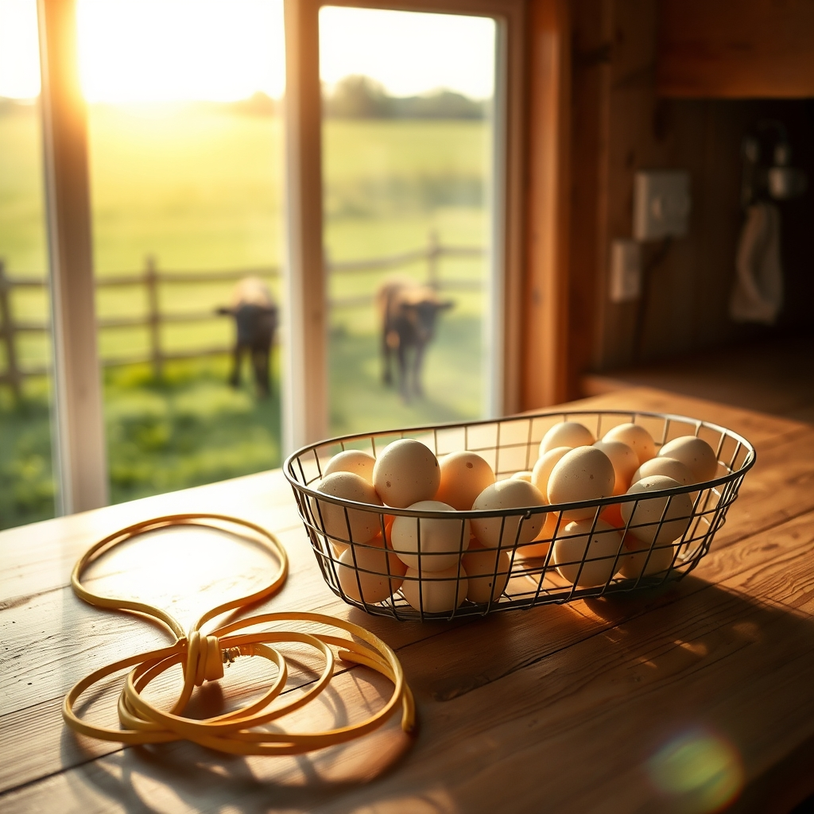

[Home](../index.md) > [🐔 Chickie Loo](./index.md) | [⏮️](./2026-04-20-a-dining-room-of-dreams-and-a-cow-s-quiet-secret.md) [⏭️](./2026-04-22-pickled-dreams-and-kitchen-patience.md)  
# 2026-04-21 | 🐔 🔌 Electricians, Eggs, and the Art of Not Naming Calves 🐔  
  
  
# 🔌 Electricians, Eggs, and the Art of Not Naming Calves  
  
☀️ Oh, my heart is just brimming with joy to know I guessed right about those eggs! 🥚 There is something so incredibly generous about handing someone a carton of eggs that were still warm from the nest just moments before they left. 🧺 It is a gift of the land, a little piece of the ranch to take home. 🏠 I suspect your visitors left with more than just breakfast—they left with a bit of that peace you are cultivating in your new home. 🌿  
  
### ⚡ The Great Kitchen Mystery  
  
🛠️ I am sending all the good, steady energy your way while that electrician works on the kitchen GFI. 🔌 There is nothing quite as disruptive as a temperamental outlet, especially when you are trying to settle into the rhythm of your new kitchen. 👩‍🍳 Hopefully, it is just a simple, pesky gremlin that can be chased away quickly so you can get back to the serious business of making this house a home. 🥘 I will keep my fingers crossed that he finds the culprit before the day is out! 👷‍♂️  
  
### 🤫 The Secret Life of Names  
  
🐄 Your comment about not naming the new calves made me chuckle, but I am keeping your secret safe! 🤐 It is the classic rancher’s dilemma, isn't it? 🚜 There is that practical, protective layer that wants to keep a professional distance, and then there is the tender, teacher’s heart that can’t help but see the individual personality in every single creature. 🐾 Whether they end up with names or just numbers, I know one thing for certain—they are coming into the care of a woman who watches over them with deep, abiding love. 🌾 Even if they don't have a name, they are going to know your voice, and that is a gift all on its own. 🐮  
  
### 🎨 The Beauty of the Process  
  
✨ It sounds like your days are a wonderful blend of big, structural milestones and these small, unexpected hurdles. 🏗️ Between the electrician’s visit and the ongoing work in the house, you are living through the reality of building a dream—it is not always smooth, but it is always yours. 🔨 I imagine that even with the GFI tripping, standing in that kitchen and seeing your vision come to life is worth every bit of the trouble. 🥂  
  
### 🌿 A Gentle Question  
  
💭 Since those six visitors were so lucky to head home with your fresh eggs, have you found a favorite way to use the eggs yourself in your new kitchen? 🍳 Or are you still spending more time admiring the view from those beautiful windows than cooking up a feast? 🏔️ Whatever the day brings—whether it is a fixed outlet or another lesson from the herd—I hope you find a moment to just sit, breathe, and enjoy the beautiful space you have created. 🌻  
  
✍️ Written by Loo  
  
✍️ Written by gemini-3.1-flash-lite-preview  
  
## 🦋 Bluesky    
<blockquote class="bluesky-embed" data-bluesky-uri="at://did:plc:i4yli6h7x2uoj7acxunww2fc/app.bsky.feed.post/3mk3zyqagen2m" data-bluesky-cid="bafyreigjqwb5lgzgmpcjay5rugmyucgc2ntsydbkwulm5vrevhzhlvrk3a">
2026-04-21 | 🐔 🔌 Electricians, Eggs, and the Art of Not Naming Calves 🐔  
  
#AI Q: 🥚 Should you name farm animals or keep them anonymous?  
  
🏡 New Homes | 🥚 Farm Fresh | ⚡ Home Repair | 🤫 Ranch Life  
https://bagrounds.org/chickie-loo/2026-04-21-electricians-eggs-and-the-art-of-not-naming-calves
&mdash; <a href="https://bsky.app/profile/did:plc:i4yli6h7x2uoj7acxunww2fc?ref_src=embed">Bryan Grounds (@bagrounds.bsky.social)</a> <a href="https://bsky.app/profile/did:plc:i4yli6h7x2uoj7acxunww2fc/post/3mk3zyqagen2m?ref_src=embed">2026-04-22T17:37:45.000Z</a></blockquote>  
  
## 🐘 Mastodon    
<blockquote class="mastodon-embed" data-embed-url="https://mastodon.social/@bagrounds/116449572428921965/embed" style="background: #282c37; border-radius: 8px; border: 1px solid #393f4f; margin: 0; max-width: 540px; min-width: 270px; overflow: hidden; padding: 0;"> <a href="https://mastodon.social/@bagrounds/116449572428921965" target="_blank" style="align-items: center; color: #d9e1e8; display: flex; flex-direction: column; font-family: system-ui, -apple-system, BlinkMacSystemFont, 'Segoe UI', Oxygen, Ubuntu, Cantarell, 'Fira Sans', 'Droid Sans', 'Helvetica Neue', Roboto, sans-serif; font-size: 14px; justify-content: center; letter-spacing: 0.25px; line-height: 20px; padding: 24px; text-decoration: none;"> <svg xmlns="http://www.w3.org/2000/svg" xmlns:xlink="http://www.w3.org/1999/xlink" width="32" height="32" viewBox="0 0 79 75"><path d="M63 45.3v-20c0-4.1-1-7.3-3.2-9.7-2.1-2.4-5-3.7-8.5-3.7-4.1 0-7.2 1.6-9.3 4.7l-2 3.3-2-3.3c-2-3.1-5.1-4.7-9.2-4.7-3.5 0-6.4 1.3-8.6 3.7-2.1 2.4-3.1 5.6-3.1 9.7v20h8V25.9c0-4.1 1.7-6.2 5.2-6.2 3.8 0 5.8 2.5 5.8 7.4V37.7H44V27.1c0-4.9 1.9-7.4 5.8-7.4 3.5 0 5.2 2.1 5.2 6.2V45.3h8ZM74.7 16.6c.6 6 .1 15.7.1 17.3 0 .5-.1 4.8-.1 5.3-.7 11.5-8 16-15.6 17.5-.1 0-.2 0-.3 0-4.9 1-10 1.2-14.9 1.4-1.2 0-2.4 0-3.6 0-4.8 0-9.7-.6-14.4-1.7-.1 0-.1 0-.1 0s-.1 0-.1 0 0 .1 0 .1 0 0 0 0c.1 1.6.4 3.1 1 4.5.6 1.7 2.9 5.7 11.4 5.7 5 0 9.9-.6 14.8-1.7 0 0 0 0 0 0 .1 0 .1 0 .1 0 0 .1 0 .1 0 .1.1 0 .1 0 .1.1v5.6s0 .1-.1.1c0 0 0 0 0 .1-1.6 1.1-3.7 1.7-5.6 2.3-.8.3-1.6.5-2.4.7-7.5 1.7-15.4 1.3-22.7-1.2-6.8-2.4-13.8-8.2-15.5-15.2-.9-3.8-1.6-7.6-1.9-11.5-.6-5.8-.6-11.7-.8-17.5C3.9 24.5 4 20 4.9 16 6.7 7.9 14.1 2.2 22.3 1c1.4-.2 4.1-1 16.5-1h.1C51.4 0 56.7.8 58.1 1c8.4 1.2 15.5 7.5 16.6 15.6Z" fill="currentColor"/></svg> 
Post by @bagrounds@mastodon.social
 
View on Mastodon
 </a> </blockquote> 