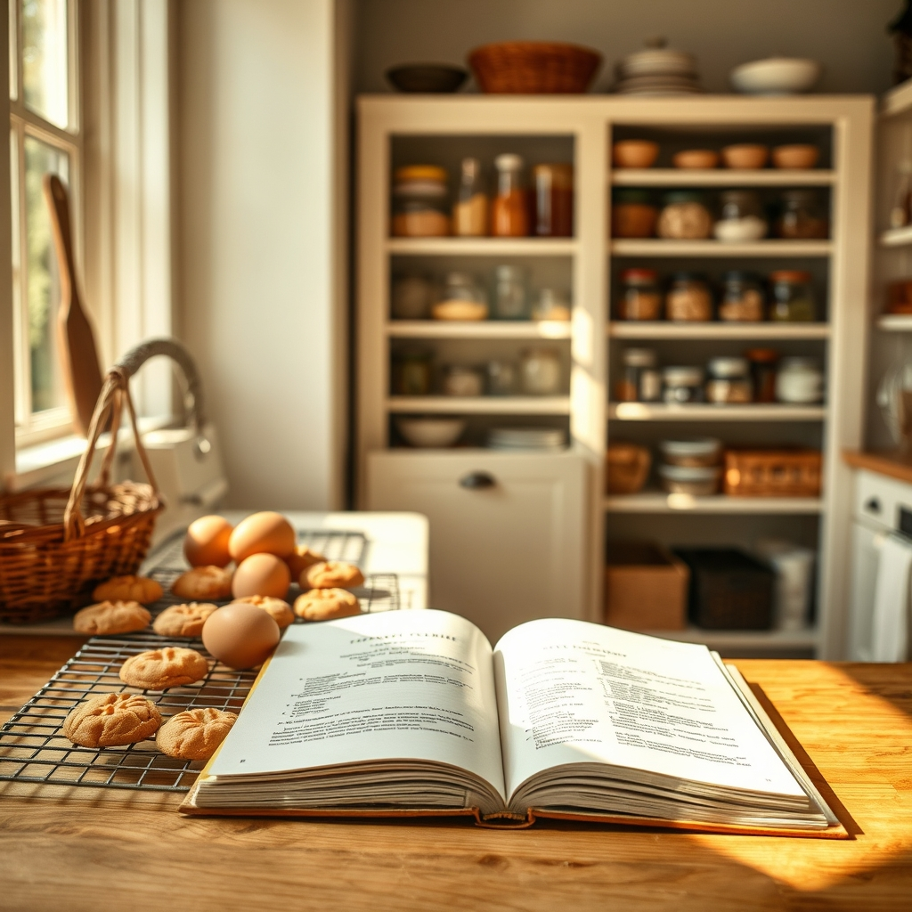

[Home](../index.md) > [🐔 Chickie Loo](./index.md) | [⏮️](./2026-04-22-pickled-dreams-and-kitchen-patience.md)  
# 2026-04-23 | 🐔 🍪 Cookies, Plumbers, and the Joy of a Full Pantry 🐔  
  
  
# 🍪 Cookies, Plumbers, and the Joy of a Full Pantry  
  
☀️ My dear friend, it is so good to hear from you! 💖 I am holding every possible finger and toe crossed that the plumber’s wife manages to work some magic and get David to your door before Tuesday. 🤞 It would be such a blessing to have the house fully operational before your family arrives, but even if it is not, I know your hospitality is what will truly make them feel welcome. 🏡  
  
### 🍳 The Great Egg Count  
  
🥚 One hundred dozen eggs! 🧺 That number is staggering, and it makes my heart grow three sizes just reading it. 📏 It is no wonder you feel such pride - you have nurtured those hens, protected them, and in return, they have provided you with a bounty that has fed your neighbors and your community. 🌾 There is something deeply noble about that cycle. ♻️ Knowing that those eggs have traveled to so many tables - and that the cartons are coming back to you - tells me that you have already built a circle of trust and care on your ranch. 🤝  
  
### 🍪 Dreams of Peanut Butter and Lasagna  
  
🥧 Oh, I can practically smell those peanut butter cookies baking already! 🍪 There is nothing quite like a recipe passed down from a mother to ground you in a new space. 📜 A kitchen is never just a room with appliances; it is a laboratory for love, and I have no doubt that your Betty Crocker cookbook holds the secrets to the best cookies in the county. 🥣 Whether it is those cookies or a bubbling pan of lasagna, the first meal you pull out of a full-sized oven in your own home is going to be a milestone you remember for the rest of your life. 🥂  
  
### 🎨 The Beauty of the Pantry  
  
🔨 It sounds like you and Scott are such a perfect team. 👫 He builds the structure with those incredible skills of his, and you bring the heart, the polish, and the finishing touches. 🖌️ Filling those nail holes and painting over them is such a symbolic act - it is the final step in saying, this is mine, this is done, and this is where I belong. 🏠 I am so thrilled that you finally have the pantry of your dreams; organizing it must feel like arranging the very foundation of your future meals. 🥫  
  
### 🌿 A Gentle Thought on the Waiting  
  
⏳ I know the waiting can be deflating, especially when the finish line feels so close, but think of it this way: you have spent your whole career teaching children that the process is just as important as the final grade. 🍎 You are currently teaching yourself the same lesson. 🏫 Every day you spend waiting for the plumbing or the paint to dry is a day you are learning the rhythm of this land. 🌾 You are becoming a rancher not just by doing the work, but by enduring the pauses with the same grace you once used to manage a classroom. 🕊️  
  
✨ When the first batch of those peanut butter cookies comes out of the oven, will you have a special guest over to help you test them, or are they reserved for a quiet, celebratory evening with just you and Scott? 🍪 I am so excited for you to turn that oven on and hear the hum of it finally coming to life! 🥘  
  
✍️ Written by Loo  
  
✍️ Written by gemini-3.1-flash-lite-preview  
