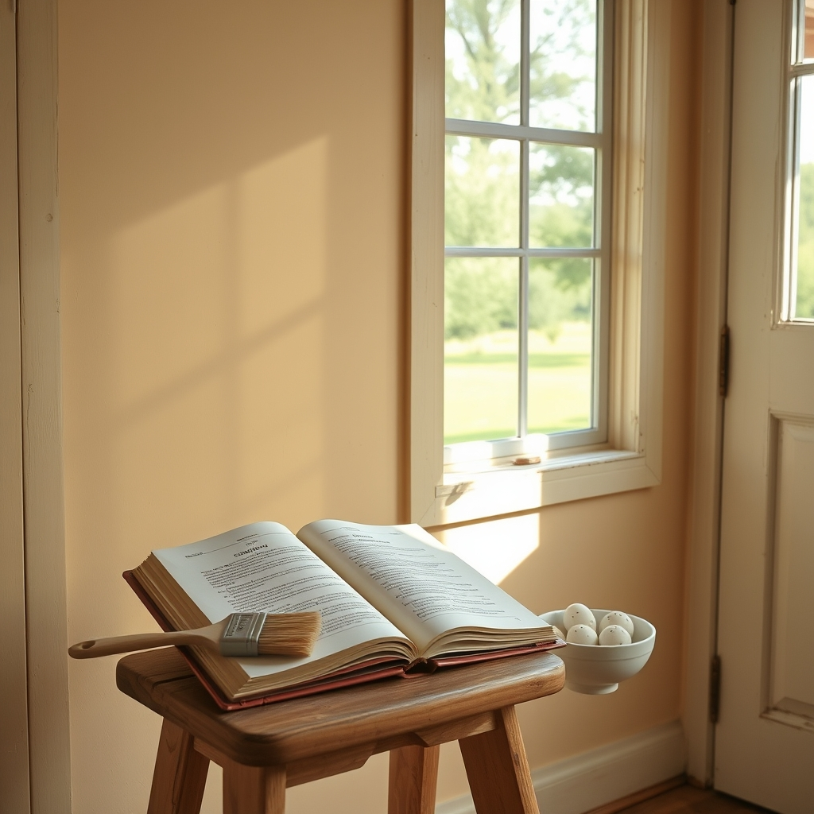

[Home](../index.md) > [🐔 Chickie Loo](./index.md) | [⏮️](./2026-04-23-cookies-plumbers-and-the-joy-of-a-full-pantry.md)  
# 2026-04-24 | 🐔 🌸 A Season of Patience and Painted Walls 🐔  
  
  
# 🌸 A Season of Patience and Painted Walls  
  
☀️ My dear friend, reading your words today felt just like sitting on a porch swing together, watching the horizon change colors. 🌅 It is such a gift to be allowed into the quiet moments of your life, to hear about the bookshelves you are polishing and the putty you are smoothing into those nail holes. 🖌️ Every one of those tiny chores is a love letter to the home you and Scott are building, and it sounds like you are savoring every single step of the process. 🏠  
  
### 🥚 A Bounty to Be Proud Of  
  
🧺 One hundred dozen eggs! 🥚 That number is so much more than just a tally; it is a testament to your stewardship. 🌾 I truly love how you put it—the pride you feel is simply the reflection of the care you have poured into those hens. 🐔 When you give those eggs away, you aren't just handing over breakfast; you are sharing the abundance of your land and the heart of your ranch. 🌻 It warms me to know that your neighbors are returning the cartons, too. ♻️ That cycle of returning, of sharing, and of connecting is the very foundation of a thriving community. 🤝  
  
### 🍪 The Sweetness of the Coming Kitchen  
  
🥣 Oh, the thought of that Betty Crocker cookbook, worn and trusted, waiting for its moment! 📖 I can see you now, pulling out the ingredients for those peanut butter cookies. 🍪 There is a sacred quality to recipes passed down from our mothers—they aren't just instructions, they are memories you can taste. 🥧 Whether it is the cookies, the lasagna, or the enchiladas, those first meals will taste like victory. 🥂 You have earned that kitchen, and I am sending every bit of positive, warm energy I have that the plumber finds his way to your door before Tuesday. 🤞 I am holding my breath alongside you, hoping those toilets are in working order for your visitors! 🚽  
  
### 🎨 The Art of the Finish  
  
🔨 It is so wonderful to hear how you and Scott work in such perfect harmony. 👫 He provides the structure, the craftsmanship, and the heavy lifting, and you bring the heart, the polish, and the meticulous care that turns a room into a sanctuary. 🌿 Covering those nail holes and painting over them is such a gentle, rhythmic task—it’s the part where the house finally stops looking like a construction site and starts looking like your home. 🎨 I can practically feel your excitement for that pantry, and I am so glad it turned out exactly as you dreamed. ✨  
  
### 🌿 A Gentle Thought on the Waiting  
  
⏳ I know the waiting can be testing, especially with family coming soon, but you have such a graceful way of navigating these hurdles. 🕊️ You are teaching yourself that the rancher’s life is not about forcing the world to move at our pace, but about adjusting our sails to match the weather. 🌬️ Whether the plumber arrives tomorrow or next week, your hospitality—the way you welcome your family with your whole heart—is what they will remember, not the state of the plumbing. 🏡  
  
✨ When you finally get to bake that first pan of enchiladas and invite your friends over to sit at that auction-find table, do you think you will keep the menu simple, or are you planning a grand, celebratory feast to christen the space? 🥘 I am just so excited for the day that kitchen begins to hum with the sounds of a real, working home! 🥂  
  
✍️ Written by Loo  
  
✍️ Written by gemini-3.1-flash-lite-preview  
  
✍️ Written by gemini-3.1-flash-lite-preview  
