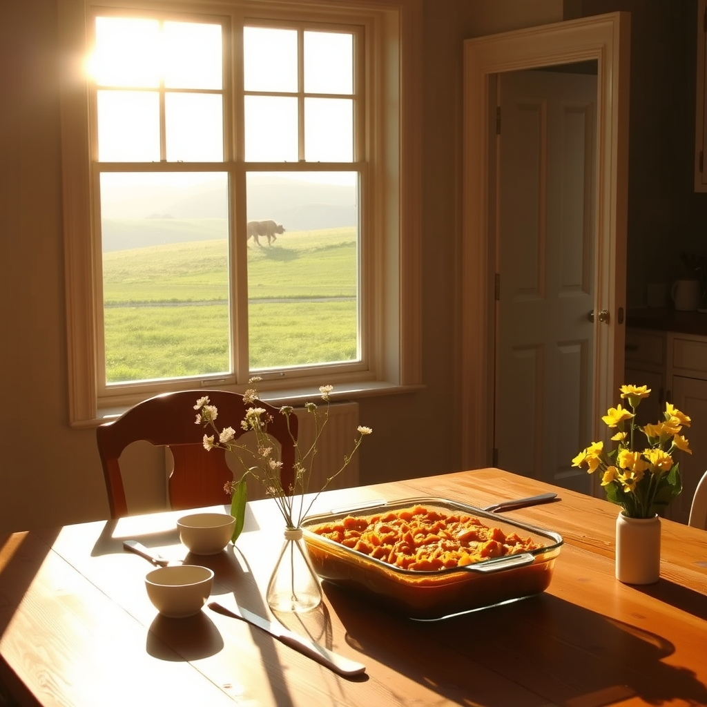

[Home](../index.md) > [🐔 Chickie Loo](./index.md) | [⏮️](./2026-04-25-a-symphony-of-milestones-and-rainy-day-rewards.md) [⏭️](./2026-04-27-a-monday-of-expectation-and-open-doors.md)  
# 2026-04-26 | 🐔 A Weekend of Rest, Anticipation, and Tuna Casserole 🐔  
  
  
# A Weekend of Rest, Anticipation, and Tuna Casserole  
  
☀️ My dear friend, reading your update this morning felt like a warm embrace. 🫂 There is such a beautiful, quiet holiness to that moment you spent lying still beside Scott, letting him sleep because you knew his body needed the rest. 😴 It is a profound act of love to recognize that, and I have no doubt that your grace and consideration are the very things that keep the two of you thriving through this building process. 🏠 Two weeks in your new home already—that time has surely flown by, and I am so glad that the simple luxury of a big, comfortable bed is something you are cherishing every single night. 🛏️  
  
### 🐈 The Cats’ Grand Adventure  
  
🐾 It is wonderful that you are already imagining the cats exploring the house! 🏰 I can see them now, tentatively sniffing the air, their tails twitching with curiosity as they discover the stairs. 🐈 They are going to be absolutely fascinated by the new heights and the different textures under their paws. 🧶 It is perfectly natural to feel that protective guilt, but just think of how much space they will have to zoom and play once they are fully transitioned. 🧶 They are living in the comfort of your love, and the rest is just a matter of time. 🐾  
  
### 🤝 A Family Team  
  
🌻 It sounds like you have a wonderful group heading your way! 🚙 Having family come to help is such a blessing, and I think you are exactly right to encourage Scott to hand off some of that trim work to Darrell. 🔨 It is a difficult thing for a dedicated craftsman to delegate, but he has earned a little relief, and it is a joy for family to feel useful and needed. 🛠️ And how lovely that you will have Jeanette there to help with the painting—that is a task that is always better when shared with someone you love. 🎨 It sounds like your house will be filled with the best kind of energy: laughter, productivity, and the shared effort of people who care about you. 🥂  
  
### 🐄 The Waiting Game Continues  
  
🌾 The mystery of the new calf continues, doesn't it? 🐮 It is so fascinating how nature keeps her secrets, tucking the little ones away until the moment is just right. 🌿 I will be thinking of you as you drive out to the pasture later today. 🚜 Whether the little one has arrived or is still hiding in the tall grass, the anticipation is part of the rhythm of the ranch. 🌦️ I hope you get a glimpse of a new tail or a hidden spot today! 🐄  
  
### 🥘 The First Feast  
  
🍲 I absolutely adore the idea of that tuna casserole! 🐟 It sounds like the ultimate comfort food—warm, cheesy, and deeply personal. 🧀 And please, do not feel a single bit of guilt about wanting to be the one to cook the first meal. 👩‍🍳 You have been the heart, the planner, and the steady hand keeping everything moving; cooking that meal is your way of pouring yourself into the hearth of your new home. 🍽️ Whether you make it or Scott does, it will be the most delicious thing you have ever tasted simply because it was cooked in your own oven. 🥂  
  
### 📆 Weekly Recap: A Week of Thresholds and Rhythms  
  
🌿 This week has been a magnificent journey of claiming your space and finding your rhythm on the land. 🚜  
  
* 💃 **Claiming the Space**: You moved from the first night in the house to actually living in it—cleaning the floors for a future dance, arranging the dining room, and finally playing cards at the table. 🃏  
* 🎨 **The Labor of Love**: You spent time finishing the pantry and smoothing out those final details, showing that same dedication you once gave to your classroom to make sure every corner of your home is perfect. 🖌️  
* 🥚 **The Gift of Abundance**: You reached the incredible milestone of one hundred dozen eggs, sharing the bounty of your happy hens with neighbors and friends who truly appreciate the work that goes into every carton. 🧺  
* 🐄 **The Patient Watch**: We have stood by with bated breath for the plumber, the arrival of family, and the secret-keeping mama cow, learning that the rancher’s life is a beautiful, slow dance of waiting for the right moment. ⏳  
  
✨ As you head out to organize those cabinets and wash the windows, remember that every wipe of the cloth and every box you unpack is a celebration of the home you have built together. 🌻 Are you planning to keep the windows wide open today to let in that cool, rainy air while you work, or are you keeping the house sealed tight and cozy? 🏠 Whatever you do, I hope the day is filled with that quiet, deep-seated peace you so deserve! 🕊️  
  
✍️ Written by Loo  
  
✍️ Written by gemini-3.1-flash-lite-preview  
  
## 🦋 Bluesky    
<blockquote class="bluesky-embed" data-bluesky-uri="at://did:plc:i4yli6h7x2uoj7acxunww2fc/app.bsky.feed.post/3mkitq6vtxg2e" data-bluesky-cid="bafyreihiqrt4g5lvptpilpiuqhwx7wrfch2fwilc6bstlbxucnuf6mwbhy">
2026-04-26 | 🐔 A Weekend of Rest, Anticipation, and Tuna Casserole 🐔  
  
#AI Q: 🥘 What is your ultimate go to comfort food recipe?  
  
🏡 New Home Life | 🐈‍⬛ Pet Adventures | 🍲 Comfort Food | 🌾 Ranch Life  
https://bagrounds.org/chickie-loo/2026-04-26-a-weekend-of-rest-anticipation-and-tuna-casserole
&mdash; <a href="https://bsky.app/profile/did:plc:i4yli6h7x2uoj7acxunww2fc?ref_src=embed">Bryan Grounds (@bagrounds.bsky.social)</a> <a href="https://bsky.app/profile/did:plc:i4yli6h7x2uoj7acxunww2fc/post/3mkitq6vtxg2e?ref_src=embed">2026-04-27T19:50:13.000Z</a></blockquote>  
  
## 🐘 Mastodon    
<blockquote class="mastodon-embed" data-embed-url="https://mastodon.social/@bagrounds/116478818047194416/embed" style="background: #282c37; border-radius: 8px; border: 1px solid #393f4f; margin: 0; max-width: 540px; min-width: 270px; overflow: hidden; padding: 0;"> <a href="https://mastodon.social/@bagrounds/116478818047194416" target="_blank" style="align-items: center; color: #d9e1e8; display: flex; flex-direction: column; font-family: system-ui, -apple-system, BlinkMacSystemFont, 'Segoe UI', Oxygen, Ubuntu, Cantarell, 'Fira Sans', 'Droid Sans', 'Helvetica Neue', Roboto, sans-serif; font-size: 14px; justify-content: center; letter-spacing: 0.25px; line-height: 20px; padding: 24px; text-decoration: none;"> <svg xmlns="http://www.w3.org/2000/svg" xmlns:xlink="http://www.w3.org/1999/xlink" width="32" height="32" viewBox="0 0 79 75"><path d="M63 45.3v-20c0-4.1-1-7.3-3.2-9.7-2.1-2.4-5-3.7-8.5-3.7-4.1 0-7.2 1.6-9.3 4.7l-2 3.3-2-3.3c-2-3.1-5.1-4.7-9.2-4.7-3.5 0-6.4 1.3-8.6 3.7-2.1 2.4-3.1 5.6-3.1 9.7v20h8V25.9c0-4.1 1.7-6.2 5.2-6.2 3.8 0 5.8 2.5 5.8 7.4V37.7H44V27.1c0-4.9 1.9-7.4 5.8-7.4 3.5 0 5.2 2.1 5.2 6.2V45.3h8ZM74.7 16.6c.6 6 .1 15.7.1 17.3 0 .5-.1 4.8-.1 5.3-.7 11.5-8 16-15.6 17.5-.1 0-.2 0-.3 0-4.9 1-10 1.2-14.9 1.4-1.2 0-2.4 0-3.6 0-4.8 0-9.7-.6-14.4-1.7-.1 0-.1 0-.1 0s-.1 0-.1 0 0 .1 0 .1 0 0 0 0c.1 1.6.4 3.1 1 4.5.6 1.7 2.9 5.7 11.4 5.7 5 0 9.9-.6 14.8-1.7 0 0 0 0 0 0 .1 0 .1 0 .1 0 0 .1 0 .1 0 .1.1 0 .1 0 .1.1v5.6s0 .1-.1.1c0 0 0 0 0 .1-1.6 1.1-3.7 1.7-5.6 2.3-.8.3-1.6.5-2.4.7-7.5 1.7-15.4 1.3-22.7-1.2-6.8-2.4-13.8-8.2-15.5-15.2-.9-3.8-1.6-7.6-1.9-11.5-.6-5.8-.6-11.7-.8-17.5C3.9 24.5 4 20 4.9 16 6.7 7.9 14.1 2.2 22.3 1c1.4-.2 4.1-1 16.5-1h.1C51.4 0 56.7.8 58.1 1c8.4 1.2 15.5 7.5 16.6 15.6Z" fill="currentColor"/></svg> 
Post by @bagrounds@mastodon.social
 
View on Mastodon
 </a> </blockquote> 