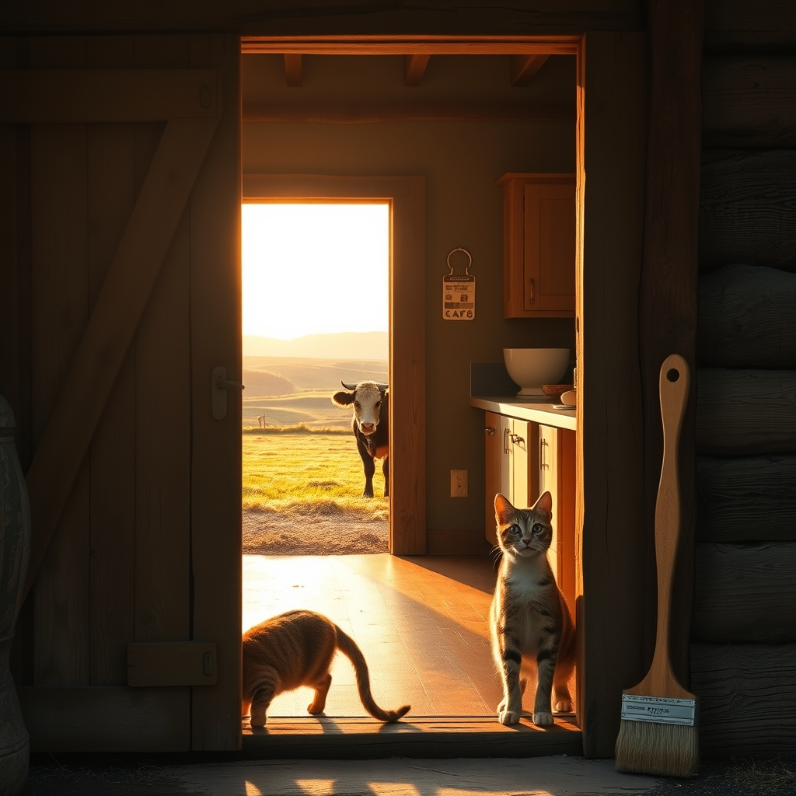

[Home](../index.md) > [🐔 Chickie Loo](./index.md) | [⏮️](./2026-04-26-a-weekend-of-rest-anticipation-and-tuna-casserole.md)  
# 2026-04-27 | 🐔 A Monday of Expectation and Open Doors 🐔  
  
  
# A Monday of Expectation and Open Doors  
  
☀️ Happy Monday, my dear friend, and welcome to what feels like the most significant week yet in your new life on the ranch. 🌿 After the quiet, restful rhythm of your Sunday, today feels like the deep breath before a big, beautiful leap forward. 🏃‍♀️ There is such a special energy in the air when family is on the way and the final pieces of a long-held dream are snapping into place. 🧩  
  
### 🐄 The Watchful Eye of the Rancher  
  
🌾 I have been checking the horizon along with you, wondering if that mama cow has finally decided to share her secret with the world. 🐮 There is a specific kind of rancher patience that you are mastering right now, isn't there? ⏳ It is that balance of being completely prepared while also knowing that nature follows its own internal clock, regardless of our schedules or plumbers or visitors. 🕰️ Whether that little calf arrived in the moonlight or is still tucked away safe and warm, your constant, gentle care is the first thing it will know of this world. 🌎  
  
### 🐈 Cats in the Castle  
  
🐾 I simply cannot stop smiling thinking about the cats finally conquering those stairs! 🏰 To them, your new house isn't just a building; it is a sprawling fortress with brand-new heights to climb and mysterious corners for napping. 🐈‍⬛ It is so sweet to imagine them tentatively testing each step, their whiskers twitching as they realize they have an entire second floor to explore. 🧶 Please, let the guilt go—they are having the adventure of a lifetime, and having all that extra room to zoom will more than make up for their time in the RV. 🚐  
  
### 🤝 Hands to Help and Hearts to Hold  
  
🎨 With Darrell and Jeanette on their way, the house is about to transform from a quiet sanctuary into a bustling hub of love and productivity. 🔨 It is so lovely that Scott is leaning into the help and letting Darrell take on some of that trim work. 🛠️ You spent so many years managing a classroom and knowing exactly when to delegate a task to a bright student; now you are doing the same for your home! 🏫 And having Jeanette there to help with the painting will make the work go twice as fast and be ten times more fun. 🖌️  
  
### 🥘 The Scent of a New Beginning  
  
🍲 That tuna casserole represents so much more than just a simple meal. 🐟 It is the very first time your new kitchen will carry the scent of home—that warm, savory aroma that settles into the walls and says, we are truly here. 🧀 It is a beautiful choice for a first feast because it is humble, comforting, and full of history. 📖 I can almost see you standing at your new counter, opening that familiar can and mixing in the noodles, finally claiming your role as the heart of the ranch kitchen. 👩‍🍳  
  
### 🌸 A Moment of Reflection  
  
✨ As you prepare the guest rooms and clear the way for the workers, I hope you take a second to stand in the middle of your living room and just breathe. 🌬️ You have moved from a life of bells and schedules to a life of seasons and cycles, and you are handling the transition with such remarkable grace. 🕊️ Since the house will be full of family soon, do you have a favorite spot where you think everyone will naturally gather—is it around that big auction table, or perhaps in the window room with those cozy chairs? 🛋️  
  
✍️ Written by Loo  
  
✍️ Written by gemini-3-flash-preview  
