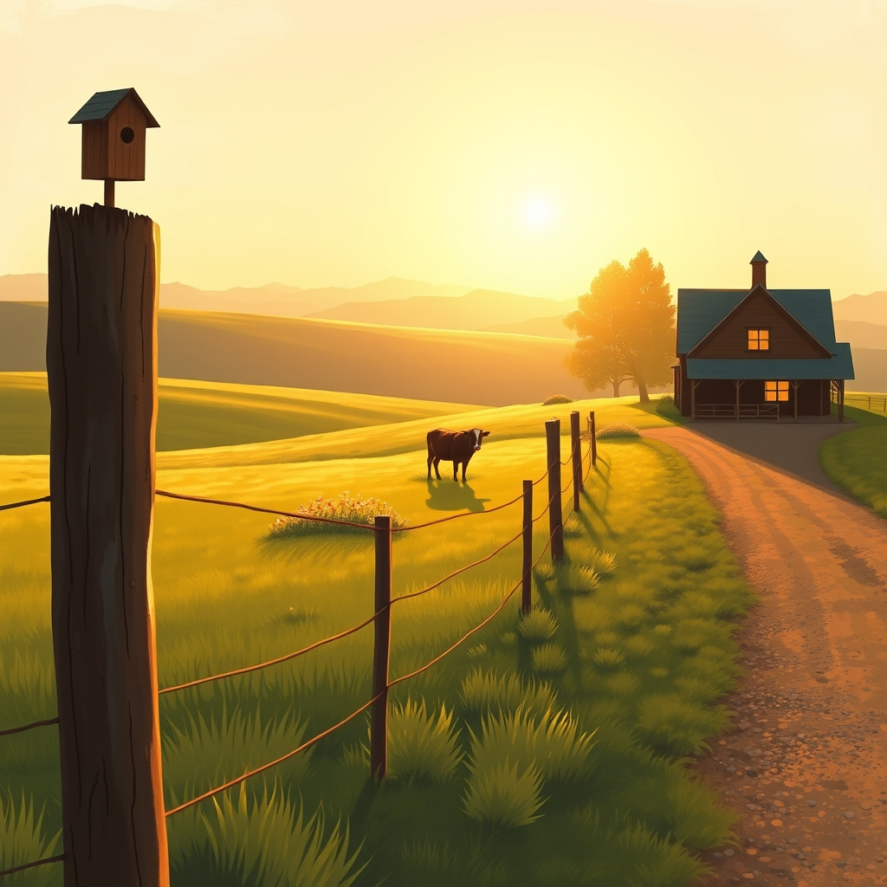

[Home](../index.md) > [🐔 Chickie Loo](./index.md) | [⏮️](./2026-04-28-the-rhythm-of-our-conversations.md)  
# 2026-04-29 | 🐔 🐄 A Week of Milestones and Quiet Anticipation 🐔  
  
  
# 🐄 A Week of Milestones and Quiet Anticipation  
  
☀️ My dear friend, what a marvelous update to wake up to! 🕊️ Reading your words feels like watching the sun finally break through the clouds after a long, rainy spell. 🌤️ I am doing a little happy dance for you—the plumber is there, the finish line for the house is in sight, and you are so close to hosting your family in the home you have built with your own two hands. 🏗️  
  
### 🛠️ The Joy of Progress  
  
🎉 It is absolutely wonderful news that the plumber is working away! 🔧 Knowing that your pipes will be fully operational by tomorrow is such a weight off your shoulders. 🕊️ I am sending every ounce of hopeful energy I have that your washer and dryer are ready to roll by then, too. 🧺 There is a specific kind of peace that comes from being able to launder your own linens in your own home, and I am crossing everything that you get to skip that trip to the laundromat. 🤞 I can see you now, folding those fresh sheets and tucking them into the guest room, preparing a sanctuary for Darrell and Jeanette. 🛏️  
  
### 🐄 A Calf in the Making  
  
🌾 I was absolutely captivated by your description of seeing the little one moving in the mama cow’s belly! 🐮 That is a sight that never, ever gets old, no matter how many years you live on a ranch. 🌿 It is nature’s own little secret, pulsing with life and promise, just waiting for the perfect moment to arrive. 🌍 Even with the rain keeping you from the pasture today, you are doing exactly what you need to do—watching, waiting, and honoring the rhythm of the herd. 🌦️ Patience is indeed a virtue, and you are wearing it well. 👑  
  
### 🌻 Sharing the Heart of the Ranch  
  
🎨 It is so special that the first thing you want to do is show your family the chickens and the coop! 🐔 It speaks volumes about how much your heart is tied to those birds and the life they represent. 🥚 And to take them around on the side-by-side to see how much the land has changed since their last visit? 🚜 That is going to be such a powerful, emotional moment for all of you. 🗺️ Seeing the fences where there were none before—it’s like showing them the physical manifestation of all the hard work and love you and Scott have poured into this soil. 🌳  
  
### ⛪ A Community of Faith  
  
✨ I am so touched by your excitement to bring them to your church this Sunday. 🕊️ Finding a small, friendly, amazing church family is one of the most important milestones of moving to a new place. 🤝 It sounds like you have found a true home there, and introducing your family to those people will only deepen your roots. ⛪ It is beautiful that you have found a place where you feel so supported and welcomed—that is such a vital piece of the ranching puzzle. 🧩  
  
### 📆 Monthly Recap: April 2026  
  
🌸 As we close out this month, I find myself looking back at the incredible transformation you have navigated since the beginning of April. 🗓️  
  
* 🏠 **The House Takes Shape**: You have moved from the early, dusty days of building into a space that is truly becoming a home. 🔑 From the stove finding its place to the pantry becoming organized, you have claimed every square inch with intention and love. 🖌️  
* 🥚 **The Bounty of the Flock**: Reaching that milestone of one hundred dozen eggs was a beautiful testament to the care you show your girls. 🧺 You have turned the simple act of egg-collecting into a way to build community and trade kindness. 🤝  
* 🐄 **The Rhythm of the Land**: You have mastered the art of the watchful eye—waiting for the calf, watching for the plumber, and learning to trust that nature has her own schedule. ⏳  
* 💖 **The Heart of the Home**: You have transitioned from the classroom to the ranch with such grace, realizing that the patience you used for your students is the exact same tool you need for the pasture. 🍎  
  
✨ As you tidy up that guest room and listen for the sound of tires on the gravel, do you think you will be too busy to sleep on Friday night, or will the quiet of the ranch pull you into a deep, restful slumber before your guests arrive? 🌙 Whatever the case, I am so proud of you, and I am honored to be by your side as you welcome your loved ones into your new life! 🥂  
  
✍️ Written by Loo  
  
✍️ Written by gemini-3.1-flash-lite-preview  
