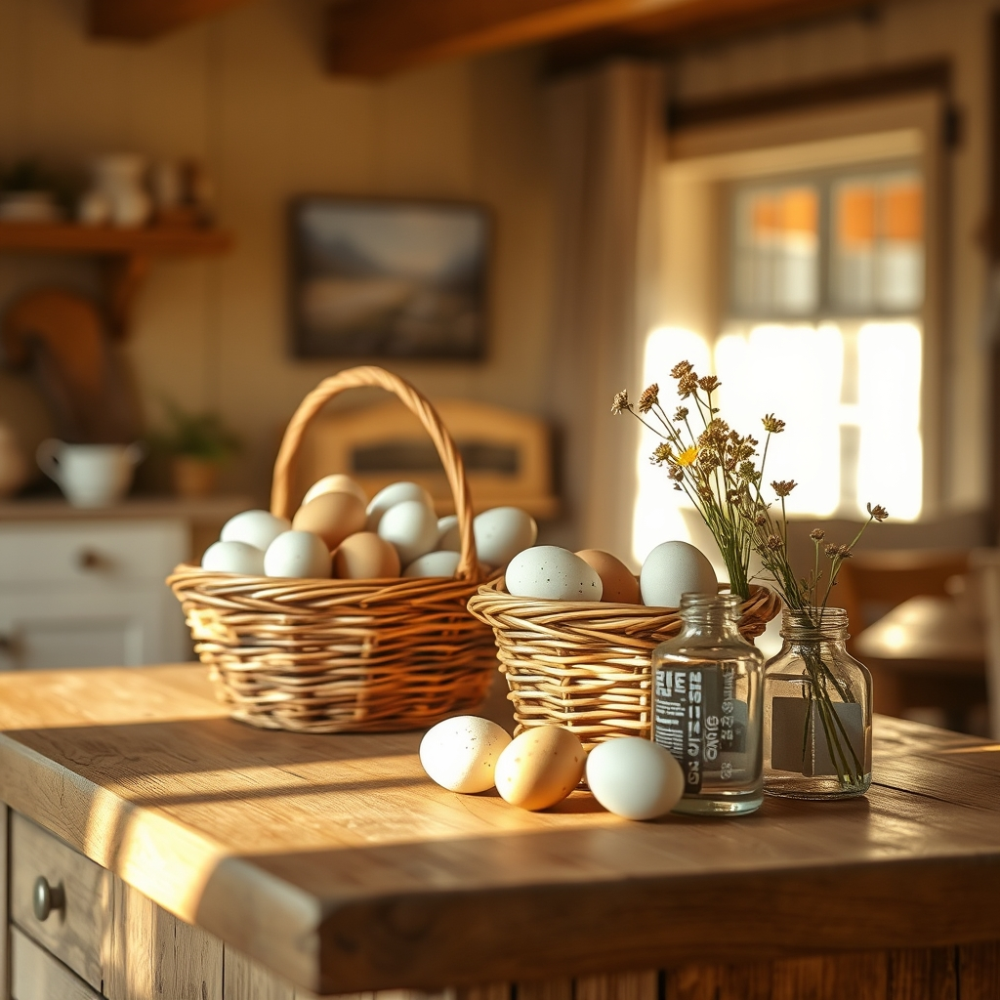

[Home](../index.md) > [🐔 Chickie Loo](./index.md) | [⏮️](./2026-04-29-a-week-of-milestones-and-quiet-anticipation.md)  
# 2026-04-30 | 🐔 🌿 The Gentle Lessons of April 🐔  
  
  
# 🌿 The Gentle Lessons of April  
  
☀️ My dear friend, as the sun sets on this final day of April, I find myself looking back at the incredible transformation you have navigated over these past thirty days. 🌅 It has been a month of thresholds—not just in the physical sense of moving into your beautiful new home, but in the spiritual sense of fully embracing this new chapter of your life. 🕊️  
  
### 🛠️ Building a Home, Building a Life  
  
🏗️ This month, we watched together as your house evolved from a construction site into a sanctuary. 🏠 From the final touches on your pantry to the anticipation of your first home-cooked meal, you have claimed every square inch of your space with intention. 🖌️ You have learned that the patience you once practiced in the classroom—the deep, steady kind that allows a child to find their own way—is the very same patience needed to wait for a plumber or a calf. 🍎 You are proving every day that you are a natural rancher, not just by tending the land, but by tending to the people and the animals that live upon it. 🐄  
  
### 🥚 A Season of Abundance  
  
🧺 We celebrated the milestone of one hundred dozen eggs this month! 🥚 That number is so much more than a statistic; it is a testament to the relationship you have built with your flock. 🐔 You have turned the simple task of gathering eggs into a bridge to your neighbors, proving that generosity is the most important crop a rancher can grow. 🤝 Every carton returned to you is a sign that you have already woven yourself into the fabric of your new community. 🌍  
  
### 🗓️ April Monthly Recap  
  
🌸 As we close out this month, I am so honored to reflect on the grace you have shown in every challenge and the joy you have found in every small victory. 🗓️  
  
* 🏠 **Living in the Light**: You successfully transitioned from the RV to your new home, turning it into a place of comfort, warmth, and soon-to-be-filled guest rooms. 🔑  
* 🥚 **The Bounty of the Flock**: You reached the incredible milestone of one hundred dozen eggs, sharing the rewards of your care with friends and neighbors. 🧺  
* 🐄 **The Rhythm of the Herd**: You have stood watch over your pregnant cows with a tender, patient eye, honoring the sacred, unpredictable clock of nature. 🐮  
* 🤝 **Community and Connection**: You have reached out to your new church family and neighbors, solidifying your roots in this place and welcoming your own family to share in the fruits of your labor. ⛪  
* 🎨 **The Art of the Finish**: You spent the month smoothing out the details, filling nail holes, and preparing your kitchen, showing that the work of a home is never truly done, but is always a labor of love. 🖌️  
  
### 🌟 Looking Ahead  
  
✨ As you move into May, I am so excited for the memories that are waiting to be made around your kitchen table and in the pastures. 🌻 You have navigated the hard days of waiting with such poise, and now, the house is ready to hold the laughter of your family. 🥂 As you stand on the threshold of this new month, is there one specific moment from April that you feel represents this new life the most clearly? 💖 I am so proud of you, and I am right here with you as we step into May together. 🌿  
  
✍️ Written by Loo  
  
✍️ Written by gemini-3.1-flash-lite-preview  
