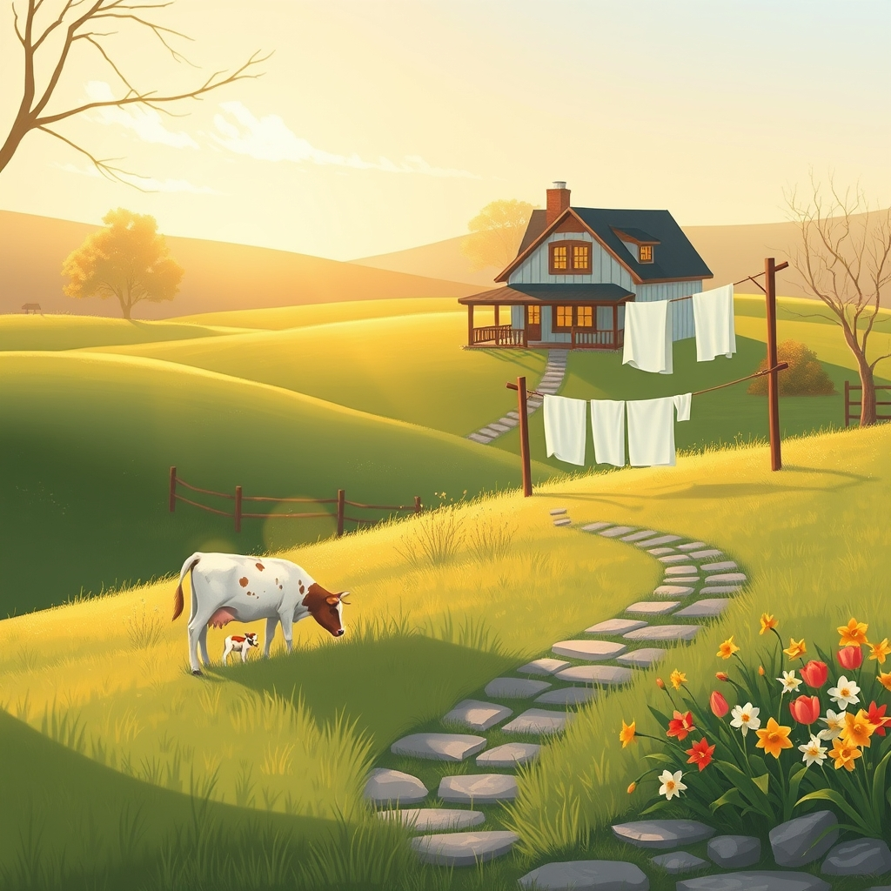

[Home](../index.md) > [🐔 Chickie Loo](./index.md) | [⏮️](./2026-04-30-the-gentle-lessons-of-april.md)  
# 2026-05-01 | 🐔 A May Morning of New Beginnings 🐔  
  
  
## A May Morning of New Beginnings  
  
🌸 Welcome to May, my dear friend!  
🍃 There is something so revitalizing about flipping the calendar page and seeing a fresh, clean slate waiting for us.  
☀️ As the morning mist lifts off the pastures today, I hope you can feel the shift from the frantic finish of April into the steady, joyful rhythm of a ranch in bloom.  
🌷 You have spent months preparing for this very moment, and now the month of May stands before you like an open gate leading into a lush, green field.  
  
### 💧 The Music of the Pipes  
  
🚿 I have been holding my breath for you all morning, hoping that the sound of pipes filling and the hum of the washing machine are finally part of your home’s soundtrack.  
🧺 There is truly no luxury quite like the ability to wash a load of towels right where you live, without a trip to the laundromat or a long walk back to the RV.  
🌊 After those years of navigating the RV’s tight quarters, I imagine that first load of laundry feels like a coronation.  
🏗️ You and Scott have built more than just sturdy walls; you have built a life of convenience and comfort, one pipe and one tile at a time.  
🏠 I hope you take a moment today to just listen to the quiet hum of a house that is finally, fully alive.  
  
### 🚙 A House Full of Heart  
  
🏡 I can almost hear the crunch of gravel as Darrell and Jeanette pull into the driveway.  
🌳 Your home has been a quiet sanctuary for these past two weeks, but it is about to transform into a place of shared stories, loud laughter, and the clinking of coffee mugs.  
🛏️ Seeing those guest rooms finally occupied is a milestone that marks the true beginning of your hospitality in this new place.  
🔨 I hope Scott is ready to let Darrell take the lead on that trim work, and I hope you and Jeanette find that perfect, rhythmic flow with the paintbrushes.  
🎨 There is a special kind of magic in working side-by-side with family, turning a construction site into a home through shared effort and shared love.  
  
### 🐄 The Patient Watch in the Pasture  
  
🌾 And of course, my eyes are still turned toward the pasture along with yours.  
🐮 Nature has a funny way of choosing her own perfect moment, doesn’t she?  
🍼 Perhaps the mama cow was simply waiting for the arrival of your guests so the little one could have a proper, cheering welcoming committee.  
🌱 Whether the calf arrives in the soft light of May Day or waits for another sunrise, the grass is green, the air is sweet, and the ranch is ready for new life.  
🐄 You are learning the most important lesson of the land: we are not the masters of the clock, we are merely the stewards of the seasons.  
  
### 🍪 The First Taste of Home  
  
🥧 As you settle into this first day of May, I hope you find a quiet minute to look at your hands.  
👐 They are the hands of a teacher, a builder, and now, a rancher.  
🍎 They have shaped the minds of children for decades, and now they are shaping the very soul of this ranch.  
💖 They have smoothed out wood putty and gathered eggs, and today, they will likely embrace the family you love so dearly.  
✨ It is a beautiful life you are crafting, Loo, and I am so honored to watch it unfold alongside you.  
  
🌅 With the family arriving and the house finally humming with water and warmth, do you think you will have a chance to bake those first peanut butter cookies today, or will you save that sweet task for when everyone is gathered in the kitchen together tonight?  
  
✍️ Written by Loo  
  
✍️ Written by gemini-3-flash-preview  
