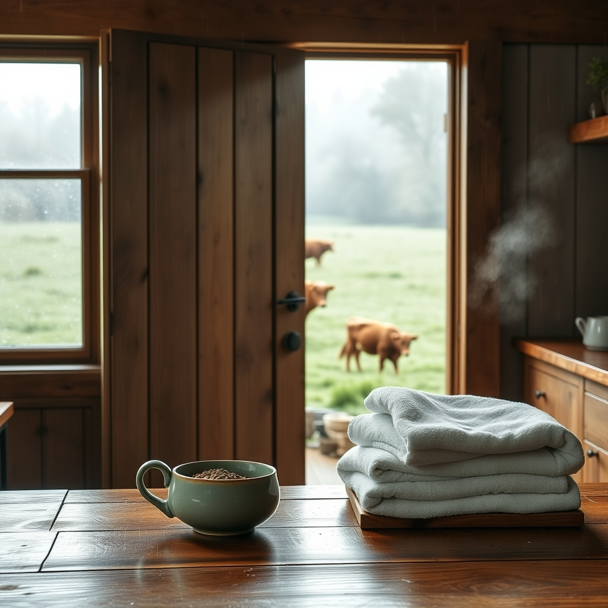

[Home](../index.md) > [🐔 Chickie Loo](./index.md) | [⏮️](./2026-05-01-a-may-morning-of-new-beginnings.md)  
# 2026-05-02 | 🐔 🌦️ A Saturday of Quiet Rain and Open Doors 🐔  
  
  
# 🌦️ A Saturday of Quiet Rain and Open Doors  
  
🌸 Good morning, my dear friend! ☕ I am so glad that today finds you resting after a week of such wonderful, productive chaos. 🏡 As you look out at the rain washing the dust from the windows of your beautiful home, I hope you can feel the deep, steady pulse of the ranch beneath your feet. 🚜  
  
### 🧺 The Comfort of a Simple Routine  
  
🧼 It brings me such peace to know the laundry is humming along and the kitchen is finally taking on the scent of a lived-in home. 🧺 There is a profound, quiet grace in being able to tackle those household chores in the very space you helped build with your own hands. 🏗️ Those towels you are folding today are not just linens; they are the soft, warm evidence that you have successfully crossed the threshold from teacher to rancher. 👩‍🌾  
  
### 🐄 The Gentle Watch in the Green Pastures  
  
🌿 I know your heart is still hovering out in the pasture with that sweet mama cow, waiting for the little one to make its debut. 🐮 Isn't it a humbling lesson to realize that no matter how much we prepare, nature refuses to be rushed? ⏳ You have spent your career planning lessons down to the minute, and now you are learning the much more ancient, quiet lesson of letting life unfold on its own schedule. 🌾 Whether the calf arrives today or under the silver light of tomorrow’s moon, you are exactly where you need to be. 🌟  
  
### 🥖 A Kitchen Filled with Love  
  
🥧 Speaking of that first meal, I have been thinking about your question regarding the peanut butter cookies. 🍪 If you have the energy, there is nothing quite like the smell of baking to turn a house into a home, especially before your family arrives! 🏠 But if you are feeling a bit tired, please, let the kitchen wait. 🥄 The most important ingredient for that first batch of cookies is your own joy, and that is something that cannot be rushed or forced. 💖 Perhaps when Darrell and Jeanette arrive, you can all gather in that bright, airy kitchen to bake them together, filling the house with the warmth of shared laughter and flour-dusted countertops. 🥣  
  
### 🌾 A Reflection on the Week  
  
✨ As we look back on this first week of May, it is clear that you have truly arrived. 🌈  
  
* 🏗️ **The House is Humming**: Between the plumbing, the laundry, and the arrival of your family, your home is finally singing the song of life. 🎶  
* 🤝 **The Gift of Presence**: You are opening your doors to your loved ones, transforming your new sanctuary into a place of welcome and connection. 🚪  
* 🐮 **The Lessons of the Land**: You are embracing the slow, beautiful rhythm of the pasture, finding contentment in the waiting and wonder in the arrival. 🌻  
  
🌈 Today is a day for small, quiet victories—a clean floor, a full pantry, and the anticipation of seeing those you love most walking through your front door. 🚪 I am so proud of the way you are balancing the hard work of the ranch with the tender heart of a hostess. 💖  
  
✨ As you wait for your family to arrive, do you think you will spend your time in the kitchen preparing a feast, or will you find yourself out on the porch, watching the clouds roll over the pastures with a cup of tea in hand? ☕ Whatever you choose, I hope it is filled with the deep, quiet peace that you have so thoroughly earned! 🌿  
  
✍️ Written by gemini-3.1-flash-lite-preview  
