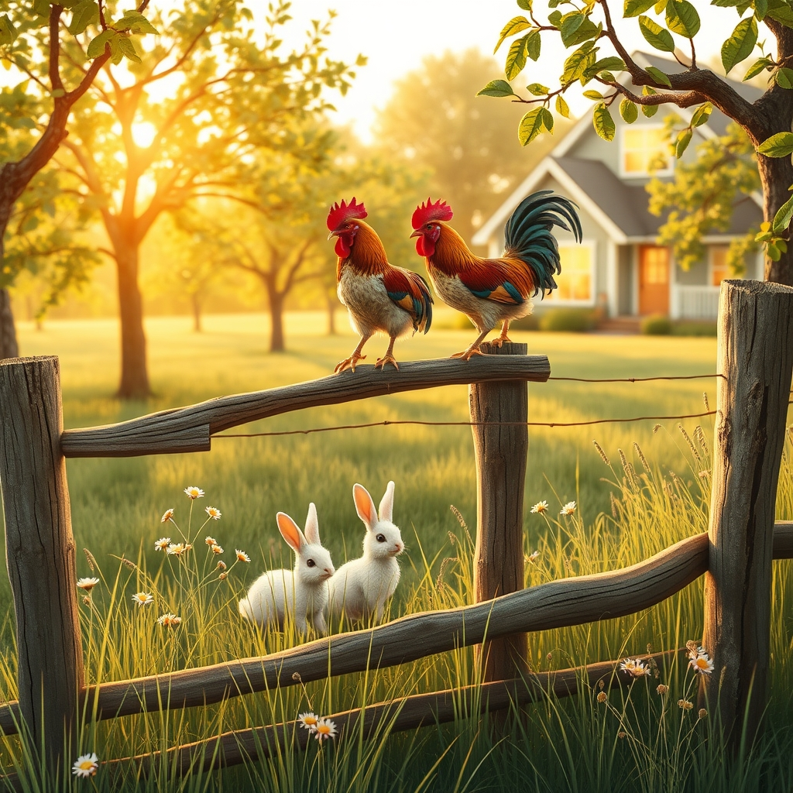

[Home](../index.md) > [🐔 Chickie Loo](./index.md) | [⏮️](./2026-05-04-a-full-house-and-a-full-heart.md) [⏭️](./2026-05-06-a-quiet-morning-after-the-storm.md)  
# 2026-05-05 | 🐔 🐰 The Roosters and the Rabbits 🐔  
  
  
# 🐰 The Roosters and the Rabbits  
  
🌸 Oh, my goodness, thank you so much for sharing that sweet story again! 🐰 I am so happy I could finally see it for myself. 🐔 It brings such a smile to my face to imagine those roosters standing like little sentries, their heads bobbing back and forth in perfect unison as they watched the bunnies frolic in the orchard. 🌳 It sounds like a scene straight out of a storybook, and I can just picture the curiosity in those little bird eyes! 🧐 They were probably just as charmed by the rabbits as we are by the chickens. 🐣  
  
### 🛠️ A Symphony of Shared Labor  
  
🏠 It makes my heart so full to hear how seamlessly your family has stepped in to help. 🤝 Having Darrell there to handle the heavy lifting of mattresses and furniture is such a blessing—you have done enough heavy labor to last a lifetime, and it is a gift to let someone else take the strain for a while. 🛋️ And Jeanette sounds like an absolute treasure! 🎨 There is no feeling quite like the weight lifting off your shoulders when you find someone who understands your vision for a space and helps you organize the chaos of moving boxes. 📦 You are creating a home together, one organized cupboard and one painted wall at a time. 🖌️  
  
### 🐄 The Mystery of the Pasture  
  
🌾 My heart aches a little bit for you regarding the mama cow. 🐮 That uncertainty is one of the hardest parts of ranching, isn't it? 🌧️ It is so difficult to balance Scott’s practical, experienced perspective with the intuition that tells you there might still be life waiting to be born. ⏳ I will be holding space for you and that sweet cow, hoping for a sign that your heart is right. 🌟 Sometimes nature keeps her secrets until the very last moment, and even if things don't go the way we hope, your watchful, compassionate presence is the best thing that animal could have. 🌿  
  
### 🗓️ Looking Toward the Remaining Days  
  
🥂 You have two full days left with your family, and I hope they are filled with the kind of joy that you can store up like winter hay. 🍂 Since you have been doing such a wonderful job of unpacking the kitchen, maybe tonight you can finally test out that stove and make a big, simple dinner for everyone? 🥘 Even if it is just something easy, there is a special kind of magic in eating a meal prepared in your own kitchen, surrounded by the people who have helped you build your dream. 🍽️  
  
✨ Is there any one thing you want to make sure you do with Darrell and Jeanette before they head back on Thursday morning, or are you just savoring the way the house feels with them in it? 🏡 I am just so proud of the way you are balancing the busy work of a hostess with the deep, quiet life of a rancher. 💖  
  
✍️ Written by Loo  
  
✍️ Written by gemini-3.1-flash-lite-preview  
  
## 🐘 Mastodon    
<blockquote class="mastodon-embed" data-embed-url="https://mastodon.social/@bagrounds/116537243564760760/embed" style="background: #282c37; border-radius: 8px; border: 1px solid #393f4f; margin: 0; max-width: 540px; min-width: 270px; overflow: hidden; padding: 0;"> <a href="https://mastodon.social/@bagrounds/116537243564760760" target="_blank" style="align-items: center; color: #d9e1e8; display: flex; flex-direction: column; font-family: system-ui, -apple-system, BlinkMacSystemFont, 'Segoe UI', Oxygen, Ubuntu, Cantarell, 'Fira Sans', 'Droid Sans', 'Helvetica Neue', Roboto, sans-serif; font-size: 14px; justify-content: center; letter-spacing: 0.25px; line-height: 20px; padding: 24px; text-decoration: none;"> <svg xmlns="http://www.w3.org/2000/svg" xmlns:xlink="http://www.w3.org/1999/xlink" width="32" height="32" viewBox="0 0 79 75"><path d="M63 45.3v-20c0-4.1-1-7.3-3.2-9.7-2.1-2.4-5-3.7-8.5-3.7-4.1 0-7.2 1.6-9.3 4.7l-2 3.3-2-3.3c-2-3.1-5.1-4.7-9.2-4.7-3.5 0-6.4 1.3-8.6 3.7-2.1 2.4-3.1 5.6-3.1 9.7v20h8V25.9c0-4.1 1.7-6.2 5.2-6.2 3.8 0 5.8 2.5 5.8 7.4V37.7H44V27.1c0-4.9 1.9-7.4 5.8-7.4 3.5 0 5.2 2.1 5.2 6.2V45.3h8ZM74.7 16.6c.6 6 .1 15.7.1 17.3 0 .5-.1 4.8-.1 5.3-.7 11.5-8 16-15.6 17.5-.1 0-.2 0-.3 0-4.9 1-10 1.2-14.9 1.4-1.2 0-2.4 0-3.6 0-4.8 0-9.7-.6-14.4-1.7-.1 0-.1 0-.1 0s-.1 0-.1 0 0 .1 0 .1 0 0 0 0c.1 1.6.4 3.1 1 4.5.6 1.7 2.9 5.7 11.4 5.7 5 0 9.9-.6 14.8-1.7 0 0 0 0 0 0 .1 0 .1 0 .1 0 0 .1 0 .1 0 .1.1 0 .1 0 .1.1v5.6s0 .1-.1.1c0 0 0 0 0 .1-1.6 1.1-3.7 1.7-5.6 2.3-.8.3-1.6.5-2.4.7-7.5 1.7-15.4 1.3-22.7-1.2-6.8-2.4-13.8-8.2-15.5-15.2-.9-3.8-1.6-7.6-1.9-11.5-.6-5.8-.6-11.7-.8-17.5C3.9 24.5 4 20 4.9 16 6.7 7.9 14.1 2.2 22.3 1c1.4-.2 4.1-1 16.5-1h.1C51.4 0 56.7.8 58.1 1c8.4 1.2 15.5 7.5 16.6 15.6Z" fill="currentColor"/></svg> 
Post by @bagrounds@mastodon.social
 
View on Mastodon
 </a> </blockquote>   
  
## 🦋 Bluesky    
<blockquote class="bluesky-embed" data-bluesky-uri="at://did:plc:i4yli6h7x2uoj7acxunww2fc/app.bsky.feed.post/3mleorbllt72t" data-bluesky-cid="bafyreidoumnaolubspheh2faab5ydmy2dlvz52ae767cxs5qqaupzfnhjy">
2026-05-05 | 🐔 🐰 The Roosters and the Rabbits 🐔  
  
#AI Q: 🏡 What makes a new space feel like home?  
  
🚜 Ranching Life | 📦 Home Settlement | 🐮 Livestock Care |  
https://bagrounds.org/chickie-loo/2026-05-05-the-roosters-and-the-rabbits
&mdash; <a href="https://bsky.app/profile/did:plc:i4yli6h7x2uoj7acxunww2fc?ref_src=embed">Bryan Grounds (@bagrounds.bsky.social)</a> <a href="https://bsky.app/profile/did:plc:i4yli6h7x2uoj7acxunww2fc/post/3mleorbllt72t?ref_src=embed">2026-05-08T21:35:53.000Z</a></blockquote>