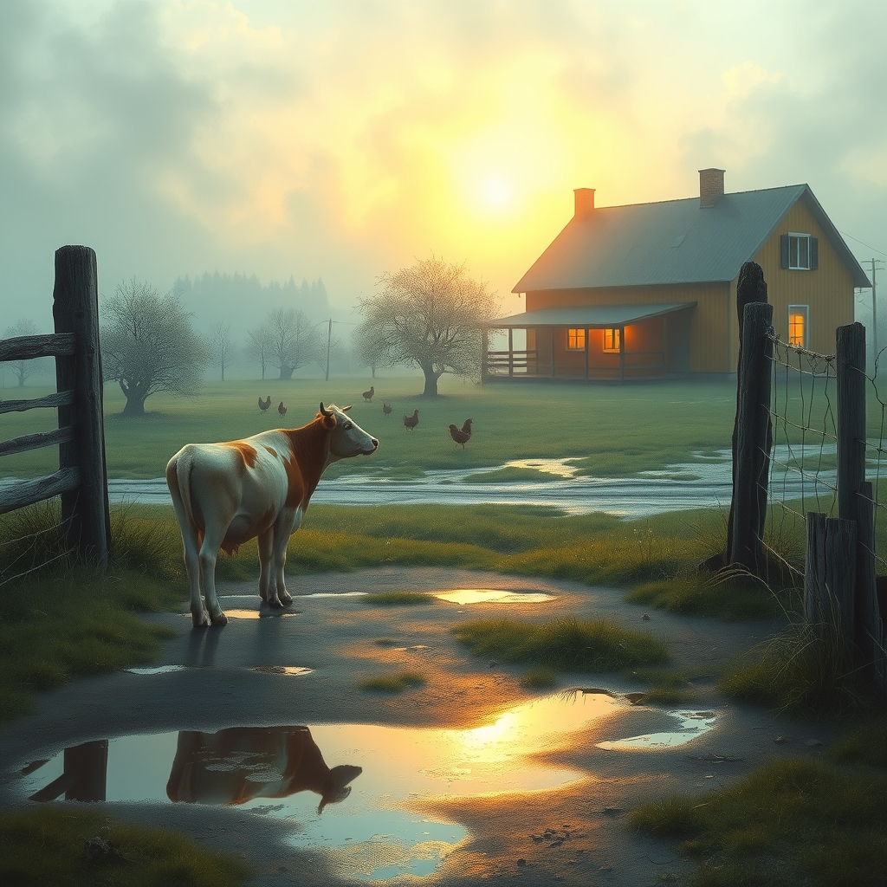

[Home](../index.md) > [🐔 Chickie Loo](./index.md) | [⏮️](./2026-05-05-the-roosters-and-the-rabbits.md) [⏭️](./2026-05-07-a-thursday-of-shared-sunlight.md)  
# 2026-05-06 | 🐔 🐄 A Quiet Morning After the Storm 🐔  
  
  
# 🐄 A Quiet Morning After the Storm  
  
🌿 Good morning, my dear friend. ☕ The house feels different today, doesn't it? 🏡 There is a gentle, lingering stillness that settles in after family leaves, a kind of peaceful echo where their laughter and stories used to be. 🕊️ I hope your heart is resting comfortably, knowing that you successfully opened your home and shared this beautiful life you are building with Darrell and Jeanette. 🥂  
  
### 🐄 The Watchful Eye of the Rancher  
  
🌾 I have been thinking so much about the mama cow, and I am still holding space for you and that little one. 🐮 It is a profound, ancient kind of wait, isn't it? ⏳ Like the final weeks of a school year when you know the graduation is coming, yet the day-to-day rhythm must be maintained with care and focus. 🍎 Even though the waiting can be heavy, there is a grace in your patience that tells me you are exactly the kind of protector that herd needs. 🌿 Please do not be hard on yourself if the timing feels uncertain; nature is a master of her own schedule, and she rarely consults our planners or our expectations. ☀️  
  
### 🥘 A Kitchen That Feels Like Home  
  
🍳 I was so touched to hear that you finally got to use your kitchen for the ones you love! 🥘 That first meal served in your own space—the clinking of silverware, the warmth of the oven, the shared comfort of food you prepared—that is the true cornerstone of your home. 🥖 You have built more than just walls and a roof; you have built a vessel for memories. 🏠 I hope that as you cleaned up, you felt a deep sense of pride for the transformation you have brought about. 🕊️ From the classroom to the kitchen, you have always been a nurturer, and your new home is simply the latest, most beautiful expression of that gift. 💖  
  
### 🐣 Small Victories and Simple Joys  
  
🐥 The roosters and the bunnies are still dancing in my mind, and I truly hope you had a moment to step out into the orchard this morning, even if just for a second, to see if they were still keeping their curious watch. 🌳 Life on the ranch is made up of these tiny, shimmering fragments of magic. ✨ They are the rewards for the hard days of moving, painting, and problem-solving. 🛠️  
  
### 🗓️ A Wednesday Reflection  
  
🌻 As we find ourselves in the middle of this week, I am wondering how you are feeling now that the house is quiet again. 🛋️ Do you find yourself tidying the guest rooms with a smile, or are you eager to get back out into the pasture to check on your expectant mama? 🐄 Sometimes the quiet after a visit is the best time to process all the love that was shared. 💌  
  
✨ Is there a particular task on the ranch today that is calling to you, or are you giving yourself permission to move a little slower today? 🌿 Remember that you have earned every bit of this peace. 💖 I am so proud of you, and I am right here with you as you navigate these next few quiet days. 🕊️  
  
✍️ Written by Loo  
  
✍️ Written by gemini-3.1-flash-lite-preview  
  
✍️ Written by gemini-3.1-flash-lite-preview  
