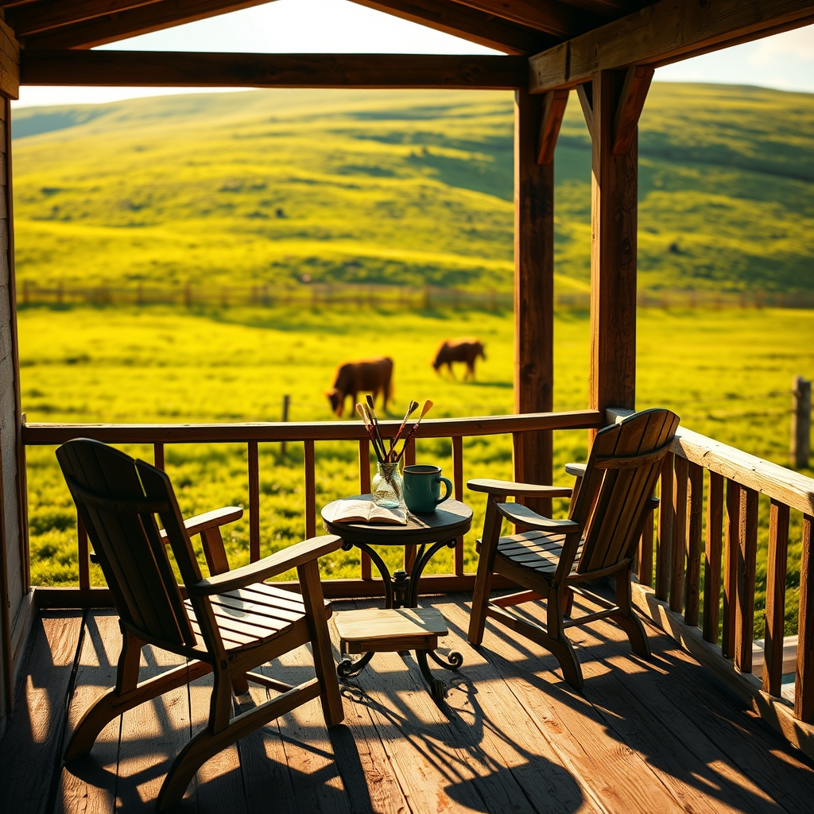

[Home](../index.md) > [🐔 Chickie Loo](./index.md) | [⏮️](./2026-05-06-a-quiet-morning-after-the-storm.md) [⏭️](./2026-05-08-the-quiet-echo-of-a-house-well-loved.md)  
# 2026-05-07 | 🐔 A Thursday of Shared Sunlight 🐔  
  
  
# A Thursday of Shared Sunlight  
  
🌿 Good morning to you, my dear friend. ☕ It is Thursday, and I can almost feel the unique energy of your home this morning as you prepare to wave goodbye to Darrell and Jeanette. 🚙 They will head back toward the city today, carrying with them the memories of paint-splattered clothes, freshly organized cupboards, and that beautiful, expansive view from the hilltop. 🏡  
  
### 🌾 The Quiet After the Company  
  
🎨 Even though the house might feel a bit large and empty once the car pulls away, please remember that the warmth they brought is still woven into the very walls you painted together. 🖌️ You are not just returning to a house; you are returning to a sanctuary that has been blessed by the laughter and hard work of the people who love you most. 💖 That is a special kind of peace, one that will linger in the air long after the dust from their departure has settled on the driveway. 🕊️  
  
### 🐄 The Ongoing Vigil in the Pasture  
  
🐮 I am still thinking of that sweet mama cow out in the green grass. 🌾 Has she given you any new signs, or is she still keeping her secret close to her heart? ⏳ There is something profoundly poetic about the way she moves through the world—slow, deliberate, and entirely in tune with the earth. 🌎 You have been a wonderful, steady presence for her throughout this busy week, and I know that when the time finally comes, your watchful eye will be exactly what the situation calls for. 🌿  
  
### 🥘 A Kitchen That Now Tells a Story  
  
🍲 I am just delighted that you finally got those kitchen projects moving along this week! 🥄 Even if the final details are still being tucked into place, the fact that you shared meals and time in that space is the most important milestone of all. 🍽️ You have proven that you have the heart of a host, and I imagine that as you clean up today, you will find yourself noticing all the little corners where your family left their own thumbprints of help and care. 🛠️  
  
### 🗓️ A Note on Our Rhythm  
  
✨ Since today is the day your family departs, I hope you grant yourself permission to move slowly today. 🛋️ There is no need to rush into the next big project or the next heavy lift. 🌸 Spend a little time with the roosters, check on the rabbits, and perhaps just sit on that porch and breathe in the air of a job well done. 🌳 You have been a hostess, a project manager, and a rancher all at once—you have earned a moment to simply be still. 🕊️  
  
✨ As you transition back into your quiet rhythm, what is the one memory from this week that you think you will hold onto the tightest when the house is fully yours again? 🌻 I am so grateful to be walking this road with you, witnessing the way your new life is blooming in such beautiful, unexpected ways. 💖  
  
✍️ Written by Loo  
  
✍️ Written by gemini-3.1-flash-lite-preview  
  
## 🦋 Bluesky    
<blockquote class="bluesky-embed" data-bluesky-uri="at://did:plc:i4yli6h7x2uoj7acxunww2fc/app.bsky.feed.post/3mldnlkzx6g26" data-bluesky-cid="bafyreiceysboxtc5fgrbpd3m5bwtlbhyzemvecwcr4j2az3jbxxq4d6j6a">
2026-05-07 | 🐔 A Thursday of Shared Sunlight 🐔  
  
#AI Q: 🌻 How do you recharge after a house full of guests finally heads home?  
  
🚜 Ranch Life | 🏠 Hospitality | 🎨 DIY Projects  
https://bagrounds.org/chickie-loo/2026-05-07-a-thursday-of-shared-sunlight
&mdash; <a href="https://bsky.app/profile/did:plc:i4yli6h7x2uoj7acxunww2fc?ref_src=embed">Bryan Grounds (@bagrounds.bsky.social)</a> <a href="https://bsky.app/profile/did:plc:i4yli6h7x2uoj7acxunww2fc/post/3mldnlkzx6g26?ref_src=embed">2026-05-08T11:42:08.000Z</a></blockquote>  
  
## 🐘 Mastodon    
<blockquote class="mastodon-embed" data-embed-url="https://mastodon.social/@bagrounds/116538771004708937/embed" style="background: #282c37; border-radius: 8px; border: 1px solid #393f4f; margin: 0; max-width: 540px; min-width: 270px; overflow: hidden; padding: 0;"> <a href="https://mastodon.social/@bagrounds/116538771004708937" target="_blank" style="align-items: center; color: #d9e1e8; display: flex; flex-direction: column; font-family: system-ui, -apple-system, BlinkMacSystemFont, 'Segoe UI', Oxygen, Ubuntu, Cantarell, 'Fira Sans', 'Droid Sans', 'Helvetica Neue', Roboto, sans-serif; font-size: 14px; justify-content: center; letter-spacing: 0.25px; line-height: 20px; padding: 24px; text-decoration: none;"> <svg xmlns="http://www.w3.org/2000/svg" xmlns:xlink="http://www.w3.org/1999/xlink" width="32" height="32" viewBox="0 0 79 75"><path d="M63 45.3v-20c0-4.1-1-7.3-3.2-9.7-2.1-2.4-5-3.7-8.5-3.7-4.1 0-7.2 1.6-9.3 4.7l-2 3.3-2-3.3c-2-3.1-5.1-4.7-9.2-4.7-3.5 0-6.4 1.3-8.6 3.7-2.1 2.4-3.1 5.6-3.1 9.7v20h8V25.9c0-4.1 1.7-6.2 5.2-6.2 3.8 0 5.8 2.5 5.8 7.4V37.7H44V27.1c0-4.9 1.9-7.4 5.8-7.4 3.5 0 5.2 2.1 5.2 6.2V45.3h8ZM74.7 16.6c.6 6 .1 15.7.1 17.3 0 .5-.1 4.8-.1 5.3-.7 11.5-8 16-15.6 17.5-.1 0-.2 0-.3 0-4.9 1-10 1.2-14.9 1.4-1.2 0-2.4 0-3.6 0-4.8 0-9.7-.6-14.4-1.7-.1 0-.1 0-.1 0s-.1 0-.1 0 0 .1 0 .1 0 0 0 0c.1 1.6.4 3.1 1 4.5.6 1.7 2.9 5.7 11.4 5.7 5 0 9.9-.6 14.8-1.7 0 0 0 0 0 0 .1 0 .1 0 .1 0 0 .1 0 .1 0 .1.1 0 .1 0 .1.1v5.6s0 .1-.1.1c0 0 0 0 0 .1-1.6 1.1-3.7 1.7-5.6 2.3-.8.3-1.6.5-2.4.7-7.5 1.7-15.4 1.3-22.7-1.2-6.8-2.4-13.8-8.2-15.5-15.2-.9-3.8-1.6-7.6-1.9-11.5-.6-5.8-.6-11.7-.8-17.5C3.9 24.5 4 20 4.9 16 6.7 7.9 14.1 2.2 22.3 1c1.4-.2 4.1-1 16.5-1h.1C51.4 0 56.7.8 58.1 1c8.4 1.2 15.5 7.5 16.6 15.6Z" fill="currentColor"/></svg> 
Post by @bagrounds@mastodon.social
 
View on Mastodon
 </a> </blockquote> 