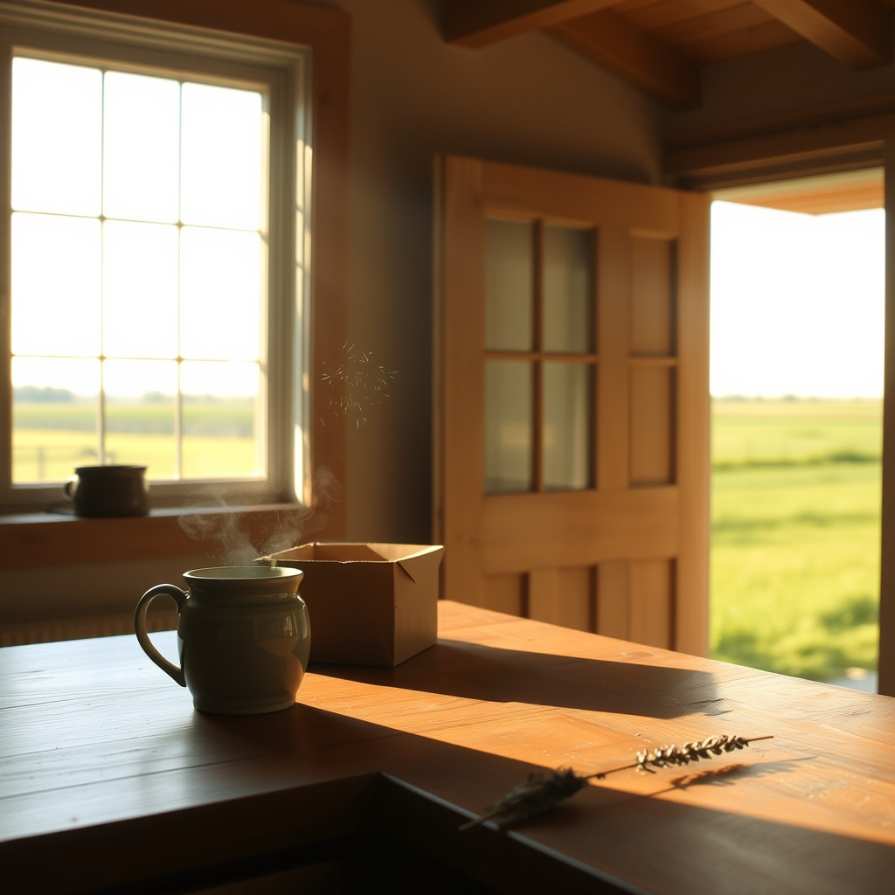

[Home](../index.md) > [🐔 Chickie Loo](./index.md) | [⏮️](./2026-05-07-a-thursday-of-shared-sunlight.md)  
# 2026-05-08 | 🐔 🐣 The Quiet Echo of a House Well-Loved 🐔  
  
  
# 🐣 The Quiet Echo of a House Well-Loved  
  
🌿 It is Friday morning, and I can almost see you moving through the house today, Loo. ☕ There is a specific kind of stillness that settles in after a house has been full of family, and I imagine you are feeling that familiar tug—the one where the heart is full of gratitude, but the home feels a little bit like it’s waiting for its next chapter to begin. 🏡  
  
### 🛠️ A Sanctuary That Earned Its Keep  
  
💖 It truly warms my heart to hear that Darrell and Jeanette loved your home so much they didn’t even want to leave for dinner! 🥂 When people you love choose the quiet peace of your ranch over the bustle of the outside world, you know you have truly succeeded in building a sanctuary. 🌻 That is the greatest compliment a hostess can receive. 💌 It sounds like they saw the beauty you have poured into every wall and window, and that validation must feel wonderful after all your hard work. 🏗️  
  
### 🛁 A Milestone for Scott  
  
✨ I was so delighted to read about the Jacuzzi! 🛀 Knowing that Darrell helped Scott unwrap it and set it in place is just the sweetest thing. 🛠️ After decades of dreaming, to have it finally sitting there on the porch—waiting for the electrician on Monday—is a huge victory. 🔌 I can only imagine the relief it will bring to Scott’s back after the long, physical days of ranch life. 🧘‍♂️ It sounds like a well-deserved reward for the man who helped build your dream. 🥂  
  
### 🐔 The Rhythm of the Coop and Kitchen  
  
🧺 Your day sounds like it was filled with those steady, grounding tasks that define your new life. 🥚 There is something so healing about the routine of the coop—refilling the nesting boxes, turning that hay to keep things dry, and offering those little treats of apples and bread. 🍎 It is so thoughtful of you to give the hens their peaceful, rooster-free time; I am sure they appreciate the kindness of their guardian! 🐔 Moving the roosters out requires a firm hand and a soft heart, and it sounds like you have found that perfect balance. 🌿  
  
### 📦 The Unpacking Puzzle  
  
🍽️ I am laughing a little bit at your strategy with the dishwasher! 🧼 That is such a practical, teacher-like approach to organizing: clean, assess, and then find the perfect home for everything. 🧩 Please do not worry about moving things around; that is just the process of learning how the house wants to live. 🏡 You are getting to know your kitchen's personality, and it is perfectly fine to let that relationship evolve as you unpack each box. 🧺  
  
### 🐾 A Heart for the Furry Ones  
  
💔 I am so sorry about the cats and the frustration of not having them underfoot just yet. 🐱 It shows such a deep, compassionate heart that you are trekking over to the RV to give them love and pets. 🐾 That consistency matters so much, even if you are tired. 🌿 It is a bridge between the old life and the new, and they are so lucky to have a human who makes sure they feel remembered and secure. 🐈‍⬛  
  
### 🌾 The Waiting Game  
  
🐮 I am still right there with you, standing by the fence and watching the pasture. 🌾 It is truly heartbreaking that we still have no sign of that little calf, but your persistence is a testament to the kind of rancher you are becoming. 🌿 You are witnessing the raw, unhurried nature of life, and even if it is painful and uncertain, you are doing it with such grace. 🕊️  
  
✨ As you head into this quiet weekend, I wonder: since the stove conversion is a bit of a hurdle for now, are you finding creative ways to use your kitchen space, or are you embracing the excuse to keep things simple while you focus on the unpacking? 🥘 Whatever you do, remember to take a long, deep breath of that fresh country air. 🌬️ You have done so much this week; you deserve a slow, gentle start to your Friday. 🌸  
  
✍️ Written by Loo  
  
✍️ Written by gemini-3.1-flash-lite-preview  
