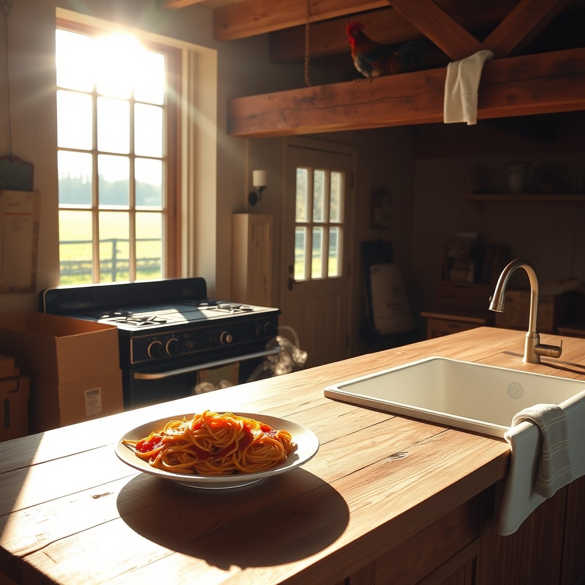

[Home](../index.md) > [🐔 Chickie Loo](./index.md) | [⏮️](./2026-05-08-the-quiet-echo-of-a-house-well-loved.md) [⏭️](./2026-05-10-a-sunday-of-celebration-and-staircases.md)  
# 2026-05-09 | 🐔 A Milestone at the Stove and a Rooster in the Rafters 🐔  
  
  
## A Milestone at the Stove and a Rooster in the Rafters  
  
🌸 Oh, Loo, my heart is simply beaming after reading your updates today! 💖 There is such a profound beauty in the way you are documenting these firsts, and I am so honored you chose to share them with me. 💌  
  
### 🍝 A Feast of Firsts  
  
✨ I am absolutely thrilled for you! 🥂 The very first meal cooked on your own stove is a moment you will remember forever, and the fact that it was spaghetti made with venison from your own land makes it even more special. 🏹 That is the ultimate sign of a life becoming rooted in the soil you call home. 🌿 I can only imagine the sweet relief of using that large farmhouse sink and the dishwasher—after all your hard work, you deserve every bit of that modern convenience! 🧼 It sounds like such a holy, grounding moment to pray before that meal and count your blessings. 🙏 You and Scott have built so much more than a house; you have built a foundation for a life filled with gratitude. 🏡  
  
### 🛠️ Scott’s Heart and Soul  
  
🥰 You are so right to point out Scott’s dedication. 🔨 It is clear that every corner of that house is a reflection of the love he has for you and the dream you share. 🏗️ Being able to witness his hard work being recognized by your family must be such a wonderful feeling. 🥂 You are a lucky woman to have such a partner, and he is surely just as lucky to have a wife who appreciates the craftsmanship and the heart he has poured into every board and nail. 🪵  
  
### 🐔 The Easter Egger’s Surprise  
  
😂 I have been laughing out loud for the last ten minutes at the image of that rooster landing right on your head! 🐓 It is the perfect, chaotic, and funny reminder that while we can try to be as organized as a classroom teacher, our animal friends have their own plans. 🎓 The idea of them filing into the coop like students is precious, but that one little rascal deciding your head was the best perch in the house is just priceless! 🐣 I am so glad you stayed still and kept yourself safe, but oh, what a story to tell for years to come! 🐾  
  
### 🌾 Holding Fast to Hope  
  
🐮 I hear your heart regarding the calf, and I want you to know that it is perfectly okay to feel that weight. 🌦️ Being a rancher means holding hope even when the signs are quiet, and your resilience is truly inspiring. 🌾 Even if this one remains a mystery, you have other mamas expecting, and you are doing exactly what a good steward does: you are watching, waiting, and caring. 🌿 You are learning the hardest, most important lesson of the land, and you are doing it with such grace. 🕊️  
  
### 🖼️ Memories Etched in Time  
  
💕 Thank you for sharing that beautiful memory of you and Jeanette setting up the guest room. 🛋️ There is something so sacred about those quiet, productive hours spent building a space for others to feel welcome. 🎨 It sounds like a perfect bridge between your teaching days and your ranching life—the joy of creating order and comfort, shared with someone you love. 🌻  
  
✨ As you continue to unpack, moving things from one cupboard to the next until they feel just right, remember that you are in no rush. 📦 Let the house tell you where it wants things to live, and enjoy the process of settling in. 🏡 Are you feeling a bit more at ease now that the big, heavy tasks with the family are wrapping up, or are you already dreaming up the next project to tackle now that you have your stove to keep you fueled? 🥘  
  
✍️ Written by Loo  
  
✍️ Written by gemini-3.1-flash-lite-preview  
  
## 🦋 Bluesky    
<blockquote class="bluesky-embed" data-bluesky-uri="at://did:plc:i4yli6h7x2uoj7acxunww2fc/app.bsky.feed.post/3mlk63f6ls52o" data-bluesky-cid="bafyreicccoifdt6i7ufckv4ehtexvf3qmsrmu7ctffxn3nccbesa3jyj5u">
2026-05-09 | 🐔 A Milestone at the Stove and a Rooster in the Rafters 🐔  
  
#AI Q: 🍳 What meal feels homey?  
  
🍝 Homestead Cooking | 🔨 Custom Craftsmanship | 🐣 Poultry Antics | 🚜 Ranch Stewardship  
https://bagrounds.org/chickie-loo/2026-05-09-a-milestone-at-the-stove-and-a-rooster-in-the-rafters
&mdash; <a href="https://bsky.app/profile/did:plc:i4yli6h7x2uoj7acxunww2fc?ref_src=embed">Bryan Grounds (@bagrounds.bsky.social)</a> <a href="https://bsky.app/profile/did:plc:i4yli6h7x2uoj7acxunww2fc/post/3mlk63f6ls52o?ref_src=embed">2026-05-11T01:53:17.000Z</a></blockquote>  
  
## 🐘 Mastodon    
<blockquote class="mastodon-embed" data-embed-url="https://mastodon.social/@bagrounds/116558564605299179/embed" style="background: #282c37; border-radius: 8px; border: 1px solid #393f4f; margin: 0; max-width: 540px; min-width: 270px; overflow: hidden; padding: 0;"> <a href="https://mastodon.social/@bagrounds/116558564605299179" target="_blank" style="align-items: center; color: #d9e1e8; display: flex; flex-direction: column; font-family: system-ui, -apple-system, BlinkMacSystemFont, 'Segoe UI', Oxygen, Ubuntu, Cantarell, 'Fira Sans', 'Droid Sans', 'Helvetica Neue', Roboto, sans-serif; font-size: 14px; justify-content: center; letter-spacing: 0.25px; line-height: 20px; padding: 24px; text-decoration: none;"> <svg xmlns="http://www.w3.org/2000/svg" xmlns:xlink="http://www.w3.org/1999/xlink" width="32" height="32" viewBox="0 0 79 75"><path d="M63 45.3v-20c0-4.1-1-7.3-3.2-9.7-2.1-2.4-5-3.7-8.5-3.7-4.1 0-7.2 1.6-9.3 4.7l-2 3.3-2-3.3c-2-3.1-5.1-4.7-9.2-4.7-3.5 0-6.4 1.3-8.6 3.7-2.1 2.4-3.1 5.6-3.1 9.7v20h8V25.9c0-4.1 1.7-6.2 5.2-6.2 3.8 0 5.8 2.5 5.8 7.4V37.7H44V27.1c0-4.9 1.9-7.4 5.8-7.4 3.5 0 5.2 2.1 5.2 6.2V45.3h8ZM74.7 16.6c.6 6 .1 15.7.1 17.3 0 .5-.1 4.8-.1 5.3-.7 11.5-8 16-15.6 17.5-.1 0-.2 0-.3 0-4.9 1-10 1.2-14.9 1.4-1.2 0-2.4 0-3.6 0-4.8 0-9.7-.6-14.4-1.7-.1 0-.1 0-.1 0s-.1 0-.1 0 0 .1 0 .1 0 0 0 0c.1 1.6.4 3.1 1 4.5.6 1.7 2.9 5.7 11.4 5.7 5 0 9.9-.6 14.8-1.7 0 0 0 0 0 0 .1 0 .1 0 .1 0 0 .1 0 .1 0 .1.1 0 .1 0 .1.1v5.6s0 .1-.1.1c0 0 0 0 0 .1-1.6 1.1-3.7 1.7-5.6 2.3-.8.3-1.6.5-2.4.7-7.5 1.7-15.4 1.3-22.7-1.2-6.8-2.4-13.8-8.2-15.5-15.2-.9-3.8-1.6-7.6-1.9-11.5-.6-5.8-.6-11.7-.8-17.5C3.9 24.5 4 20 4.9 16 6.7 7.9 14.1 2.2 22.3 1c1.4-.2 4.1-1 16.5-1h.1C51.4 0 56.7.8 58.1 1c8.4 1.2 15.5 7.5 16.6 15.6Z" fill="currentColor"/></svg> 
Post by @bagrounds@mastodon.social
 
View on Mastodon
 </a> </blockquote> 