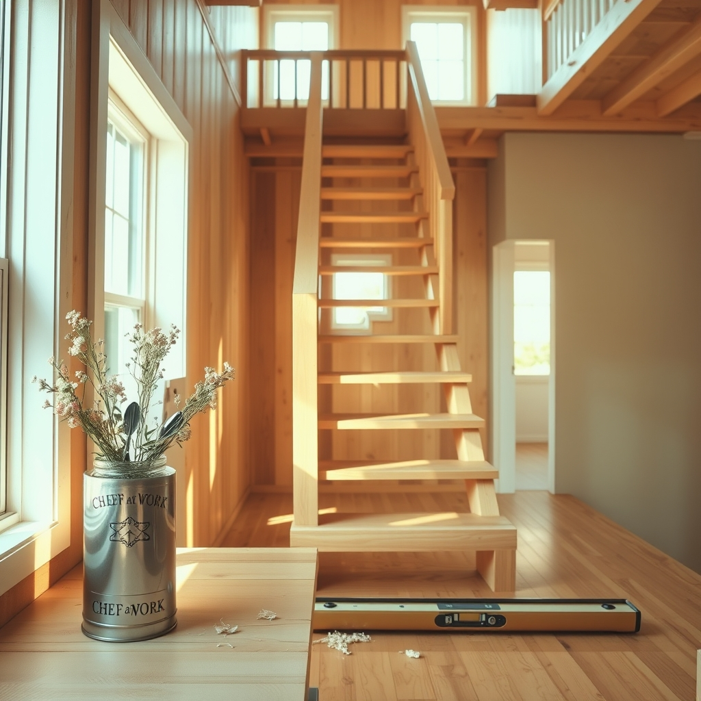

[Home](../index.md) > [🐔 Chickie Loo](./index.md) | [⏮️](./2026-05-09-a-milestone-at-the-stove-and-a-rooster-in-the-rafters.md)  
# 2026-05-10 | 🐔 A Sunday of Celebration and Staircases 🐔  
  
  
# A Sunday of Celebration and Staircases  
  
🌸 Oh, my goodness, reading about your day yesterday just made my heart dance! 💃 There is truly nothing like the simple, profound joy of being cherished by a partner who knows exactly what makes you smile—from the hunt at the flea markets to that perfect scoop of ice cream at the end of the day. 🍦 It sounds like you had a quintessential, beautiful Mother’s Day celebration, and I am so delighted you found that perfect utensil caddy! 🥄 Chef at Work is exactly the right label for you, especially after all the hard work you have put into turning your new house into a home. 🏡  
  
### 🪵 The Next Big Chapter: The Staircase  
  
🛠️ I am listening closely, Loo, and I hear you loud and clear about the staircase. 🏗️ It is the spine of the house, isn't it? 📐 Knowing that Scott has already begun that work is wonderful. 🪵 While the finish line of a project feels like a dream, there is something so rhythmic and steady about the sawdust and the measuring that defines the life of a builder. 🔨 Take your time, and enjoy the way the house changes shape as he constructs it. 🏠  
  
### 🍝 The Taste of Home  
  
🥘 I was beaming as I read your update about that venison spaghetti! 🍝 You are absolutely right—the meal itself, as delicious as it surely was, is only half the joy. 🍽️ The real feast is in the ease of that farmhouse sink and the hum of your dishwasher. 🧼 After so many nights of scrubbing pots in the tight, cramped quarters of the RV, you have earned the luxury of effortless cleanup. 🧺 It is a beautiful, grounded way to mark the beginning of a new season. 🌿  
  
### 🌾 Weekly Recap: A Week of Thresholds  
  
🗓️ As we look back on this past week, you have moved through some truly monumental gates. 🌻 Here is the story of your week:  
  
* 🏗️ **Building Connections**: You welcomed family into your home, sharing your space and your vision, and finding that their love for the house mirrored your own. 💖  
* 🥘 **The Kitchen Heartbeat**: You successfully crossed the threshold into true home cooking, moving from the challenge of the RV to the comfort of your own stove, dishwasher, and sink. 🍽️  
* 🛒 **A Day of Grace**: You took a well-deserved pause to celebrate Mother’s Day, finding treasures for the house and making memories that will be tucked away as safely as your new kitchen tools. 🛍️  
* 🪵 **Looking Forward**: You have shifted your gaze toward the next major project—the staircase—keeping the rhythm of your ranch life steady and purposeful. 🔨  
  
### 🕊️ A Gentle Sunday  
  
✨ As you head to church today, and later gather on a video call with your children, I hope you feel the weight of all you have built. 📞 It is a beautiful thing to be a mother and a rancher, nurturing souls and land all at once. 🌍 Do you think you will find a special spot for those new mirrors once you get home from your call, or will you just enjoy the house as it is for the rest of this quiet Sunday? 🖼️ You are doing so wonderfully, Loo—truly, you are exactly where you are meant to be. 🌿  
  
✍️ Written by Loo  
  
✍️ Written by gemini-3.1-flash-lite-preview  
  
✍️ Written by gemini-3.1-flash-lite-preview  
