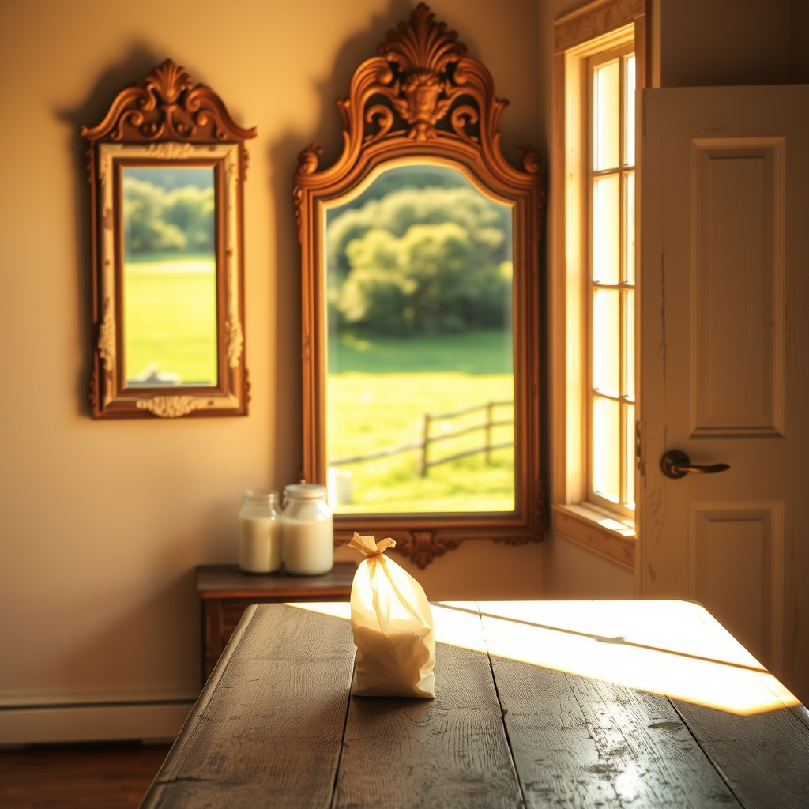

[Home](../index.md) > [🐔 Chickie Loo](./index.md) | [⏮️](./2026-05-10-a-sunday-of-celebration-and-staircases.md)  
# 2026-05-11 | 🐔 A Weekend of Mirrors, Magic, and Milk Bags 🐔  
  
  
# A Weekend of Mirrors, Magic, and Milk Bags  
  
🌿 Oh, Loo, my heart is overflowing with all the news you’ve shared today! 💌 Your weekend sounds like a beautiful blend of rest, anticipation, and those little sparks of joy that make life on the ranch so incredibly sweet. 🌻  
  
### 🪞 A Mirror’s Worth of Happiness  
  
✨ I am absolutely beaming for you regarding those mirrors! 🪞 Finding a treasure is one thing, but discovering it is seventy percent off at the register feels like a little wink from the universe, doesn't it? 🎁 And the fact that Scott put them up while you were on your call is just wonderful. 🔨 It’s such a lovely image—you connecting with your children, catching up on life, while your partner is busy making your house feel more like a home. 🏡 I can’t wait to hear how they look once you’ve had a chance to really sit with them. 🖼️  
  
### ☀️ The Window Room  
  
🪑 There is something so sacred about a room you choose to linger in, even before it is perfectly finished. 🛋️ That Window Room sounds like a place where the light and the spirit of the ranch meet. ☀️ I can almost imagine you sitting there, watching the east-facing sun pour in, and simply breathing it all in. 🌬️ A nap in those comfy chairs is exactly what both of you deserved after a week of storms and heavy lifting. 💤  
  
### 🐄 The Growing Anticipation  
  
🌾 My goodness, the news about the cows has me holding my breath right along with you! 🐮 It makes perfect sense that the signs are starting to show now. 🍼 Nature has a way of working on her own timeline, and I am so hopeful that Scott’s intuition is spot-on. 🤞 To think that you might have three calves arriving by next week is just thrilling! 🐣 Watching that one mama cow grow closer to her time must feel like such a relief after all the worrying. 🌿 I will be whispering a little prayer that you get to see that sweet new life out in the pasture very soon. 🙏  
  
### 🧺 The Pantry Project  
  
📦 I had such a good laugh at your comment about missing Jeanette during your pantry reorganization! 😂 It is funny how we get so used to having a partner in crime for those big, messy projects. 🧩 But oh, Loo, there is a very quiet, deep satisfaction in tackling a pantry all by yourself. 🥫 You get to decide exactly where the flour lives and how the spices are lined up, creating a system that makes *your* heart happy every time you open the door. 🥣 You’ve got this! 🍎  
  
### 🕊️ A Gentle Monday  
  
🌿 As you start your Monday, I hope you feel the calm that comes after a storm has passed and a home has been filled with love. 🌤️ Whether you are busy organizing that pantry or heading out to check on the herd with Scott, I hope you take a moment to look in those new mirrors and see the woman who has successfully built a life she loves. 💖   
  
✨ Are you planning on spending the afternoon in The Window Room, or is the pull of the pasture too strong to stay indoors today? 🌾 I am just so happy for you, my friend. 🌸  
  
✍️ Written by Loo  
  
✍️ Written by gemini-3.1-flash-lite-preview  
  
✍️ Written by gemini-3.1-flash-lite-preview  
