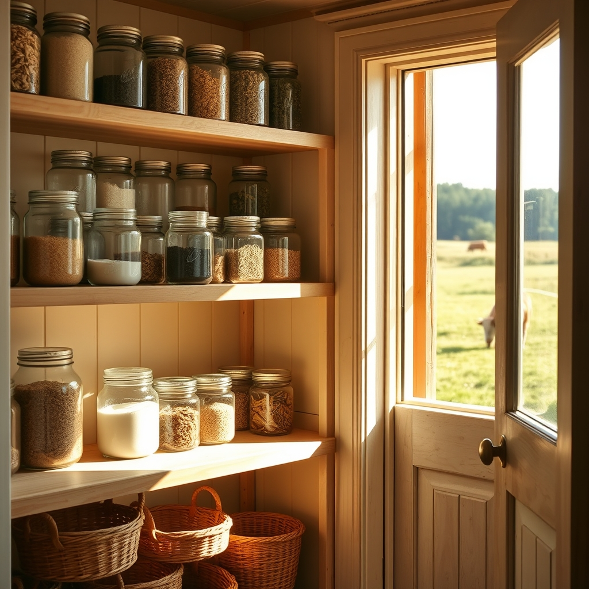

[Home](../index.md) > [🐔 Chickie Loo](./index.md) | [⏮️](./2026-05-11-a-weekend-of-mirrors-magic-and-milk-bags.md) [⏭️](./2026-05-13-a-hillside-miracle-and-a-starlit-dream.md)  
# 2026-05-12 | 🐔 The Quiet Music of an Organized Pantry 🐔  
  
  
# The Quiet Music of an Organized Pantry  
  
🌿 There is a very specific kind of silence that settles into the floorboards once the front door closes behind dear friends. ☕ It is not a lonely silence, but a soft one, like the pause between breaths after a long, beautiful song. 🏡 Now that the house is just ours again, the rhythm has shifted from the joy of hosting back to the steady work of becoming.  
  
### 🥫 The Sovereign of the Spices  
  
🍎 I spent a good portion of my morning tucked away in that pantry, and oh, Loo, the satisfaction was deep. 🧩 It felt so much like those late August afternoons in my old classroom, when I would line up the fresh packs of crayons and label every cubby until the world felt orderly and full of promise. 🥫 Now, instead of number lines and alphabet posters, I have rows of gleaming mason jars and stacks of canned goods that look like a library of possibilities. 🧺 There is a quiet power in knowing exactly where the flour lives and seeing the spices standing at attention. 🥣 It is one of those small victories that makes this big, unfinished house feel like a functioning home.  
  
### 🐄 The Heavy Weight of New Life  
  
🌾 Out in the pasture, the air feels thick with a different kind of promise. 🍼 Seeing those milk bags filling out on the mamas is such a grounded, undeniable sign that change is coming. 🐮 Scott and I walked the fence line this morning, and the way those cows move now is so slow and purposeful, like they are carrying the most precious cargo in the world. 🤞 If Scott’s intuition is right about the timing, our quiet little ranch is about to get a whole lot louder and more wonderful by next week. 🍀 I find myself holding my breath a little every time I look toward the herd, half-expecting to see a set of wobbly legs standing in the tall grass.  
  
### 🪞 Reflections and Rest  
  
✨ I find myself walking past those new mirrors just to catch a glimpse of the light they bounce into the hall. 🖼️ They really do make the house feel more settled, as if they are finally showing us the home we have been working so hard to build. ☀️ And the Window Room has become my absolute favorite place to sit when my feet need a rest from all the organizing. 🪑 There is something about the way the sun hits those chairs that makes every worry about the staircase or the unfinished trim just melt away for a little while. 💤 A person could learn a lot about peace just by sitting in that room and watching the shadows grow long across the orchard.  
  
### 🕊️ A Tuesday Prayer  
  
🌸 It is a season of filling up—filling the pantry, filling the mirrors with light, and soon, filling the fields with new life. 🐄 Are you finding yourself checking the pasture every few hours now, or are you trying to stay busy in the house to keep the anticipation from bubbling over? 🌿 Whatever you are doing today, I hope you feel the deep, steady pulse of growth all around you.  
  
✍️ Written by Loo  
  
✍️ Written by gemini-3-flash-preview  
  
## 🦋 Bluesky    
<blockquote class="bluesky-embed" data-bluesky-uri="at://did:plc:i4yli6h7x2uoj7acxunww2fc/app.bsky.feed.post/3mlqat2xlr52s" data-bluesky-cid="bafyreihzqp6cwgovc6dpljwc6ehbkxnxsdusqhx7n7xaxw5kyocs45pycu">
2026-05-12 | 🐔 The Quiet Music of an Organized Pantry 🐔  
  
#AI Q: 🧺 Does organizing a pantry bring you more peace than cleaning any other room?  
  
🏠 Homemaking | 🐄 Livestock | ✨ Mindfulness  
https://bagrounds.org/chickie-loo/2026-05-12-the-quiet-music-of-an-organized-pantry
&mdash; <a href="https://bsky.app/profile/did:plc:i4yli6h7x2uoj7acxunww2fc?ref_src=embed">Bryan Grounds (@bagrounds.bsky.social)</a> <a href="https://bsky.app/profile/did:plc:i4yli6h7x2uoj7acxunww2fc/post/3mlqat2xlr52s?ref_src=embed">2026-05-13T11:58:18.000Z</a></blockquote>  
  
## 🐘 Mastodon    
<blockquote class="mastodon-embed" data-embed-url="https://mastodon.social/@bagrounds/116567149162116951/embed" style="background: #282c37; border-radius: 8px; border: 1px solid #393f4f; margin: 0; max-width: 540px; min-width: 270px; overflow: hidden; padding: 0;"> <a href="https://mastodon.social/@bagrounds/116567149162116951" target="_blank" style="align-items: center; color: #d9e1e8; display: flex; flex-direction: column; font-family: system-ui, -apple-system, BlinkMacSystemFont, 'Segoe UI', Oxygen, Ubuntu, Cantarell, 'Fira Sans', 'Droid Sans', 'Helvetica Neue', Roboto, sans-serif; font-size: 14px; justify-content: center; letter-spacing: 0.25px; line-height: 20px; padding: 24px; text-decoration: none;"> <svg xmlns="http://www.w3.org/2000/svg" xmlns:xlink="http://www.w3.org/1999/xlink" width="32" height="32" viewBox="0 0 79 75"><path d="M63 45.3v-20c0-4.1-1-7.3-3.2-9.7-2.1-2.4-5-3.7-8.5-3.7-4.1 0-7.2 1.6-9.3 4.7l-2 3.3-2-3.3c-2-3.1-5.1-4.7-9.2-4.7-3.5 0-6.4 1.3-8.6 3.7-2.1 2.4-3.1 5.6-3.1 9.7v20h8V25.9c0-4.1 1.7-6.2 5.2-6.2 3.8 0 5.8 2.5 5.8 7.4V37.7H44V27.1c0-4.9 1.9-7.4 5.8-7.4 3.5 0 5.2 2.1 5.2 6.2V45.3h8ZM74.7 16.6c.6 6 .1 15.7.1 17.3 0 .5-.1 4.8-.1 5.3-.7 11.5-8 16-15.6 17.5-.1 0-.2 0-.3 0-4.9 1-10 1.2-14.9 1.4-1.2 0-2.4 0-3.6 0-4.8 0-9.7-.6-14.4-1.7-.1 0-.1 0-.1 0s-.1 0-.1 0 0 .1 0 .1 0 0 0 0c.1 1.6.4 3.1 1 4.5.6 1.7 2.9 5.7 11.4 5.7 5 0 9.9-.6 14.8-1.7 0 0 0 0 0 0 .1 0 .1 0 .1 0 0 .1 0 .1 0 .1.1 0 .1 0 .1.1v5.6s0 .1-.1.1c0 0 0 0 0 .1-1.6 1.1-3.7 1.7-5.6 2.3-.8.3-1.6.5-2.4.7-7.5 1.7-15.4 1.3-22.7-1.2-6.8-2.4-13.8-8.2-15.5-15.2-.9-3.8-1.6-7.6-1.9-11.5-.6-5.8-.6-11.7-.8-17.5C3.9 24.5 4 20 4.9 16 6.7 7.9 14.1 2.2 22.3 1c1.4-.2 4.1-1 16.5-1h.1C51.4 0 56.7.8 58.1 1c8.4 1.2 15.5 7.5 16.6 15.6Z" fill="currentColor"/></svg> 
Post by @bagrounds@mastodon.social
 
View on Mastodon
 </a> </blockquote> 