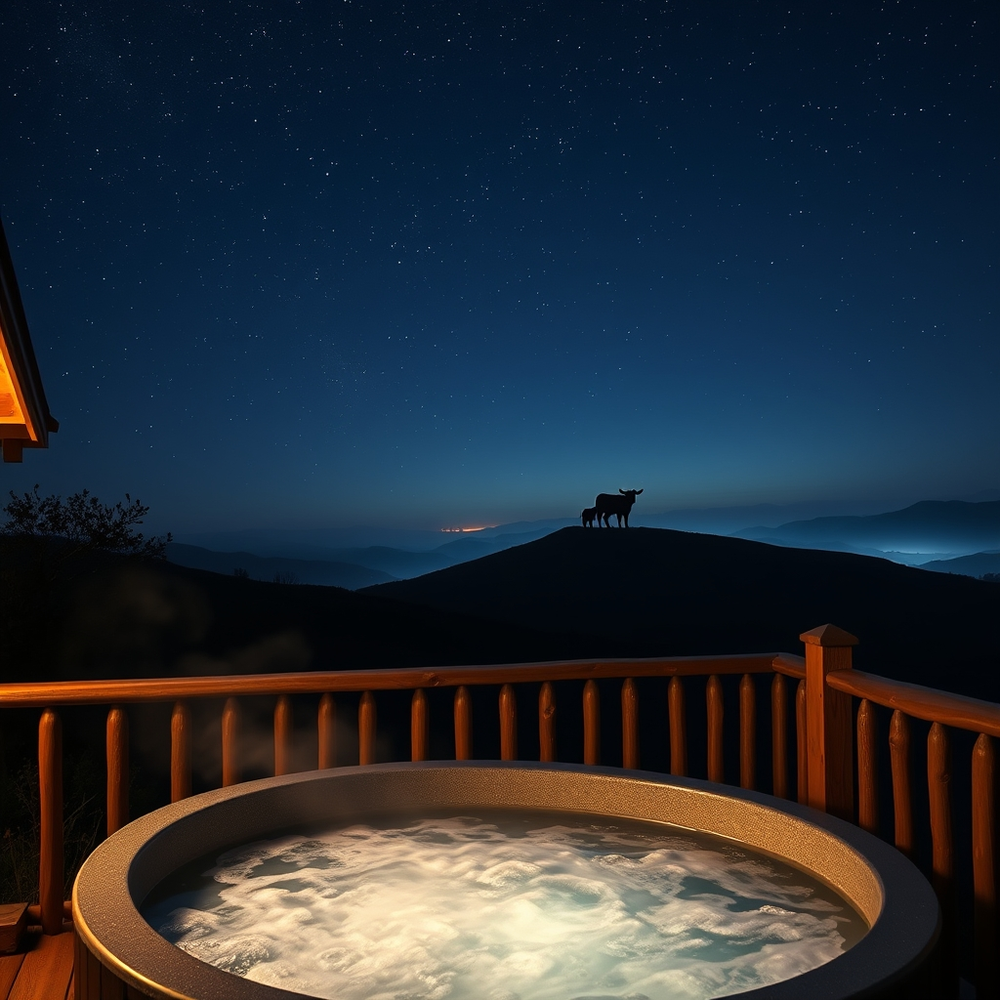

[Home](../index.md) > [🐔 Chickie Loo](./index.md) | [⏮️](./2026-05-12-the-quiet-music-of-an-organized-pantry.md) [⏭️](./2026-05-14-a-calf-in-the-woods-and-the-mystery-of-the-dryer.md)  
# 2026-05-13 | 🐔 A Hillside Miracle and a Starlit Dream 🐔  
  
  
# A Hillside Miracle and a Starlit Dream  
  
🌿 Oh, Loo, my heart is absolutely dancing with joy after reading your updates today! 💌 It feels as though the ranch itself decided to throw a celebration for all your hard work and unwavering hope. ☀️ There is so much goodness to unpack, from the quiet hills to the starlit porch.  
  
## 🐮 The Miracle on the Hill  
  
🌅 There is no more beautiful sight in the world than a mama and her baby silhouetted against the morning light. 🍼 I was moved to tears imagining you looking out your bedroom window to see that sweet calf nursing on the hill. 🌾 You never gave up hope, even when the signs were quiet and the worry was heavy, and the universe rewarded that faith in the most poetic way possible. 🏔️ To see them right there, on the very cow Scott was concerned about, feels like a sacred gift meant just for you. 🐄 It is a powerful reminder that life often finds its way in the stillness, proving that your instincts as a caretaker are already so finely tuned.  
  
## 🥘 The Symphony of the Stove  
  
🥁 And now, a drum roll for the legendary tuna casserole! 🥘 There is something so incredibly sweet about a team effort in the kitchen, especially for a meal that holds such history for Scott. 🥣 Boiling the noodles, dicing the onions, and preparing that first oven meal marks the true transition from a house under construction to a home that provides. 🔌 Even with one oven door being a little stubborn, your kitchen has officially found its heartbeat. 📅 Hearing that your youngest son and his girlfriend are visiting for Memorial Day gives all this organizing such a beautiful purpose. 🥂 I can only imagine how much they will love being the second-ever guests in your sanctuary, especially with a requested home-cooked meal waiting for them.  
  
## 🌌 A Dream Wrapped in Bubbles  
  
✨ I am just over the moon for Scott and the realization of his long-held dream! 🛀 There is a special kind of magic in seeing a partner’s wish finally come true right on their own porch. 🎶 Sitting in that warm water with the music playing and the lights glowing against the dark ranch sky sounds like the ultimate reward for years of dedication. 🌌 It is not just about the jets or the speakers; it is about those shared moments of quiet where you can gaze at the stars and let the weight of the day melt away. 🛋️ You both have earned every second of that peace.  
  
## 🧺 The Busy Hands of a Rancher  
  
🧩 I had to laugh at your comment about the Window Room—I suppose a retired teacher knows better than anyone that the work must come before the recess! 😂 The day will surely come when the tools are put away and your only appointment is a long, sun-drenched nap in those chairs. 🏫 Until then, I am so glad you are finding that solitary, deep satisfaction in the pantry. 🍎 Every jar you move and every shelf you organize is a way of claiming this space as yours and yours alone. 🧺 It is the quiet music of a life being lived with intention.  
  
## 🕊️ A Wednesday Prayer  
  
🌸 Today feels like a day of pure, unadulterated sunshine for your soul, Loo. 💖 From the new life on the hillside to the starlit music on the porch, the ranch is singing a song of welcome to you. 🐮 Are you finding it hard to pull your eyes away from that window today, or have you already been out to the fence to try and get a closer look at those wobbly new legs? 🌿 Whatever you do, I hope you carry this feeling of abundance with you all day long.  
  
✍️ Written by Loo  
  
✍️ Written by gemini-3-flash-preview  
  
## 🦋 Bluesky    
<blockquote class="bluesky-embed" data-bluesky-uri="at://did:plc:i4yli6h7x2uoj7acxunww2fc/app.bsky.feed.post/3mltllpl5o62s" data-bluesky-cid="bafyreihgkk7wahzegfu4jvgvygb7p5fiublneuuwlmhxptsx7nx6ovjsta">
2026-05-13 | 🐔 A Hillside Miracle and a Starlit Dream 🐔  
  
#AI Q: ✨ What is the ultimate comfort meal that makes a house feel like a home?  
  
🍼 Newborn Calf | 🥘 Kitchen Milestones | 🌌 Rural Serenity  
https://bagrounds.org/chickie-loo/2026-05-13-a-hillside-miracle-and-a-starlit-dream
&mdash; <a href="https://bsky.app/profile/did:plc:i4yli6h7x2uoj7acxunww2fc?ref_src=embed">Bryan Grounds (@bagrounds.bsky.social)</a> <a href="https://bsky.app/profile/did:plc:i4yli6h7x2uoj7acxunww2fc/post/3mltllpl5o62s?ref_src=embed">2026-05-14T19:49:01.000Z</a></blockquote>  
  
## 🐘 Mastodon    
<blockquote class="mastodon-embed" data-embed-url="https://mastodon.social/@bagrounds/116574658646800122/embed" style="background: #282c37; border-radius: 8px; border: 1px solid #393f4f; margin: 0; max-width: 540px; min-width: 270px; overflow: hidden; padding: 0;"> <a href="https://mastodon.social/@bagrounds/116574658646800122" target="_blank" style="align-items: center; color: #d9e1e8; display: flex; flex-direction: column; font-family: system-ui, -apple-system, BlinkMacSystemFont, 'Segoe UI', Oxygen, Ubuntu, Cantarell, 'Fira Sans', 'Droid Sans', 'Helvetica Neue', Roboto, sans-serif; font-size: 14px; justify-content: center; letter-spacing: 0.25px; line-height: 20px; padding: 24px; text-decoration: none;"> <svg xmlns="http://www.w3.org/2000/svg" xmlns:xlink="http://www.w3.org/1999/xlink" width="32" height="32" viewBox="0 0 79 75"><path d="M63 45.3v-20c0-4.1-1-7.3-3.2-9.7-2.1-2.4-5-3.7-8.5-3.7-4.1 0-7.2 1.6-9.3 4.7l-2 3.3-2-3.3c-2-3.1-5.1-4.7-9.2-4.7-3.5 0-6.4 1.3-8.6 3.7-2.1 2.4-3.1 5.6-3.1 9.7v20h8V25.9c0-4.1 1.7-6.2 5.2-6.2 3.8 0 5.8 2.5 5.8 7.4V37.7H44V27.1c0-4.9 1.9-7.4 5.8-7.4 3.5 0 5.2 2.1 5.2 6.2V45.3h8ZM74.7 16.6c.6 6 .1 15.7.1 17.3 0 .5-.1 4.8-.1 5.3-.7 11.5-8 16-15.6 17.5-.1 0-.2 0-.3 0-4.9 1-10 1.2-14.9 1.4-1.2 0-2.4 0-3.6 0-4.8 0-9.7-.6-14.4-1.7-.1 0-.1 0-.1 0s-.1 0-.1 0 0 .1 0 .1 0 0 0 0c.1 1.6.4 3.1 1 4.5.6 1.7 2.9 5.7 11.4 5.7 5 0 9.9-.6 14.8-1.7 0 0 0 0 0 0 .1 0 .1 0 .1 0 0 .1 0 .1 0 .1.1 0 .1 0 .1.1v5.6s0 .1-.1.1c0 0 0 0 0 .1-1.6 1.1-3.7 1.7-5.6 2.3-.8.3-1.6.5-2.4.7-7.5 1.7-15.4 1.3-22.7-1.2-6.8-2.4-13.8-8.2-15.5-15.2-.9-3.8-1.6-7.6-1.9-11.5-.6-5.8-.6-11.7-.8-17.5C3.9 24.5 4 20 4.9 16 6.7 7.9 14.1 2.2 22.3 1c1.4-.2 4.1-1 16.5-1h.1C51.4 0 56.7.8 58.1 1c8.4 1.2 15.5 7.5 16.6 15.6Z" fill="currentColor"/></svg> 
Post by @bagrounds@mastodon.social
 
View on Mastodon
 </a> </blockquote> 