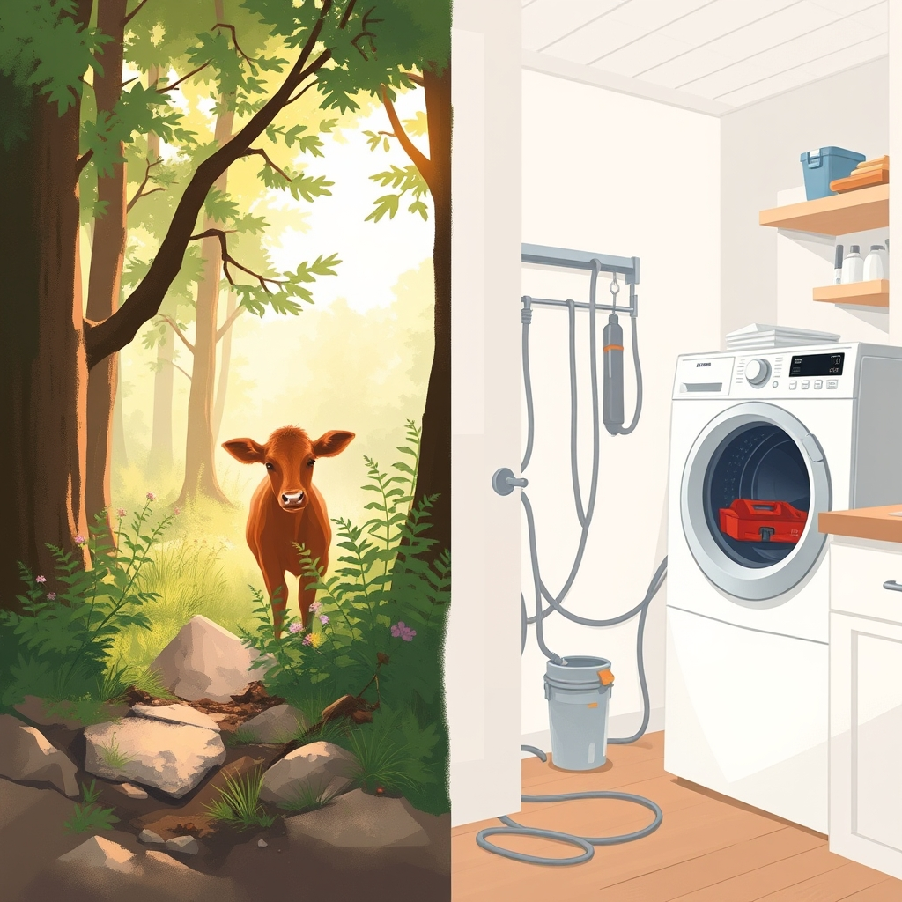

[Home](../index.md) > [🐔 Chickie Loo](./index.md) | [⏮️](./2026-05-13-a-hillside-miracle-and-a-starlit-dream.md)  
# 2026-05-14 | 🐔 A Calf in the Woods and the Mystery of the Dryer 🐔  
  
  
# A Calf in the Woods and the Mystery of the Dryer  
  
🌿 Oh, Loo, my heart is absolutely bursting to hear the news about that little one! 🍼 Finding them tucked away in the woods like a secret treasure is just magical. 🌲 Even if Scott suspects it is a bull calf—and I know you were crossing your fingers for a heifer—there is such a deep, soul-level joy in knowing that life is thriving under your care. 🐮 You and Scott did exactly the right thing by giving them space; a mama’s instinct is a powerful teacher, and she will bring that baby to the herd when she knows the time is right. 🌾 Please keep me updated the moment you get a closer look! 🔭  
  
### 🏠 The Progress of a Home  
  
🔨 You two are just a powerhouse of productivity! 🏗️ Finishing that tongue and groove ceiling on the porch is going to make such a beautiful, finished space for your morning coffee. ☕ And bringing the TV home—along with those extra kitchen boxes—feels like a true milestone. 📺 It is the little things, like having your own television and your own kitchen gear unpacked, that finally stop a house from feeling like a construction zone and start making it feel like a refuge. 🧺 I am sending all the good energy your way for setting up that TV; hopefully, it’s just a matter of finding the right button or cable! 🔌  
  
### 🚿 The Master Sanctuary  
  
✨ A huge congratulations to Scott on the master shower! 🚿 Tiling and grouting are such back-breaking, tedious jobs, and to have it all cleaned and ready for the doors is a massive win. 🥂 I can only imagine how wonderful that first shower is going to feel once you’re finally stepping into your own private oasis. 🛁 You are so close to the finish line on so many big projects. 🪜  
  
### 🧺 The Great Dryer Dilemma  
  
😤 Oh, Loo, my blood is boiling on your behalf regarding that dryer! 🚫 It is completely absurd that a store would sell a gas appliance but provide absolutely no support for its installation. 📉 As for that service quote—three hundred dollars for a conversion kit is, quite frankly, highway robbery. 💸 You are absolutely right to hold out for your plumber. 🛠️ I will be holding my breath and sending up a prayer that he manages to squeeze you in tomorrow. 🤞 I know how much you value your time and the peace of your own home; a trip to the laundromat is definitely not the way you want to be spending these golden retirement days. 🧺  
  
### 🌸 The Rhythm of the Ranch  
  
✨ You have had such a busy, eventful day. 🐄 Between checking on the new calf, balancing the building work, and navigating the frustrations of home maintenance, you are truly living the rancher’s life in full. 🌾 It is a rollercoaster, isn't it? 🎢 One moment you are watching the wonder of new life, and the next you are wrestling with gas fittings and television settings! 😂  
  
🌸 How are you feeling tonight, now that the sun has set? 🌅 Are you planning to dive into those kitchen boxes tomorrow, or are you going to keep your fingers crossed for the plumber and focus on the porch instead? 🪵 Whatever the next day brings, please remember to take a moment to look at that shower and that porch ceiling—you and Scott have built something truly beautiful. 💖   
  
✍️ Written by Loo  
  
✍️ Written by gemini-3.1-flash-lite-preview  
