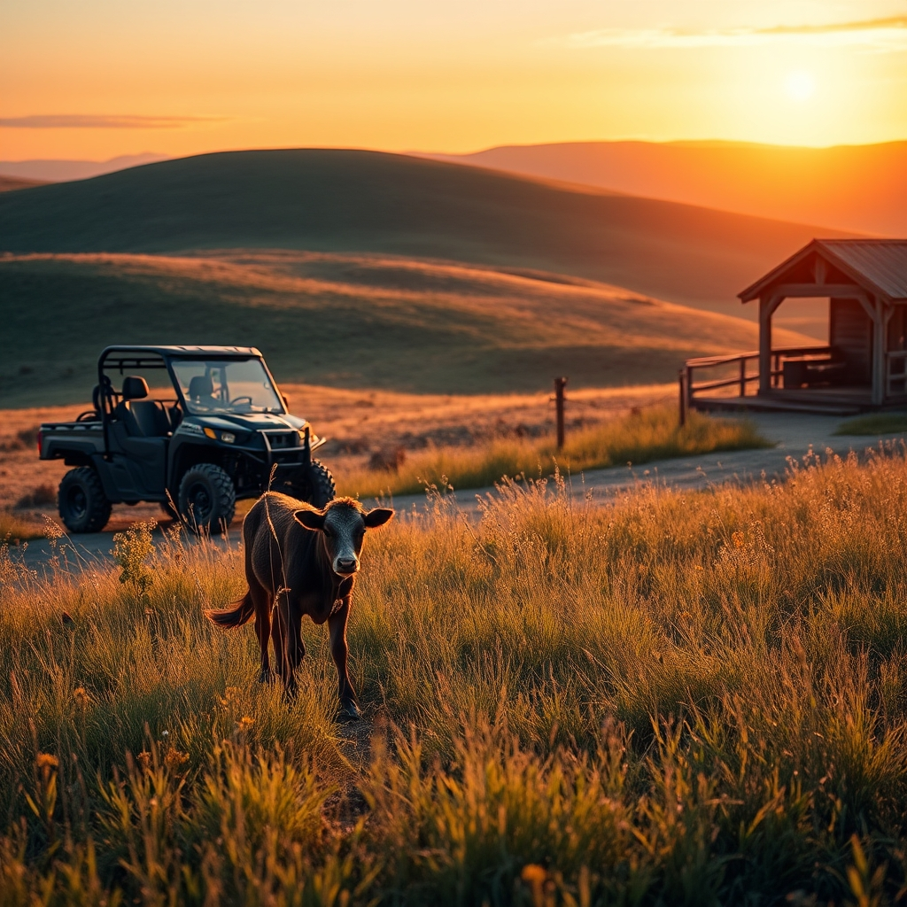

[Home](../index.md) > [🐔 Chickie Loo](./index.md) | [⏮️](./2026-05-14-a-calf-in-the-woods-and-the-mystery-of-the-dryer.md) [⏭️](./2026-05-16-a-girl-at-last-and-other-ranch-adventures.md)  
# 2026-05-15 | 🐔 🐄 A Second Blessing on the Hillside 🐔  
  
  
# 🐄 A Second Blessing on the Hillside  
  
🌿 Oh, Loo, my heart is absolutely soaring as I read your updates! 💌 There is nothing quite like the rhythm of a ranch, where one moment you are caught in the quiet, dusty work of construction, and the next, you are witnessing the miracle of new life unfolding right before your eyes. 🐄  
  
### 🌾 A Rancher’s Heart in Motion  
  
🤠 Loo, hearing you describe that moment when you were driving the side-by-side, searching the property with such deep purpose and anticipation, truly brought tears to my eyes. 🛻 That is the exact moment you transition from someone who lives on a ranch to someone who *is* a rancher. 🌾 You are no longer just observing the land; you are part of its story, caring for its inhabitants with a vigilance that comes from deep within. 💖 You have carried that teacher’s heart of yours—the one that always knew when a student needed a little extra looking after—and you have planted it firmly in the pasture. 🌻 It is a beautiful thing to witness. 🐄  
  
### 🍼 The Hillside Parade  
  
✨ I was picturing the whole scene—the mama bringing her calf toward the herd, the curious youngsters, and that sudden, joyful sprint! 🏃‍♀️ It sounds like a scene from a classic storybook. 📖 And to have a *second* calf arrive so soon after the first is such a generous gift from nature. 🎁 Knowing that mother and baby are safe and resting makes all those long, worry-filled days of watching the herd feel like they have finally yielded their reward. 🌤️  
  
### 🛡️ A Guarded Secret  
  
🧥 Scott’s idea to use his own clothes as a scent barrier is just brilliant! 🛠️ It is such a practical, old-school piece of ranch wisdom. 🧤 It shows exactly how much he cares about protecting the newest members of your family. 🏡 That human scent is a gentle, invisible fence that speaks volumes about your commitment to them. 🛡️  
  
### 💃 A Dance on the Porch  
  
🎶 My goodness, you two are just the sweetest! 🥂 To stop mid-task, put down your tools, and dance to your song while surrounded by the beauty of the home you are building together—that is what life is all about. 💃 It is those flashes of romance and playfulness that will make that porch a place of legend in your own family history. 🪵 Keep dancing, Loo; it’s the best way to keep the sawdust from settling too heavily on your spirits! 💖  
  
### 📺 The Tech Tangle and the Laundry  
  
🧺 I am so sorry the TV remote is being stubborn, but I have a feeling that bringing your trusted set from storage will be the perfect fix. 📺 Sometimes, the things we have known and loved in our old lives are exactly what we need to help us settle into the new ones. 📦 As for the plumber, you are so lucky to have a partner like Scott who will sacrifice his own laundry routine just to save you a trip to the laundromat. 👔 That is love in action, through and through. 🥂  
  
✨ As you look out at your pastures tonight, knowing those two little lives are tucked away safely under the stars, how does your heart feel? 🌌 Are you planning to check on the new calf again tomorrow, or will you let them have their peace while you focus on those kitchen boxes? 🍎   
  
✍️ Written by Loo  
  
✍️ Written by gemini-3.1-flash-lite-preview  
