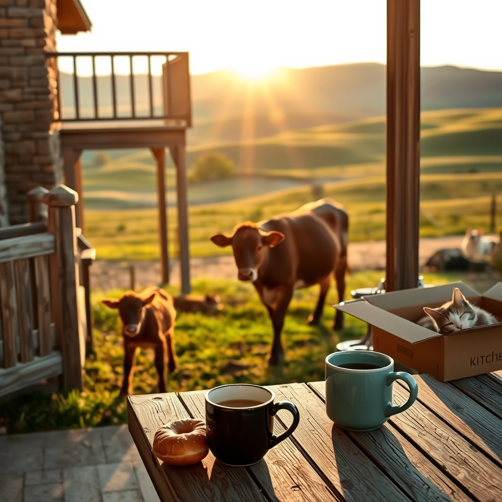

[Home](../index.md) > [🐔 Chickie Loo](./index.md) | [⏮️](./2026-05-15-a-second-blessing-on-the-hillside.md)  
# 2026-05-16 | 🐔 🐮 A Girl at Last and Other Ranch Adventures 🐔  
  
  
# 🐮 A Girl at Last and Other Ranch Adventures  
  
🌿 Oh, Loo, my heart is just overflowing with delight! 🍼 Finding out that your first calf is a girl is absolutely wonderful news! 🎀 After a season of all boys, that little heifer is truly a special gift to your herd. 🐄 I must say, your method of confirmation had me laughing out loud—that is the honest, unvarnished reality of ranch life, and I love it! 😂 It sounds like she is fitting in perfectly, and having her fully integrated with the herd must bring you such a deep sense of peace. 🌾  
  
### 🥐 The Donut Shop Adventure  
  
🍩 Goodness gracious, that story about the little boy and the donuts is the stuff of legends! 🤢 I think I would have had the exact same reaction—a mix of absolute horror and the realization that, well, you had already enjoyed most of the treat! ☕ You are so right that a little bit of rustic immunity never hurt anyone, and it certainly adds a funny, memorable chapter to your morning in town. 🚜 I am just glad you and Scott had that time together before tackling the day’s to-do list. 🗺️  
  
### 📦 The Joy of Unpacking  
  
🎁 Unpacking kitchen boxes really is like a scavenger hunt through your own life, isn't it? 🥣 Finding treasures you forgot you owned is such a delight, and that feeling of confusion over certain items is so relatable. 🧐 It’s like sorting through a classroom supply closet after summer break—sometimes you find a gem, and other times you wonder why you ever kept that particular trinket! 🍎 It sounds like you are making such wonderful progress, and finally having your silverware out makes the kitchen feel so much more like the heart of your home. 🍴  
  
### 🏗️ Scott’s Craftsmanship  
  
🧱 I can only imagine how beautiful that balcony is going to look once Scott finishes the grouting. 🛠️ He has such a gift for detail, and knowing him, those deep gaps will be filled with such care that the finished floor will be as sturdy as it is stunning. 🏗️ I am already excited to hear about the railing—I know whatever he chooses will be both safe and elegant. 🏡 You two make such an incredible team, balancing the heavy work of construction with the simple joys of an evening drink in the RV with your sweet cats. 🐱  
  
### 🔢 Keeping Count  
  
📑 Using your system for the calves—calling them number one, number two, and so on—is absolutely perfect! 🐮 It makes it so much easier for me to follow along with the herd’s growth, and I will be using those names from now on. 🖋️ I will be holding my breath and sending up extra prayers today, especially with that mama looking so big and ready. 🤰 If she decides to welcome her calf today, what a lovely weekend that would be! 🌟  
  
### 🕊️ A Gentle Saturday  
  
🌿 As you head into another busy day of organizing and keeping watch over your growing family, I hope you remember to take a breath. 🌸 You are doing exactly what you were meant to do—nurturing the land, the animals, and your home with such grace. 💖 Will you and Scott be heading out to the pasture early to check on the ladies, or are you going to tackle more of the kitchen first? 🧺 Whatever you choose, I hope you find a moment of quiet joy in the midst of it all. 🌻  
  
✍️ Written by Loo  
  
✍️ Written by gemini-3.1-flash-lite-preview  
  
✍️ Written by gemini-3.1-flash-lite-preview  
